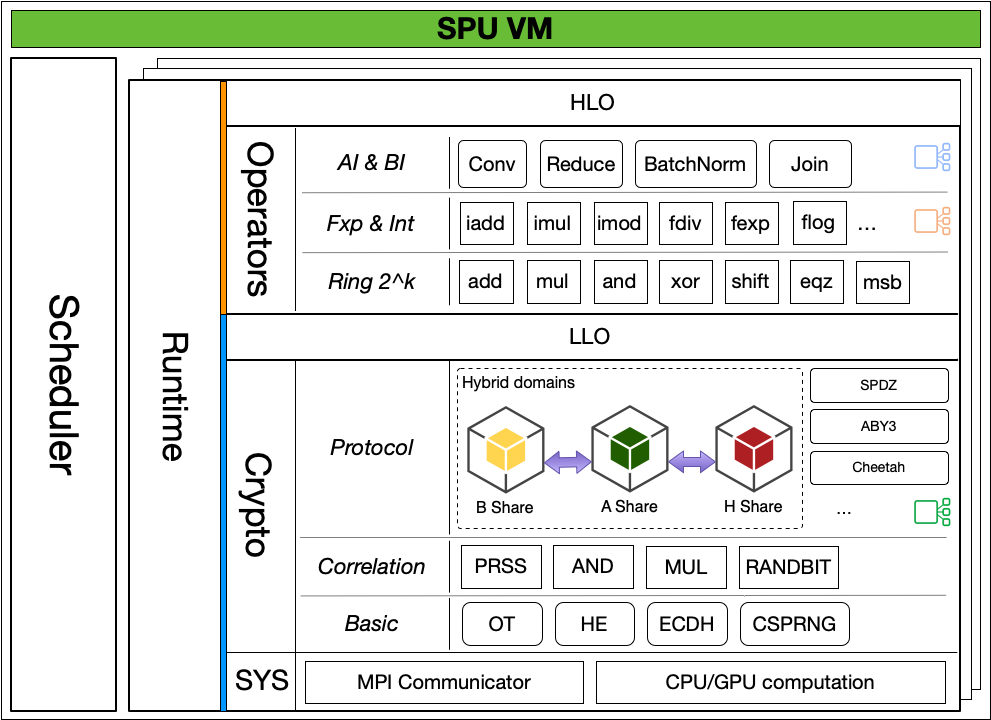

:target{#spu-secure-processing-unit}

# SPU (Secure Processing Unit)

SPU(Secure Processing Unit)是一个特定领域的编译器和运行时组合。利用SPU，你可以：

- 在不了解MPC知识的情况下创建隐私保护应用。
- 利用你最喜欢的机器学习框架和API编程。
- 不需要调整代码的情况下也可以在不同安全假设下部署应用。

:target{#introduction}

## 介绍

SPU，就像其他处理器（processing unit）一样接受代码和输入数据，并且得到输出数据。但是和其他处理器不同的是，SPU可以保护用户的隐私。

尽管SPU和CPU不能直接比较，但是从编程者的视角来说，我们可以做一个类比。

<table>
  <tbody>
    <tr>
      <td>
        <figure id="id1">
          

          <figcaption>
            CPU
          </figcaption>

          - 物理设备，集成电路。
          - 处理明文。
          - 本地系统，单用户。
          - 灵活处理各类任务。
          - 快、低时延。
        </figure>
      </td>

      <td>
        <figure id="id2">
          

          <figcaption>
            SPU
          </figcaption>

          - 虚拟设备，MPC协议。
          - 处理密文。
          - 分布式系统，多用户。
          - 只适合特定任务。
          - 相对较慢，高时延。
        </figure>
      </td>
    </tr>
  </tbody>
</table>

SPU包含两个主要模块。SPU编译器将Python编码转化为蕴含隐私保护语义的二进制文件。SPU runtime执行这些二进制文件并得到结果，我们将在接下来分别介绍。

:target{#components}

## 模块

:target{#compiler}

### 编译器

<figure>
  
</figure>

就像其他编译器一样，SPU编译器将一种编程语言的代码翻译成另一种语言的代码。

SPU编译器在设计时考虑到：

- 复用机器学习前端框架，减少用户学习成本。
- 复用机器学习编译器功能，减少重复的工作。
- 为MPC后端优化，产生适合MPC协议的二进制代码。

为了实现第一个目标，我们选择 [XLA](https://www.tensorflow.org/xla/architecture) 作为SPU编译器的源语言，因为很多AI框架可以将Python代码翻译成XLA IR。利用XLA，我们可以原生支持这些AI框架。

为了实现第二个目标，我们选择 [MLIR](https://mlir.llvm.org/) 作为编译器基建。这样我们就可以复用很多与平台无关的优化和lowering pass。

为了实现第三个目标，我们在类型系统中添加了安全相关的类型提示，这些类型提示有助于实现高效率的二进制代码。

详情请查看 [SPU type system](https://www.secretflow.org.cn/docs/spu/en/development/type_system.html) 和 [SPU Compiler design](https://www.secretflow.org.cn/docs/spu/en/development/compiler.html).

:target{#runtime}

### 运行时

SPU运行时是一个用多个不相互信任的物理节点组成的虚拟设备。

- 在SPU中，多个物理设备同时执行一个MPC协议，在完成特定计算任务的同时保护数据隐私。
- 从外面看，多个物理设备形成了一个虚拟设备并且提供了通用计算服务。

模型示意图如下。

<figure id="id3">
  

  <figcaption>
    SPU内部
  </figcaption>
</figure>

作为一个虚拟机，SPU运行时是一个多层的结果，将SPU二进制程序逐层分解只最底层的密码学原语，并且提供了并行和调度能力。

<figure id="id4">
  

  <figcaption>
    SPU运行时结构
  </figcaption>
</figure>

详情请访问 [SPU 文档](https://www.secretflow.org.cn/docs/spu/en/) 。

:target{#summary}

## 总结

前面我们介绍SPU的不同模块，接下来，我们了解一下SPU操作的总体流程。

<figure id="id5">
  

  <figcaption>
    SPU操作总结
  </figcaption>
</figure>

- 用户利用TensorFLow，PyTorch或JAX编程。
- 利用SPU编译器，源码被翻译成能被SPU运行时理解的SPU IR。
- 利用SPU IO，数据提供方将数据加密为SPU运行时可以理解的格式。
- SPU运行时根据MPC协议执行IR，并产生（加密的）输出。
- 利用SPU IO，数据接收方解密加密之后的输出以得到最终结果。

:target{#appendix}

## 附录

:target{#mpc-secure-multi-party-computation}

### MPC (Secure multi-party computation)

如果你不熟悉MPC，请参阅 [Resources for Getting Started with MPC](https://u.cs.biu.ac.il/~lindell/MPC-resources.html) 和一些著名的 [MPC 框架和协议](https://github.com/rdragos/awesome-mpc#frameworks.)。

SPU实现了多种MPC协议，包括：

- [ABY3](https://eprint.iacr.org/2018/403.pdf):一个多数诚实的3PC协议。SPU实现了半诚实模型。
- [Semi2k-SPDZ](https://eprint.iacr.org/2018/482.pdf) :一个半诚实NPC协议。和SPDZ协议类似，但是需要一个可信第三方来产生离线的随机数。目前，在协议中默认使用可信第一方。因此，目前主要用于调试。
- [Cheetah](https://eprint.iacr.org/2022/207) :一个快速半诚实的2pc模型。因为协议不需要可信第三方，因此会需要一些计算开销。

详情请参阅 [SPU MPC development status](https://www.secretflow.org.cn/docs/spu/en/reference/mpc_status.html)。

:target{#spu-api-design}

### SPU API设计

SPU的API十分简单，主要有三个主要模块，对应之前的模块描述。

- [SPU Io](https://www.secretflow.org.cn/docs/spu/en/reference/py_api.html#runtime-io) 是一个在密码和秘密分享之间转化的库。
- [SPU compiler](https://www.secretflow.org.cn/docs/spu/en/reference/py_api.html#compiler),是一个将XLA转化为SPU IR的工具。
- [SPU Runtime](https://www.secretflow.org.cn/docs/spu/en/reference/py_api.html#runtime-setup), 是一个读入SPU IR并执行MPC计算的库。

:target{#spu-in-secretflow}

### SecretFlow中的SPU

在SecretFlow中，SPU设备包装了上述所有SPU的概念，并提供了更简单的编程接口。

- 数据所有者是SecretFlow中的PYU设备，明文并成为PYU Objects。
- 一个PYU object（明文）可以被转化为秘密分享，被叫做SPU Object。
- Python函数可以被发送至SPU设备执行，背后是SPU编译器和运行时。
- 最后，一个SPU Object可以被转化为PYU Object，并被一个PYU设备拥有。
