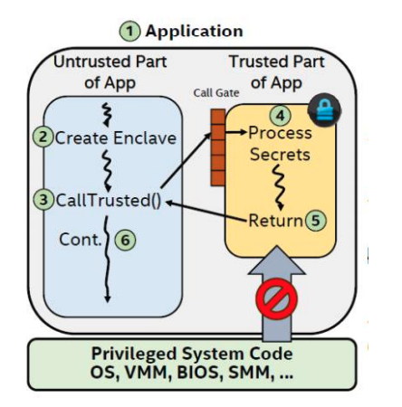
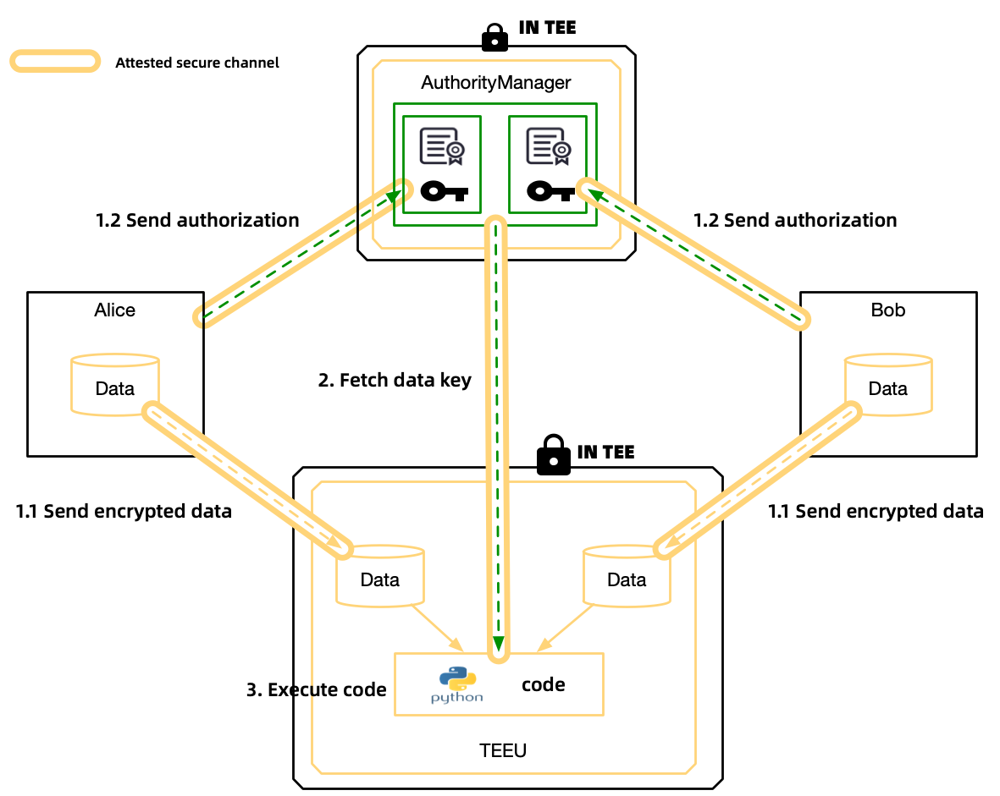
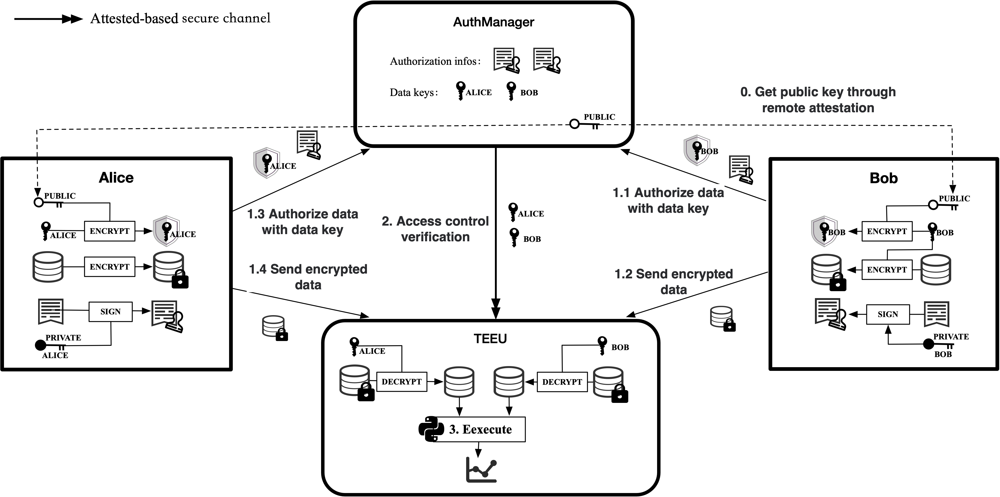
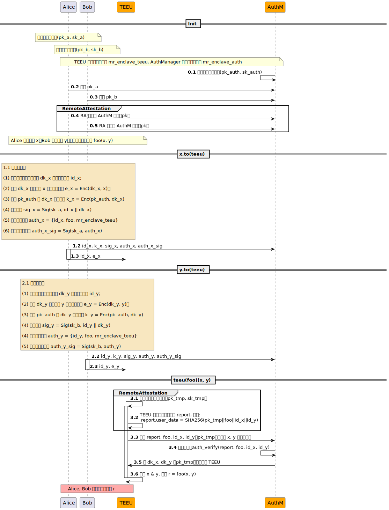

:target{#teeu}

# TEEU 设备

:target{#introduction-to-tee}

## TEE介绍

可信执行环境(Trusted Execution Environment，TEE) 是一种基于硬件的隐私保护技术。它保证了执行代码的真实性，运行时状态(如CPU寄存器、内存和敏感I/O)的完整性，以及存储在内存中的代码、数据和运行时状态的机密性。此外，还应能够向第三方提供远程认证，以证明其可靠性。

目前隐私保护计算路线繁多，比如多方安全计算（Multi-Party secure Computing，MPC）、同态加密（Homomorphic Encryption，HE）、联邦学习（Federated Learning，FL）以及 TEE 等。MPC、HE和TEE都具备比较清晰的安全模型，可以做到保护计算过程中的数据隐私。其中，MPC和HE主要是基于纯密码学理论，优点是安全可证明，但由于依赖大量复杂计算，导致计算性能较低，目前难以在大规模场景上使用。而TEE是基于安全硬件的方案，优点是通用性好，支持大规模计算，缺点是需要信赖硬件。

TEE本身也有多种实现（比如Intel SGX、Intel TDX、Arm TrustZone、Arm CCA、AMD SEV、Hygon CSV等），其原理也略有不同，目前隐语支持的主要是Intel SGX 2.0（Software Guard Extensions），我们以SGX为例简单介绍TEE的原理。

:target{#sgx-enclave}

### SGX: Enclave

Enclave可以被视为进程中安全可信的部分，其中运行的程序和数据的机密性和完整性受到SGX的保护。Enclave所处的内存是加密的，除了Enclave自身和CPU之外，其他系统软件包括 Operating system (OS), Virtual Machine Monitor (VMM), System Management Mode (SMM), BIOS 等都无法访问 Enclave，从而避免 Enclave 被恶意攻击。

下图中黄色部分表示了 Enclave。从图中我们可以看到，在标准的SGX模型下，应用被分为可信和不可信两部分，可信部分为 Enclave，非可信部分为运行在外面的代码和数据



关于enclave的更详细介绍，可以阅读 [SGX Enclave](https://www.intel.com/content/dam/develop/external/us/en/documents/overview-of-intel-sgx-enclave-637284.pdf)

:target{#sgx-remote-attestation}

### SGX: 远程认证

远程认证提供了一种方法，允许远程用户验证远程进程中软件的真实性。

远程认证可以对以下内容进行验证：

1. Enclave运行在SGX内部
2. Enclave运行在具有最新安全级别的系统上
3. Enclave的代码

通过远程认证，用户可以确保enclave运行环境是可靠的，且运行的代码未被篡改。

目前SGX支持两种类型的远程认证：ECDSA（Elliptic Curve Digital Signature Algorithm）认证和 Intel EPID(Intel Enhanced Privacy ID) 认证。其中，ECDSA 需要配合 Intel SGX DCAP（Intel Software Guard Extensions Data Center Attestation Primitives）一齐使用。第三代 Intel Xeon Scalable 和部分 Xeon E3处理器支持 ECDSA 认证，部分 Intel Core、Intel Xeon E 和 Intel Xeon E3 支持 EPID 认证。

SecretFlow目前仅支持ECDSA认证模式。

:target{#libos-occlum}

### LibOS: Occlum

在原生SGX编程模型中，应用被分为可信（enclave）和不可信两部分，出于安全原因，Enclave内部不允许直接执行系统调用。这意味一个应用程序要跑在 SGX 上，需要对原始的代码划分为可信和不可信部分，其中可信部分不能进行系统调用。虽然SGX提供了专用的sdk帮助开发者编写SGX程序，但是迁移已有应用跑在SGX上依然有很大的负担，因为大部分已有的应用无法直接运行，需要做或多或少的修改，甚至可能很难改动成功。

基于上述背景，一些LibOS被用于在SGX上运行应用。LibOS（Library OS）将系统内核的部分能力（比如文件I/O、网络通信）以库的形式提供给应用程序，应用程序运行在LibOS上，而LibOS作为SGX的应用程序运行在SGX机器上，从而让已有的应用在很少或者几乎无修改的情况下运行在SGX上。目前比较成熟的 LibOS 有 [Occlum](https://github.com/occlum/occlum)、[Gramine](https://github.com/gramineproject/gramine)等。目前隐语选择 occlum 作为运行 SGX 的底座 LibOS。

:target{#id1}

## TEEU 设备

TEE 提供了良好的安全模型，并且支持大规模高性能计算，是目前隐私保护计算不可或缺的路线之一。但是TEE目前依然存在上手难度较高的问题，其易用性还没有做到和非 TEE 一样简单易用。为了给用户提供更易用的 TEE 能力，同时也作为基础的隐私保护计算能力，隐语从设计伊始就把 TEE 纳入了技术路线，提供 TEE 设备——TEEU 作为明密文混合编程的基础设备。

TEEU(TEE processing Unit)属于隐语密态设备的一种。TEEU 被设计为可以在 TEE上 运行 python 程序，用户通过 SecretFlow 提供的接口，可以把数据加密发送给 TEEU，从而可以让 TEEU 在 TEE 内对数据进行安全计算。TEEU 通过屏蔽底层细节（比如远程认证、数据加密和传输），并且提供数据访问授权控制语义，让用户使用 TEE 尽量简单，同时不降低其安全性。

需要注意，目前用户发送给TEEU的数据是加密的，仅在TEEU内部解密进行计算，但是最终计算的结果是明文输出的。因此目前使用 TEEU 进行计算时，请确保计算结果明文是对您是可以接受的，否则建议审慎使用。计算结果的安全性和访问控制会在后续版本中添加，欢迎持续关注我们的更新。

:target{#overall-architecture}

### 整体架构

下图以 Alice 和 Bob 使用 TEEU 进行融合安全计算为例，展示了 TEEU 的整体架构和链路。该图表述了 Alice 和 Bob 把各自的数据发送给 TEEU，并且授权 TEEU 对数据进行指定的计算（python 代码）。其大致的流程可以描述为：

1. Alice/Bob的数据会以加密的形式发送给TEEU，以确保数据安全。
2. Alice/Bob 的数据加密秘钥由 Authority Manager 托管，AuthoriyManager 是运行在TEE内的一个应用，提供数据访问控制服务。Alice/Bob 除了向 Authority Manager 提供数据加密秘钥外，还会附带可以访问数据的TEEU身份标识（MRENCLAVE）以及允许执行的计算逻辑（python 代码）。
3. TEEU 执行 python 代码之前，会访问 Authority Manager 获取数据秘钥，以及数据被允许执行的 python 代码签名。只有收到的 python 代码和授权允许的 python 代码一致时，TEEU 才会最终执行 python 代码。

上述流程中，每一步都基于SGX的远程认证机制，对运行的 Authority Manager 和 TEEU 进行了认证，从而确保安全性，后文会详细介绍。



:target{#principle-introduction}

### 原理介绍

下图为 TEEU 的详细描述。



我们将使用序列图详细解释上述流程。



:target{#init}

#### init

Alice 和 Bob 各自持有一对公私密钥，AuthManager 以及 TEEU 的安全度量值（MRENCLAVE）可以通过源码计算得到。

在初始化阶段, AuthManager 会在启动时生成一对公私密钥（0.1）；Alice，Bob 会将公钥信息注入 AuthManager（0.2-0.3), 用于 AuthManager 对数据授权签名的验证，Alice/Bob 通过远程认证获取 AuthManager 的公钥（0.4-0.5）。

:target{#x-to-teeu}

#### [x.to](http://x.to)(teeu)

1.1. 数据准备（Data preparation）

> (1) 随机生成加密数据密钥 dk\_x 以及数据标识 id\_x；<br /> (2) 使用 dk\_x 加密数据 x to 得到加密数据 e\_x = Enc(dk\_x, x)；<br /> (3) 使用 pk\_auth 对 dk\_x 进行加密 k\_x = Enc(pk\_auth, dk\_x)；<br /> (4) 计算签名 sig\_x = Sig(sk\_a, id\_x || dk\_x)；<br /> (5) 生成数据授权 auth\_x = \{id\_x, foo, mr\_enclave\_teeu}；<br /> (6) 对授权信息签名 sig\_auth\_x = Sig(sk\_a, auth\_x)

1.2 将 k\_x, sig\_x, auth\_x, sig\_auth\_x 发送至 AuthManager

1.3 将 id\_x 以及加密数据 e\_x 发送至 TEEU

:target{#y-to-teeu}

#### [y.to](http://y.to)(teeu)

与 <strong>[x.to](http://x.to)(teeu)</strong> 执行操作一致（2.1-2.3）

:target{#teeu-foo-x-y}

#### teeu(foo)(x, y)

3.1. TEEU 随机生成临时公私钥（pk\_tmp, sk\_tmp），这对公私钥作为后续与 AuthManager 通信的临时密钥。

3.2. TEEU 生成远程认证报告 `ra_report`, 其中用户自定义字段 `ra_report.user_data` 设置为 SHA256(pk\_tmp || SHA256(foo) || id\_x || id\_y)。

3.3. TEEU 将 `ra_report`，随机生成的公钥 `pk_tmp`，待执行的函数哈希 `SHA256(foo)` 以及加密数据 x，y 的 ID 发送给 AuthManager，用于请求 x，y 的解密密钥。

3.4 AuthManager 会验证 report 以及待执行函数的哈希值是否满足 x, y 的授权信息（验证流程见 `AuthVerify`)

> AuthVerify<br /> (1) 根据 id\_x, 查询到以下信息 k\_x, sig\_x, auth\_x, sig\_auth\_x, pk\_a。<br /> (2) 使用 sk\_auth 解密 k\_x 得到 dk\_x.<br /> (3) 使用 pk\_a 验证签名, SigVerify(pk\_a, sig\_x, id\_x || dk\_x).<br /> (4) 使用 pk\_a 验证签名, SigVerify(pk\_a, sig\_auth\_x, auth\_x), 这一步和第（3）步结合起来可以说明授权信息是由 Alice 生成的，而不是伪造的，因为只有 Alice 才知道 dk\_x。<br /> (5) 验证 foo 是否在 auth\_x 内.<br /> (6) 验证 ra\_report 并确认 ra\_report.mr\_enclave 是否在 auth\_x 内。<br /> (7) 对 id\_y 重复 (1)-(6)的操作。

3.5. AuthManager 验证通过后， 将 dk\_x, dk\_y 用 pk\_tmp 加密传输给 TEEU。

3.6. TEEU解密 x & y, 执行 r = foo(x, y)。

:target{#module-introduction}

### 模块介绍

:target{#authmanager}

#### AuthManager

如何保护用户数据隐私的同时又合理使用数据？通常从两方面出发：

1. 数据的计算全部都在TEE环境中运行，保证隐私性。
2. 上传数据的用户对数据进行授权，保证TEE环境中只有符合授权语义的算子才能使用该份数据。

AuthManager 正是为了解决数据的授权，它有以下几个特点：

1. 在TEE环境中运行，由上传数据的用户（PYU）进行远程验证，保证 AuthManager 没有恶意行为
2. 网络通信采用签名或者 mac、数字信封等方式防止通信数据被篡改，支持 mtls 通信
3. 灵活的授权语义
4. 数据的加密秘钥（data key）与元信息由 AuthManager 管理，TEEU 必须与 AuthManager 通信验证授权才能获取秘钥，保证授权语义无法被绕过

AuthManager的代码参见[AuthManager](https://github.com/secretflow/authmanager)。

:target{#term}

##### 术语

机构（institution id）：上传数据的用户方，此处为 PYU

授权应用（application）：一个完整的程序，此处为 TEEU，通常用 mr\_enclave 来度量

授权函数（func）：程序中实际执行的函数，此处为 TEEU 执行的 python 代码

:target{#secure-communication}

##### 安全通信

数字信封：AuthManager 自生成公私钥，PYU 使用公钥加密数据，AuthManager 使用私钥解密数据，为了防止公钥被篡改，AuthManager 返回给 RA 的 report 数据中包含公钥信息，通过 TEE 机制保证公钥正确

mtls 通信：可选功能，需 AuthManager 与 PYU 生成证书才可正常使用

:target{#authorization-semantics}

##### 授权语义

粒度：授权机构institution id + 授权应用app（mr\_enclave）+ 授权函数func（无状态）

由于 AuthManager 在此处是为 TEEU 进行授权，TEEU 不是机构，因而此处的授权语义是：授权应用 app（mr\_enclave） + 授权函数 func（无状态）

:target{#storage-model}

##### 存储模型

提供了 storage 存储层的抽象，目前支持 inmemory 和 remote 两种

1. inmemory：内存存储，没有持久化功能，通过 TEE 内存机制加密防止泄露
2. remote：远程存储，可持久化，http 服务访问（但需要自行部署存储服务），数据都需要加密后再存储防止泄露

:target{#id2}

#### TEEU 设备

此处 TEEU 指实际执行 python 代码的 SGX 程序。TEEU 作为 ray 的一个 actor 在 Occlum 内运行，其核心作用是在保证符合授权语义的情况下执行 python 代码。TEEU 的工作流程比较简单，主要包括：

1. 接收用户提供的python方法以及相关参数。
2. 按照AuthManager的授权语义，向AuthManager请求参数数据的加密秘钥。若相关数据并未授权给对应的代码使用，则获取失败。
3. 使用数据秘钥对数据解密后获取数据明文，并执行python方法。

因为TEEU作为SGX程序运行，所以可以确保执行过程中的数据安全。与此同时用户可以对TEEU进行远程认证，从而确保TEEU代码没有被篡改。

:target{#limitations}

##### 局限性说明

目前SecretFlow使用occlum作为基础的LibOS，occlum支持python3.8并且支持运行一些常见的python库，但是仍然有部分python库无法在occlum里运行。比如有些程序在没有修改的情况下无法直接运行，或者使用到了occlum暂时不支持的系统调用/内核功能等。

另外，由于目前occlum尚不支持虚拟内存，对于程序来说，所有申请的内存均会被视作实际使用内存，因此程序在occlum里运行的表现可能和在普通OS不太一样，比如占用内存会很大。

如果您在运行中遇到报错，可以通过issue联系我们。

:target{#explanation-of-sample-code}

### 示例代码讲解

本小节我们结合demo代码来讲解TEEU背后发生的事情，demo代码如下（如何运行demo代码可以参考[teeu快速上手](../../tutorial/teeu.mdx)）。

```python
import numpy as np

def average(data):
    return np.average(data, axis=1)


alice = sf.PYU('Alice')
bob = sf.PYU('Bob')

teeu = TEEU('carol', mr_enclave='mr_enclave of TEEU')

a = alice(lambda: np.random.rand(4, 3))()
b = bob(lambda: np.random.rand(4, 3))()

a_teeu = a.to(teeu, allow_funcs=average)
b_teeu = b.to(teeu, allow_funcs=average)

avg_val = teeu(average)([a_teeu, b_teeu])
print(sf.reveal(avg_val))
```

1. 第7\~8行构造了两个参与方Alice和Bob的PYU实例。
2. 第10行构造了TEEU的实例，TEEU有参与方carol持有。
3. 第12-13行Alice和Bob分别生成了一个随机numpy array，这里的随机生成分别发生在Alice和Bob本地。
4. 第15\~16行Alice和Bob分别把通过`to`方法把各自的numpy array发送给teeu，允许对其执行average方法。这一步做了以下事情：
   1. 数据加密
      1. 随机生成加密数据密钥和数据id。
      2. 使用密钥加密数据，得到数据密文。
      3. 使用私钥对数据密文、数据id等进行签名（使用Alice/Bob的私钥）
   2. 授权
      1. 生成授权信息，包括数据id、average方法、TEEU的度量值（mr\_enclave）等
      2. 对授权信息进行签名（使用Alice/Bob的私钥）
   3. 对AuthManager进行远程认证
      1. 通过远程认证，用户可以确保enclave运行环境是可靠的，且运行的代码未被篡改。
      2. 使用AuthManager的公钥对数据加密秘钥、授权信息等进行加密保护，并附带然后发送给AuthManager
   4. 把数据密文和数据id发送给TEEU。
5. 第17行 TEEU 执行 average 方法，入参为Alice和Bob的numpy array构成的列表。这一步做了以下事情：
   1. TEEU临时随机生成一对公私钥，并且生成自己的远程认证报告，公钥附带在报告中。
   2. TEEU将 Report、average方法、numpy array对应的数据id发送给 AuthManager，请求获取数据解密密钥。
   3. AuthManager进行授权检查：
      1. 首先验证TEEU的Report，检查其度量值和授权信息中的度量值一致。
      2. 检查average方法和授权信息中的方法一致。
      3. 上面两部检查均通过后，则将数据解密密钥使用TEEU的公钥进行加密，并返回给TEEU
   4. TEEU使用解密密钥对numpy array进行解密，得到明文，并执行average方法，求得聚合后的平均值。
   5. TEEU将执行结果发送给Alice和Bob。

:target{#how-to-install-and-use-new-python-libraries-in-occlum}

### 如何在 Occlum 中安装和使用新的 python 库

目前 SecretFlow 提供的 TEE 镜像内置了部分 python 库，比如 numpy。如果您需要使用到其他没有内置的库，则需要先安装才能使用。方法如下

1. 启动容器

```python
docker run -it --net host --privileged -v /dev/sgx_enclave:/dev/sgx/enclave -v /dev/sgx_provision:/dev/sgx/provision -name SecretFlow-tee SecretFlow/tee-occlum:latest
```

2. 安装python包

```bash
cd /root/occlum_instance
PYTHONPATH=$PWD/image/opt/secretflow/lib/python3.8/site-packages/ pip install --prefix image/opt/secretflow <python_package>
```

3. 运行代码

您需要执行occlum build，获取新的mr\_enclave，并运行您的脚本。具体可以参考前面的教程。提示：

提醒：

- /root/occlum\_instance/images是occlum实际运行时的顶级根目录，您的自定义脚本建议放在 /root/occlum\_instance/images/root/下面，实际运行（执行occlum run命令）时，脚本的路径必须填写为`occlum run /bin/python /root/your_script.py`
- 新的 python 程序可能会占用更多的内存，如果您遇到内存不足等报错，可以尝试扩大内存配置，配置文件为/root/occlum\_instance/Occlum.json，通常您只需要把`user_space_size`调整一个更大的值。
- 每次修改了脚本或者配置文件的内容，都必须先执行 `occlum build -f` 才能确保生效，请一定注意

:target{#roadmap}

### 路线图

[TrustedFlow](https://www.secretflow.org.cn/docs/trustedflow/advanced_topic/roadmap.html)
