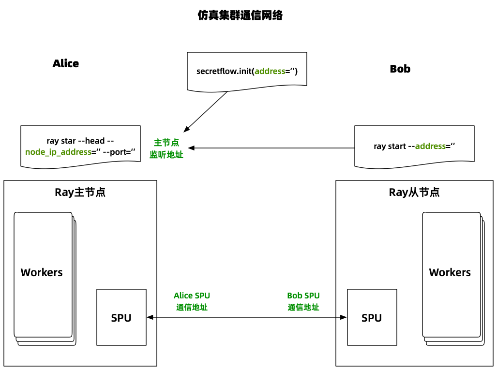
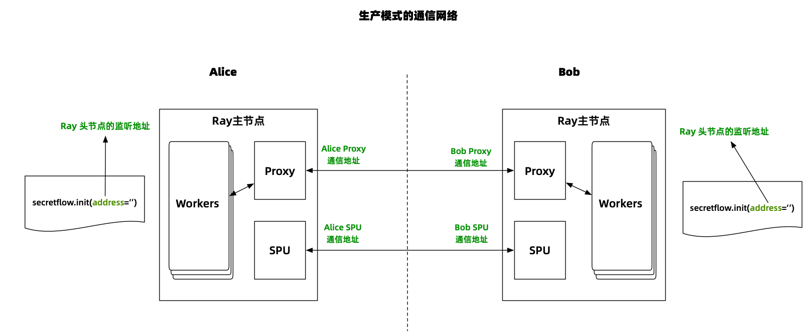

:target{#deployment}

# 部署

:target{#pre-knowledge-about-ray}

## 前置知识：关于Ray

隐语使用Ray作为分布式计算调度框架。Ray集群由一个主节点和零或若干个从节点组成，更多Ray的知识可以访问[Ray官网](https://docs.ray.io/)。

:target{#deploy-based-on-kuscia}

## 基于Kuscia部署

Kuscia is a lightweight privacy-preserving computing task orchestration framework based on K3s. It provides a unified privacy-preserving computing foundation that can abstract away heterogeneous infrastructure and protocols.

使用Kuscia，你可以不需要关注SecretFlow组网的细节，直接通过kubectl命令或者API接口轻松地管理和执行SecretFlow作业。此外，Kuscia还支持通信安全和并发运行SecretFlow作业。

如果你需要在业务中使用SecretFlow，推荐基于Kuscia部署运行SecretFlow。详情请参考Kuscia的[快速入门](https://www.secretflow.org.cn/docs/kuscia/latest/zh-Hans/getting_started/quickstart_cn)文档。

:target{#simulation}

## 仿真

SecretFlow被设计为可以快速仿真，既可以单机运行，也可以在多个节点上运行。

<strong>注意</strong>

基于单个ray集群的SecretFlow只适用于仿真。 生产环境建议阅读后面的生产相关章节。

---

:target{#standalone-mode-for-simulation}

### 单机仿真

使用 `secretflow.init` 在单机模式下运行SecretFlow。该模式会直接启动只有一个节点的ray集群，并且当程序退出时会自动关闭。

```python
>>> import secretflow as sf
>>> sf.init(parties=['alice', 'bob'], address='local')
```

:target{#cluster-mode-for-simulation}

### 集群模式仿真

在隐语的集群仿真模式下，每个Ray节点模拟一个机构，具体做法是通过给每个Ray节点添加机构名称标记，从而保证机构的计算被调度到相应的Ray节点上。 整体通信网络如下。



下面的例子展示了如何在多个节点上部署一个包含alice和bob的集群。

:target{#start-head-node}

#### 启动主节点

在第一台机器上启动带有 “alice” 标识的主节点。

---

<strong>注意</strong>

1. 请使用真实的ip地址和端口。
2. `{"alice": 16}` 意味着alice最多可以同时运行16个worker。 您可以按需要自行调整。

---

```bash
ray start --head --node-ip-address="ip" --port="port" --resources='{"alice": 16}' --include-dashboard=False --disable-usage-stats
```

当屏幕中输出 “Ray runtime started.” 意味着主节点成功启动。

现在我们的集群只有一个主节点，接下来我们启动更多节点。

:target{#start-other-nodes}

#### 启动其他节点

在另一台机器上启动带有 “bob” 标志的节点。 这个节点将会连接主节点并加入集群。

---

<strong>注意</strong>

请将 `ip:port` 更换为主节点的 `node-ip-address` 和 `port`。

---

```bash
ray start --address="ip:port" --resources='{"bob": 16}' --disable-usage-stats
```

当屏幕输出中出现 “Ray runtime started.” 意味着节点启动成功。现在由两个Ray节点构成的Ray集群已经搭建完毕。其中，头节点模拟机构alice，从节点模拟机构bob。

你也可以继续重复上述步骤以启动带有其他参与方标识的节点。

:target{#start-secretflow}

#### 启动SecretFlow

现在你可以启动SecretFlow。下面这段代码表示alice和bob分别执行了一个返回输入值的函数。

---

<strong>提示</strong>

1. 请使用主节点的 `node-ip-address` 和 `port` 填充 `sf.init` 的 `address` 参数。
2. 如果你启动了更多的节点（比如carol、davy等），记得在`parties=['alice', 'bob']`参数中添加新的参与方名称。

---

```python
>>> import secretflow as sf
# Replace with the `node-ip-address` and `port` of head node.
>>> sf.init(parties=['alice', 'bob'], address='ip:port')
>>> alice = sf.PYU('alice')
>>> bob = sf.PYU('bob')
>>> alice(lambda x : x)(2)
<secretflow.device.device.pyu.PYUObject object at 0x7fe932a1a640>
>>> bob(lambda x : x)(2)
<secretflow.device.device.pyu.PYUObject object at 0x7fe6fef03250>
```

:target{#optional-how-to-shut-down-the-cluster}

#### （可选）如何关闭集群

当你需要关闭集群时，请使用以下命令。请在所有机器上执行命令。

请注意在机器上的所有ray进程都会被停止，这意味着所有ray集群将会停止。

```bash
ray stop
```

:target{#optional-how-to-setup-an-spu-in-cluster-mode}

#### （可选）如何在集群模式下启动SPU

`SPU` 在不同节点上包含了多个工作进程。大部分SPU的代码由C++编写以确保性能。SPU基于Brpc，这意味着SPU拥有一个独立于Ray网络之外的服务网格。换言之，你必须单独处理SPU的端口。目前，我们正在尝试合并两者。

SPU的配置可以参考。

---

<strong>提示</strong>

1. 请使用主节点的 `node-ip-address` 和 `port` 填充 `sf.init` 的 `address` 参数。
2. `alice` 的 `address` 请填写可以被bob访通的地址，并且选择一个 <strong>未被占用的端口</strong> ，注意不要和Ray端口冲突。
3. `alice` 的 `listen_addr` 可以和alice `address`里的端口一样。
4. `bob` 的 `address` 请填写可以被alice访通的地址，并且选择一个 <strong>未被占用的端口</strong> ，注意不要和Ray端口冲突。
5. `bob` 的 `listen_addr` 可以和bob `address`里的端口一样。

---

```python
import spu
import secretflow as sf

# Use ray head adress please.
sf.init(parties=['alice', 'bob'], address='Ray head node address')

cluster_def={
    'nodes': [
        {
            'party': 'alice',
            # Please choose an unused port.
            'address': 'ip:port of alice',
            'listen_addr': '0.0.0.0:port'
        },
        {
            'party': 'bob',
            # Please choose an unused port.
            'address': 'ip:port of bob',
            'listen_addr': '0.0.0.0:port'
        },
    ],
    'runtime_config': {
        'protocol': spu.spu_pb2.SEMI2K,
        'field': spu.spu_pb2.FM128,
        'sigmoid_mode': spu.spu_pb2.RuntimeConfig.SIGMOID_REAL,
    }
}

spu = sf.SPU(cluster_def=cluster_def)
```

详细的SPU配置可以参考 [SPU config](https://www.secretflow.org.cn/docs/spu/en/reference/runtime_config.html)。

---

<strong>注意</strong>

你可以看到在很多教程中使用 `sf.utils.testing.cluster_def` 建立SPU。请注意它只能在单机模式下使用，因为它使用了 `127.0.0.1` 作为默认ip。

```python
>>> spu = sf.SPU(sf.utils.testing.cluster_def(['alice', 'bob', 'carol']))
```

---

:target{#deploy-secretflow-in-a-docker-container-with-simulation-mode}

### 使用docker部署仿真SecretFlow

在此之前，您可能需要先了解[docker网络](https://docs.docker.com/network/)的概念。Docker网络目前比较主流的两种网络是[host网络](https://docs.docker.com/network/host/)和[bridge网络](https://docs.docker.com/network/bridge/)，您可以点击链接阅读官方文档了解更多。

隐语推荐使用host网络模式启动容器，下面会向您解释原因。

:target{#recommended-host-network}

#### （推荐）host网络

如果您使用host方式启动docker容器（比如在启动时添加参数`--network host`），则容器会直接共享宿主机的网络。因此这种情况下搭建SecretFlow集群无需特别的配置，您可以直接使用宿主机的地址作为节点间通信的地址。部署步骤可以参考前文。

:target{#not-recommended-bridge-network}

#### （不推荐）bridge网络

如果您使用bridge网络启动docker容器，则意味着容器会拥有独立的隔离网络，ip地址与宿主机不同，并且不在同一个bridge网络上的容器默认是不通的。虽然您可以通过[端口映射](https://docs.docker.com/engine/reference/commandline/run/#publish)的方式把端口映射到宿主机上，但是由于ray多个节点之间的通信比较复杂，其中涉及到很多端口，比较容易出错不易配置正确，所以我们并不建议使用bridge模式搭建仿真集群。

如果因为某些原因您确实无法使用host网络，希望下面的说明对您使用bridge网络部署SecretFlow有帮助。

:target{#scenario-1-deploying-a-simulation-cluster-using-multiple-docker-containers-on-a-single-machine}

##### 情形一： 在一台机器上使用多个docker容器模部署仿真集群

下列步骤展示了如何在一台机器上启动多个容器。由于在同一台机器上，因此多个容器可以使用同一个bridge网络通信。

1. 创建一个bridge网络

下列命令创建了一个网段为192.168.0.1/24的bridge网络，名称叫做sfnet。 注意该网段仅为示例，您可以根据自己的需求自行修改网段地址。

```bash
docker network create sfnet --subnet 192.168.0.1/24
```

2. 启动第一个容器模拟机构alice

下列命令启动了名为`secretflow0`的容器，使用第一步创建的bridege网络，并且指定了ip为192.168.0.10。

```bash
docker run -it --network sfnet --ip 192.168.0.10 --name secretflow1 secretflow/secretflow-anolis8:latest bash
```

容器启动成功后，接着我们启动ray的主节点。下列命令启动了Ray的主节点，监听端口为9001（您可以自由选择一个未使用的端口）。

```default
ray start --head --port=9001 --resources='{"alice": 16}' --include-dashboard=False --disable-usage-stats
```

3. 启动第二个容器模拟机构bob

下列命令启动了名为`secretflow1`的容器，使用第一步创建的bridege网络，并且指定了ip为192.168.0.20。

```bash
docker run -it --network sfnet --ip 192.168.0.20 --name secretflow2 secretflow/secretflow-anolis8:latest bash
```

启动容器后，我们启动Ray的从节点。下面命令启动了Ray的从节点，连接上一步启动的主节点。

```default
ray start --address=192.168.0.10:9001 --resources='{"bob": 16}' --disable-usage-stats
```

至此我们已经搭建了两个Ray节点，分别代表机构alice和bob。

4. 启动SecretFlow

启动SecretFlow 我们在第一个容器内启动SecretFlow，下列Python代码说明SecretFlow成功连接到了Ray集群

```python
>>> import secretflow as sf
>>> sf.init(parties=['alice', 'bob'], address='192.168.0.10:9001')
2023-02-18 07:08:29,697 INFO worker.py:1352 -- Connecting to existing Ray cluster at address: 192.168.0.10:9001...
2023-02-18 07:08:29,718 INFO worker.py:1538 -- Connected to Ray cluster.
>>> # your code to run
```

5. （可选）启动SPU设备

这一步描述了如何启动SPU设备。假设SPU在alice上使用端口9100，在bob上使用端口9200。（端口号仅为示例，您可以任意选择未被占用的端口）

```python
import spu
import secretflow as sf

# Use ray head adress please.
sf.init(parties=['alice', 'bob'], address='192.168.0.10:9001')

cluster_def={
    'nodes': [
        {
            'party': 'alice',
            'address': '192.168.0.10:9100',
            'listen_addr': '0.0.0.0:9100'
        },
        {
            'party': 'bob',
            'address': '192.168.0.20:9200',
            'listen_addr': '0.0.0.0:9200'
        },
    ],
    'runtime_config': {
        'protocol': spu.spu_pb2.SEMI2K,
        'field': spu.spu_pb2.FM128,
        'sigmoid_mode': spu.spu_pb2.RuntimeConfig.SIGMOID_REAL,
    }
}

spu = sf.SPU(cluster_def=cluster_def)

# your code to run.
```

:target{#not-recommended-strongly-scenario-2-deploy-a-simulation-cluster-using-multiple-docker-containers-on-multiple-machines}

##### （强烈不推荐）情形二：在多台机器上使用多个docker容器部署仿真集群

如果您需要在多台机器上使用bridge网络部署多个容器来搭建Ray集群，由于Ray的通信协议复杂(使用到很多端口且会发生跨节点互相访问），导致需要每台机器上都要透出很多端口，操作很复杂且很容易出错。Ray官方对此的支持也并不好，所以我们非常不推荐这种部署模式。

:target{#deploy-secretflow-in-wsl-windows-subsystem-for-linux-with-simulation-mode}

### 使用WSL(Windows Subsystem for Linux)部署仿真SecretFlow

如果您在WSL2使用隐语的话，您可以在WSL2上使用不同的发行版部署隐语

下列步骤将演示如何在WSL上部署仿真模式的SecretFlow。

1. 在您的WSL上安装不同的发行版

您应该安装至少两个不同版本的发行版，例如Ubuntu 20.04.6 LTS 和 Ubuntu 22.04.2 LTS 或者至少两个不同的发行版，例如Ubuntu 和 Debian，在这个例子里面`alice`位于`Ubuntu 20.04.6 LTS` 而且`bob` 位于 `Ubuntu 22.04.2 LTS`:

- alice:
  ```bash
  (secretflow) alice@DESKTOP-SAOB7DQ:~$ lsb_release -a
  No LSB modules are available.
  Distributor ID: Ubuntu
  Description:    Ubuntu 20.04.6 LTS
  Release:        20.04
  Codename:       focal
  (secretflow) alice@DESKTOP-SAOB7DQ:~$
  ```
- bob:
  ```bash
  (secretflow) bob@DESKTOP-SAOB7DQ:~$ lsb_release -a
  No LSB modules are available.
  Distributor ID: Ubuntu
  Description:    Ubuntu 22.04.2 LTS
  Release:        22.04
  Codename:       jammy
  (secretflow) bob@DESKTOP-SAOB7DQ:~$
  ```

2. 在不同的发行版上安装隐语

在不同的发行版上执行下列步骤建立隐语的开发环境

- 安装Miniconda  改变您的工作目录到您的home目录安装Miniconda
  ```bash
  cd ~
  ```
  下载Miniconda
  ```bash
  wget https://repo.anaconda.com/miniconda/Miniconda3-latest-Linux-x86_64.sh
  ```
  安装Miniconda
  ```bash
  sh Miniconda3-latest-Linux-x86_64.sh
  ```
  在Miniconda的安装完成以后，您可以删除Miniconda的安装包
- 创建隐语的虚拟环境， 在不同发行版上的Python版本应该完全一致
  ```bash
  conda create --name secretflow python==3.8.15
  ```
- 激活隐语的虚拟环境
  ```bash
  conda activate secretflow
  ```
- 启动SecretFlow
  ```bash
  pip install -U secretflow
  ```

3. 获取您的WSL的IP地址

因为WSL的实现原理，WSL里的不同发行版共用相同的IP地址，所以我们只能够在单机模式下部署隐语。使用命令 `ifconfig`获得您的WSL的IP地址，如果出现 `command not found`，您可以安装 `net-tools`，您可以在Ubuntu上运行下列命令安装它

````none
```bash
apt install net-tools
```
````

Ubuntu下的一个例子

```bash
(secretflow) alice@DESKTOP-SAOB7DQ:~$ ifconfig
eth0: flags=4163<UP,BROADCAST,RUNNING,MULTICAST>  mtu 1500
        inet 172.23.139.91  netmask 255.255.240.0  broadcast 172.23.143.255
        inet6 fe80::215:5dff:fe23:1cd6  prefixlen 64  scopeid 0x20<link>
        ether 00:15:5d:23:1c:d6  txqueuelen 1000  (Ethernet)
        RX packets 1782122  bytes 7504258331 (7.5 GB)
        RX errors 0  dropped 0  overruns 0  frame 0
        TX packets 1077846  bytes 63011688 (63.0 MB)
        TX errors 0  dropped 0 overruns 0  carrier 0  collisions 0

lo: flags=73<UP,LOOPBACK,RUNNING>  mtu 65536
        inet 127.0.0.1  netmask 255.0.0.0
        inet6 ::1  prefixlen 128  scopeid 0x10<host>
        loop  txqueuelen 1000  (Local Loopback)
        RX packets 701234  bytes 573429022 (573.4 MB)
        RX errors 0  dropped 0  overruns 0  frame 0
        TX packets 701234  bytes 573429022 (573.4 MB)
        TX errors 0  dropped 0 overruns 0  carrier 0  collisions 0
```

IP 地址 `172.23.139.91` 是我们需要的, 我们把它记作`ray_ip`

4. 启动Ray集群主节点

使用 `ray_ip` 在标记为”alice”的发行版上启动主节点这里，`ray_ip` 是 `172.23.139.91` 而且我们选择端口`20010` (我们把它记作 `ray_port`)作为Ray的端口那么在主节点启动Ray集群的命令就可以如下所示

```bash
ray start --head --node-ip-address="172.23.139.91" --port="20010" --resources='{"alice": 16}' --include-dashboard=False --disable-usage-stats
```

运行日志

```bash
(secretflow) alice@DESKTOP-SAOB7DQ:~$ ray start --head --node-ip-address="172.23.139.91" --port="20010" --resources='{"alice": 16}' --include-dashboard=False --disable-usage-stats
Usage stats collection is disabled.

Local node IP: 172.23.139.91

--------------------
Ray runtime started.
--------------------

Next steps
  To connect to this Ray runtime from another node, run
    ray start --address='172.23.139.91:20010'

  Alternatively, use the following Python code:
    import ray
    ray.init(address='auto', _node_ip_address='172.23.139.91')

  To connect to this Ray runtime from outside of the cluster, for example to
  connect to a remote cluster from your laptop directly, use the following
  Python code:
    import ray
    ray.init(address='ray://<head_node_ip_address>:10001')

  To see the status of the cluster, use
    ray status

  If connection fails, check your firewall settings and network configuration.

  To terminate the Ray runtime, run
    ray stop
(secretflow) alice@DESKTOP-SAOB7DQ:~$
```

5. 启动Ray集群其他节点

使用 `ray_ip` 和 `ray_port` 启动Ray集群的其他节点在标记为”bob”的发行版上：

- `ray_ip`:172.23.139.91
- `ray_port`:20010 然后运行命令

```bash
ray start --address="172.23.139.91:20010" --resources='{"bob": 16}' --disable-usage-stats
```

运行日志

```bash
(secretflow) bob@DESKTOP-SAOB7DQ:~$ ray start --address="172.23.139.91:20010" --resources='{"bob": 16}' --disable-usage-stats
Local node IP: 172.23.139.91

--------------------
Ray runtime started.
--------------------

To terminate the Ray runtime, run
  ray stop
(secretflow) bob@DESKTOP-SAOB7DQ:~$
```

6. 检查Ray集群的状态

在Ray集群的任一节点检查Ray集群的状态，比如标记为”alice”的发行版上

```bash
ray status
```

运行日志

```bash
(secretflow) alice@DESKTOP-SAOB7DQ:~$ ray status
======== Autoscaler status: 2023-05-18 10:33:28.673249 ========
Node status
---------------------------------------------------------------
Healthy:
 1 node_4cb5fcb410e8b11a62bcebe5653918f0c6ae2b996e028e8e5ec22199
 1 node_d74a3ee633f939d04af3f67f7d4910c064c95a040e6998bfb706aed6
Pending:
 (no pending nodes)
Recent failures:
 (no failures)

Resources
---------------------------------------------------------------
Usage:
 0.0/24.0 CPU
 0.0/16.0 alice
 0.0/16.0 bob
 0.00/8.894 GiB memory
 0.00/4.110 GiB object_store_memory

Demands:
 (no resource demands)
(secretflow) alice@DESKTOP-SAOB7DQ:~$
```

如上所示，可以发现两个Ray集群的节点

7. 启动SecretFlow

我们使用`ray_ip` 和 `ray_port` 在标记为”alice”的第一个发行版上启动隐语, 下面在bash上运行的Python代码表示 隐语已经成功地连接到了Ray集群. 你也可以直接运行Python代码脚本

```bash
(secretflow) alice@DESKTOP-SAOB7DQ:~$ python
Python 3.8.15 (default, Nov 24 2022, 15:19:38)
[GCC 11.2.0] :: Anaconda, Inc. on linux
Type "help", "copyright", "credits" or "license" for more information.
>>> import secretflow as sf
>>> sf.init(parties=['alice', 'bob'], address='172.23.139.91:20010')
2023-05-18 10:36:07,871 INFO worker.py:1352 -- Connecting to existing Ray cluster at address: 172.23.139.91:20010...
2023-05-18 10:36:07,879 INFO worker.py:1538 -- Connected to Ray cluster.
>>># your code to run
>>>
```

8. （可选）启动SPU设备

这一步描述了如何启动SPU设备。假设SPU在alice上使用端口9100，在bob上使用端口9200。（端口号仅为示例，您可以任意选择未被占用的端口）

- `ray_ip`:172.23.139.91
- `ray_port`:20010

```python
import spu
import secretflow as sf

# Use ray head adress please.
# sf.init(parties=['alice', 'bob'], address='ray_ip:ray_port')
sf.init(parties=['alice', 'bob'], address='172.23.139.91:20010')

cluster_def={
    'nodes': [
        {
            'party': 'alice',
            'address': '172.23.139.91:9100',
            'listen_addr': '0.0.0.0:9100'
        },
        {
            'party': 'bob',
            'address': '172.23.139.91:9200',
            'listen_addr': '0.0.0.0:9200'
        },
    ],
    'runtime_config': {
        'protocol': spu.spu_pb2.SEMI2K,
        'field': spu.spu_pb2.FM128,
        'sigmoid_mode': spu.spu_pb2.RuntimeConfig.SIGMOID_REAL,
    }
}

spu = sf.SPU(cluster_def=cluster_def)

# your code to run.
```

:target{#production}

## 生产模式

SecretFlow提供了多控制器模式用于生产以提升安全性。（如果您想了解更多，欢迎阅读[隐语编程思想](../developer/design/programming_in_secretflow.mdx)）

用于生产的SecretFlow由多个ray集群组成，每个参与方拥有各自的ray集群。 <strong>与此同时，每一个参与方都要同时执行代码，才能完成任务的协作</strong> 。生产模式的架构如下图所示。



下列步骤将演示如何部署生产模式的SecretFlow。

:target{#setup-a-secretflow-cluster-crossing-silo}

### 创建跨机构的SecretFlow集群。

下面的例子展示了如何构建一个由alice和bob组成的生产集群。

---

<strong>注意</strong>

请牢记alice和bob需要同时运行代码。

---

:target{#start-secretflow-on-the-node-of-alice}

#### 在alice节点上启动SecretFlow

alice首先启动ray集群。注意这里的命令是启动Ray的主节点。

```bash
ray start --head --node-ip-address="ip" --port="port" --include-dashboard=False --disable-usage-stats
```

屏幕输出中显示”Ray runtime started.”，则说明Ray的主节点启动成功。至此alice的Ray集群已经创建完成。

`alice`使用集群配置初始化SecretFlow，并且运行代码。

---

<strong>提示</strong>

1. 请使用主节点的 `node-ip-address` 和 `port` 填充 `sf.init` 的 `address` 参数。
2. `alice` 的 `address` 请填写可以被bob访通的地址，并且选择一个 <strong>未被占用的端口</strong> ，注意不要和Ray和SPU的端口冲突。
3. `bob` 的 `address` 请填写可以被alice访通的地址，并且选择一个 <strong>未被占用的端口</strong> ，注意不要和Ray和SPU的端口冲突。
4. 注意 `self_party` 为 `alice` 。
5. 请注意sf.init不需要提供 `parties` 参数，而是需要提供 `cluster_config` 来描述两个机构之间的通信地址和端口。
6. 为了确保alice和bob的端口能够被对方访问同时系统的防火墙不被关闭，您应该把alice和bob的IP地址加入到对方的IP白名单
7. telnet 命令通常用于测试端口的可访问性。

---

```python
cluster_config ={
    'parties': {
        'alice': {
            # replace with alice's real address.
            'address': 'ip:port of alice',
            'listen_addr': '0.0.0.0:port'
        },
        'bob': {
            # replace with bob's real address.
            'address': 'ip:port of bob',
            'listen_addr': '0.0.0.0:port'
        },
    },
    'self_party': 'alice'
}

sf.init(address='alice ray head node address', cluster_config=cluster_config)

# your code to run.
```

:target{#start-secretflow-on-the-node-of-bob}

#### 在bob节点上启动SecretFlow。

bob首先启动ray集群

```bash
ray start --head --node-ip-address="ip" --port="port" --include-dashboard=False --disable-usage-stats
```

Head node starts successfully if you see “Ray runtime started.” in the screen output.
So far, Bob’s Ray cluster has been successfully built.

bob使用和alice类似的集群配置初始化SecretFlow，除了 `self_party` 字段稍有不同。然后运行代码。

---

<strong>提示</strong>

1. 使用主节点的 `node-ip-address` 和 `port`来填充 `sf.init` 的 `address` 参数。注意，这里填写的是bob的头节点地址，请不要填写成alice的。
2. `alice` 的 `address` 请填写可以被bob访通的地址，并且选择一个 <strong>未被占用的端口</strong> ，注意不要和Ray和SPU的端口冲突。
3. `bob` 的 `address` 请填写可以被alice访通的地址，并且选择一个 <strong>未被占用的端口</strong> ，注意不要和Ray和SPU的端口冲突。
4. 注意`self_party` 为 `bob`。
5. 请注意sf.init不需要提供 `parties` 参数，而是需要提供 `cluster_config` 来描述两个机构之间的通信地址和端口。
6. 为了确保alice和bob的端口能够被对方访问同时系统的防火墙不被关闭，您应该把alice和bob的IP地址加入到对方的IP白名单
7. telnet 命令通常用于测试端口的可访问性。

---

```python
cluster_config ={
    'parties': {
        'alice': {
            # replace with alice's real address.
            'address': 'ip:port of alice',
            'listen_addr': '0.0.0.0:port'
        },
        'bob': {
            # replace with bob's real address.
            'address': 'ip:port of bob',
            'listen_addr': '0.0.0.0:port'
        },
    },
    'self_party': 'bob'
}

sf.init(address='bob ray head node address', cluster_config=cluster_config)

# your code to run.
```

:target{#how-to-setup-spu-for-production}

### 如何构建SPU

除了SPU的创建需要多个参会方同时执行外，创建SPU的方式与模拟模式一样，请阅读前文了解更多细节。

为了避免启动时差带来的比如连接超时等问题，您可能需要设置SPU的`link_desc`参数来调整连接相关参数，具体参见 [SPU](../source/secretflow.device.device.device.mdx#secretflow.device.device.spu.SPU.__init__)

:target{#suggestions-for-production}

### 生产环境建议

1. 启动tls验证。

   SecretFlow的跨机构grpc通信可以配置TLS以提升安全性。

   alice的配置示例。
   ```python
   tls_config = {
       "ca_cert": "ca root cert of other parties (e.g. bob)",
       "cert": "server cert of alice in pem",
       "key": "server key of alice in pem",
   }

   sf.init(address='ip:port', 
           cluster_config=cluster_config, 
           tls_config=tls_config
   )
   ```
   bob的配置示例。
   ```python
   tls_config = {
       "ca_cert": "ca root cert of other parties (e.g. alice)",
       "cert": "server cert of bob in pem",
       "key": "server key of bob in pem",
   }

   sf.init(address='ip:port', 
           cluster_config=cluster_config, 
           tls_config=tls_config
   )
   ```
2. 序列化/反序列化增强。

   SecretFlow使用 `pickle` 进行序列化/反序列化，可能存在被攻击的风险。你可以在初始化SecretFlow时通过 `cross_silo_serializing_allowed_list` 参数设置允许序列化的对象。示例如下（请不要直接使用该示例，请根据实际需要自行修改）。
   ```python
   allowed_list =  {
       "numpy.core.numeric": ["*"],
       "numpy": ["dtype"],
   }

   sf.init(address='ip:port', 
           cluster_config=cluster_config, 
           cross_silo_serializing_allowed_list=allowed_list
   )
   ```
