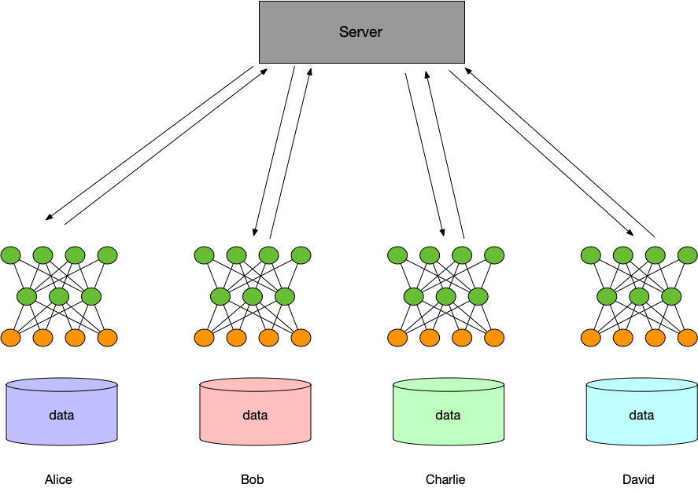
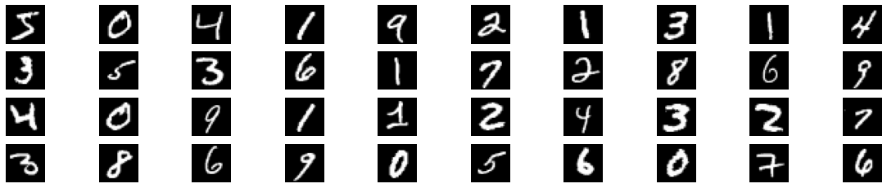

:target{#水平联邦：图像分类}

# 水平联邦：图像分类

> 以下代码仅作为示例，请勿在生产环境直接使用。

在这个教程中，我们将使用图像分类任务来介绍在secretflow框架下怎样来完成水平联邦学习任务。secretflow框架提供了一套用户友好的api，可以很方便的将您的keras模型或者pytorch模型应用到联邦学习场景，成为联邦学习模型。在接下来的教程中我们将手把手演示，如何将您已有的模型变成secretflow下的联邦模型，完成联邦多方建模任务。

:target{#水平联邦学习概念}

## 水平联邦学习概念

这里的联邦学习特指的是水平场景的联邦学习，也就是样本的联合。这种模式适用于各个参与方业务相同，但触达的客户群不同，这种情况可以联合多方的样本来训练一个性能更好或者泛化性能更好的联合模型。比如在医疗场景，每个医院都有自己独特的病人群，各个地区的医院之间几乎是互不重叠，但是他们对于病历的检查记录（如影像，血检等）又是相同类型的。



训练模型

1. Each participant downloads the latest model from the server.
2. 训练流程： 1. 各个参与方从服务器下载最新的模型 2. 每个参与方利用本方的本地数据训练模型，将梯度加密（或者将参数加密）上传给服务器，服务器得到各方上传上来的加密梯度（加密参数）在服务端进行安全聚合，用聚合后的梯度更新模型参数。 3. 服务器将更新后的模型返回给各个参与方 4. 各个参与方更新各自的模型，准备下一次训练。
3. The server returns the updated model to each participant.
4. Each participant updates their local model, and prepare next training.

:target{#使用SecretFlow进行联邦学习}

## 使用SecretFlow进行联邦学习

<Notebook.Cell>
  <Notebook.CodeArea prompt="[1]:" stderr={false} type="input">
    ```python
    %load_ext autoreload
    %autoreload 2
    ```
  </Notebook.CodeArea>
</Notebook.Cell>

在secretflow环境创造3个实体\[Alice，Bob，Charlie]，其中 Alice, Bob和Charlie 是三个PYU，Alice和Bob角色是client，Charlie角色是server。

<Notebook.Cell>
  <Notebook.CodeArea prompt="[2]:" stderr={false} type="input">
    ```python
    import secretflow as sf

    # Check the version of your SecretFlow
    print('The version of SecretFlow: {}'.format(sf.__version__))

    # In case you have a running secretflow runtime already.
    sf.shutdown()

    sf.init(['alice', 'bob', 'charlie'], address='local')
    alice, bob, charlie = sf.PYU('alice'), sf.PYU('bob'), sf.PYU('charlie')
    ```
  </Notebook.CodeArea>
</Notebook.Cell>

<Notebook.Cell>
  <Notebook.CodeArea prompt="[3]:" stderr={false} type="input">
    ```python
    spu = sf.SPU(sf.utils.testing.cluster_def(['alice', 'bob']))
    ```
  </Notebook.CodeArea>
</Notebook.Cell>

:target{#准备训练数据}

### 准备训练数据

Alice 和 Bob 各自拥有一半的数据。

<Notebook.Cell>
  <Notebook.CodeArea prompt="[4]:" stderr={false} type="input">
    ```python
    from secretflow.data.ndarray import load
    from secretflow.utils.simulation.datasets import load_mnist

    (x_train, y_train), (x_test, y_test) = load_mnist(
        parts=[alice, bob], normalized_x=True, categorical_y=True
    )
    ```
  </Notebook.CodeArea>
</Notebook.Cell>

`x_train`, `y_train`, `x_test`, `y_test` 都是 `FedNdarray`.我们来看一下获得到的FedNdarray数据，FedNdarray是一个构建在多方概念上的虚拟的Ndarray，目的是保护数据隐私。底层数据存储在各个参与方，对于FedNdarray的操作，实际上只是各个参与方对自己的local数据做操作。server端或者其他client不会接触到原始的数据。这里为了方便演示，我们手动把数据下载到driver端。 <strong>这个数据在后面的单方模型对比使用</strong>。

<Notebook.Cell>
  <Notebook.CodeArea prompt="[5]:" stderr={false} type="input">
    ```python
    import numpy as np
    from secretflow.utils.simulation.datasets import dataset

    mnist = np.load(dataset('mnist'), allow_pickle=True)
    image = mnist['x_train']
    label = mnist['y_train']
    ```
  </Notebook.CodeArea>
</Notebook.Cell>

让我们从数据集中抓取一些样本，通过可视化的方法来看看，在Alice和Bob两方的数据是什么样？

<Notebook.Cell>
  <Notebook.CodeArea prompt="[6]:" stderr={false} type="input">
    ```python
    from matplotlib import pyplot as plt

    figure = plt.figure(figsize=(20, 4))
    j = 0

    for example in image[:40]:
        plt.subplot(4, 10, j + 1)
        plt.imshow(example, cmap='gray', aspect='equal')
        plt.axis('off')
        j += 1
    ```
  </Notebook.CodeArea>

  <Notebook.FancyOutput prompt="" type="output">
    
  </Notebook.FancyOutput>
</Notebook.Cell>

<Notebook.Cell>
  <Notebook.CodeArea prompt="[7]:" stderr={false} type="input">
    ```python
    figure = plt.figure(figsize=(20, 4))
    j = 0
    for example in image[:40]:
        plt.subplot(4, 10, j + 1)
        plt.imshow(example, cmap='gray', aspect='equal')
        plt.axis('off')
        j += 1
    ```
  </Notebook.CodeArea>

  <Notebook.FancyOutput prompt="" type="output">
    
  </Notebook.FancyOutput>
</Notebook.Cell>

从上面两个例子可以看出，Alice和Bob的数据类型和任务都是一致的，但是由于触达的用户群不同，所以样本会有差别。让我们再次拿出之前已经得到的FedNdarray，并对他们做训练接和测试集的拆分来交给后面的训练任务。

:target{#定义模型}

### 定义模型

<Notebook.Cell>
  <Notebook.CodeArea prompt="[8]:" stderr={false} type="input">
    ```python
    def create_conv_model(input_shape, num_classes, name='model'):
        def create_model():
            from tensorflow import keras
            from tensorflow.keras import layers

            # Create model
            model = keras.Sequential(
                [
                    keras.Input(shape=input_shape),
                    layers.Conv2D(32, kernel_size=(3, 3), activation="relu"),
                    layers.MaxPooling2D(pool_size=(2, 2)),
                    layers.Conv2D(64, kernel_size=(3, 3), activation="relu"),
                    layers.MaxPooling2D(pool_size=(2, 2)),
                    layers.Flatten(),
                    layers.Dropout(0.5),
                    layers.Dense(num_classes, activation="softmax"),
                ]
            )
            # Compile model
            model.compile(
                loss='categorical_crossentropy', optimizer='adam', metrics=["accuracy"]
            )
            return model

        return create_model
    ```
  </Notebook.CodeArea>
</Notebook.Cell>

:target{#训练模型}

### 训练模型

1. 导入包

<Notebook.Cell>
  <Notebook.CodeArea prompt="[9]:" stderr={false} type="input">
    ```python
    from secretflow.security.aggregation import SPUAggregator, SecureAggregator
    from secretflow.ml.nn import FLModel
    ```
  </Notebook.CodeArea>
</Notebook.Cell>

2. 定义模型

<Notebook.Cell>
  <Notebook.CodeArea prompt="[10]:" stderr={false} type="input">
    ```python
    num_classes = 10
    input_shape = (28, 28, 1)
    model = create_conv_model(input_shape, num_classes)
    ```
  </Notebook.CodeArea>
</Notebook.Cell>

3. 定义参与训练的device\_list，即之前准备好的各个参与方的PYU。

<Notebook.Cell>
  <Notebook.CodeArea prompt="[11]:" stderr={false} type="input">
    ```python
    device_list = [alice, bob]
    ```
  </Notebook.CodeArea>
</Notebook.Cell>

4. 隐语提供了多种聚合方案，SecureAggregator和PPUAggregator可用于安全聚合，更多安全聚合方案可以参考 [安全聚合](../developer/algorithm/secure_aggregation.mdx)。

<Notebook.Cell>
  <Notebook.CodeArea prompt="[12]:" stderr={false} type="input">
    ```python
    secure_aggregator = SecureAggregator(charlie, [alice, bob])
    spu_aggregator = SPUAggregator(spu)
    ```
  </Notebook.CodeArea>
</Notebook.Cell>

5. 定义联邦模型

<Notebook.Cell>
  <Notebook.CodeArea prompt="[13]:" stderr={false} type="input">
    ```python
    fed_model = FLModel(
        server=charlie,
        device_list=device_list,
        model=model,
        aggregator=secure_aggregator,
        strategy="fed_avg_w",
        backend="tensorflow",
    )
    ```
  </Notebook.CodeArea>
</Notebook.Cell>

6. 跑起来

<Notebook.Cell>
  <Notebook.CodeArea prompt="[14]:" stderr={false} type="input">
    ```python
    history = fed_model.fit(
        x_train,
        y_train,
        validation_data=(x_test, y_test),
        epochs=10,
        sampler_method="batch",
        batch_size=128,
        aggregate_freq=1,
    )
    ```
  </Notebook.CodeArea>
</Notebook.Cell>

<Notebook.Cell>
  <Notebook.CodeArea prompt="[15]:" stderr={false} type="input">
    ```python
    # Draw accuracy values for training & validation
    plt.plot(history["global_history"]['accuracy'])
    plt.plot(history["global_history"]['val_accuracy'])
    plt.title('FLModel accuracy')
    plt.ylabel('Accuracy')
    plt.xlabel('Epoch')
    plt.legend(['Train', 'Valid'], loc='upper left')
    plt.show()

    # Draw loss for training & validation
    plt.plot(history["global_history"]['loss'])
    plt.plot(history["global_history"]['val_loss'])
    plt.title('FLModel loss')
    plt.ylabel('Loss')
    plt.xlabel('Epoch')
    plt.legend(['Train', 'Valid'], loc='upper left')
    plt.show()
    ```
  </Notebook.CodeArea>

  <Notebook.FancyOutput prompt="" type="output">
    
  </Notebook.FancyOutput>

  <Notebook.FancyOutput prompt="" type="output">
    
  </Notebook.FancyOutput>
</Notebook.Cell>

<Notebook.Cell>
  <Notebook.CodeArea prompt="[16]:" stderr={false} type="input">
    ```python
    global_metric = fed_model.evaluate(x_test, y_test, batch_size=128)
    print(global_metric)
    ```
  </Notebook.CodeArea>

  <Notebook.CodeArea prompt="" stderr={false} type="output">
    <pre>
      {"([Mean(name='loss', total=748.24194, count=10000.0), Mean(name='accuracy', total=9775.0, count=10000.0)], {'alice': [Mean(name='loss', total=527.7763, count=5000.0), Mean(name='accuracy', total=4833.0, count=5000.0)], 'bob': [Mean(name='loss', total=220.46567, count=5000.0), Mean(name='accuracy', total=4942.0, count=5000.0)]})\n"}
    </pre>
  </Notebook.CodeArea>
</Notebook.Cell>

:target{#对比单方模型}

### 对比单方模型

:target{#模型}

#### 模型

模型结构和上面fl的模型保持一致。

:target{#数据}

#### 数据

数据同样使用mnist数据集，单方模型这里我们只是用了切分后的Alice方数据共20000个样本。

<Notebook.Cell>
  <Notebook.CodeArea prompt="[17]:" stderr={false} type="input">
    ```python
    from tensorflow import keras
    from tensorflow.keras import layers
    from sklearn.model_selection import train_test_split


    def create_model():
        model = keras.Sequential(
            [
                keras.Input(shape=input_shape),
                layers.Conv2D(32, kernel_size=(3, 3), activation="relu"),
                layers.MaxPooling2D(pool_size=(2, 2)),
                layers.Conv2D(64, kernel_size=(3, 3), activation="relu"),
                layers.MaxPooling2D(pool_size=(2, 2)),
                layers.Flatten(),
                layers.Dropout(0.5),
                layers.Dense(num_classes, activation="softmax"),
            ]
        )
        # Compile model
        model.compile(
            loss='categorical_crossentropy', optimizer='adam', metrics=["accuracy"]
        )
        return model


    single_model = create_model()
    ```
  </Notebook.CodeArea>
</Notebook.Cell>

<Notebook.Cell>
  <Notebook.CodeArea prompt="[18]:" stderr={false} type="input">
    ```python
    from sklearn.model_selection import train_test_split
    from sklearn.preprocessing import OneHotEncoder

    alice_x = image[:10000]
    alice_y = label[:10000]
    alice_y = OneHotEncoder(sparse=False).fit_transform(alice_y.reshape(-1, 1))

    random_seed = 1234
    alice_X_train, alice_X_test, alice_y_train, alice_y_test = train_test_split(
        alice_x, alice_y, test_size=0.33, random_state=random_seed
    )
    ```
  </Notebook.CodeArea>
</Notebook.Cell>

<Notebook.Cell>
  <Notebook.CodeArea prompt="[19]:" stderr={false} type="input">
    ```python
    single_model.fit(
        alice_X_train,
        alice_y_train,
        validation_data=(alice_X_test, alice_y_test),
        batch_size=128,
        epochs=10,
    )
    ```
  </Notebook.CodeArea>

  <Notebook.CodeArea prompt="" stderr={false} type="output">
    <pre>
      {"Epoch 1/10\n53/53 [==============================] - 1s 16ms/step - loss: 8.1856 - accuracy: 0.5194 - val_loss: 0.5021 - val_accuracy: 0.8461\nEpoch 2/10\n53/53 [==============================] - 1s 13ms/step - loss: 0.7643 - accuracy: 0.7754 - val_loss: 0.3211 - val_accuracy: 0.9024\nEpoch 3/10\n53/53 [==============================] - 1s 13ms/step - loss: 0.5189 - accuracy: 0.8452 - val_loss: 0.2557 - val_accuracy: 0.9233\nEpoch 4/10\n53/53 [==============================] - 1s 14ms/step - loss: 0.3795 - accuracy: 0.8899 - val_loss: 0.1997 - val_accuracy: 0.9388\nEpoch 5/10\n53/53 [==============================] - 1s 13ms/step - loss: 0.3246 - accuracy: 0.9024 - val_loss: 0.1864 - val_accuracy: 0.9406\nEpoch 6/10\n53/53 [==============================] - 1s 13ms/step - loss: 0.2747 - accuracy: 0.9182 - val_loss: 0.1696 - val_accuracy: 0.9464\nEpoch 7/10\n53/53 [==============================] - 1s 12ms/step - loss: 0.2245 - accuracy: 0.9324 - val_loss: 0.1484 - val_accuracy: 0.9545\nEpoch 8/10\n53/53 [==============================] - 1s 13ms/step - loss: 0.2123 - accuracy: 0.9361 - val_loss: 0.1427 - val_accuracy: 0.9570\nEpoch 9/10\n53/53 [==============================] - 1s 13ms/step - loss: 0.1884 - accuracy: 0.9425 - val_loss: 0.1290 - val_accuracy: 0.9633\nEpoch 10/10\n53/53 [==============================] - 1s 13ms/step - loss: 0.1775 - accuracy: 0.9451 - val_loss: 0.1179 - val_accuracy: 0.9627\n"}
    </pre>
  </Notebook.CodeArea>

  <Notebook.CodeArea prompt="[19]:" stderr={false} type="output">
    <pre>
      {"<keras.callbacks.History at 0x7fcd9c53f7c0>\n"}
    </pre>
  </Notebook.CodeArea>
</Notebook.Cell>

上面两个实验模拟了一个典型的水平联邦场景的训练问题，Alice和Bob拥有类型的图片，每一方只有样本的一部分数据，但是双方的训练目的是一致的如果Alice只用自己的一方数据来训练模型，能够得到一个精确度0.945的模型，但是如果联合Bob的数据之后，可以获得一个精确度接近0.995的模型，而且多方数据联合训练的模型的泛化性能也会更好。

:target{#总结}

## 总结

- 本篇我们介绍了什么是联邦学习，以及如何在secretflow框架下进行水平联邦学习。
- 从实验数据可以看出，水平联邦通过扩充样本量，联合多方训练可以提升模型效果。
- 本文档使用了安全聚合（SecureAggregator）来做演示，secretflow提供了多种聚合方案，您可以在 [安全聚合](../developer/algorithm/secure_aggregation.mdx) 了解更多信息。
- 下一步，你可能想尝试不同的数据集，您需要先将数据集进行垂直切分，然后按照本教程的流程进行。
