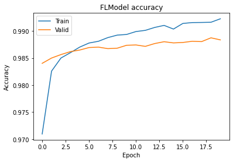

:target{#使用Pytorch后端来进行联邦学习}

# 使用Pytorch后端来进行联邦学习

> 以下代码仅作为演示用，请勿直接在生产环境使用。

在本教程中，我们将引导您了解如何在 SecretFlow 上使用 pytorch 后端进行联邦学习。

- 我们将以图像分类任务为例
- 使用 pytorch 作为后端
- 我们将展示如何使用多种 fl 策略

如果你想了解更多关于联邦学习、数据集等的知识，可以移步 [水平联邦：图像分类](Federate_Learning_for_Image_Classification.mdx) 。

<strong>开始吧</strong>

<Notebook.Cell>
  <Notebook.CodeArea prompt="[1]:" stderr={false} type="input">
    ```python
    %load_ext autoreload
    %autoreload 2
    ```
  </Notebook.CodeArea>
</Notebook.Cell>

<Notebook.Cell>
  <Notebook.CodeArea prompt="[2]:" stderr={false} type="input">
    ```python
    import secretflow as sf

    # Check the version of your SecretFlow
    print('The version of SecretFlow: {}'.format(sf.__version__))

    # In case you have a running secretflow runtime already.
    sf.shutdown()

    sf.init(['alice', 'bob', 'charlie'], address='local')
    alice, bob, charlie = sf.PYU('alice'), sf.PYU('bob'), sf.PYU('charlie')
    ```
  </Notebook.CodeArea>
</Notebook.Cell>

:target{#Here,-let-us-first-introduce-some-concepts}

## Here, let us first introduce some concepts

<LineBlock>
  BaseModule: 类似于 `torch.nn.module`

  TorchModel: 一个包装类包括 `loss_fn`,`optim_fn`,

  metric\_wrapper: metrics包装器

  optim\_wrapper： optim\_fn包装器

  FLModel：联合模型，使用 `backend` 指定哪个bachend将被使用，使用 `strategy` 来指定将使用哪个联合策略
</LineBlock>

<Notebook.Cell>
  <Notebook.CodeArea prompt="[3]:" stderr={false} type="input">
    ```python
    from secretflow.ml.nn.utils import BaseModule, TorchModel
    from secretflow.ml.nn.fl.utils import metric_wrapper, optim_wrapper
    from secretflow.ml.nn import FLModel
    from torchmetrics import Accuracy, Precision
    from secretflow.security.aggregation import SecureAggregator
    from secretflow.utils.simulation.datasets import load_mnist
    from torch import nn, optim
    from torch.nn import functional as F
    ```
  </Notebook.CodeArea>
</Notebook.Cell>

当我们定义模型时，我们只需要继承 `BaseModule` 来代替 `nn.Module` 的，其他与pytorch一致。

<Notebook.Cell>
  <Notebook.CodeArea prompt="[4]:" stderr={false} type="input">
    ```python
    class ConvNet(BaseModule):
        """Small ConvNet for MNIST."""

        def __init__(self):
            super(ConvNet, self).__init__()
            self.conv1 = nn.Conv2d(1, 3, kernel_size=3)
            self.fc_in_dim = 192
            self.fc = nn.Linear(self.fc_in_dim, 10)

        def forward(self, x):
            x = F.relu(F.max_pool2d(self.conv1(x), 3))
            x = x.view(-1, self.fc_in_dim)
            x = self.fc(x)
            return F.softmax(x, dim=1)
    ```
  </Notebook.CodeArea>
</Notebook.Cell>

我们可以继续使用中在pytorch中定义的损失函数和优化器，在secretflow中唯一的区别是我们需要用包装器来包装它。

<Notebook.Cell>
  <Notebook.CodeArea prompt="[5]:" stderr={false} type="input">
    ```python
    (train_data, train_label), (test_data, test_label) = load_mnist(
        parts={alice: 0.4, bob: 0.6},
        normalized_x=True,
        categorical_y=True,
        is_torch=True,
    )

    loss_fn = nn.CrossEntropyLoss
    optim_fn = optim_wrapper(optim.Adam, lr=1e-2)
    model_def = TorchModel(
        model_fn=ConvNet,
        loss_fn=loss_fn,
        optim_fn=optim_fn,
        metrics=[
            metric_wrapper(Accuracy, task="multiclass", num_classes=10, average='micro'),
            metric_wrapper(Precision, task="multiclass", num_classes=10, average='micro'),
        ],
    )
    ```
  </Notebook.CodeArea>
</Notebook.Cell>

<Notebook.Cell>
  <Notebook.CodeArea prompt="[6]:" stderr={false} type="input">
    ```python
    device_list = [alice, bob]
    server = charlie
    aggregator = SecureAggregator(server, [alice, bob])

    # spcify params
    fl_model = FLModel(
        server=server,
        device_list=device_list,
        model=model_def,
        aggregator=aggregator,
        strategy='fed_avg_w',  # fl strategy
        backend="torch",  # backend support ['tensorflow', 'torch']
    )
    ```
  </Notebook.CodeArea>
</Notebook.Cell>

<Notebook.Cell>
  <Notebook.CodeArea prompt="[7]:" stderr={false} type="input">
    ```python
    history = fl_model.fit(
        train_data,
        train_label,
        validation_data=(test_data, test_label),
        epochs=20,
        batch_size=32,
        aggregate_freq=1,
    )
    ```
  </Notebook.CodeArea>
</Notebook.Cell>

<Notebook.Cell>
  <Notebook.CodeArea prompt="[8]:" stderr={false} type="input">
    ```python
    from matplotlib import pyplot as plt

    # Draw accuracy values for training & validation
    plt.plot(history.global_history['multiclassaccuracy'])
    plt.plot(history.global_history['val_multiclassaccuracy'])
    plt.title('FLModel accuracy')
    plt.ylabel('Accuracy')
    plt.xlabel('Epoch')
    plt.legend(['Train', 'Valid'], loc='upper left')
    plt.show()
    ```
  </Notebook.CodeArea>

  <Notebook.FancyOutput prompt="" type="output">
    
  </Notebook.FancyOutput>
</Notebook.Cell>
