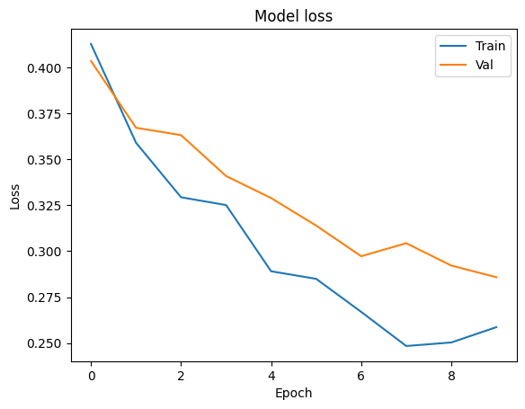

:target{#拆分学习：银行营销}

# 拆分学习：银行营销

> 以下代码仅作为演示用，请勿直接在生产环境使用。

在这个教程中，我们将以银行的市场营销模型为例，展示在 <cite>SecretFlow</cite> 框架下如何完成垂直场景下的拆分学习。 <cite>SecretFlow</cite> 框架提供了一套用户友好的API，可以很方便的将您的Keras模型或者PyTorch模型应用到拆分学习场景，以完成垂直场景的联合建模任务.

在接下来的教程中我们将手把手演示，如何将您已有的 <cite>Keras</cite> 模型变成 <cite>SecretFlow</cite> 下的拆分学习模型，完成联邦多方建模任务。

:target{#什么是拆分学习？}

## 什么是拆分学习？

拆分学习的核心思想是将网络结构进行拆分，每个设备（机构）只保留一部分网络结构，所有设备的子网络结构组合在一起，构成一个完整的网络模型。在训练过程中，不同的设备（机构）只对本地的网络结构进行前向或反向计算，并将计算结果传递给下一个设备，多个设备端通过联合模型，完成训练，直到收敛为止。


<LineBlock>
  <cite>Alice</cite> ：拥有 <cite>data\_alice</cite> ， <cite>model\_base\_alice</cite>

  <strong>Bob</strong> ：拥有 <cite>data\_bob</cite> ， <cite>model\_base\_bob</cite> ， <cite>model\_fuse</cite>
</LineBlock>

1. <cite>Alice</cite> 用本方的数据通过 <cite>model\_base\_alice</cite> 得到 <cite>hidden0</cite> ，发送给Bob
2. <cite>Bob</cite> 用本方的数据通过 <cite>model\_base\_bob</cite> 得到 <cite>hidden1</cite>
3. <cite>hidden\_0</cite> 和 <cite>hidden\_1</cite> 输入到 <cite>AggLayer</cite> 进行聚合，聚合后的 <del id="id2">\`</del>hidden\_merge\`为输出
4. <cite>Bob</cite> 方输入 <cite>hidden\_merge</cite> 到 <cite>model\_fuse</cite>，结合\`label\` 得到梯度，并进行回传
5. 通过 <cite>AggLayer</cite> 将梯度拆分为 <cite>g0</cite> , <cite>g1</cite> 两部分，将 <cite>g0</cite> 和 <cite>g1</cite> 分别发送给 <cite>Alice</cite> 和 <cite>Bob</cite>
6. <cite>Alice</cite> 和 <cite>Bob</cite> 的 <cite>basenet</cite> 分别根据 <cite>g0</cite> 和 <cite>g1</cite> 对本方的基础模型进行更新

:target{#任务}

## 任务

市场营销是银行业在不断变化的市场环境中，为满足客户需要、实现经营目标的整体性经营和销售的活动。在目前大数据的环境下，数据分析为银行业提供了更有效的分析手段。对客户需求分析，了解目标市场趋势以及更宏观的市场策略都可以提供依据与方向。

数据来自 [kaggle](https://www.kaggle.com/janiobachmann/bank-marketing-dataset) 上的经典银行营销数据集，是一家葡萄牙银行机构电话直销的活动，目标变量是客户是否订阅存款产品。

:target{#数据}

## 数据

1. 样本量总计11162个，其中训练集8929， 测试集2233
2. 特征16维，标签为2分类
3. 我们预先对数据进行了切割，alice持有其中的4维基础属性特征，bob持有12维银行交易特征，对应的label只有alice方持有

我们先来看看我们的银行市场营销数据长什么样的?

原始数据被拆分为bank\_alice和bank\_bob，分别存在alice和bob两方。这里的csv是仅经过拆分没有做预处理的原始数据，我们将使用secretflow preprocess进行FedData预处理。

<Notebook.Cell>
  <Notebook.CodeArea prompt="[1]:" stderr={false} type="input">
    ```python
    %load_ext autoreload
    %autoreload 2

    import secretflow as sf
    import matplotlib.pyplot as plt

    sf.init(['alice', 'bob'], address='local')
    alice, bob = sf.PYU('alice'), sf.PYU('bob')
    ```
  </Notebook.CodeArea>
</Notebook.Cell>

:target{#数据准备}

### 数据准备

<Notebook.Cell>
  <Notebook.CodeArea prompt="[2]:" stderr={false} type="input">
    ```python
    import pandas as pd
    from secretflow.utils.simulation.datasets import dataset

    df = pd.read_csv(dataset('bank_marketing'), sep=';')
    ```
  </Notebook.CodeArea>
</Notebook.Cell>

我们假设Alice是一个新银行，他们只有用户的基本信息，和是否从其他银行购买过理财产品的label

<Notebook.Cell>
  <Notebook.CodeArea prompt="[3]:" stderr={false} type="input">
    ```python
    alice_data = df[["age", "job", "marital", "education", "y"]]
    alice_data
    ```
  </Notebook.CodeArea>

  <Notebook.FancyOutput prompt="[3]:" type="output">
    <div>
      <style scoped={true}>
        {"\n    .dataframe tbody tr th:only-of-type {\n        vertical-align: middle;\n    }\n\n    .dataframe tbody tr th {\n        vertical-align: top;\n    }\n\n    .dataframe thead th {\n        text-align: right;\n    }\n"}
      </style>

      <table border={1} className="dataframe">
        <thead>
          <tr style={{"textAlign":"right"}}>
            <th /><th>{"age"}</th><th>{"job"}</th><th>{"marital"}</th><th>{"education"}</th><th>{"y"}</th>
          </tr>
        </thead>

        <tbody>
          <tr>
            <th>{"0"}</th><td>{"30"}</td><td>{"unemployed"}</td><td>{"married"}</td><td>{"primary"}</td><td>{"no"}</td>
          </tr>

          <tr>
            <th>{"1"}</th><td>{"33"}</td><td>{"services"}</td><td>{"married"}</td><td>{"secondary"}</td><td>{"no"}</td>
          </tr>

          <tr>
            <th>{"2"}</th><td>{"35"}</td><td>{"management"}</td><td>{"single"}</td><td>{"tertiary"}</td><td>{"no"}</td>
          </tr>

          <tr>
            <th>{"3"}</th><td>{"30"}</td><td>{"management"}</td><td>{"married"}</td><td>{"tertiary"}</td><td>{"no"}</td>
          </tr>

          <tr>
            <th>{"4"}</th><td>{"59"}</td><td>{"blue-collar"}</td><td>{"married"}</td><td>{"secondary"}</td><td>{"no"}</td>
          </tr>

          <tr>
            <th>{"..."}</th><td>{"..."}</td><td>{"..."}</td><td>{"..."}</td><td>{"..."}</td><td>{"..."}</td>
          </tr>

          <tr>
            <th>{"4516"}</th><td>{"33"}</td><td>{"services"}</td><td>{"married"}</td><td>{"secondary"}</td><td>{"no"}</td>
          </tr>

          <tr>
            <th>{"4517"}</th><td>{"57"}</td><td>{"self-employed"}</td><td>{"married"}</td><td>{"tertiary"}</td><td>{"no"}</td>
          </tr>

          <tr>
            <th>{"4518"}</th><td>{"57"}</td><td>{"technician"}</td><td>{"married"}</td><td>{"secondary"}</td><td>{"no"}</td>
          </tr>

          <tr>
            <th>{"4519"}</th><td>{"28"}</td><td>{"blue-collar"}</td><td>{"married"}</td><td>{"secondary"}</td><td>{"no"}</td>
          </tr>

          <tr>
            <th>{"4520"}</th><td>{"44"}</td><td>{"entrepreneur"}</td><td>{"single"}</td><td>{"tertiary"}</td><td>{"no"}</td>
          </tr>
        </tbody>
      </table>

      <p>{"4521 rows × 5 columns"}</p>
    </div>
  </Notebook.FancyOutput>
</Notebook.Cell>

Bob端是一个老银行，他们有用户的账户余额，是否有房，是否有贷款，以及最近的营销反馈

<Notebook.Cell>
  <Notebook.CodeArea prompt="[4]:" stderr={false} type="input">
    ```python
    bob_data = df[
        [
            "default",
            "balance",
            "housing",
            "loan",
            "contact",
            "day",
            "month",
            "duration",
            "campaign",
            "pdays",
            "previous",
            "poutcome",
        ]
    ]
    bob_data
    ```
  </Notebook.CodeArea>

  <Notebook.FancyOutput prompt="[4]:" type="output">
    <div>
      <style scoped={true}>
        {"\n    .dataframe tbody tr th:only-of-type {\n        vertical-align: middle;\n    }\n\n    .dataframe tbody tr th {\n        vertical-align: top;\n    }\n\n    .dataframe thead th {\n        text-align: right;\n    }\n"}
      </style>

      <table border={1} className="dataframe">
        <thead>
          <tr style={{"textAlign":"right"}}>
            <th /><th>{"default"}</th><th>{"balance"}</th><th>{"housing"}</th><th>{"loan"}</th><th>{"contact"}</th><th>{"day"}</th><th>{"month"}</th><th>{"duration"}</th><th>{"campaign"}</th><th>{"pdays"}</th><th>{"previous"}</th><th>{"poutcome"}</th>
          </tr>
        </thead>

        <tbody>
          <tr>
            <th>{"0"}</th><td>{"no"}</td><td>{"1787"}</td><td>{"no"}</td><td>{"no"}</td><td>{"cellular"}</td><td>{"19"}</td><td>{"oct"}</td><td>{"79"}</td><td>{"1"}</td><td>{"-1"}</td><td>{"0"}</td><td>{"unknown"}</td>
          </tr>

          <tr>
            <th>{"1"}</th><td>{"no"}</td><td>{"4789"}</td><td>{"yes"}</td><td>{"yes"}</td><td>{"cellular"}</td><td>{"11"}</td><td>{"may"}</td><td>{"220"}</td><td>{"1"}</td><td>{"339"}</td><td>{"4"}</td><td>{"failure"}</td>
          </tr>

          <tr>
            <th>{"2"}</th><td>{"no"}</td><td>{"1350"}</td><td>{"yes"}</td><td>{"no"}</td><td>{"cellular"}</td><td>{"16"}</td><td>{"apr"}</td><td>{"185"}</td><td>{"1"}</td><td>{"330"}</td><td>{"1"}</td><td>{"failure"}</td>
          </tr>

          <tr>
            <th>{"3"}</th><td>{"no"}</td><td>{"1476"}</td><td>{"yes"}</td><td>{"yes"}</td><td>{"unknown"}</td><td>{"3"}</td><td>{"jun"}</td><td>{"199"}</td><td>{"4"}</td><td>{"-1"}</td><td>{"0"}</td><td>{"unknown"}</td>
          </tr>

          <tr>
            <th>{"4"}</th><td>{"no"}</td><td>{"0"}</td><td>{"yes"}</td><td>{"no"}</td><td>{"unknown"}</td><td>{"5"}</td><td>{"may"}</td><td>{"226"}</td><td>{"1"}</td><td>{"-1"}</td><td>{"0"}</td><td>{"unknown"}</td>
          </tr>

          <tr>
            <th>{"..."}</th><td>{"..."}</td><td>{"..."}</td><td>{"..."}</td><td>{"..."}</td><td>{"..."}</td><td>{"..."}</td><td>{"..."}</td><td>{"..."}</td><td>{"..."}</td><td>{"..."}</td><td>{"..."}</td><td>{"..."}</td>
          </tr>

          <tr>
            <th>{"4516"}</th><td>{"no"}</td><td>{"-333"}</td><td>{"yes"}</td><td>{"no"}</td><td>{"cellular"}</td><td>{"30"}</td><td>{"jul"}</td><td>{"329"}</td><td>{"5"}</td><td>{"-1"}</td><td>{"0"}</td><td>{"unknown"}</td>
          </tr>

          <tr>
            <th>{"4517"}</th><td>{"yes"}</td><td>{"-3313"}</td><td>{"yes"}</td><td>{"yes"}</td><td>{"unknown"}</td><td>{"9"}</td><td>{"may"}</td><td>{"153"}</td><td>{"1"}</td><td>{"-1"}</td><td>{"0"}</td><td>{"unknown"}</td>
          </tr>

          <tr>
            <th>{"4518"}</th><td>{"no"}</td><td>{"295"}</td><td>{"no"}</td><td>{"no"}</td><td>{"cellular"}</td><td>{"19"}</td><td>{"aug"}</td><td>{"151"}</td><td>{"11"}</td><td>{"-1"}</td><td>{"0"}</td><td>{"unknown"}</td>
          </tr>

          <tr>
            <th>{"4519"}</th><td>{"no"}</td><td>{"1137"}</td><td>{"no"}</td><td>{"no"}</td><td>{"cellular"}</td><td>{"6"}</td><td>{"feb"}</td><td>{"129"}</td><td>{"4"}</td><td>{"211"}</td><td>{"3"}</td><td>{"other"}</td>
          </tr>

          <tr>
            <th>{"4520"}</th><td>{"no"}</td><td>{"1136"}</td><td>{"yes"}</td><td>{"yes"}</td><td>{"cellular"}</td><td>{"3"}</td><td>{"apr"}</td><td>{"345"}</td><td>{"2"}</td><td>{"249"}</td><td>{"7"}</td><td>{"other"}</td>
          </tr>
        </tbody>
      </table>

      <p>{"4521 rows × 12 columns"}</p>
    </div>
  </Notebook.FancyOutput>
</Notebook.Cell>

:target{#环境的搭建}

## 环境的搭建

<LineBlock>
  环境的搭建

  Alice 和 bob 是两个 PYU 。

  在 Secretflow 环境中创建 2 个实体 \[Alice, Bob]，其中 ‘Alice’ 和 ‘Bob’ 是两个 PYU。 一旦您构建了这两个对象，您可以愉快地开始拆分学习
</LineBlock>

:target{#引入依赖}

### 引入依赖

<Notebook.Cell>
  <Notebook.CodeArea prompt="[5]:" stderr={false} type="input">
    ```python
    from secretflow.data.split import train_test_split
    from secretflow.ml.nn import SLModel
    ```
  </Notebook.CodeArea>
</Notebook.Cell>

:target{#准备数据}

## 准备数据

创建联邦表

联邦表是一个跨多方的虚拟概念，我们定义 `VDataFrame` 用于垂直场景设置。

1. 联邦表中各方的数据存储在本地，不允许出域。
2. 除了拥有数据的一方之外，没有人可以访问数据存储。
3. 联邦表的任何操作都会由driver调度给每个worker，执行指令会逐层传递，直到特定worker的Python Runtime。 框架确保只有当worker的 worker.device 和 Object.device 相同时，才能够操作数据。
4. 联邦表旨在从中心角度管理和操作多方数据。
5. `Federated Table` 的接口与 pandas.DataFrame 对齐，以降低多方数据操作的成本。
6. SecretFlow 框架提供 Plain\&Ciphertext （明密文）混合编程能力。垂直联邦表是使用 `SPU` 构建的， `MPC-PSI` 用于安全地获取来自各方的交集和对齐数据。


VDataFrame 提供类似于 pandas 的 read\_csv 接口，不同之处在于secretflow\.read\_csv 接收一个定义双方数据路径的字典。我们可以使用 `secretflow.vertical.read_csv` 来构建 `VDataFrame` 。

```none
read_csv(file_dict,delimiter,ppu,keys,drop_key)
    filepath: Path of the participant file. The address can be a relative or absolute path to a local file
    spu: SPU Device for PSI; If this parameter is not specified, data must be prealigned
    keys: Key for intersection.
```

创建spu 对象

<Notebook.Cell>
  <Notebook.CodeArea prompt="[6]:" stderr={false} type="input">
    ```python
    spu = sf.SPU(sf.utils.testing.cluster_def(['alice', 'bob']))
    ```
  </Notebook.CodeArea>
</Notebook.Cell>

<Notebook.Cell>
  <Notebook.CodeArea prompt="[7]:" stderr={false} type="input">
    ```python
    from secretflow.utils.simulation.datasets import load_bank_marketing

    # Alice has the first four features,
    # while bob has the left features
    data = load_bank_marketing(parts={alice: (0, 4), bob: (4, 16)}, axis=1)
    # Alice holds the label.
    label = load_bank_marketing(parts={alice: (16, 17)}, axis=1)
    ```
  </Notebook.CodeArea>
</Notebook.Cell>

<cite>data</cite> 为构建好的垂直联邦表，它从全局上只拥有所有数据的 <cite>Schema</cite>

我们进一步来看一下VDF的数据管理

通过一个实例可以看出，age这个字段是属于alice的，所以在alice方的partition可以得到对应的列，但是bob方想要去获取age的时候会报\`KeyError\`错误。

这里有一个Partition的概念，是我们定义的一个数据分片，每个Partition都会有自己的device归属，只有归属的device才可以操作数据。

<Notebook.Cell>
  <Notebook.CodeArea prompt="[8]:" stderr={false} type="input">
    ```python
    data['age'].partitions[alice].data
    ```
  </Notebook.CodeArea>

  <Notebook.CodeArea prompt="[8]:" stderr={false} type="output">
    <pre>
      {"<secretflow.device.device.pyu.PYUObject at 0x7fd7b1e8cb20>\n"}
    </pre>
  </Notebook.CodeArea>
</Notebook.Cell>

<Notebook.Cell>
  <Notebook.CodeArea prompt="[ ]:" stderr={false} type="input">
    ```python
    # You can uncomment this and you will get a KeyError.
    # data['age'].partitions[bob]
    ```
  </Notebook.CodeArea>
</Notebook.Cell>

<LineBlock>
  我们接着对生成的联邦表做数据预处理。

  我们这里以LabelEncoder和MinMaxScaler为例，这两个预处理函数在\`sklearn\`中有对应的概念，它们的使用方法和sklearn中是类似的
</LineBlock>

<Notebook.Cell>
  <Notebook.CodeArea prompt="[9]:" stderr={false} type="input">
    ```python
    from secretflow.preprocessing.scaler import MinMaxScaler
    from secretflow.preprocessing.encoder import LabelEncoder
    ```
  </Notebook.CodeArea>
</Notebook.Cell>

<Notebook.Cell>
  <Notebook.CodeArea prompt="[10]:" stderr={false} type="input">
    ```python
    encoder = LabelEncoder()
    data['job'] = encoder.fit_transform(data['job'])
    data['marital'] = encoder.fit_transform(data['marital'])
    data['education'] = encoder.fit_transform(data['education'])
    data['default'] = encoder.fit_transform(data['default'])
    data['housing'] = encoder.fit_transform(data['housing'])
    data['loan'] = encoder.fit_transform(data['loan'])
    data['contact'] = encoder.fit_transform(data['contact'])
    data['poutcome'] = encoder.fit_transform(data['poutcome'])
    data['month'] = encoder.fit_transform(data['month'])
    label = encoder.fit_transform(label)
    ```
  </Notebook.CodeArea>
</Notebook.Cell>

<Notebook.Cell>
  <Notebook.CodeArea prompt="[11]:" stderr={false} type="input">
    ```python
    print(f"label= {type(label)},\ndata = {type(data)}")
    ```
  </Notebook.CodeArea>

  <Notebook.CodeArea prompt="" stderr={false} type="output">
    <pre>
      {"label= <class 'secretflow.data.vertical.dataframe.VDataFrame'>,\ndata = <class 'secretflow.data.vertical.dataframe.VDataFrame'>\n"}
    </pre>
  </Notebook.CodeArea>
</Notebook.Cell>

通过MinMaxScaler做数据标准化

<Notebook.Cell>
  <Notebook.CodeArea prompt="[12]:" stderr={false} type="input">
    ```python
    scaler = MinMaxScaler()

    data = scaler.fit_transform(data)
    ```
  </Notebook.CodeArea>
</Notebook.Cell>

接着我们将数据集划分成训练集（train-set）和测试集（test-set）

<Notebook.Cell>
  <Notebook.CodeArea prompt="[13]:" stderr={false} type="input">
    ```python
    from secretflow.data.split import train_test_split

    random_state = 1234
    train_data, test_data = train_test_split(
        data, train_size=0.8, random_state=random_state
    )
    train_label, test_label = train_test_split(
        label, train_size=0.8, random_state=random_state
    )
    ```
  </Notebook.CodeArea>
</Notebook.Cell>

<strong>小结</strong> ：到这里为止，我们就完成了联邦表的定义，数据的预处理，以及训练集和测试集的划分。 SecretFlow框架定义了跨越多方的 <cite>联邦表</cite> 概念，同时定义了一套构建在联邦表上的操作（它在逻辑上对等 <cite>pandas.DataFrame</cite>） ，同时定义了对于联邦表的预处理操作（它在逻辑上对等 <cite>sklearn</cite>） ，您在使用过程中遇到问题，可以参考我们的文档以及API介绍，进一步了解其他的功能

:target{#模型介绍}

## 模型介绍

<strong>单机版本</strong>：”对于该任务一个基本的DNN就可以完成，输入16维特征，经过一个DNN网络，输出对于正负样本的概率。”

创建联邦表

- Alice:
  - base\_net:输入4维特征，经过一个dnn网络得到hidden.
  - fuse\_net:接收\_alice,以及bob计算得到的hidden特征，输入这些特征到fuse\_net，进行特征融合，送入之后的网络完成整个前向传播过程和反向传播过程。
- Bob:
  - base\_net:输入12维特征，经过一个dnn网络得到hidden，然后将hidden发送给alice方，完成接下来的运算。

:target{#定义模型}

### 定义模型

接下来，我们开始创建联邦模型。

接下来我们开始创建我们定义的联邦模型 <cite>SLTFModel</cite> 和 <cite>SLTorchModel(WIP，工作正在进行)</cite> ,用于构建垂直场景的拆分学习，我们定义了简单易用的可扩展接口，可以很方便的将您已有的模型，转换成SF—Model，进而进行垂直场景联邦建模。

拆分学习即将一个模型拆分开来，一部分放在数据的本地执行，另外一部分放在有label的一方。首先我们来定义本地执行的模型——base\_model

<Notebook.Cell>
  <Notebook.CodeArea prompt="[14]:" stderr={false} type="input">
    ```python
    def create_base_model(input_dim, output_dim, name='base_model'):
        # Create model
        def create_model():
            from tensorflow import keras
            from tensorflow.keras import layers
            import tensorflow as tf

            model = keras.Sequential(
                [
                    keras.Input(shape=input_dim),
                    layers.Dense(100, activation="relu"),
                    layers.Dense(output_dim, activation="relu"),
                ]
            )
            # Compile model
            model.summary()
            model.compile(
                loss='binary_crossentropy',
                optimizer='adam',
                metrics=["accuracy", tf.keras.metrics.AUC()],
            )
            return model

        return create_model
    ```
  </Notebook.CodeArea>
</Notebook.Cell>

我们使用create\_base\_model分别为 <cite>Alice</cite> 和 <cite>Bob</cite> 创建他们的base model

<Notebook.Cell>
  <Notebook.CodeArea prompt="[15]:" stderr={false} type="input">
    ```python
    # prepare model
    hidden_size = 64

    model_base_alice = create_base_model(4, hidden_size)
    model_base_bob = create_base_model(12, hidden_size)
    ```
  </Notebook.CodeArea>
</Notebook.Cell>

<Notebook.Cell>
  <Notebook.CodeArea prompt="[16]:" stderr={false} type="input">
    ```python
    model_base_alice()
    model_base_bob()
    ```
  </Notebook.CodeArea>

  <Notebook.CodeArea prompt="" stderr={false} type="output">
    <pre>
      {"Model: \"sequential\"\n_________________________________________________________________\n Layer (type)                Output Shape              Param #\n=================================================================\n dense (Dense)               (None, 100)               500\n\n dense_1 (Dense)             (None, 64)                6464\n\n=================================================================\nTotal params: 6,964\nTrainable params: 6,964\nNon-trainable params: 0\n_________________________________________________________________\nModel: \"sequential_1\"\n_________________________________________________________________\n Layer (type)                Output Shape              Param #\n=================================================================\n dense_2 (Dense)             (None, 100)               1300\n\n dense_3 (Dense)             (None, 64)                6464\n\n=================================================================\nTotal params: 7,764\nTrainable params: 7,764\nNon-trainable params: 0\n_________________________________________________________________\n"}
    </pre>
  </Notebook.CodeArea>

  <Notebook.CodeArea prompt="[16]:" stderr={false} type="output">
    <pre>
      {"<keras.engine.sequential.Sequential at 0x7fd7a09c31f0>\n"}
    </pre>
  </Notebook.CodeArea>
</Notebook.Cell>

接下来我们定义有label的一方，或者server端的模型——fuse\_model。在fuse\_model的定义中，我们需要正确的定义loss，optimizer，metrics。这里可以兼容所有您已有的Keras模型的配置

<Notebook.Cell>
  <Notebook.CodeArea prompt="[17]:" stderr={false} type="input">
    ```python
    def create_fuse_model(input_dim, output_dim, party_nums, name='fuse_model'):
        def create_model():
            from tensorflow import keras
            from tensorflow.keras import layers
            import tensorflow as tf

            # input
            input_layers = []
            for i in range(party_nums):
                input_layers.append(
                    keras.Input(
                        input_dim,
                    )
                )

            merged_layer = layers.concatenate(input_layers)
            fuse_layer = layers.Dense(64, activation='relu')(merged_layer)
            output = layers.Dense(output_dim, activation='sigmoid')(fuse_layer)

            model = keras.Model(inputs=input_layers, outputs=output)
            model.summary()

            model.compile(
                loss='binary_crossentropy',
                optimizer='adam',
                metrics=["accuracy", tf.keras.metrics.AUC()],
            )
            return model

        return create_model
    ```
  </Notebook.CodeArea>
</Notebook.Cell>

<Notebook.Cell>
  <Notebook.CodeArea prompt="[18]:" stderr={false} type="input">
    ```python
    model_fuse = create_fuse_model(input_dim=hidden_size, party_nums=2, output_dim=1)
    ```
  </Notebook.CodeArea>
</Notebook.Cell>

<Notebook.Cell>
  <Notebook.CodeArea prompt="[19]:" stderr={false} type="input">
    ```python
    model_fuse()
    ```
  </Notebook.CodeArea>

  <Notebook.CodeArea prompt="" stderr={false} type="output">
    <pre>
      {"Model: \"model\"\n__________________________________________________________________________________________________\n Layer (type)                   Output Shape         Param #     Connected to\n==================================================================================================\n input_3 (InputLayer)           [(None, 64)]         0           []\n\n input_4 (InputLayer)           [(None, 64)]         0           []\n\n concatenate (Concatenate)      (None, 128)          0           ['input_3[0][0]',\n                                                                  'input_4[0][0]']\n\n dense_4 (Dense)                (None, 64)           8256        ['concatenate[0][0]']\n\n dense_5 (Dense)                (None, 1)            65          ['dense_4[0][0]']\n\n==================================================================================================\nTotal params: 8,321\nTrainable params: 8,321\nNon-trainable params: 0\n__________________________________________________________________________________________________\n"}
    </pre>
  </Notebook.CodeArea>

  <Notebook.CodeArea prompt="[19]:" stderr={false} type="output">
    <pre>
      {"<keras.engine.functional.Functional at 0x7fd7a0d569d0>\n"}
    </pre>
  </Notebook.CodeArea>
</Notebook.Cell>

:target{#创建拆分学习模型}

### 创建拆分学习模型

<LineBlock>
  创建拆分学习模型

  我们需要三个参数来初始化SLModel
</LineBlock>

- base\_model\_dict：一个字典，它需要传入参与训练的所有client以及base\_model映射。
- device\_y：PYU对象，哪一方持有label
- model\_fuse：融合模型，具体的优化器以及损失函数都在这个模型中进行定义

定义 base\_model\_dict

```python
base_model_dict:Dict[PYU,model_fn]
```

<Notebook.Cell>
  <Notebook.CodeArea prompt="[20]:" stderr={false} type="input">
    ```python
    base_model_dict = {alice: model_base_alice, bob: model_base_bob}
    ```
  </Notebook.CodeArea>
</Notebook.Cell>

<Notebook.Cell>
  <Notebook.CodeArea prompt="[21]:" stderr={false} type="input">
    ```python
    from secretflow.security.privacy import DPStrategy, LabelDP
    from secretflow.security.privacy.mechanism.tensorflow import GaussianEmbeddingDP

    # Define DP operations
    train_batch_size = 128
    gaussian_embedding_dp = GaussianEmbeddingDP(
        noise_multiplier=0.5,
        l2_norm_clip=1.0,
        batch_size=train_batch_size,
        num_samples=train_data.values.partition_shape()[alice][0],
        is_secure_generator=False,
    )
    label_dp = LabelDP(eps=64.0)
    dp_strategy_alice = DPStrategy(label_dp=label_dp)
    dp_strategy_bob = DPStrategy(embedding_dp=gaussian_embedding_dp)
    dp_strategy_dict = {alice: dp_strategy_alice, bob: dp_strategy_bob}
    dp_spent_step_freq = 10
    ```
  </Notebook.CodeArea>
</Notebook.Cell>

<Notebook.Cell>
  <Notebook.CodeArea prompt="[22]:" stderr={false} type="input">
    ```python
    sl_model = SLModel(
        base_model_dict=base_model_dict,
        device_y=alice,
        model_fuse=model_fuse,
        dp_strategy_dict=dp_strategy_dict,
    )
    ```
  </Notebook.CodeArea>
</Notebook.Cell>

<Notebook.Cell>
  <Notebook.CodeArea prompt="[23]:" stderr={false} type="input">
    ```python
    sf.reveal(test_data.partitions[alice].data), sf.reveal(
        test_label.partitions[alice].data
    )
    ```
  </Notebook.CodeArea>

  <Notebook.CodeArea prompt="[23]:" stderr={false} type="output">
    <pre>
      {"(           age       job  marital  education\n 1426  0.279412  0.181818      0.5   0.333333\n 416   0.176471  0.636364      1.0   0.333333\n 3977  0.264706  0.000000      0.5   0.666667\n 2291  0.338235  0.000000      0.5   0.333333\n 257   0.132353  0.909091      1.0   0.333333\n ...        ...       ...      ...        ...\n 1508  0.264706  0.818182      1.0   0.333333\n 979   0.544118  0.090909      0.0   0.000000\n 3494  0.455882  0.090909      0.5   0.000000\n 42    0.485294  0.090909      0.5   0.333333\n 1386  0.455882  0.636364      0.5   0.333333\n\n [905 rows x 4 columns],\n       y\n 1426  0\n 416   0\n 3977  0\n 2291  0\n 257   0\n ...  ..\n 1508  0\n 979   0\n 3494  0\n 42    0\n 1386  0\n\n [905 rows x 1 columns])\n"}
    </pre>
  </Notebook.CodeArea>
</Notebook.Cell>

<Notebook.Cell>
  <Notebook.CodeArea prompt="[24]:" stderr={false} type="input">
    ```python
    sf.reveal(train_data.partitions[alice].data), sf.reveal(
        train_label.partitions[alice].data
    )
    ```
  </Notebook.CodeArea>

  <Notebook.CodeArea prompt="[24]:" stderr={false} type="output">
    <pre>
      {"(           age       job  marital  education\n 1106  0.235294  0.090909      0.5   0.333333\n 1309  0.176471  0.363636      0.5   0.333333\n 2140  0.411765  0.272727      1.0   0.666667\n 2134  0.573529  0.454545      0.5   0.333333\n 960   0.485294  0.818182      0.5   0.333333\n ...        ...       ...      ...        ...\n 664   0.397059  0.090909      1.0   0.333333\n 3276  0.235294  0.181818      0.5   0.666667\n 1318  0.220588  0.818182      0.5   0.333333\n 723   0.220588  0.636364      0.5   0.333333\n 2863  0.176471  0.363636      1.0   0.666667\n\n [3616 rows x 4 columns],\n       y\n 1106  0\n 1309  0\n 2140  1\n 2134  0\n 960   0\n ...  ..\n 664   0\n 3276  0\n 1318  0\n 723   0\n 2863  0\n\n [3616 rows x 1 columns])\n"}
    </pre>
  </Notebook.CodeArea>
</Notebook.Cell>

<Notebook.Cell>
  <Notebook.CodeArea prompt="[25]:" stderr={false} type="input">
    ```python
    history = sl_model.fit(
        train_data,
        train_label,
        validation_data=(test_data, test_label),
        epochs=10,
        batch_size=train_batch_size,
        shuffle=True,
        verbose=1,
        validation_freq=1,
        dp_spent_step_freq=dp_spent_step_freq,
    )
    ```
  </Notebook.CodeArea>

  <Notebook.CodeArea prompt="" stderr={false} type="output">
    <pre>
      <span className="ansi-cyan-fg">{"(PYUSLTFModel pid=37975)"}</span>{" Model: \"sequential\"\n"}<span className="ansi-cyan-fg">{"(PYUSLTFModel pid=37975)"}</span>{" _________________________________________________________________\n"}<span className="ansi-cyan-fg">{"(PYUSLTFModel pid=37975)"}</span>{"  Layer (type)                Output Shape              Param #\n"}<span className="ansi-cyan-fg">{"(PYUSLTFModel pid=37975)"}</span>{" =================================================================\n"}<span className="ansi-cyan-fg">{"(PYUSLTFModel pid=37975)"}</span>{"  dense (Dense)               (None, 100)               500\n"}<span className="ansi-cyan-fg">{"(PYUSLTFModel pid=37975)"}</span><span className="ansi-cyan-fg">{"(PYUSLTFModel pid=37975)"}</span>{"  dense_1 (Dense)             (None, 64)                6464\n"}<span className="ansi-cyan-fg">{"(PYUSLTFModel pid=37975)"}</span><span className="ansi-cyan-fg">{"(PYUSLTFModel pid=37975)"}</span>{" =================================================================\n"}<span className="ansi-cyan-fg">{"(PYUSLTFModel pid=37975)"}</span>{" Total params: 6,964\n"}<span className="ansi-cyan-fg">{"(PYUSLTFModel pid=37975)"}</span>{" Trainable params: 6,964\n"}<span className="ansi-cyan-fg">{"(PYUSLTFModel pid=37975)"}</span>{" Non-trainable params: 0\n"}<span className="ansi-cyan-fg">{"(PYUSLTFModel pid=37975)"}</span>{" _________________________________________________________________\n"}<span className="ansi-cyan-fg">{"(PYUSLTFModel pid=37975)"}</span>{" Model: \"model\"\n"}<span className="ansi-cyan-fg">{"(PYUSLTFModel pid=37975)"}</span>{" __________________________________________________________________________________________________\n"}<span className="ansi-cyan-fg">{"(PYUSLTFModel pid=37975)"}</span>{"  Layer (type)                   Output Shape         Param #     Connected to\n"}<span className="ansi-cyan-fg">{"(PYUSLTFModel pid=37975)"}</span>{" ==================================================================================================\n"}<span className="ansi-cyan-fg">{"(PYUSLTFModel pid=37975)"}</span>{"  input_2 (InputLayer)           [(None, 64)]         0           []\n"}<span className="ansi-cyan-fg">{"(PYUSLTFModel pid=37975)"}</span><span className="ansi-cyan-fg">{"(PYUSLTFModel pid=37975)"}</span>{"  input_3 (InputLayer)           [(None, 64)]         0           []\n"}<span className="ansi-cyan-fg">{"(PYUSLTFModel pid=37975)"}</span><span className="ansi-cyan-fg">{"(PYUSLTFModel pid=37975)"}</span>{"  concatenate (Concatenate)      (None, 128)          0           ['input_2[0][0]',\n"}<span className="ansi-cyan-fg">{"(PYUSLTFModel pid=37975)"}</span>{"                                                                   'input_3[0][0]']\n"}<span className="ansi-cyan-fg">{"(PYUSLTFModel pid=37975)"}</span><span className="ansi-cyan-fg">{"(PYUSLTFModel pid=37975)"}</span>{"  dense_2 (Dense)                (None, 64)           8256        ['concatenate[0][0]']\n"}<span className="ansi-cyan-fg">{"(PYUSLTFModel pid=37975)"}</span><span className="ansi-cyan-fg">{"(PYUSLTFModel pid=37975)"}</span>{"  dense_3 (Dense)                (None, 1)            65          ['dense_2[0][0]']\n"}<span className="ansi-cyan-fg">{"(PYUSLTFModel pid=37975)"}</span><span className="ansi-cyan-fg">{"(PYUSLTFModel pid=37975)"}</span>{" ==================================================================================================\n"}<span className="ansi-cyan-fg">{"(PYUSLTFModel pid=37975)"}</span>{" Total params: 8,321\n"}<span className="ansi-cyan-fg">{"(PYUSLTFModel pid=37975)"}</span>{" Trainable params: 8,321\n"}<span className="ansi-cyan-fg">{"(PYUSLTFModel pid=37975)"}</span>{" Non-trainable params: 0\n"}<span className="ansi-cyan-fg">{"(PYUSLTFModel pid=37975)"}</span>{" __________________________________________________________________________________________________\n"}
    </pre>
  </Notebook.CodeArea>

  <Notebook.CodeArea prompt="" stderr={false} type="output">
    <pre>
      <span className="ansi-cyan-fg">{"(PYUSLTFModel pid=37977)"}</span>{" Model: \"sequential\"\n"}<span className="ansi-cyan-fg">{"(PYUSLTFModel pid=37977)"}</span>{" _________________________________________________________________\n"}<span className="ansi-cyan-fg">{"(PYUSLTFModel pid=37977)"}</span>{"  Layer (type)                Output Shape              Param #\n"}<span className="ansi-cyan-fg">{"(PYUSLTFModel pid=37977)"}</span>{" =================================================================\n"}<span className="ansi-cyan-fg">{"(PYUSLTFModel pid=37977)"}</span>{"  dense (Dense)               (None, 100)               1300\n"}<span className="ansi-cyan-fg">{"(PYUSLTFModel pid=37977)"}</span><span className="ansi-cyan-fg">{"(PYUSLTFModel pid=37977)"}</span>{"  dense_1 (Dense)             (None, 64)                6464\n"}<span className="ansi-cyan-fg">{"(PYUSLTFModel pid=37977)"}</span><span className="ansi-cyan-fg">{"(PYUSLTFModel pid=37977)"}</span>{" =================================================================\n"}<span className="ansi-cyan-fg">{"(PYUSLTFModel pid=37977)"}</span>{" Total params: 7,764\n"}<span className="ansi-cyan-fg">{"(PYUSLTFModel pid=37977)"}</span>{" Trainable params: 7,764\n"}<span className="ansi-cyan-fg">{"(PYUSLTFModel pid=37977)"}</span>{" Non-trainable params: 0\n"}<span className="ansi-cyan-fg">{"(PYUSLTFModel pid=37977)"}</span>{" _________________________________________________________________\n"}
    </pre>
  </Notebook.CodeArea>
</Notebook.Cell>

我们来可视化训练过程

<Notebook.Cell>
  <Notebook.CodeArea prompt="[26]:" stderr={false} type="input">
    ```python
    # Plot the change of loss during training
    plt.plot(history['train_loss'])
    plt.plot(history['val_loss'])
    plt.title('Model loss')
    plt.ylabel('Loss')
    plt.xlabel('Epoch')
    plt.legend(['Train', 'Val'], loc='upper right')
    plt.show()
    ```
  </Notebook.CodeArea>

  <Notebook.FancyOutput prompt="" type="output">
    
  </Notebook.FancyOutput>
</Notebook.Cell>

<Notebook.Cell>
  <Notebook.CodeArea prompt="[27]:" stderr={false} type="input">
    ```python
    # Plot the change of accuracy during training
    plt.plot(history['train_accuracy'])
    plt.plot(history['val_accuracy'])
    plt.title('Model accuracy')
    plt.ylabel('Accuracy')
    plt.xlabel('Epoch')
    plt.legend(['Train', 'Val'], loc='upper left')
    plt.show()
    ```
  </Notebook.CodeArea>

  <Notebook.FancyOutput prompt="" type="output">
    
  </Notebook.FancyOutput>
</Notebook.Cell>

<Notebook.Cell>
  <Notebook.CodeArea prompt="[28]:" stderr={false} type="input">
    ```python
    # Plot the Area Under Curve(AUC) of loss during training
    plt.plot(history['train_auc_1'])
    plt.plot(history['val_auc_1'])
    plt.title('Model Area Under Curve')
    plt.ylabel('Area Under Curve')
    plt.xlabel('Epoch')
    plt.legend(['Train', 'Val'], loc='upper left')
    plt.show()
    ```
  </Notebook.CodeArea>

  <Notebook.FancyOutput prompt="" type="output">
    
  </Notebook.FancyOutput>
</Notebook.Cell>

我们来调用一下评估函数，看下训练效果怎么样

<Notebook.Cell>
  <Notebook.CodeArea prompt="[29]:" stderr={false} type="input">
    ```python
    global_metric = sl_model.evaluate(test_data, test_label, batch_size=128)
    ```
  </Notebook.CodeArea>
</Notebook.Cell>

:target{#和单方模型的对比}

## 和单方模型的对比

<LineBlock>
  在这里，我们使用与分裂学习示例中相同的模型结构，但仅在这种情况下使用 Alice 的模型结构。定义模型的代码如下所示。

  数据

  数据也使用 Kaggle 的反欺诈数据集。在这里，我们只使用 Alice 的新银行数据。

  样本量总计11162个，其中训练集8929， 测试集2233

  2\. The feature dimension is 4.
</LineBlock>

<Notebook.Cell>
  <Notebook.CodeArea prompt="[30]:" stderr={false} type="input">
    ```python
    from tensorflow import keras
    from tensorflow.keras import layers
    import tensorflow as tf
    from sklearn.model_selection import train_test_split


    def create_model():
        model = keras.Sequential(
            [
                keras.Input(shape=4),
                layers.Dense(100, activation="relu"),
                layers.Dense(64, activation='relu'),
                layers.Dense(64, activation='relu'),
                layers.Dense(1, activation='sigmoid'),
            ]
        )
        model.compile(
            loss='binary_crossentropy',
            optimizer='adam',
            metrics=["accuracy", tf.keras.metrics.AUC()],
        )
        return model


    single_model = create_model()
    ```
  </Notebook.CodeArea>
</Notebook.Cell>

数据处理

<Notebook.Cell>
  <Notebook.CodeArea prompt="[31]:" stderr={false} type="input">
    ```python
    import pandas as pd
    from sklearn.model_selection import train_test_split
    from sklearn.preprocessing import MinMaxScaler
    from sklearn.preprocessing import LabelEncoder

    encoder = LabelEncoder()
    single_part_data = alice_data.copy()

    single_part_data['job'] = encoder.fit_transform(alice_data['job'])
    single_part_data['marital'] = encoder.fit_transform(alice_data['marital'])
    single_part_data['education'] = encoder.fit_transform(alice_data['education'])
    single_part_data['y'] = encoder.fit_transform(alice_data['y'])
    ```
  </Notebook.CodeArea>
</Notebook.Cell>

<Notebook.Cell>
  <Notebook.CodeArea prompt="[32]:" stderr={false} type="input">
    ```python
    y = single_part_data['y']
    alice_data = single_part_data.drop(columns=['y'], inplace=False)
    ```
  </Notebook.CodeArea>
</Notebook.Cell>

<Notebook.Cell>
  <Notebook.CodeArea prompt="[33]:" stderr={false} type="input">
    ```python
    scaler = MinMaxScaler()
    alice_data = scaler.fit_transform(alice_data)
    ```
  </Notebook.CodeArea>
</Notebook.Cell>

<Notebook.Cell>
  <Notebook.CodeArea prompt="[34]:" stderr={false} type="input">
    ```python
    train_data, test_data = train_test_split(
        alice_data, train_size=0.8, random_state=random_state
    )
    train_label, test_label = train_test_split(y, train_size=0.8, random_state=random_state)
    ```
  </Notebook.CodeArea>
</Notebook.Cell>

<Notebook.Cell>
  <Notebook.CodeArea prompt="[35]:" stderr={false} type="input">
    ```python
    alice_data.shape
    ```
  </Notebook.CodeArea>

  <Notebook.CodeArea prompt="[35]:" stderr={false} type="output">
    <pre>
      {"(4521, 4)\n"}
    </pre>
  </Notebook.CodeArea>
</Notebook.Cell>

<Notebook.Cell>
  <Notebook.CodeArea prompt="[36]:" stderr={false} type="input">
    ```python
    single_model.fit(
        train_data,
        train_label,
        validation_data=(test_data, test_label),
        batch_size=128,
        epochs=10,
        shuffle=False,
    )
    ```
  </Notebook.CodeArea>

  <Notebook.CodeArea prompt="" stderr={false} type="output">
    <pre>
      {"Epoch 1/10\n29/29 [==============================] - 1s 10ms/step - loss: 0.5564 - accuracy: 0.8261 - auc_3: 0.4520 - val_loss: 0.4089 - val_accuracy: 0.8729 - val_auc_3: 0.4384\nEpoch 2/10\n29/29 [==============================] - 0s 3ms/step - loss: 0.3771 - accuracy: 0.8877 - auc_3: 0.4524 - val_loss: 0.3969 - val_accuracy: 0.8729 - val_auc_3: 0.4322\nEpoch 3/10\n29/29 [==============================] - 0s 3ms/step - loss: 0.3653 - accuracy: 0.8877 - auc_3: 0.4417 - val_loss: 0.3911 - val_accuracy: 0.8729 - val_auc_3: 0.4316\nEpoch 4/10\n29/29 [==============================] - 0s 3ms/step - loss: 0.3601 - accuracy: 0.8877 - auc_3: 0.4514 - val_loss: 0.3875 - val_accuracy: 0.8729 - val_auc_3: 0.4443\nEpoch 5/10\n29/29 [==============================] - 0s 3ms/step - loss: 0.3585 - accuracy: 0.8877 - auc_3: 0.4626 - val_loss: 0.3855 - val_accuracy: 0.8729 - val_auc_3: 0.4680\nEpoch 6/10\n29/29 [==============================] - 0s 3ms/step - loss: 0.3571 - accuracy: 0.8877 - auc_3: 0.4737 - val_loss: 0.3839 - val_accuracy: 0.8729 - val_auc_3: 0.4867\nEpoch 7/10\n29/29 [==============================] - 0s 3ms/step - loss: 0.3557 - accuracy: 0.8877 - auc_3: 0.4879 - val_loss: 0.3828 - val_accuracy: 0.8729 - val_auc_3: 0.5052\nEpoch 8/10\n29/29 [==============================] - 0s 2ms/step - loss: 0.3547 - accuracy: 0.8877 - auc_3: 0.5001 - val_loss: 0.3818 - val_accuracy: 0.8729 - val_auc_3: 0.5164\nEpoch 9/10\n29/29 [==============================] - 0s 2ms/step - loss: 0.3539 - accuracy: 0.8877 - auc_3: 0.5107 - val_loss: 0.3807 - val_accuracy: 0.8729 - val_auc_3: 0.5290\nEpoch 10/10\n29/29 [==============================] - 0s 2ms/step - loss: 0.3530 - accuracy: 0.8877 - auc_3: 0.5212 - val_loss: 0.3799 - val_accuracy: 0.8729 - val_auc_3: 0.5368\n"}
    </pre>
  </Notebook.CodeArea>

  <Notebook.CodeArea prompt="[36]:" stderr={false} type="output">
    <pre>
      {"<keras.callbacks.History at 0x7fd7a85ec7c0>\n"}
    </pre>
  </Notebook.CodeArea>
</Notebook.Cell>

<Notebook.Cell>
  <Notebook.CodeArea prompt="[37]:" stderr={false} type="input">
    ```python
    single_model.evaluate(test_data, test_label, batch_size=128)
    ```
  </Notebook.CodeArea>

  <Notebook.CodeArea prompt="" stderr={false} type="output">
    <pre>
      {"8/8 [==============================] - 0s 1ms/step - loss: 0.3799 - accuracy: 0.8729 - auc_3: 0.5368\n"}
    </pre>
  </Notebook.CodeArea>

  <Notebook.CodeArea prompt="[37]:" stderr={false} type="output">
    <pre>
      {"[0.3799220025539398, 0.8729282021522522, 0.5367639064788818]\n"}
    </pre>
  </Notebook.CodeArea>
</Notebook.Cell>

:target{#小结}

### 小结

上面两个实验模拟了一个典型的垂直场景的训练问题，Alice和Bob拥有相同的样本群体，但每一方只有样本的一部分特征数据，如果Alice只用自己的一方数据来训练模型，能够得到一个准确率为0.583,auc 分数为0.53的模型，但是如果联合Bob的数据之后，可以获得一个准确率为0.893，auc分数为0.883的模型。

:target{#总结}

## 总结

- 本篇教程，我们介绍了什么是拆分学习，以及如何在SecretFlow框架下进行拆分学习
- 从实验数据可以看出，拆分学习在扩充样本维度，通过联合多方训练提升模型效果方面有显著优势
- 本教程使用明文聚合来做演示，同时没有考虑隐藏层的泄露问题，SecretFlow提供了聚合层AggLayer，通过MPC,TEE,HE，以及DP等方式规避隐层明文传输泄露的问题。如果您感兴趣，可以看相关文档。
- 下一步，您可能想尝试不同的数据集，您需要先将数据集进行垂直切分，然后按照本教程的流程进行
