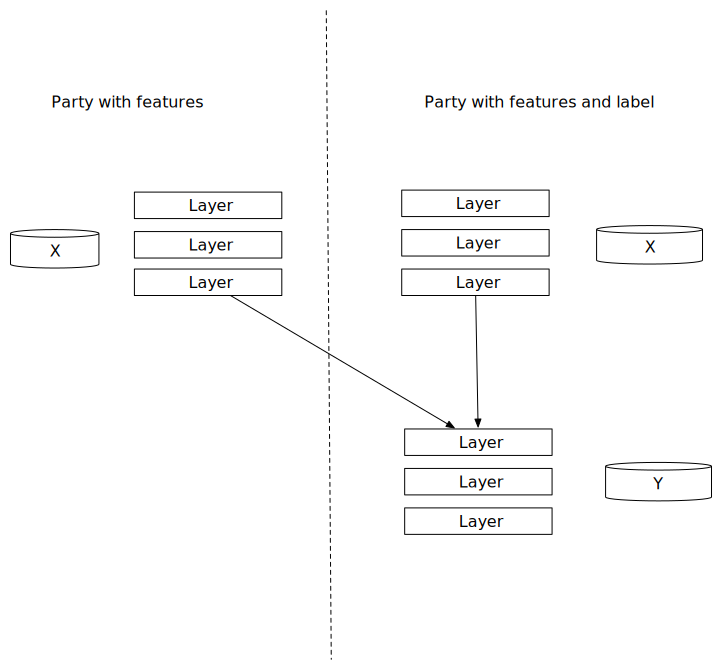

:target{#图神经网络拆分学习}

# 图神经网络拆分学习

> 以下代码仅作为示例，请勿在生产环境直接使用。

:target{#初始化}

## 初始化

创建alice和bob两个参与方。

<Notebook.Cell>
  <Notebook.CodeArea prompt="[1]:" stderr={false} type="input">
    ```python
    import secretflow as sf

    # Check the version of your SecretFlow
    print('The version of SecretFlow: {}'.format(sf.__version__))

    # In case you got a running secetflow runtime already.
    sf.shutdown()

    sf.init(parties=['alice', 'bob'], address='local')

    alice, bob = sf.PYU('alice'), sf.PYU('bob')
    ```
  </Notebook.CodeArea>
</Notebook.Cell>

:target{#准备数据集}

## 准备数据集

:target{#Cora数据集}

### Cora数据集

[cora](https://linqs-data.soe.ucsc.edu/public/lbc/cora.tgz) 数据集由两个文件组成：<cite>cora.cites</cite> 和 <cite>cora.content</cite>。

- <cite>cora.cites</cite> 包含了论文引用记录，共两列： cited\_paper\_id(被引用论文)和citing\_paper\_id（发起引用的论文）。
- <cite>cora.content</cite> 包含了论文内容记录，拥有1435列，分别是paper\_id（论文id）, subject（课题）, 和其他1,433二值化特征。

我们使用隐语内置已经切分好的cora数据集。

- 训练集包含140个论文id。
- 测试集包含1000个论文id。
- 验证集包含500个论文id。

:target{#切分数据集}

### 切分数据集

对数据集进行切分。

- alice持有前716个特征，bob持有剩余的其他特征。
- alice持有所有的标签。
- alice和bob均持有所有的边。

<Notebook.Cell>
  <Notebook.CodeArea prompt="[2]:" stderr={false} type="input">
    ```python
    import networkx as nx
    import numpy as np
    import os
    import pickle
    import scipy
    import zipfile
    import tempfile
    from pathlib import Path
    from secretflow.utils.simulation.datasets import dataset
    from secretflow.data.ndarray import load


    def load_cora():
        dataset_zip = dataset('cora')
        extract_path = str(Path(dataset_zip).parent)
        with zipfile.ZipFile(dataset_zip, 'r') as zip_f:
            zip_f.extractall(extract_path)

        file_names = [
            os.path.join(extract_path, f'ind.cora.{name}')
            for name in ['y', 'tx', 'ty', 'allx', 'ally', 'graph']
        ]

        objects = []
        for name in file_names:
            with open(name, 'rb') as f:
                objects.append(pickle.load(f, encoding='latin1'))

        y, tx, ty, allx, ally, graph = tuple(objects)

        with open(os.path.join(extract_path, f"ind.cora.test.index"), 'r') as f:
            test_idx_reorder = f.readlines()
        test_idx_reorder = list(map(lambda s: int(s.strip()), test_idx_reorder))
        test_idx_range = np.sort(test_idx_reorder)

        nodes = scipy.sparse.vstack((allx, tx)).tolil()
        nodes[test_idx_reorder, :] = nodes[test_idx_range, :]
        edge = nx.adjacency_matrix(nx.from_dict_of_lists(graph))
        edge = edge.toarray() + np.eye(edge.shape[1])

        labels = np.vstack((ally, ty))
        labels[test_idx_reorder, :] = labels[test_idx_range, :]

        idx_test = test_idx_range.tolist()
        idx_train = range(len(y))
        idx_val = range(len(y), len(y) + 500)

        def sample_mask(idx, length):
            mask = np.zeros(length)
            mask[idx] = 1
            return np.array(mask, dtype=bool)

        idx_train = sample_mask(idx_train, labels.shape[0])
        idx_val = sample_mask(idx_val, labels.shape[0])
        idx_test = sample_mask(idx_test, labels.shape[0])

        y_train = np.zeros(labels.shape)
        y_val = np.zeros(labels.shape)
        y_test = np.zeros(labels.shape)
        y_train[idx_train, :] = labels[idx_train, :]
        y_val[idx_val, :] = labels[idx_val, :]
        y_test[idx_test, :] = labels[idx_test, :]

        nodes = nodes.toarray()
        features_split_pos = round(nodes.shape[1] / 2)
        nodes_alice, nodes_bob = (
            nodes[:, :features_split_pos],
            nodes[:, features_split_pos:],
        )
        temp_dir = tempfile.mkdtemp()
        saved_files = [
            os.path.join(temp_dir, name)
            for name in [
                'edge.npy',
                'x_alice.npy',
                'x_bob.npy',
                'y_train.npy',
                'y_val.npy',
                'y_test.npy',
                'idx_train.npy',
                'idx_val.npy',
                'idx_test.npy',
            ]
        ]
        np.save(saved_files[0], edge)
        np.save(saved_files[1], nodes_alice)
        np.save(saved_files[2], nodes_bob)
        np.save(saved_files[3], y_train)
        np.save(saved_files[4], y_val)
        np.save(saved_files[5], y_test)
        np.save(saved_files[6], idx_train)
        np.save(saved_files[7], idx_val)
        np.save(saved_files[8], idx_test)
        return saved_files


    saved_files = load_cora()

    edge = load({alice: saved_files[0], bob: saved_files[0]})
    features = load({alice: saved_files[1], bob: saved_files[2]})
    Y_train = load({alice: saved_files[3]})
    Y_val = load({alice: saved_files[4]})
    Y_test = load({alice: saved_files[5]})
    idx_train = load({alice: saved_files[6]})
    idx_val = load({alice: saved_files[7]})
    idx_test = load({alice: saved_files[8]})
    ```
  </Notebook.CodeArea>
</Notebook.Cell>

事实上，隐语已经内置好了cora数据，所以你只需要跑下面这一行代码即可获得与上面代码相同的结果。

<Notebook.Cell>
  <Notebook.CodeArea prompt="[3]:" stderr={false} type="input">
    ```python
    from secretflow.utils.simulation.datasets import load_cora

    (edge, features, Y_train, Y_val, Y_test, idx_train, idx_val, idx_test) = load_cora(
        [alice, bob]
    )
    ```
  </Notebook.CodeArea>
</Notebook.Cell>

:target{#构建图神经网络模型}

## 构建图神经网络模型

:target{#实现图卷积层}

### 实现图卷积层

<Notebook.Cell>
  <Notebook.CodeArea prompt="[4]:" stderr={false} type="input">
    ```python
    import tensorflow as tf
    from tensorflow.keras import activations
    from tensorflow.keras import backend as K
    from tensorflow.keras import constraints, initializers, regularizers
    from tensorflow.keras.layers import Dropout, Layer, LeakyReLU


    class GraphAttention(Layer):
        def __init__(
            self,
            F_,
            attn_heads=1,
            attn_heads_reduction='average',  # {'concat', 'average'}
            dropout_rate=0.5,
            activation='relu',
            use_bias=True,
            kernel_initializer='glorot_uniform',
            bias_initializer='zeros',
            attn_kernel_initializer='glorot_uniform',
            kernel_regularizer=None,
            bias_regularizer=None,
            attn_kernel_regularizer=None,
            activity_regularizer=None,
            kernel_constraint=None,
            bias_constraint=None,
            attn_kernel_constraint=None,
            **kwargs,
        ):
            if attn_heads_reduction not in {'concat', 'average'}:
                raise ValueError('Possbile reduction methods: concat, average')

            self.F_ = F_  # Number of output features (F' in the paper)
            self.attn_heads = attn_heads  # Number of attention heads (K in the paper)
            self.attn_heads_reduction = attn_heads_reduction
            self.dropout_rate = dropout_rate  # Internal dropout rate
            self.activation = activations.get(activation)
            self.use_bias = use_bias

            self.kernel_initializer = initializers.get(kernel_initializer)
            self.bias_initializer = initializers.get(bias_initializer)
            self.attn_kernel_initializer = initializers.get(attn_kernel_initializer)

            self.kernel_regularizer = regularizers.get(kernel_regularizer)
            self.bias_regularizer = regularizers.get(bias_regularizer)
            self.attn_kernel_regularizer = regularizers.get(attn_kernel_regularizer)
            self.activity_regularizer = regularizers.get(activity_regularizer)

            self.kernel_constraint = constraints.get(kernel_constraint)
            self.bias_constraint = constraints.get(bias_constraint)
            self.attn_kernel_constraint = constraints.get(attn_kernel_constraint)
            self.supports_masking = False

            # Populated by build()
            self.kernels = []  # Layer kernels for attention heads
            self.biases = []  # Layer biases for attention heads
            self.attn_kernels = []  # Attention kernels for attention heads

            if attn_heads_reduction == 'concat':
                # Output will have shape (..., K * F')
                self.output_dim = self.F_ * self.attn_heads
            else:
                # Output will have shape (..., F')
                self.output_dim = self.F_

            super(GraphAttention, self).__init__(**kwargs)

        def build(self, input_shape):
            assert len(input_shape) >= 2
            F = input_shape[0][-1]

            # Initialize weights for each attention head
            for head in range(self.attn_heads):
                # Layer kernel
                kernel = self.add_weight(
                    shape=(F, self.F_),
                    initializer=self.kernel_initializer,
                    regularizer=self.kernel_regularizer,
                    constraint=self.kernel_constraint,
                    name='kernel_{}'.format(head),
                )
                self.kernels.append(kernel)

                # # Layer bias
                if self.use_bias:
                    bias = self.add_weight(
                        shape=(self.F_,),
                        initializer=self.bias_initializer,
                        regularizer=self.bias_regularizer,
                        constraint=self.bias_constraint,
                        name='bias_{}'.format(head),
                    )
                    self.biases.append(bias)

                # Attention kernels
                attn_kernel_self = self.add_weight(
                    shape=(self.F_, 1),
                    initializer=self.attn_kernel_initializer,
                    regularizer=self.attn_kernel_regularizer,
                    constraint=self.attn_kernel_constraint,
                    name='attn_kernel_self_{}'.format(head),
                )
                attn_kernel_neighs = self.add_weight(
                    shape=(self.F_, 1),
                    initializer=self.attn_kernel_initializer,
                    regularizer=self.attn_kernel_regularizer,
                    constraint=self.attn_kernel_constraint,
                    name='attn_kernel_neigh_{}'.format(head),
                )
                self.attn_kernels.append([attn_kernel_self, attn_kernel_neighs])
            self.built = True

        def call(self, inputs):
            X = inputs[0]  # Node features (N x F)
            A = inputs[1]  # Adjacency matrix (N x N)

            outputs = []
            for head in range(self.attn_heads):
                kernel = self.kernels[head]  # W in the paper (F x F')
                attention_kernel = self.attn_kernels[
                    head
                ]  # Attention kernel a in the paper (2F' x 1)

                # Compute inputs to attention network
                features = K.dot(X, kernel)  # (N x F')

                # Compute feature combinations
                # Note: [[a_1], [a_2]]^T [[Wh_i], [Wh_2]] = [a_1]^T [Wh_i] + [a_2]^T [Wh_j]
                attn_for_self = K.dot(
                    features, attention_kernel[0]
                )  # (N x 1), [a_1]^T [Wh_i]
                attn_for_neighs = K.dot(
                    features, attention_kernel[1]
                )  # (N x 1), [a_2]^T [Wh_j]

                # Attention head a(Wh_i, Wh_j) = a^T [[Wh_i], [Wh_j]]
                dense = attn_for_self + K.transpose(
                    attn_for_neighs
                )  # (N x N) via broadcasting

                # Add nonlinearty
                dense = LeakyReLU(alpha=0.2)(dense)

                # Mask values before activation (Vaswani et al., 2017)
                mask = -10e9 * (1.0 - A)
                dense += mask

                # Apply softmax to get attention coefficients
                dense = K.softmax(dense)  # (N x N)

                # Apply dropout to features and attention coefficients
                dropout_attn = Dropout(self.dropout_rate)(dense)  # (N x N)
                dropout_feat = Dropout(self.dropout_rate)(features)  # (N x F')

                # Linear combination with neighbors' features
                node_features = K.dot(dropout_attn, dropout_feat)  # (N x F')

                if self.use_bias:
                    node_features = K.bias_add(node_features, self.biases[head])

                # Add output of attention head to final output
                outputs.append(node_features)

            # Aggregate the heads' output according to the reduction method
            if self.attn_heads_reduction == 'concat':
                output = K.concatenate(outputs)  # (N x KF')
            else:
                output = K.mean(K.stack(outputs), axis=0)  # N x F')

            output = self.activation(output)
            return output

        def compute_output_shape(self, input_shape):
            output_shape = input_shape[0][0], self.output_dim
            return output_shape

        def get_config(self):
            config = super().get_config().copy()
            config.update(
                {
                    'attn_heads': self.attn_heads,
                    'attn_heads_reduction': self.attn_heads_reduction,
                    'F_': self.F_,
                }
            )
            return config
    ```
  </Notebook.CodeArea>
</Notebook.Cell>

:target{#实现fuse层}

### 实现fuse层

Fuse模型会在持有label的一方使用，其工作原理如下： 1. 使用多个参与方拼接后的embedding生成最终的embedding。 2. 使用Softmax预测分类。

<Notebook.Cell>
  <Notebook.CodeArea prompt="[5]:" stderr={false} type="input">
    ```python
    class ServerNet(tf.keras.layers.Layer):
        def __init__(
            self,
            in_channel: int,
            hidden_size: int,
            num_layer: int,
            num_class: int,
            dropout: float,
            **kwargs,
        ):
            super(ServerNet, self).__init__()
            self.num_class = num_class
            self.num_layer = num_layer
            self.hidden_size = hidden_size
            self.in_channel = in_channel
            self.dropout = dropout
            self.layers = []
            super(ServerNet, self).__init__(**kwargs)

        def build(self, input_shape):
            self.layers.append(
                tf.keras.layers.Dense(self.hidden_size, input_shape=(self.in_channel,))
            )
            for i in range(self.num_layer - 2):
                self.layers.append(
                    tf.keras.layers.Dense(self.hidden_size, input_shape=(self.hidden_size,))
                )
            self.layers.append(
                tf.keras.layers.Dense(self.num_class, input_shape=(self.hidden_size,))
            )

            super(ServerNet, self).build(input_shape)

        def call(self, inputs):
            x = inputs
            x = Dropout(self.dropout)(x)
            for i in range(self.num_layer):
                x = Dropout(self.dropout)(x)
                x = self.layers[i](x)

            return K.softmax(x)

        def compute_output_shape(self, input_shape):
            output_shape = self.hidden_size, self.output_dim
            return output_shape

        def get_config(self):
            config = super().get_config().copy()
            config.update(
                {
                    'in_channel': self.in_channel,
                    'hidden_size': self.hidden_size,
                    'num_layer': self.num_layer,
                    'num_class': self.num_class,
                    'dropout': self.dropout,
                }
            )
            return config
    ```
  </Notebook.CodeArea>
</Notebook.Cell>

:target{#构建基础模型}

### 构建基础模型

每个参与方都会使用基础模型生成embedding。基础模型使用一层图卷积层来生成embedding。

所有参与方的embedding将会传输给持有标签的一方进行后续处理。

<Notebook.Cell>
  <Notebook.CodeArea prompt="[6]:" stderr={false} type="input">
    ```python
    from tensorflow.keras.models import Model


    def create_base_model(
        input_shape, n_hidden, l2_reg, num_heads, dropout_rate, learning_rate
    ):
        def base_model():
            feature_input = tf.keras.Input(shape=(input_shape[1],))
            graph_input = tf.keras.Input(shape=(input_shape[0],))
            regular = tf.keras.regularizers.l2(l2_reg)
            outputs = GraphAttention(
                F_=n_hidden,
                attn_heads=num_heads,
                attn_heads_reduction='average',  # {'concat', 'average'}
                dropout_rate=dropout_rate,
                activation='relu',
                use_bias=True,
                kernel_initializer='glorot_uniform',
                bias_initializer='zeros',
                attn_kernel_initializer='glorot_uniform',
                kernel_regularizer=regular,
                bias_regularizer=None,
                attn_kernel_regularizer=None,
                activity_regularizer=None,
                kernel_constraint=None,
                bias_constraint=None,
                attn_kernel_constraint=None,
            )([feature_input, graph_input])
            # outputs = tf.keras.layers.Flatten()(outputs)
            model = Model(inputs=[feature_input, graph_input], outputs=outputs)
            model._name = "embed_model"
            # Compile model
            model.summary()
            metrics = ['acc']
            optimizer = tf.keras.optimizers.get(
                {
                    'class_name': 'adam',
                    'config': {'learning_rate': learning_rate},
                }
            )
            model.compile(
                loss='categorical_crossentropy',
                weighted_metrics=metrics,
                optimizer=optimizer,
            )
            return model

        return base_model
    ```
  </Notebook.CodeArea>
</Notebook.Cell>

:target{#构建fuse模型}

### 构建fuse模型

Fuse模型把所有参与方的embedding拼接在一起，该模型仅在持有标签的一方使用。

<Notebook.Cell>
  <Notebook.CodeArea prompt="[7]:" stderr={false} type="input">
    ```python
    from tensorflow import keras
    from tensorflow.keras import layers


    def create_fuse_model(hidden_units, hidden_size, n_classes, layer_num, learning_rate):
        def fuse_model():
            inputs = [keras.Input(shape=size) for size in hidden_units]
            x = layers.concatenate(inputs)
            input_shape = x.shape[-1]
            y_pred = ServerNet(
                in_channel=input_shape,
                hidden_size=hidden_size,
                num_layer=layer_num,
                num_class=n_classes,
                dropout=0.0,
            )(x)
            # Create the model.
            model = keras.Model(inputs=inputs, outputs=y_pred, name="fuse_model")
            model.summary()
            metrics = ['acc']
            optimizer = tf.keras.optimizers.get(
                {
                    'class_name': 'adam',
                    'config': {'learning_rate': learning_rate},
                }
            )
            model.compile(
                loss='categorical_crossentropy',
                weighted_metrics=metrics,
                optimizer=optimizer,
            )
            return model

        return fuse_model
    ```
  </Notebook.CodeArea>
</Notebook.Cell>

:target{#基于拆分学习训练GNN模型}

## 基于拆分学习训练GNN模型

构建一个拆分学习模型。

alice作为持有标签的一方，将拥有基础模型和fuse模型，bob仅拥有基础模型。

完整的模型结构如下



<Notebook.Cell>
  <Notebook.CodeArea prompt="[8]:" stderr={false} type="input">
    ```python
    from secretflow.ml.nn import SLModel

    hidden_size = 256
    n_classes = 7
    attn_heads = 2
    layer_num = 3
    learning_rate = 1e-3
    dropout_rate = 0.0
    l2_reg = 0.1
    num_heads = 4
    epochs = 10
    optimizer = 'adam'

    partition_shapes = features.partition_shape()

    input_shape_alice = partition_shapes[alice]
    input_shape_bob = partition_shapes[bob]

    sl_model = SLModel(
        base_model_dict={
            alice: create_base_model(
                input_shape_alice,
                hidden_size,
                l2_reg,
                num_heads,
                dropout_rate,
                learning_rate,
            ),
            bob: create_base_model(
                input_shape_bob,
                hidden_size,
                l2_reg,
                num_heads,
                dropout_rate,
                learning_rate,
            ),
        },
        device_y=alice,
        model_fuse=create_fuse_model(
            [hidden_size, hidden_size], hidden_size, n_classes, layer_num, learning_rate
        ),
    )
    ```
  </Notebook.CodeArea>
</Notebook.Cell>

拟合模型。

<Notebook.Cell>
  <Notebook.CodeArea prompt="[9]:" stderr={false} type="input">
    ```python
    sl_model.fit(
        x=[features, edge],
        y=Y_train,
        epochs=epochs,
        batch_size=input_shape_alice[0],
        sample_weight=idx_train,
        validation_data=([features, edge], Y_val, idx_val),
    )
    ```
  </Notebook.CodeArea>

  <Notebook.CodeArea prompt="[9]:" stderr={false} type="output">
    <pre>
      {"{'train_loss': [0.10079389,\n  0.22567141,\n  0.22043751,\n  0.21422826,\n  0.20669468,\n  0.19755282,\n  0.18661694,\n  0.17386208,\n  0.15947907,\n  0.14394416],\n 'train_acc': [0.12857144,\n  0.4484375,\n  0.6375,\n  0.703125,\n  0.725,\n  0.7484375,\n  0.7671875,\n  0.7828125,\n  0.7859375,\n  0.7859375],\n 'val_loss': [0.35441864,\n  0.3481322,\n  0.3404651,\n  0.3310032,\n  0.3193798,\n  0.30531174,\n  0.2886611,\n  0.2694977,\n  0.24824995,\n  0.22571504],\n 'val_acc': [0.388,\n  0.564,\n  0.632,\n  0.654,\n  0.684,\n  0.708,\n  0.728,\n  0.732,\n  0.732,\n  0.74]}\n"}
    </pre>
  </Notebook.CodeArea>
</Notebook.Cell>

查看GNN模型预测效果。

<Notebook.Cell>
  <Notebook.CodeArea prompt="[10]:" stderr={false} type="input">
    ```python
    sl_model.evaluate(
        x=[features, edge],
        y=Y_test,
        batch_size=input_shape_alice[0],
        sample_weight=idx_test,
    )
    ```
  </Notebook.CodeArea>

  <Notebook.CodeArea prompt="[10]:" stderr={false} type="output">
    <pre>
      {"{'loss': 0.44117668, 'acc': 0.772}\n"}
    </pre>
  </Notebook.CodeArea>
</Notebook.Cell>

:target{#总结}

## 总结

本文展示了怎么使用拆分学习训练图神经网络。文中实现了一个基础的GNN示例，未来我们会进行更多探索，比如:

- 大规模图数据：文中示例每次训练是在全部图数据上进行，会引入较大的计算负担。我们会尝试探索诸如mini batch等方式来降低计算和内存消耗。
- 支持部分对齐的图：示例中的图数据是假设每方的节点都是对齐一致的，但是实际中可能只有部分对齐。我们后续会探索多方仅有部分节点对齐的场景。
