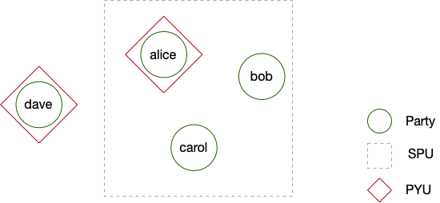
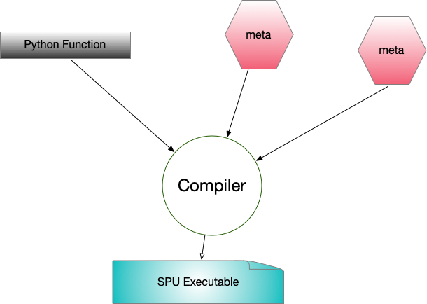

:target{#SPU基础}

# SPU基础

> The following codes are demos only. It’s <strong>NOT for production</strong> due to system security concerns, please <strong>DO NOT</strong> use it directly in production.

SPU设备在SecretFlow中负责执行MPC计算。

本教程将帮助你：

- 熟悉SPU设备和SPU Object。
- 学习如何在Python Object/PYU Object和SPU Object之间相互转化。
- 利用SPU设备执行MPC计算。

:target{#创建一个SPU设备}

## 创建一个SPU设备

:target{#创建SecretFlow-Parties}

### 创建SecretFlow Parties

SecretFlow Parties是在SecretFlow的基本节点，我们将会创建4个party - <strong>alice</strong>, <strong>bob</strong>, <strong>carol</strong> 和 <strong>dave</strong>。

基于这四个party，我们将会建立3个设备。

- 一个基于 <em>alice</em> 的PYU设备
- 一个基于 <em>dave</em> 的PYU设备
- 一个基于 <em>alice</em> , <em>bob</em> 和 <em>carol</em> 的SPU设备



<Notebook.Cell>
  <Notebook.CodeArea prompt="[1]:" stderr={false} type="input">
    ```python
    import secretflow as sf

    # Check the version of your SecretFlow
    print('The version of SecretFlow: {}'.format(sf.__version__))

    # In case you have a running secretflow runtime already.
    sf.shutdown()

    sf.init(['alice', 'bob', 'carol', 'dave'], address='local')
    ```
  </Notebook.CodeArea>
</Notebook.Cell>

:target{#创建一个基于三方ABY3协议的SPU设备}

### 创建一个基于三方ABY3协议的SPU设备

After that, let’s create an SPU device with [ABY3](https://eprint.iacr.org/2018/403.pdf) protocol.

`sf.utils.testing.cluster_def` 是一个helper通过寻找未占用的端口来创建一个设置。

<Notebook.Cell>
  <Notebook.CodeArea prompt="[2]:" stderr={false} type="input">
    ```python
    aby3_config = sf.utils.testing.cluster_def(parties=['alice', 'bob', 'carol'])

    aby3_config
    ```
  </Notebook.CodeArea>

  <Notebook.CodeArea prompt="[2]:" stderr={false} type="output">
    <pre>
      {"{'nodes': [{'party': 'alice', 'address': '127.0.0.1:49613'},\n  {'party': 'bob', 'address': '127.0.0.1:52053'},\n  {'party': 'carol', 'address': '127.0.0.1:25589'}],\n 'runtime_config': {'protocol': 3, 'field': 3}}\n"}
    </pre>
  </Notebook.CodeArea>
</Notebook.Cell>

Then let’s use <em>aby3\_config</em> to create an SPU device and check its cluster\_def.

<Notebook.Cell>
  <Notebook.CodeArea prompt="[3]:" stderr={false} type="input">
    ```python
    spu_device = sf.SPU(aby3_config)

    spu_device.cluster_def
    ```
  </Notebook.CodeArea>

  <Notebook.CodeArea prompt="[3]:" stderr={false} type="output">
    <pre>
      {"{'nodes': [{'party': 'alice', 'address': '127.0.0.1:49613'},\n  {'party': 'bob', 'address': '127.0.0.1:52053'},\n  {'party': 'carol', 'address': '127.0.0.1:25589'}],\n 'runtime_config': {'protocol': 3, 'field': 3}}\n"}
    </pre>
  </Notebook.CodeArea>
</Notebook.Cell>

Lastly, let’s create two PYU devices.

<Notebook.Cell>
  <Notebook.CodeArea prompt="[4]:" stderr={false} type="input">
    ```python
    alice, dave = sf.PYU('alice'), sf.PYU('dave')
    ```
  </Notebook.CodeArea>
</Notebook.Cell>

:target{#向SPU设备传值}

## 向SPU设备传值

Before talking about computation with SPU device, let’s understand how to pass a Python object or a PYUObject to SPU device.

:target{#SPUObject}

### SPUObject

PYU Object可以转化到 SPU Object被SPU节点来共享秘密。

<strong>sf.device.SPUIO</strong> is the helper class to do the job. You don’t need to call this method in your code. We just use it to demonstrate the structure of <strong>SPUObjects</strong> and everything happens for you.

每一个SPUObject包含两个成员：

- meta: 原始对象的结构。
- shares: 原始对象的秘密分享。

<Notebook.Cell>
  <Notebook.CodeArea prompt="[5]:" stderr={false} type="input">
    ```python
    spu_io = sf.device.SPUIO(spu_device.conf, spu_device.world_size)

    bank_account = [{'id': 12345, 'deposit': 1000.25}, {'id': 12345, 'deposit': 100000.25}]

    import spu

    meta, io_info, *shares = spu_io.make_shares(bank_account, spu.Visibility.VIS_SECRET)
    ```
  </Notebook.CodeArea>
</Notebook.Cell>

Let’s check meta first.

<Notebook.Cell>
  <Notebook.CodeArea prompt="[6]:" stderr={false} type="input">
    ```python
    meta
    ```
  </Notebook.CodeArea>

  <Notebook.CodeArea prompt="[6]:" stderr={false} type="output">
    <pre>
      {"[{'deposit': SPUValueMeta(shape=(), dtype=dtype('float32'), vtype=1, protocol=3, field=3, fxp_fraction_bits=0),\n  'id': SPUValueMeta(shape=(), dtype=dtype('int32'), vtype=1, protocol=3, field=3, fxp_fraction_bits=0)},\n {'deposit': SPUValueMeta(shape=(), dtype=dtype('float32'), vtype=1, protocol=3, field=3, fxp_fraction_bits=0),\n  'id': SPUValueMeta(shape=(), dtype=dtype('int32'), vtype=1, protocol=3, field=3, fxp_fraction_bits=0)}]\n"}
    </pre>
  </Notebook.CodeArea>
</Notebook.Cell>

我猜你已经发现meta保留了原始数据的结构，只是将数字和数列替换为 <strong>SPUValueMeta</strong> 。

- data\_type, 代表了值是整数还是定点数。
- visibility，代表了值是密文还是明文。
- storage\_type, indicates attributes of value, e.g. MPC protocol(ABY3 in our case), field size(128 bits in our case), etc

Then let’s check shares of bank\_account\_spu. Since we are passing data to a 3PC SPU device. We would have three pieces of shares, and we are going to check the first piece.

<Notebook.Cell>
  <Notebook.CodeArea prompt="[7]:" stderr={false} type="input">
    ```python
    assert len(shares) == 12

    shares[0]
    ```
  </Notebook.CodeArea>

  <Notebook.CodeArea prompt="[7]:" stderr={false} type="output">
    <pre>
      {"[{'deposit': b'\\x08\\n\\x10\\x01\"\\x10aby3.AShr<FM128>* \\xcd\\xbd\\xed#\\x06\\x04\\x0f\\xebJ\\xdc\\xdf\\x1b\\xacUe\\xdc\\xbe\\'\\x94\\xbb\\xf8?\\xa9-\\x99\\xc8TzM\\xf3\\xe4\\xaf',\n  'id': b'\\x08\\x06\\x10\\x01\"\\x10aby3.AShr<FM128>* \\xf0\\x8b\\xaa\\xc4\\xe5V\\x8a^\\xffq>\\xee\\x08\\x85\\xa6\\x87\\x82C\\xb6\\xbf|_\\xff\\x18\\xfb\\xb7\\xe3`\\x86\\xea\\xc9\\x1a'},\n {'deposit': b'\\x08\\n\\x10\\x01\"\\x10aby3.AShr<FM128>* \\xbaB\\x18\\xa6\\x84\\x9eW\\xa3\\xe8\\x18\\xc6\\x81\\xc7\\x1dp\\'\\x03\\xb4\\xa7\\xa6\\x9e\\x0eF\\xfan\\x81\\xd33,\\xcd\\x05X',\n  'id': b'\\x08\\x06\\x10\\x01\"\\x10aby3.AShr<FM128>* xj\\xde\\x12\\xa9\\x82\\xdfi\\xaahZ\\x16\\r\\xdeH\\x15$\\x17\\xce\\x05\\x8f\\x9b\\x9f\\xc5\\x81d\\x94!\\xab\\x983\\xaf'}]\n"}
    </pre>
  </Notebook.CodeArea>
</Notebook.Cell>

你应该发现一个SPU Object的分片非常类似于meta和原始数据。它仍保留原始数据的结构，但数字被编码的密文替换了（如果你想，可以试着猜测原始数据）。

Well, let’s reconstruct the origin Python object from SPU object.

<Notebook.Cell>
  <Notebook.CodeArea prompt="[8]:" stderr={false} type="input">
    ```python
    bank_account_hat = spu_io.reconstruct(shares, io_info, meta)
    bank_account_hat
    ```
  </Notebook.CodeArea>

  <Notebook.CodeArea prompt="[8]:" stderr={false} type="output">
    <pre>
      {"[{'deposit': array(1000.25, dtype=float32), 'id': array(12345, dtype=int32)},\n {'deposit': array(100000.25, dtype=float32), 'id': array(12345, dtype=int32)}]\n"}
    </pre>
  </Notebook.CodeArea>
</Notebook.Cell>

如果你将 <strong>bank\_account\_hat</strong> 和原始的 <strong>bank\_account</strong> 进行比较，你应该会发现 <strong>bank\_account\_hat</strong> 中的所有数字都已经变成了 <strong>numpy.array</strong> ，但值被保留了。

:target{#将一个PYU-Object从PYU传给SPU}

### 将一个PYU Object从PYU传给SPU

首先，我们用一个PYU设备创建一个PYU object。

<Notebook.Cell>
  <Notebook.CodeArea prompt="[9]:" stderr={false} type="input">
    ```python
    def debit_amount():
        return 10


    debit_amount_pyu = alice(debit_amount)()
    debit_amount_pyu
    ```
  </Notebook.CodeArea>

  <Notebook.CodeArea prompt="[9]:" stderr={false} type="output">
    <pre>
      {"<secretflow.device.device.pyu.PYUObject at 0x7fd98cd09130>\n"}
    </pre>
  </Notebook.CodeArea>
</Notebook.Cell>

Then let’s pass debit\_amount\_pyu from PYU to SPU. We will get an SPU object as result. Under the hood, <strong>alice</strong> calls <strong>sf.device.SPUIO.make\_shares</strong> to get <strong>meta</strong> and <strong>shares</strong> to send to nodes of the spu device.

<Notebook.Cell>
  <Notebook.CodeArea prompt="[10]:" stderr={false} type="input">
    ```python
    debit_amount_spu = debit_amount_pyu.to(spu_device)

    debit_amount_spu
    ```
  </Notebook.CodeArea>

  <Notebook.CodeArea prompt="[10]:" stderr={false} type="output">
    <pre>
      {"<secretflow.device.device.spu.SPUObject at 0x7fd817a03c70>\n"}
    </pre>
  </Notebook.CodeArea>
</Notebook.Cell>

Let’s check meta of debit\_amount\_spu.

<Notebook.Cell>
  <Notebook.CodeArea prompt="[11]:" stderr={false} type="input">
    ```python
    debit_amount_spu.meta
    ```
  </Notebook.CodeArea>

  <Notebook.CodeArea prompt="[11]:" stderr={false} type="output">
    <pre>
      {"ObjectRef(e0dc174c83599034ffffffffffffffffffffffff0100000001000000)\n"}
    </pre>
  </Notebook.CodeArea>
</Notebook.Cell>

Oh no, it’s a Ray ObjectRef located at alice part. So how about shares of debit\_amount\_spu?

<Notebook.Cell>
  <Notebook.CodeArea prompt="[12]:" stderr={false} type="input">
    ```python
    debit_amount_spu.shares_name
    ```
  </Notebook.CodeArea>

  <Notebook.CodeArea prompt="[12]:" stderr={false} type="output">
    <pre>
      {"[ObjectRef(f4402ec78d3a260750696baee0bc0bb42b40620a0100000001000000),\n ObjectRef(f91b78d7db9a65936b44b364879d9518bec82ea10100000001000000),\n ObjectRef(82891771158d68c155ebf101d0aa7682c810dad40100000001000000)]\n"}
    </pre>
  </Notebook.CodeArea>
</Notebook.Cell>

So you get a list of ObjectRef! Since it’s located at alice part, we couldn’t check the value at host.

如果你非常好奇，我们可以用 <strong>sf.reveal</strong> 检查原始值。在生产环境中，请谨慎使用 <strong>sf.reveal</strong> ！当在 <strong>SPUObjects</strong> 上应用 <strong>sf.reveal</strong> 时，<strong>sf.device.SPUIO.reconstruct</strong> 将会被自动调用。

<Notebook.Cell>
  <Notebook.CodeArea prompt="[13]:" stderr={false} type="input">
    ```python
    sf.reveal(debit_amount_spu)
    ```
  </Notebook.CodeArea>

  <Notebook.CodeArea prompt="[13]:" stderr={false} type="output">
    <pre>
      {"array(10, dtype=int32)\n"}
    </pre>
  </Notebook.CodeArea>
</Notebook.Cell>

:target{#将一个Python-Object从Host传到SPU}

### 将一个Python Object从Host传到SPU

Let’s pass a dict from Host to SPU device.

> 注：我知道这看起来很奇怪。目前，如果你想把一个Python对象传递给SPU设备，你必须先将它传递给一个PYU。

<Notebook.Cell>
  <Notebook.CodeArea prompt="[14]:" stderr={false} type="input">
    ```python
    bank_account_spu = sf.to(alice, bank_account).to(spu_device)
    ```
  </Notebook.CodeArea>
</Notebook.Cell>

:target{#总结}

### 总结

这是使用 SPU 设备的数据流的第一部分，此时，您应该了解以下事实。

- Python Object/PYU Object可以转化到 SPU Object。
- 一个SPU Object 包含了meta 和 shares。
- <strong>sf.to</strong> 和 <strong>sf.reveal</strong> 调用 <strong>sf.device.SPUIO</strong> 来在SPU对象和Python对象之间转换数据。
- Just converting to SPU Object won’t trigger data flow from PYU to SPU. e.g. When you transferred a PYU object to an SPU object. All the field of SPU objects including meta and shares are still located at the PYU device. The shares would only be sent to parties of SPU device when computation do happen. In short, data flow is lazy.

:target{#使用-SPU-设备进行计算}

## 使用 SPU 设备进行计算

Since we have two SPU objects - <em>bank\_account\_spu</em> and <em>debit\_amount\_spu</em> as inputs. Let’s try to do some computation with SPU device.

<Notebook.Cell>
  <Notebook.CodeArea prompt="[15]:" stderr={false} type="input">
    ```python
    def deduce_from_account(bank_account, amount):
        new_bank_account = []

        for account in bank_account:
            account['deposit'] = account['deposit'] - amount
            new_bank_account.append(account)

        return new_bank_account


    new_bank_account_spu = spu_device(deduce_from_account)(
        bank_account_spu, debit_amount_spu
    )

    new_bank_account_spu
    ```
  </Notebook.CodeArea>

  <Notebook.CodeArea prompt="[15]:" stderr={false} type="output">
    <pre>
      {"<secretflow.device.device.spu.SPUObject at 0x7fd98cca88b0>\n"}
    </pre>
  </Notebook.CodeArea>
</Notebook.Cell>

<em>new\_bank\_account\_spu</em> is also a <strong>SPUObject</strong>. But it’s a bit different from <em>debit\_amount\_spu</em>!

- <em>debit\_amount\_spu</em> 位于 alice，因此只有 alice 可以检查值。
- <em>new\_bank\_account\_spu</em> is located at spu, each party of spu have a piece of shares. And you couldn’t check the value directly without <em>sf.reveal</em>.

好吧，但是 SPU 设备的计算背后发生了什么？

:target{#步骤1：将Python（Jax）代码编译为SPU可执行文件}

### 步骤1：将Python（Jax）代码编译为SPU可执行文件

Python 函数（在我们的例子中是 <em>deduce\_from\_account</em>）和所有输入的元数据（<em>bank\_account\_spu</em> 和 <em>debit\_amount\_spu</em>）将被发送到 SPU 设备。然后使用 SPU 编译器将它们编译为 <em>SPU Executable</em>。



:target{#步骤2：将SPU可执行文件和秘密分享分配给SPU参与方。}

### 步骤2：将SPU可执行文件和秘密分享分配给SPU参与方。

SPU 设备的每一方将获得：

- 一份 SPU Executable
- 每个 SPU object一份share


:target{#步骤3：运行SPU可执行文件并组装SPU对象}

### 步骤3：运行SPU可执行文件并组装SPU对象

然后 SPU 设备的每一方将执行 SPU Executation。

最后，SPU 设备的每一方都将拥有一个输出 SPU Object的一份share和一个meta。

然后 SecretFlow 框架将使用它们来组装 SPU Object。

:target{#从-SPU-设备中获取值}

## 从 SPU 设备中获取值

But in the end, we need to get value from spu, we couldn’t always keep <em>SPUObject</em> as secret!

处理 <em>SPUObject</em> 的最常见方法是将秘密传递给一方。 该方不一定是由 SPU 设备组成的各方之一。

<Notebook.Cell>
  <Notebook.CodeArea prompt="[16]:" stderr={false} type="input">
    ```python
    new_bank_account_pyu = new_bank_account_spu.to(dave)

    new_bank_account_pyu
    ```
  </Notebook.CodeArea>

  <Notebook.CodeArea prompt="[16]:" stderr={false} type="output">
    <pre>
      {"<secretflow.device.device.pyu.PYUObject at 0x7fd98cd754f0>\n"}
    </pre>
  </Notebook.CodeArea>
</Notebook.Cell>

We just pass <em>new\_bank\_account\_spu</em> to <strong>pyu</strong>, then it becomes a <em>PYUObject</em>! And it’s owned by dave. Let’s check the value of <em>new\_bank\_account\_pyu</em>.

<Notebook.Cell>
  <Notebook.CodeArea prompt="[17]:" stderr={false} type="input">
    ```python
    sf.reveal(new_bank_account_pyu)
    ```
  </Notebook.CodeArea>

  <Notebook.CodeArea prompt="[17]:" stderr={false} type="output">
    <pre>
      {"[{'deposit': array(990.25, dtype=float32), 'id': array(12345, dtype=int32)},\n {'deposit': array(99990.25, dtype=float32), 'id': array(12345, dtype=int32)}]\n"}
    </pre>
  </Notebook.CodeArea>
</Notebook.Cell>

我们也可以直接将 <em>SPUObject</em> 传递给host。 利用神奇的 <em>sf.reveal</em> 。 再次提醒在生产环境中要小心使用 <em>sf.reveal</em> ！

<Notebook.Cell>
  <Notebook.CodeArea prompt="[18]:" stderr={false} type="input">
    ```python
    sf.reveal(new_bank_account_spu)
    ```
  </Notebook.CodeArea>

  <Notebook.CodeArea prompt="[18]:" stderr={false} type="output">
    <pre>
      {"[{'deposit': array(990.25, dtype=float32), 'id': array(12345, dtype=int32)},\n {'deposit': array(99990.25, dtype=float32), 'id': array(12345, dtype=int32)}]\n"}
    </pre>
  </Notebook.CodeArea>
</Notebook.Cell>

:target{#进阶主题：使用不同的-MPC-协议}

## 进阶主题：使用不同的 MPC 协议

At this moment, SPU device supports multiple MPC protocol besides ABY3. It’s easy to use different MPC protocol - just set the proper field in cluster def.

例如，如果有人想使用 2PC 协议 - Cheetah，你应该准备另一个集群 def：

<Notebook.Cell>
  <Notebook.CodeArea prompt="[19]:" stderr={false} type="input">
    ```python
    import spu

    import secretflow as sf

    # In case you have a running secretflow runtime already.
    sf.shutdown()

    sf.init(['alice', 'bob', 'carol', 'dave'], address='local')

    cheetah_config = sf.utils.testing.cluster_def(
        parties=['alice', 'bob'],
        runtime_config={
            'protocol': spu.spu_pb2.CHEETAH,
            'field': spu.spu_pb2.FM64,
        },
    )
    ```
  </Notebook.CodeArea>
</Notebook.Cell>

然后你可以用 <em>cheetah\_config</em> 创建一个 SPU 设备。

<Notebook.Cell>
  <Notebook.CodeArea prompt="[20]:" stderr={false} type="input">
    ```python
    spu_device2 = sf.SPU(cheetah_config)
    ```
  </Notebook.CodeArea>
</Notebook.Cell>

Let’s check the <em>cluster\_def</em> of spu\_device2.

<Notebook.Cell>
  <Notebook.CodeArea prompt="[21]:" stderr={false} type="input">
    ```python
    spu_device2.cluster_def
    ```
  </Notebook.CodeArea>

  <Notebook.CodeArea prompt="[21]:" stderr={false} type="output">
    <pre>
      {"{'nodes': [{'party': 'alice', 'address': '127.0.0.1:64555'},\n  {'party': 'bob', 'address': '127.0.0.1:30243'}],\n 'runtime_config': {'protocol': 4, 'field': 2}}\n"}
    </pre>
  </Notebook.CodeArea>
</Notebook.Cell>

We could use <em>spu\_device2</em> to check famous Yao’s Millionaires’ problem.

<Notebook.Cell>
  <Notebook.CodeArea prompt="[22]:" stderr={false} type="input">
    ```python
    def get_carol_assets():
        return 1000000


    def get_dave_assets():
        return 1000002


    carol, dave = sf.PYU('carol'), sf.PYU('dave')

    carol_assets = carol(get_carol_assets)()
    dave_assets = dave(get_dave_assets)()
    ```
  </Notebook.CodeArea>
</Notebook.Cell>

我们使用 <em>spu\_device2</em> 来检查 <em>carol</em> 是否更富有。

<Notebook.Cell>
  <Notebook.CodeArea prompt="[23]:" stderr={false} type="input">
    ```python
    def get_winner(carol, dave):
        return carol > dave


    winner = spu_device2(get_winner)(carol_assets, dave_assets)

    sf.reveal(winner)
    ```
  </Notebook.CodeArea>

  <Notebook.CodeArea prompt="[23]:" stderr={false} type="output">
    <pre>
      {"array(False)\n"}
    </pre>
  </Notebook.CodeArea>
</Notebook.Cell>

:target{#进阶主题：从SPU-计算得到多个返回值}

## 进阶主题：从SPU 计算得到多个返回值

在大多数情况下，我们从 SPU 设备执行的函数中获得多个返回值。

例如，

<Notebook.Cell>
  <Notebook.CodeArea prompt="[24]:" stderr={false} type="input">
    ```python
    def get_multiple_outputs(x, y):
        return x + y, x - y
    ```
  </Notebook.CodeArea>
</Notebook.Cell>

有多种选择可以处理这个问题。

:target{#选项-1：将所有返回值视为单一返回值}

### 选项 1：将所有返回值视为单一返回值

This is the default behavior of SPU. Let’s see.

<Notebook.Cell>
  <Notebook.CodeArea prompt="[25]:" stderr={false} type="input">
    ```python
    single_output = spu_device2(get_multiple_outputs)(carol_assets, dave_assets)

    single_output
    ```
  </Notebook.CodeArea>

  <Notebook.CodeArea prompt="[25]:" stderr={false} type="output">
    <pre>
      {"<secretflow.device.device.spu.SPUObject at 0x7fd98cd754c0>\n"}
    </pre>
  </Notebook.CodeArea>
</Notebook.Cell>

We could see we only get a single <em>SPUObject</em>. Let’s reveal it.

<Notebook.Cell>
  <Notebook.CodeArea prompt="[26]:" stderr={false} type="input">
    ```python
    sf.reveal(single_output)
    ```
  </Notebook.CodeArea>

  <Notebook.CodeArea prompt="[26]:" stderr={false} type="output">
    <pre>
      {"(array(2000002, dtype=int32), array(-2, dtype=int32))\n"}
    </pre>
  </Notebook.CodeArea>
</Notebook.Cell>

所以 single\_output 本身实际上代表一个元组。

:target{#选项-2：即时决定返回值数量}

### 选项 2：即时决定返回值数量

我们还可以指示 SPU 为我们决定返回值数量。

<Notebook.Cell>
  <Notebook.CodeArea prompt="[27]:" stderr={false} type="input">
    ```python
    from secretflow.device.device.spu import SPUCompilerNumReturnsPolicy

    multiple_outputs = spu_device2(
        get_multiple_outputs, num_returns_policy=SPUCompilerNumReturnsPolicy.FROM_COMPILER
    )(carol_assets, dave_assets)

    multiple_outputs
    ```
  </Notebook.CodeArea>

  <Notebook.CodeArea prompt="[27]:" stderr={false} type="output">
    <pre>
      {"(<secretflow.device.device.spu.SPUObject at 0x7fd98cce0400>,\n <secretflow.device.device.spu.SPUObject at 0x7fd98cce0490>)\n"}
    </pre>
  </Notebook.CodeArea>
</Notebook.Cell>

let’s check two outputs respectively.

<Notebook.Cell>
  <Notebook.CodeArea prompt="[28]:" stderr={false} type="input">
    ```python
    print(sf.reveal(multiple_outputs[0]))
    print(sf.reveal(multiple_outputs[1]))
    ```
  </Notebook.CodeArea>

  <Notebook.CodeArea prompt="" stderr={false} type="output">
    <pre>
      {"2000002\n-2\n"}
    </pre>
  </Notebook.CodeArea>
</Notebook.Cell>

:target{#选项-3：手动确定返回值数量}

### 选项 3：手动确定返回值数量

如果可能，您还可以手动设置返回值数量。

<Notebook.Cell>
  <Notebook.CodeArea prompt="[29]:" stderr={false} type="input">
    ```python
    user_multiple_outputs = spu_device2(
        get_multiple_outputs,
        num_returns_policy=SPUCompilerNumReturnsPolicy.FROM_USER,
        user_specified_num_returns=2,
    )(carol_assets, dave_assets)

    user_multiple_outputs
    ```
  </Notebook.CodeArea>

  <Notebook.CodeArea prompt="[29]:" stderr={false} type="output">
    <pre>
      {"[<secretflow.device.device.spu.SPUObject at 0x7fd98cce0a60>,\n <secretflow.device.device.spu.SPUObject at 0x7fd98cce0af0>]\n"}
    </pre>
  </Notebook.CodeArea>
</Notebook.Cell>

let’s also check two outputs respectively.

<Notebook.Cell>
  <Notebook.CodeArea prompt="[30]:" stderr={false} type="input">
    ```python
    print(sf.reveal(multiple_outputs[0]))
    print(sf.reveal(multiple_outputs[1]))
    ```
  </Notebook.CodeArea>

  <Notebook.CodeArea prompt="" stderr={false} type="output">
    <pre>
      {"2000002\n-2\n"}
    </pre>
  </Notebook.CodeArea>
</Notebook.Cell>

Let’s summarize what we have:

- 默认情况下，SPU 将所有返回值视为单个返回值。
- 由于 SPU 编译器生成 SPU 可执行文件，它可以计算出返回值数量。 但是，这个选项会导致一些延迟，因为我们必须使编译工作阻塞。
- 如果您想避免延迟，我们可以手动提供返回值数量。 但是你必须确保你提供了正确的数字，否则程序会报错！

:target{id="What's-Next?"}

## What’s Next?

在学习了 SPU 的基础知识后，您可以查看一些 SPU 高级教程：

- [Logistic Regression with SPU](lr_with_spu.mdx)
- [Neural Network with SPU](nn_with_spu.mdx)
