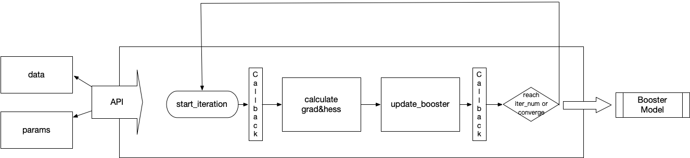
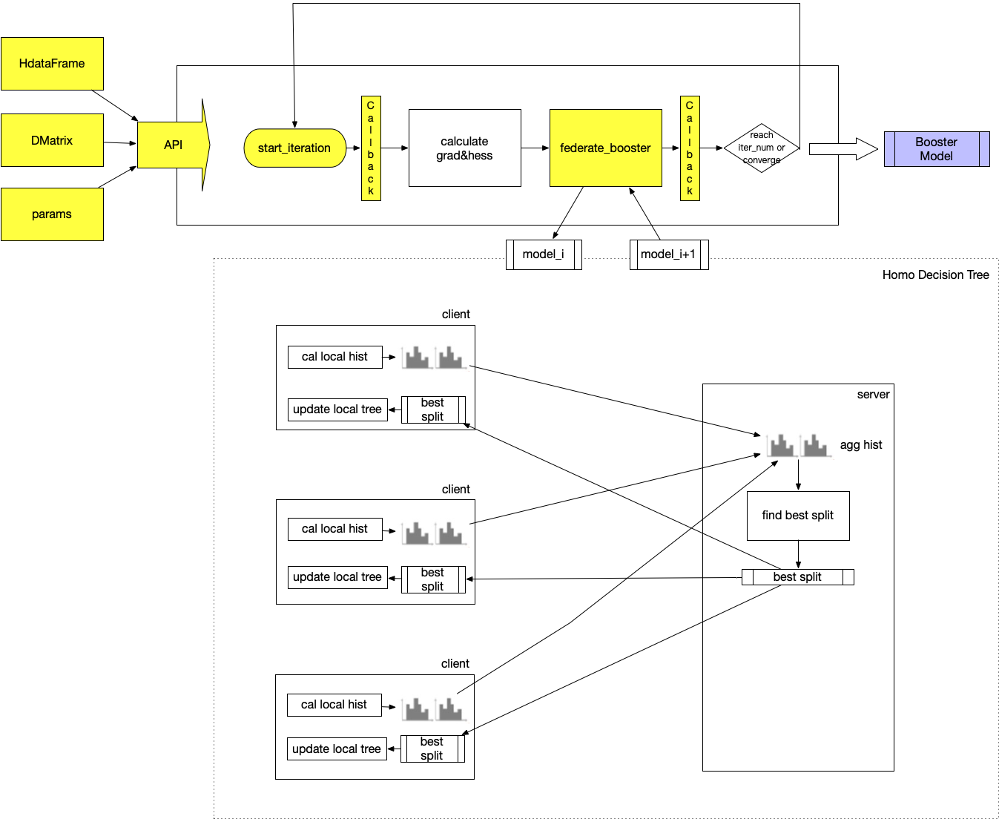
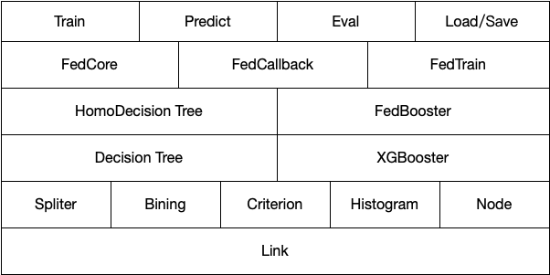
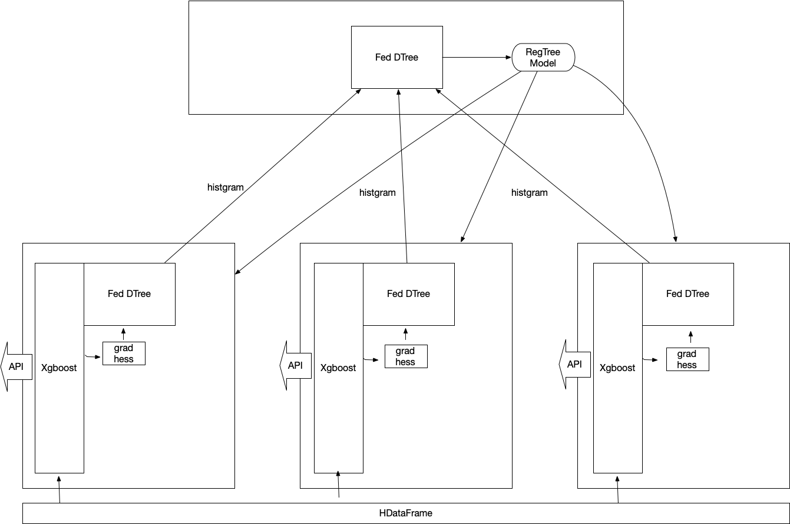

:target{#horizontally-federated-xgboost}

# 水平联邦XGBoost

水平联邦XGBoost目前支持水平场景树提升模型的构建。

在水平联邦学习场景中，数据是按照样本水平划分的，即每个数据参与方的schema是一致的，具有相同的列和类型。

:target{#introduction-to-xgboost}

## 回顾XGBoost

官方文档: [XGBoost tutorials](https://xgboost.readthedocs.io/en/latest/tutorials/index.html)在横向联邦学习场景中，每一方都有数据在相同的特征空间，但是样本空间不同，可以理解为对整体数据的采样（可能是非iid），水平树模型，需要在这个设置下，构建联合树模型完成建模。

<table>
  <thead>
    <tr>
      <td>
        角色
      </td>

      <td>
        细节
      </td>
    </tr>
  </thead>

  <tbody>
    <tr>
      <td>
        客户端
      </td>

      <td>
        客户端有自己的数据样本，也有数据样本对应的标签。 每个客户端都有相同的特征空间。 多个客户端联合训练联合模型，不泄露任何一方的本地样本数据。 客户端共享相同的训练联合模型
      </td>
    </tr>

    <tr>
      <td>
        服务端
      </td>

      <td>
        它用于聚合每个客户端报告的直方图（sum\_of gradiant & sum\_of hessian）。 服务器获取每个直方图并构建全局直方图，根据全局直方图计算最佳分割，并广播给每个客户端完成一次迭代。 由于梯度和hessian可能会泄露原始数据的一些信息，所以服务器端只能通过安全聚合来完成直方图聚合。 服务器端只能获取全局计算的直方图，无法获取任何局部直方图。
      </td>
    </tr>
  </tbody>
</table>

:target{#local-xgboost-training-process}

### Fedboost的本地训练流程



:target{#homoboost-training-process}

### 水平联邦XGBoost的训练流程



:target{#homoboost-module-dependency}

### HomoBoost的模块依赖



:target{#homoboost-whole-training-process}

### HomoBoost的完整训练流程



:target{#algorithm-process}

## 算法流程

数据输入：HdataFrame，XGBoost支持将Pandas.DataFrame直接转为DMatrix

1. 使用federated binning来做全局联合分箱，计算等频分位点作为后续计算分割点的基础。
2. 在服务端构造相同样本空间的mock数据，同步服务端和客户端的训练过程
3. 迭代前处理回调
4. 将数据输入到每个Client XGBoost引擎中计算g & h 启动homo\_boost任务； 构建FedBooster（迭代n次迭代进行树模型迭代）
   1. 迭代前处理回调
   2. 通过XGBoost引擎计算grad和hess； 通过 federated 构建树模型并将其添加到 Fedboost 模型中。 XGBoost 引擎和我们的联合树构建模块之间的交互点 - 标准 XGBoost 模型
   3. 处理callback\_after\_iteration（如 early stop，evaluation等）
5. 将当前的g和h输入到 federate decision tree模块中，发起homo\_boost任务；构建FedBooster（迭代n个iteration做树模型迭代）
   1. 进行数据reassign，分配到待分裂的节点上
   2. 根据之前计算好的binning分桶计算sum\_of\_grad 和sum\_of\_hess
   3. 发送给server端，server端做secure aggregation，挑选分裂信息发送回client端
   4. 更新分裂，而后返回1
6. 当前这棵树分裂完成后，返回树结构，各个client以及server端都会拥有完整的当前树结构，将树结构转为xgboost标准RegTree格式，加入到xgboost标准模型文件中
7. 处理callback\_after\_iteration（如 early stop，evaluation等）
8. xgboost.load\_model(刚刚生成好的标准模型文件)，进入下一次迭代

:target{#sample-code}

## 样例代码

```python
from secretflow.data.horizontal import read_csv
from secretflow.security.aggregation import SecureAggregator
from secretflow.security.compare import SPUComparator
from secretflow.utils.simulation.datasets import load_dermatology
from secretflow.ml.boost.homo_boost import SFXgboost
import secretflow as sf

# In case you have a running secretflow runtime already.
sf.shutdown()

sf.init(['alice', 'bob', 'charlie'], address='local')
alice, bob, charlie = sf.PYU('alice'), sf.PYU('bob'), sf.PYU('charlie')

aggr = SecureAggregator(charlie, [alice, bob])
spu = sf.SPU(sf.utils.testing.cluster_def(['alice', 'bob']))
comp = SPUComparator(spu)
data = load_dermatology(parts=[alice, bob], aggregator=aggr,
                        comparator=comp)
data.fillna(value=0, inplace=True)
params = {
         # XGBoost parameter tutorial
         # https://xgboost.readthedocs.io/en/latest/parameter.html
         'max_depth': 4, # max depth
         'eta': 0.3, # learning rate
         'objective': 'multi:softmax', # objection function，support "binary:logistic","reg:logistic","multi:softmax","multi:softprob","reg:squarederror"
         'min_child_weight': 1, # The minimum value of weight
         'lambda': 0.1, # L2 regularization term on weights (xgb's lambda)
         'alpha': 0, # L1 regularization term on weights (xgb's alpha)
         'max_bin': 10, # Max num of binning
         'num_class':6, # Only required in multi-class classification
         'gamma': 0, # Same to min_impurity_split,The minimux gain for a split
         'subsample': 1.0, # Subsample rate by rows
         'colsample_by_tree': 1.0, # Feature selection rate by tree
         'colsample_bylevel': 1.0, # Feature selection rate by level
         'eval_metric': 'merror',  # supported eval metric：
                                    # 1. rmse
                                    # 2. rmsle
                                    # 3. mape
                                    # 4. logloss
                                    # 5. error
                                    # 6. error@t
                                    # 7. merror
                                    # 8. mlogloss
                                    # 9. auc
                                    # 10. aucpr
         # Special params in SFXgboost
         # Required
         'hess_key': 'hess', # Required, Mark hess columns, optionally choosing a column name that is not in the data set
         'grad_key': 'grad', # Required，Mark grad columns, optionally choosing a column name that is not in the data set
         'label_key': 'class', # Required，ark label columns, optionally choosing a column name that is not in the data set
}

bst = SFXgboost(server=charlie, clients=[alice, bob])
bst.train(data, data, params=params, num_boost_round = 6)
```

:target{#tutorial}

## 教程

请查看这里的样例[tutorial](../../../tutorial/Federated_Xgboost.mdx).
