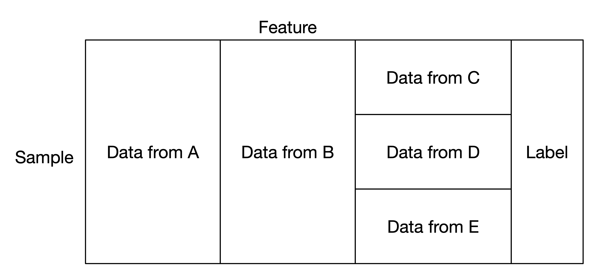

:target{#mix-federated-learning}

# 混合联邦

混合联邦适用于下列场景：部分参与方样本相同但是特征空间不同，另一部分参与方特征空间相同但是样本不同。

一种典型的数据混合切分。

:target{#mix-logistic-regression}

## 混合逻辑回归

隐语提供了 `FlLogisticRegressionMix` 可以对混合切分数据进行逻辑回归。 您可以跟着教程来学习。

:target{#tutorial}

### 教程

- [混合联邦——逻辑回归](../../tutorial/mix_lr.mdx)
