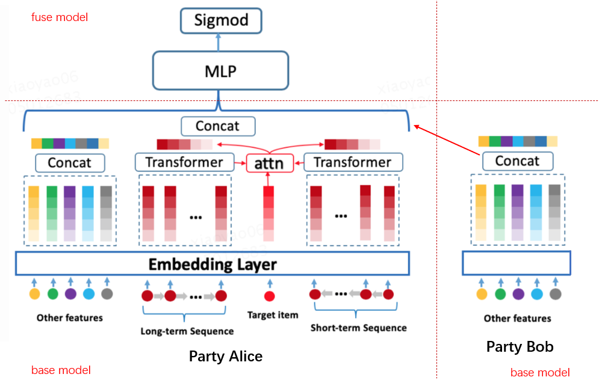

:target{#SplitRec：在隐语中使用拆分-BST-算法（Tensorflow-后端）}

# SplitRec：在隐语中使用拆分 BST 算法（Tensorflow 后端）

阿里搜索推荐团队在2019年arXiv上发布文章《Behavior Sequence Transformer for E-commerce Recommendation in Alibaba》，提出BST模型。BST利用Transformer结构捕捉用户行为序列信息，解决WDL、DIN等模型忽略序列信息的问题，因而受到关注。本文将介绍如何在隐语中使用Tensorflow后端的拆分BST算法。

:target{#BST-模型}

## BST 模型

BST 模型在 DNN 模型基础上，使用 Transformer Layer 捕捉用户行为序列中的信息，整体结构如下 

其中 Transformer Layer 使用一层 multi-head self-attention 结构，如图右侧所示。

Transformer layer 的输入是序列特征的 Embedding 和位置 Embedding 的加和。

:target{#隐语中的拆分-BST-模型}

## 隐语中的拆分 BST 模型

隐语考虑两方拆分学习场景，两方各持有一些特征，包括序列特征和其他特，一方持有 label 。双方特征经过 base 模型处理后，将 base 模型的输出输入到 fuse 模型进行学习，根据对序列特征的处理不同分为拆分 BST 模型和拆分 BSTPlus 模型。

:target{#拆分-BST-模型}

### 拆分 BST 模型

其中序列特征通过 Transformer Layer 处理，其他特征通过普通的 Embedding 处理，序列特征和其他特征是可选的，模型结构如图所示。

:target{#拆分-BSTPlus-模型}

### 拆分 BSTPlus 模型

上述 BST 模型虽然能够有效捕捉序列信息，但对于同一用户不同商品的预估来说，序列信息都是相同的，并不能区分同一用户行为序列与不同商品的关联性，因此 BSTPlus 模型在 BST 基础上叠加 DIN 中的 attention 思想，对 target item 和 Transformer layer 的输出进行 attention pooling，通过计算 target item 对序列中 item 的注意力来挖掘用户行为序列与 target item 之间的关联信息，结构如下图。由于 target item 存在于 label 方，暂不支持无 label 方有序列特征。

:target{#隐语封装}

## 隐语封装

我们在隐语中提供了对于各种应用的封装。 关于 BST 的封装在 secretflow/ml/nn/applications/sl\_bst\_tf.py，提供了 `BSTBase`，`BSTPlusBase` 和 `BSTFuse` 几个类。 下面我们通过一个例子来看一下如何使用隐语封装的 BST 来进行训练。

:target{#环境设置}

## 环境设置

<Notebook.Cell>
  <Notebook.CodeArea prompt="[1]:" stderr={false} type="input">
    ```python
    import secretflow as sf

    # Check the version of your SecretFlow
    print('The version of SecretFlow: {}'.format(sf.__version__))

    # In case you have a running secretflow runtime already.
    sf.shutdown()
    sf.init(['alice', 'bob'], address="local", log_to_driver=False)
    alice, bob = sf.PYU('alice'), sf.PYU('bob')
    device_y = bob
    ```
  </Notebook.CodeArea>

  <Notebook.CodeArea prompt="" stderr={false} type="output">
    <pre>
      {"The version of SecretFlow: 1.2.0.dev20231106\n"}
    </pre>
  </Notebook.CodeArea>
</Notebook.Cell>

:target{#数据集介绍}

## 数据集介绍

这里将使用最经典的 MovieLens 数据集进行演示。 MovieLens 是一个开放式的推荐系统数据集，包含了电影评分和电影元数据信息。

[数据集官网](https://grouplens.org/datasets/movielens/)

[下载数据集](https://secretflow-data.oss-accelerate.aliyuncs.com/datasets/movielens/ml-1m.zip)

:target{#下载并处理数据}

## 下载并处理数据

<LineBlock>
  我们通过聚合同一用户按时间顺序评分过的电影生成用户行为序列，并对数据进行切分：

  \- alice: gender, age\_group, occupation - bob: user\_id, target\_movie\_id, sequence\_movie\_ids, label
</LineBlock>

<Notebook.Cell>
  <Notebook.CodeArea prompt="[2]:" stderr={false} type="input">
    ```python
    import os
    from pathlib import Path
    import shutil

    data_dir = './test_bst_data_tf'
    dataset_download_dir = data_dir + '/data_download'
    gen_data_path = data_dir + '/data_sl_bst'


    def generate_data(plus=True):
        import numpy as np
        import pandas as pd

        from secretflow.utils.simulation.datasets import _DATASETS, get_dataset, unzip

        global dataset_download_dir
        if not Path(dataset_download_dir).is_dir():
            filepath = get_dataset(_DATASETS['ml-1m'])
            unzip(filepath, dataset_download_dir)

        dataset_dir = dataset_download_dir + '/ml-1m'
        # read data
        users = pd.read_csv(
            dataset_dir + "/users.dat",
            sep="::",
            names=["user_id", "gender", "age_group", "occupation", "zip_code"],
            engine='python',
        )

        ratings = pd.read_csv(
            dataset_dir + "/ratings.dat",
            sep="::",
            names=["user_id", "movie_id", "rating", "unix_timestamp"],
            engine='python',
        )

        movies = pd.read_csv(
            dataset_dir + "/movies.dat",
            sep="::",
            names=["movie_id", "title", "genres"],
            engine='python',
            encoding="ISO-8859-1",
        )

        users["user_id"] = users["user_id"].apply(lambda x: f"{x}")
        users["age_group"] = users["age_group"].apply(lambda x: f"{x}")
        users["occupation"] = users["occupation"].apply(lambda x: f"{x}")

        movies["movie_id"] = movies["movie_id"].apply(lambda x: f"{x}")
        movies["genres"] = movies["genres"].apply(lambda x: ','.join(x.split('|')))

        ratings["movie_id"] = ratings["movie_id"].apply(lambda x: f"{x}")
        ratings["user_id"] = ratings["user_id"].apply(lambda x: f"{x}")
        ratings["rating"] = ratings["rating"].apply(lambda x: float(x))

        # generate users' movie sequence
        ratings_group = ratings.sort_values(by=["unix_timestamp"]).groupby("user_id")

        ratings_data = pd.DataFrame(
            data={
                "user_id": list(ratings_group.groups.keys()),
                "movie_ids": list(ratings_group.movie_id.apply(list)),
                "ratings": list(ratings_group.rating.apply(list)),
                "timestamps": list(ratings_group.unix_timestamp.apply(list)),
            }
        )

        # split sequence
        if plus:
            sequence_length = 5
            step_size = 4
        else:
            sequence_length = 4
            step_size = 2

        def create_sequences(values, window_size, step_size):
            sequences = []
            start_index = 0
            while True:
                end_index = start_index + window_size
                seq = values[start_index:end_index]
                if len(seq) < window_size:
                    seq.extend(['[PAD]'] * (window_size - len(seq)))
                    sequences.append(seq)
                    break
                sequences.append(seq)
                start_index += step_size
            return sequences

        ratings_data.movie_ids = ratings_data.movie_ids.apply(
            lambda ids: create_sequences(ids, sequence_length, step_size)
        )

        ratings_data.ratings = ratings_data.ratings.apply(
            lambda ids: create_sequences(ids, sequence_length, step_size)
        )
        del ratings_data["timestamps"]

        ratings_data_movies = ratings_data[["user_id", "movie_ids"]].explode(
            "movie_ids", ignore_index=True
        )
        ratings_data_rating = ratings_data[["ratings"]].explode(
            "ratings", ignore_index=True
        )
        ratings_data_transformed = pd.concat(
            [ratings_data_movies, ratings_data_rating], axis=1
        )
        ratings_data_transformed = ratings_data_transformed.join(
            users.set_index("user_id"), on="user_id"
        )
        ratings_data_transformed['movie_id'] = ratings_data_transformed.movie_ids.apply(
            lambda x: x[-1] if '[PAD]' not in x else x[x.index('[PAD]') - 1]
        )

        if plus:
            # last movie in sequence is target movie
            ratings_data_transformed.movie_ids = ratings_data_transformed.movie_ids.apply(
                lambda x: ",".join(x[:-1])
                if '[PAD]' not in x
                else ",".join(x[: x.index('[PAD]') - 1] + x[x.index('[PAD]') :])
            )
        else:
            ratings_data_transformed.movie_ids = ratings_data_transformed.movie_ids.apply(
                lambda x: ",".join(x)
            )

        ratings_data_transformed['label'] = ratings_data_transformed.ratings.apply(
            lambda x: x[-1] if '[PAD]' not in x else x[x.index('[PAD]') - 1]
        )

        ratings_data_transformed.ratings = ratings_data_transformed.ratings.apply(
            lambda x: ",".join([str(v) for v in x[:-1]])
        )
        ratings_data_transformed = ratings_data_transformed.join(
            movies.set_index("movie_id"), on="movie_id"
        )

        del (
            ratings_data_transformed["zip_code"],
            ratings_data_transformed["title"],
            ratings_data_transformed["genres"],
            ratings_data_transformed["ratings"],
        )

        ratings_data_transformed.rename(
            columns={"movie_ids": "sequence_movie_ids", "movie_id": "target_movie_id"},
            inplace=True,
        )
        random_selection = np.random.rand(len(ratings_data_transformed.index)) <= 0.85
        train_data = ratings_data_transformed[random_selection]
        test_data = ratings_data_transformed[~random_selection]

        # save data
        if os.path.exists(gen_data_path):
            shutil.rmtree(gen_data_path)
        os.mkdir(gen_data_path)
        os.mkdir(gen_data_path + '/vocabulary')

        train_data.to_csv(
            gen_data_path + "/train_data.csv", index=False, sep="|", encoding='utf-8'
        )
        test_data.to_csv(
            gen_data_path + "/test_data.csv", index=False, sep="|", encoding='utf-8'
        )

        train_data_alice = train_data[["gender", "age_group", "occupation"]]
        train_data_bob = train_data[
            [
                "user_id",
                "sequence_movie_ids",
                "target_movie_id",
                "label",
            ]
        ]

        test_data_alice = test_data[["gender", "age_group", "occupation"]]
        test_data_bob = test_data[
            [
                "user_id",
                "sequence_movie_ids",
                "target_movie_id",
                "label",
            ]
        ]

        train_data_alice.to_csv(
            gen_data_path + "/train_data_alice.csv", index=False, sep="|", encoding='utf-8'
        )
        train_data_bob.to_csv(
            gen_data_path + "/train_data_bob.csv", index=False, sep="|", encoding='utf-8'
        )

        test_data_alice.to_csv(
            gen_data_path + "/test_data_alice.csv", index=False, sep="|", encoding='utf-8'
        )
        test_data_bob.to_csv(
            gen_data_path + "/test_data_bob.csv", index=False, sep="|", encoding='utf-8'
        )

        with open(gen_data_path + '/vocabulary/user_id', 'w') as f:
            f.write('\n'.join(list(ratings_data_transformed.user_id.unique())))

        with open(gen_data_path + '/vocabulary/gender', 'w') as f:
            f.write('\n'.join(list(ratings_data_transformed.gender.unique())))

        with open(gen_data_path + '/vocabulary/age_group', 'w') as f:
            f.write('\n'.join(list(ratings_data_transformed.age_group.unique())))

        with open(gen_data_path + '/vocabulary/occupation', 'w') as f:
            f.write('\n'.join(list(ratings_data_transformed.occupation.unique())))

        with open(gen_data_path + '/vocabulary/item_id', 'w') as f:
            f.write('\n'.join(list(movies.movie_id.unique())))


    generate_data()
    ```
  </Notebook.CodeArea>
</Notebook.Cell>

<Notebook.Cell>
  <Notebook.CodeArea prompt="[3]:" stderr={false} type="input">
    ```python
    ! head ./test_bst_data_tf/data_sl_bst/train_data_alice.csv
    ```
  </Notebook.CodeArea>

  <Notebook.CodeArea prompt="" stderr={false} type="output">
    <pre>
      {"gender|age_group|occupation\nF|1|10\nF|1|10\nF|1|10\nF|1|10\nF|1|10\nF|1|10\nF|1|10\nF|1|10\nF|1|10\n"}
    </pre>
  </Notebook.CodeArea>
</Notebook.Cell>

<Notebook.Cell>
  <Notebook.CodeArea prompt="[4]:" stderr={false} type="input">
    ```python
    ! head ./test_bst_data_tf/data_sl_bst/train_data_bob.csv
    ```
  </Notebook.CodeArea>

  <Notebook.CodeArea prompt="" stderr={false} type="output">
    <pre>
      {"user_id|sequence_movie_ids|target_movie_id|label\n1|3186,1721,1270,1022|2340|3.0\n1|2340,1836,3408,1207|2804|5.0\n1|2804,260,720,1193|919|4.0\n1|2028,3105,938,1035|1962|4.0\n1|1962,1028,2018,150|1097|4.0\n1|1097,914,1287,2797|1246|4.0\n1|1246,2762,661,2918|531|4.0\n1|531,3114,2791,1029|2321|3.0\n1|2321,1197,594,2398|1545|4.0\n"}
    </pre>
  </Notebook.CodeArea>
</Notebook.Cell>

到这里，我们以及产出训练测试用的数据文件。

:target{#构造-dataset_builder-处理数据}

## 构造 dataset\_builder 处理数据

这里对特征进行 ID 化处理，rating > 3 作为正样本，否则作为负样本

<Notebook.Cell>
  <Notebook.CodeArea prompt="[5]:" stderr={false} type="input">
    ```python
    def create_dataset_builder_alice(
        batch_size=128,
        repeat_count=5,
    ):
        def dataset_builder(x):
            import pandas as pd
            import tensorflow as tf

            x = [dict(t) if isinstance(t, pd.DataFrame) else t for t in x]
            x = x[0] if len(x) == 1 else tuple(x)
            data_set = (
                tf.data.Dataset.from_tensor_slices(x).batch(batch_size).repeat(repeat_count)
            )

            return data_set

        return dataset_builder


    def create_dataset_builder_bob(
        batch_size=128,
        repeat_count=5,
    ):
        def _parse_bob(row_sample, label):
            import tensorflow as tf

            y_t = label["label"]
            y = tf.expand_dims(
                tf.where(
                    y_t > 3,
                    tf.ones_like(y_t, dtype=tf.float32),
                    tf.zeros_like(y_t, dtype=tf.float32),
                ),
                axis=1,
            )
            return row_sample, y

        def dataset_builder(x):
            import pandas as pd
            import tensorflow as tf

            x = [dict(t) if isinstance(t, pd.DataFrame) else t for t in x]
            x = x[0] if len(x) == 1 else tuple(x)
            data_set = (
                tf.data.Dataset.from_tensor_slices(x).batch(batch_size).repeat(repeat_count)
            )

            data_set = data_set.map(_parse_bob)

            return data_set

        return dataset_builder


    batch_size = 128
    epoch = 1
    data_builder_dict = {
        alice: create_dataset_builder_alice(
            batch_size=batch_size,
            repeat_count=epoch,
        ),
        bob: create_dataset_builder_bob(
            batch_size=batch_size,
            repeat_count=epoch,
        ),
    }
    ```
  </Notebook.CodeArea>
</Notebook.Cell>

:target{#定义模型结构}

## 定义模型结构

通过 plus 指定 base 模型结构 - plus=True: BSTBase - plus=False: BSTPlusBase

<Notebook.Cell>
  <Notebook.CodeArea prompt="[6]:" stderr={false} type="input">
    ```python
    from secretflow.ml.nn.applications.sl_bst_tf import BSTBase, BSTFuse, BSTPlusBase


    def create_bstplus_base_model_alice():
        # Create model
        def create_model():
            import tensorflow as tf
            from tensorflow.keras import layers

            fea_list = ["gender", "age_group", "occupation"]
            fea_emb_size = {"gender": 8, "age_group": 8, "occupation": 8}
            fea_voc = {}
            for key in fea_list:
                with open(gen_data_path + '/vocabulary/' + key) as f:
                    values = [line.strip() for line in f.readlines()]
                    fea_voc[key] = values

            def preprocess():
                inputs = {}
                outputs = {}
                for key in fea_list:
                    inputs[key] = tf.keras.Input(shape=(1,), dtype=tf.string)

                    idx = layers.StringLookup(
                        vocabulary=fea_voc[key],
                        mask_token=None,
                        num_oov_indices=0,
                        name=f"{key}_index_lookup",
                    )(inputs[key])

                    outputs[key] = layers.Embedding(
                        input_dim=len(fea_voc[key]),
                        output_dim=fea_emb_size[key],
                        name=f"{key}_embedding",
                    )(idx)

                return tf.keras.Model(inputs=inputs, outputs=outputs)

            preprocess_layer = preprocess()
            model = BSTPlusBase(
                preprocess_layer=preprocess_layer,
                dnn_units_size=[32],
            )
            model.compile(
                loss=tf.keras.losses.binary_crossentropy,
                optimizer=tf.keras.optimizers.Adam(),
                metrics=[
                    tf.keras.metrics.AUC(),
                    tf.keras.metrics.Precision(),
                    tf.keras.metrics.Recall(),
                ],
            )
            return model  # need wrap

        return create_model


    def create_bstplus_base_model_bob():
        # Create model
        def create_model():
            import tensorflow as tf
            from tensorflow.keras import layers

            fea_list = ["user_id"]
            fea_emb_size = {"user_id": 8}
            fea_voc = {}
            for key in fea_list:
                with open(gen_data_path + '/vocabulary/' + key) as f:
                    values = [line.strip() for line in f.readlines()]
                    fea_voc[key] = values

            with open(gen_data_path + '/vocabulary/item_id') as f:
                values = [line.strip() for line in f.readlines()]
                fea_voc["item"] = values

            seq_len = 4
            item_embedding_dims = 9

            def preprocess():
                inputs = {}
                outputs = {}
                for key in fea_list:
                    inputs[key] = tf.keras.Input(shape=(1,), dtype=tf.string)

                    idx = layers.StringLookup(
                        vocabulary=fea_voc[key],
                        mask_token=None,
                        num_oov_indices=0,
                        name=f"{key}_index_lookup",
                    )(inputs[key])

                    outputs[key] = layers.Embedding(
                        input_dim=len(fea_voc[key]),
                        output_dim=fea_emb_size[key],
                        name=f"{key}_embedding",
                    )(idx)

                # sequence input
                inputs["sequence_movie_ids"] = tf.keras.Input(
                    name="sequence_movie_ids",
                    shape=(1,),
                    dtype=tf.string,
                )

                inputs['target_movie_id'] = tf.keras.Input(
                    name="target_movie_id",
                    shape=(1,),
                    dtype=tf.string,
                )

                item_lookup_layer = layers.StringLookup(
                    vocabulary=fea_voc["item"],
                    mask_token='[PAD]',  # note here!
                    name="item_index_lookup",
                )

                seq_split = tf.strings.split(inputs["sequence_movie_ids"], ',').to_tensor(
                    '[PAD]', shape=[None, 1, 4]
                )

                item_idx = item_lookup_layer(seq_split)
                outputs["sequence_idx"] = item_idx

                target_item_idx = item_lookup_layer(inputs['target_movie_id'])
                outputs['target_movie_id'] = target_item_idx

                return tf.keras.Model(inputs=inputs, outputs=outputs)

            preprocess_layer = preprocess()
            model = BSTPlusBase(
                preprocess_layer=preprocess_layer,
                dnn_units_size=[32],
                sequence_fea=["sequence_idx"],
                target_fea="target_movie_id",
                item_embedding_dims={"target_movie_id": item_embedding_dims},
                seq_len={"sequence_idx": seq_len},
                item_voc_size={"target_movie_id": len(fea_voc["item"])},
                num_head={"sequence_idx": 3},
                dropout_rate={"sequence_idx": 0.1},
            )

            model.compile(
                loss=tf.keras.losses.binary_crossentropy,
                optimizer=tf.keras.optimizers.Adam(),
                metrics=[
                    tf.keras.metrics.AUC(),
                    tf.keras.metrics.Precision(),
                    tf.keras.metrics.Recall(),
                ],
            )
            return model  # need wrap

        return create_model


    def create_base_model_alice():
        # Create model
        def create_model():
            import tensorflow as tf
            from tensorflow.keras import layers

            fea_list = ["gender", "age_group", "occupation"]
            fea_emb_size = {"gender": 8, "age_group": 8, "occupation": 8}
            fea_voc = {}
            for key in fea_list:
                with open(gen_data_path + '/vocabulary/' + key) as f:
                    values = [line.strip() for line in f.readlines()]
                    fea_voc[key] = values

            def preprocess():
                inputs = {}
                outputs = {}
                for key in fea_list:
                    inputs[key] = tf.keras.Input(shape=(1,), dtype=tf.string)

                    idx = layers.StringLookup(
                        vocabulary=fea_voc[key],
                        mask_token=None,
                        num_oov_indices=0,
                        name=f"{key}_index_lookup",
                    )(inputs[key])

                    outputs[key] = layers.Embedding(
                        input_dim=len(fea_voc[key]),
                        output_dim=fea_emb_size[key],
                        name=f"{key}_embedding",
                    )(idx)

                return tf.keras.Model(inputs=inputs, outputs=outputs)

            preprocess_layer = preprocess()
            model = BSTBase(
                preprocess_layer=preprocess_layer,
                dnn_units_size=[32],
            )
            model.compile(
                loss=tf.keras.losses.binary_crossentropy,
                optimizer=tf.keras.optimizers.Adam(),
                metrics=[
                    tf.keras.metrics.AUC(),
                    tf.keras.metrics.Precision(),
                    tf.keras.metrics.Recall(),
                ],
            )
            return model  # need wrap

        return create_model


    def create_base_model_bob():
        # Create model
        def create_model():
            import tensorflow as tf
            from tensorflow.keras import layers

            fea_list = ["user_id"]
            fea_emb_size = {"user_id": 8}
            fea_voc = {}
            for key in fea_list:
                with open(gen_data_path + '/vocabulary/' + key) as f:
                    values = [line.strip() for line in f.readlines()]
                    fea_voc[key] = values

            with open(gen_data_path + '/vocabulary/item_id') as f:
                values = [line.strip() for line in f.readlines()]
                fea_voc["item"] = values

            seq_len = 4
            item_embedding_dims = 9

            def preprocess():
                inputs = {}
                outputs = {}
                for key in fea_list:
                    inputs[key] = tf.keras.Input(shape=(1,), dtype=tf.string)

                    idx = layers.StringLookup(
                        vocabulary=fea_voc[key],
                        mask_token=None,
                        num_oov_indices=0,
                        name=f"{key}_index_lookup",
                    )(inputs[key])

                    outputs[key] = layers.Embedding(
                        input_dim=len(fea_voc[key]),
                        output_dim=fea_emb_size[key],
                        name=f"{key}_embedding",
                    )(idx)

                # sequence input
                inputs["sequence_movie_ids"] = tf.keras.Input(
                    name="sequence_movie_ids",
                    shape=(1,),
                    dtype=tf.string,
                )

                seq_split = tf.strings.split(inputs["sequence_movie_ids"], ',').to_tensor(
                    '[PAD]', shape=[None, 1, 4]
                )

                item_idx = layers.StringLookup(
                    vocabulary=fea_voc["item"],
                    mask_token='[PAD]',  # note here!
                    name="item_index_lookup",
                )(seq_split)
                outputs["sequence_idx"] = item_idx

                return tf.keras.Model(inputs=inputs, outputs=outputs)

            preprocess_layer = preprocess()
            model = BSTBase(
                preprocess_layer=preprocess_layer,
                dnn_units_size=[32],
                sequence_fea=["sequence_idx"],
                item_embedding_dims={"sequence_idx": item_embedding_dims},
                seq_len={"sequence_idx": seq_len},
                item_voc_size={"sequence_idx": len(fea_voc["item"])},
                num_head={"sequence_idx": 2},
                dropout_rate={"sequence_idx": 0.5},
            )

            model.compile(
                loss=tf.keras.losses.binary_crossentropy,
                optimizer=tf.keras.optimizers.Adam(),
                metrics=[
                    tf.keras.metrics.AUC(),
                    tf.keras.metrics.Precision(),
                    tf.keras.metrics.Recall(),
                ],
            )
            return model  # need wrap

        return create_model


    def create_fuse_model():
        # Create model
        def create_model():
            import tensorflow as tf

            model = BSTFuse(dnn_units_size=[256, 128])
            model.compile(
                loss=tf.keras.losses.binary_crossentropy,
                optimizer=tf.keras.optimizers.Adam(),
                metrics=[
                    tf.keras.metrics.AUC(),
                    tf.keras.metrics.Precision(),
                    tf.keras.metrics.Recall(),
                ],
            )
            return model

        return create_model


    plus = True
    if plus:
        model_base_alice = create_bstplus_base_model_alice()
        model_base_bob = create_bstplus_base_model_bob()
    else:
        model_base_alice = create_base_model_alice()
        model_base_bob = create_base_model_bob()

    base_model_dict = {
        alice: model_base_alice,
        bob: model_base_bob,
    }
    model_fuse = create_fuse_model()
    ```
  </Notebook.CodeArea>
</Notebook.Cell>

:target{#定义-SL-Model}

## 定义 SL Model

<Notebook.Cell>
  <Notebook.CodeArea prompt="[7]:" stderr={false} type="input">
    ```python
    from secretflow.ml.nn import SLModel

    sl_model = SLModel(
        base_model_dict=base_model_dict,
        device_y=device_y,
        model_fuse=model_fuse,
        random_seed=0,
    )
    ```
  </Notebook.CodeArea>
</Notebook.Cell>

:target{#开始训练}

## 开始训练

<Notebook.Cell>
  <Notebook.CodeArea prompt="[8]:" stderr={false} type="input">
    ```python
    from secretflow.data.vertical import read_csv


    vdf = read_csv(
        {
            alice: gen_data_path + '/train_data_alice.csv',
            bob: gen_data_path + '/train_data_bob.csv',
        },
        delimiter='|',
    )
    label = vdf["label"]
    data = vdf.drop(columns=["label"])

    data["user_id"] = data["user_id"].astype("string")
    data["age_group"] = data["age_group"].astype("string")
    data["occupation"] = data["occupation"].astype("string")
    data["target_movie_id"] = data["target_movie_id"].astype("string")

    history = sl_model.fit(
        data,
        label,
        validation_data=(data, label),
        epochs=epoch,
        batch_size=batch_size,
        random_seed=0,
        dataset_builder=data_builder_dict,
    )
    print(history)
    ```
  </Notebook.CodeArea>

  <Notebook.CodeArea prompt="" stderr={false} type="output">
    <pre>
      {"{'train_loss': [0.6462614], 'train_auc_1': [0.6504742], 'train_precision_1': [0.6380548], 'train_recall_1': [0.81458145], 'val_loss': [0.6162347], 'val_auc_1': [0.7021257], 'val_precision_1': [0.67273873], 'val_recall_1': [0.81017286]}\n"}
    </pre>
  </Notebook.CodeArea>
</Notebook.Cell>

:target{#总结}

## 总结

本文通过 MovieLens 数据集上的推荐任务来演示了如何通过隐语来训练拆分 BST 模型，您需要 1. 下载并处理数据集； 2. 构造 dataset\_builder 处理数据；3. 定义模型结构，调用 `BSTBase`，`BSTPlusBase`和`BSTFuse`定义行模结构； 4. 使用 SLModel 进行训练，预测，评估即可。

您可以在自己的数据集上进行尝试，如有任何问题，可以在 github 上进行讨论。
