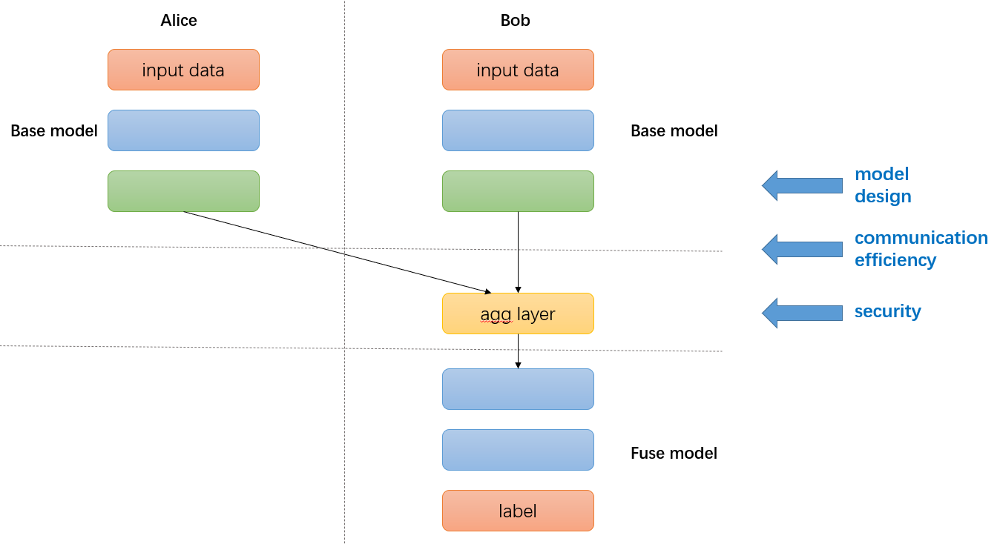

:target{#splitrec-when-split-learning-in-secretflow-meets-recommandation-system}

# SplitRec：当拆分学习遇上推荐系统

SplitRec是隐语拆分学习针对跨域推荐场景中的模型训练所提供的一系列优化算法和策略。

在传统推荐场景中，用户的数据通常需要上传到中央服务器进行模型训练。而跨域推荐场景是指联合分布在不同域的数据进行分布式训练的推荐场景。例如一个用户在一个短视频平台看了很多短视频，在另一个电商平台被推荐相关的广告，电商平台除了自有数据外，也希望从短视频平台的数据中挖掘相关的信息。同时出于数据安全考虑，各平台数据不能被上传到中央服务器进行集中式的机器学习训练，这种联合分布在不同域的数据进行模型训练的场景很适合用联邦学习中的拆分学习。

我们在隐语中提供了拆分学习的基础框架：每一个参与方拥有模型结构的一部分，所有参与方的模型合在一起形成一个完整的模型。训练过程中，不同参与方只对本地模型进行正向或者反向传播计算，并将计算结果传递给下一个参与方。多个参与方通过联合模型进行训练直至最终收敛。详情请查看 [拆分学习](../split_learning.mdx)。

另一个拆分学习的经典案例是银行的市场营销。市场营销是银行业在不断变化的市场环境中，为满足客户需要、实现经营目标的整体性经营和销售的活动。不同银行和机构可能持有相同用户的不同特征，银行希望利用其他机构的用户特征，为营销模型提供更多信息。我们在 [拆分学习：银行营销](../../../../tutorial/Split_Learning_for_bank_marketing.mdx) 中提供了使用隐语拆分学习框架来训练银行营销模型的示例。

跨域推荐模型将不同域的用户数据联合起来建模，相比传统推荐系统收集到的数据更多更丰富，同时由于数据分布在不同域，在精度、效率和安全性上都对模型的训练提出了很多挑战，主要有以下三点：

- 模型效果上，例如DeepFM等复杂模型能否直接放到拆分框架中使用？
- 训练效率上，模型训练中每个 batch 的前反向计算中的通信是否会严重降低训练效率？
- 安全性上，通信的中间数据是否会造成信息泄露，引起安全性问题？

SplitRec 在效果、效率和安全方面对拆分模型训练做了很多优化。您可以参考以下文档使用我们的优化算法和策略。

:target{#effectiveness}

## 效果

SplitRec 提供了拆分 DeepFM、BST、MMoe 等模型的封装。

<SphinxDesign type="grid-container">
  <SphinxDesign type="grid-row">
    <SphinxDesign type="grid-item">
      <SphinxDesign type="card" href="effectiveness/sl_rec_deepfm">
        <SphinxDesign type="card-body">
          <SphinxDesign type="card-title">
            DeepFM (Tensorflow)
          </SphinxDesign>

          > SplitRec 提供了拆分版本的 DeepFM 模型，DeepFM 结合了 FM 和深度学习的优势。
        </SphinxDesign>
      </SphinxDesign>
    </SphinxDesign>

    <SphinxDesign type="grid-item">
      <SphinxDesign type="card" href="effectiveness/BST_TF">
        <SphinxDesign type="card-body">
          <SphinxDesign type="card-title">
            BST (Tensorflow)
          </SphinxDesign>

          > SplitRec 提供了拆分版本的 Behavior Sequence Transformer 模型，BST 模型利用 Transformer 结构捕捉用户行为信息。
        </SphinxDesign>
      </SphinxDesign>
    </SphinxDesign>

    <SphinxDesign type="grid-item">
      <SphinxDesign type="card" href="effectiveness/BST_Torch">
        <SphinxDesign type="card-body">
          <SphinxDesign type="card-title">
            BST (PyTorch)
          </SphinxDesign>

          > SplitRec 提供了拆分版本的 Behavior Sequence Transformer 模型，BST 模型利用 Transformer 结构捕捉用户行为信息。
        </SphinxDesign>
      </SphinxDesign>
    </SphinxDesign>

    <SphinxDesign type="grid-item">
      <SphinxDesign type="card" href="effectiveness/mmoe_tf">
        <SphinxDesign type="card-body">
          <SphinxDesign type="card-title">
            MMoE (Tensorflow)
          </SphinxDesign>

          > SplitRec 提供了拆分版本的 Multi-gate Mixture-of-Experts 模型，MMoE 模型是推荐领域经典的多任务模型。
        </SphinxDesign>
      </SphinxDesign>
    </SphinxDesign>
  </SphinxDesign>
</SphinxDesign>

:target{#efficiency}

## 效率

SplitRec 借由隐语拆分学习框架的能力，提供了压缩、流水并行等策略来提升训练效率。

<SphinxDesign type="grid-container">
  <SphinxDesign type="grid-row">
    <SphinxDesign type="grid-item">
      <SphinxDesign type="card" href="efficiency/sl_compressor">
        <SphinxDesign type="card-body">
          <SphinxDesign type="card-title">
            Compression
          </SphinxDesign>

          > SplitRec 提供了量化、稀疏化、混合压缩策略来降低通信量。
        </SphinxDesign>
      </SphinxDesign>
    </SphinxDesign>

    <SphinxDesign type="grid-item">
      <SphinxDesign type="card" href="efficiency/sl_compressor">
        <SphinxDesign type="card-body">
          <SphinxDesign type="card-title">
            Pipeline Parallel
          </SphinxDesign>

          > SplitRec 提供了流水线并行来使计算和通信并行，加速训练。
        </SphinxDesign>
      </SphinxDesign>
    </SphinxDesign>
  </SphinxDesign>
</SphinxDesign>

:target{#security}

## 安全

SplitRec提供了安全聚合、差分隐私等安全策略。同时也提供了一些针对拆分学习的攻击方法，来验证不同攻击手段对拆分模型的影响，后续也会更新相关防御方法。

<SphinxDesign type="grid-container">
  <SphinxDesign type="grid-row">
    <SphinxDesign type="grid-item">
      <SphinxDesign type="card" href="security/feature_inference_attack">
        <SphinxDesign type="card-body">
          <SphinxDesign type="card-title">
            Feature Inference Attack
          </SphinxDesign>

          > SplitRec 提供了拆分学习中的特征推理攻击算法。
        </SphinxDesign>
      </SphinxDesign>
    </SphinxDesign>

    <SphinxDesign type="grid-item">
      <SphinxDesign type="card" href="security/label_inference_attack">
        <SphinxDesign type="card-body">
          <SphinxDesign type="card-title">
            Label Inference Attack
          </SphinxDesign>

          > SplitRec 提供了拆分学习中的标签推理攻击算法。
        </SphinxDesign>
      </SphinxDesign>
    </SphinxDesign>
  </SphinxDesign>
</SphinxDesign>

<TableOfContents />
