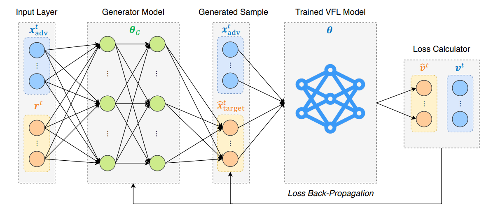
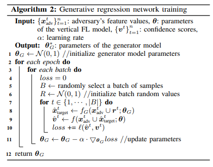
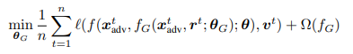

:target{#SplitRec：在隐语拆分学习中使用-FeatureInferenceAttack}

# SplitRec：在隐语拆分学习中使用 FeatureInferenceAttack

在联邦学习中，攻击者可以通过监听训练模型过程中传输的数值和梯度信息，攻击对方模型或数据，在一定程度上推理出有用信息，造成信息泄露。

本文考虑两方拆分学习中的特征推理攻击，将介绍[《Feature Inference Attacks on Model Predictions in Vertical Federated Learning》](https://arxiv.org/abs/2010.10152)中的 GRN 攻击方法在隐语中的使用。

:target{#Feature-Inference-Attack-with-Generative-Regression-Network}

## Feature Inference Attack with Generative Regression Network

特征推理攻击中，有标签的一方作为攻击方，推测对方的特征。在联邦模型训练之后，GRN 攻击方法通过一个生成回归网络（Generator Model）预测对方特征，并通过不断缩小预测特征在联邦模型的输出值和真实联邦模型输出值的差距，训练 Genertor Model，因而可以预测对方特征，如下图所示。



其中 Generator Model 具体训练步骤如下：

1. 将攻击方特征（蓝色）和随机生成的数据（橙色）输入到 Generator Model 中，输出值作为预测的对方特征
2. 将攻击方特征和预测的对方特征输入已经训完的联邦模型中，计算 logit 输出
3. 利用步骤 2 中输出的 logit 与真实 logit（攻击方特征和对方真实特征输入联邦模型计算的 logit）计算损失
4. 对得到的损失进行反向传播，更新 Generator Model 参数

算法伪代码如下：



loss 函数定义如下：

:target{#隐语中的攻击方法实现}

## 隐语中的攻击方法实现

在隐语中攻击方法的实现是通过 callback 机制来完成。攻击算法基类 CallBack 位于 secretflow/ml/nn/sl/backend/torch/callback.py，我们在联邦模型训练的以下几个节点提供 hook，不同攻击方法可以通过将攻击算法实现在对应节点的 hook， 使攻击逻辑注入到联邦模型的训练过程中。

- on\_train\_begin
- on\_train\_end
- on\_epoch\_begin
- on\_epoch\_end
- on\_batch\_begin
- on\_batch\_end

用户如果需要实现自定义的攻击方法，需要

1. 定义 CustomAttacker 继承基类 Callback，将攻击逻辑实现到对应的 hook 函数中
2. 定义 attacker\_builder 函数将构建 attacker 写到其中
3. 与普通 Split Learning 模型训练一样定义 sl\_model, 并在调用 sl\_model.fit() 时，将 callback\_dict \{party -> attacker\_builder} 传入 callbacks 参数即可

其中步骤 1 可以参考隐语中已有的 FeatureInferenceAttacker/LabelInferenceAttacker，步骤 2 和 3 可参考下面 FeatureInferenceAttacker 的使用方式。

:target{#Feature-Inferece-Attack-的隐语封装}

## Feature Inferece Attack 的隐语封装

我们在隐语中提供了多种攻击方法的封装。对于论文中的攻击方法，我们提供了 FeatureInferenceAttacker 封装，具体使用可以参考以下代码。

首先和一般 Split Learning 模型训练一样，我们将进行数据处理，并定义一个 SLModel。

然后定义调用 FeatureInferenceAttacker 的 attacker\_builder，并在 SLModel fit 时将 attacker\_builder 传入进行训练和攻击。

:target{#环境设置}

## 环境设置

<Notebook.Cell>
  <Notebook.CodeArea prompt="[1]:" stderr={false} type="input">
    ```python
    import secretflow as sf

    # Check the version of your SecretFlow
    print('The version of SecretFlow: {}'.format(sf.__version__))

    # In case you have a running secretflow runtime already.
    sf.shutdown()
    sf.init(['alice', 'bob'], address="local")
    alice, bob = sf.PYU('alice'), sf.PYU('bob')
    device_y = alice
    ```
  </Notebook.CodeArea>

  <Notebook.CodeArea prompt="" stderr={false} type="output">
    <pre>
      {"The version of SecretFlow: 1.1.0.dev20230926\n"}
    </pre>
  </Notebook.CodeArea>
</Notebook.Cell>

:target{#数据集介绍}

## 数据集介绍

这里我们使用 UCI Sensorless Drive Diagnosis 数据集，该数据集有 48 维特征 11 分类。

这里我们对数据进行纵向切分，攻击方持有 28 维特征和 label，被攻击方持有 20 维特征。

[数据集官网](http://archive.ics.uci.edu/dataset/325/dataset+for+sensorless+drive+diagnosis)

这里可以下载论文代码数据集： [drive\_cleaned.csv](https://raw.githubusercontent.com/xinjianluo/featureinference-vfl/master/datasets/drive_cleaned.csv)

或直接使用我们提供的 demo 数据 drive\_cleaned\_demo.csv

:target{#准备数据}

## 准备数据

<Notebook.Cell>
  <Notebook.CodeArea prompt="[2]:" stderr={false} type="input">
    ```python
    import numpy as np
    from secretflow.data.ndarray import FedNdarray, PartitionWay
    from secretflow.utils.simulation.datasets import _DATASETS, get_dataset


    def prepare_data():
        data_path = get_dataset(_DATASETS['drive_cleaned'])
        full_data_table = np.genfromtxt(data_path, delimiter=',')
        samples = full_data_table[:, :-1].astype(np.float32)
        labels = full_data_table[:, -1].astype(np.int64)

        # permuate columns
        batch, columns = samples.shape
        permu_cols = np.random.permutation(columns)
        samples = samples[:, permu_cols]

        # normalize feature
        fea_min = samples.min(axis=0)
        fea_max = samples.max(axis=0)
        samples = (samples - fea_min) / (fea_max - fea_min)
        mean_attr = samples.mean(axis=0)

        # split train, test, pred
        random_selection = np.random.rand(samples.shape[0]) <= 0.6
        train_sample = samples[random_selection]
        train_label = labels[random_selection]
        sample_left = samples[~random_selection]
        label_left = labels[~random_selection]

        random_selection = np.random.rand(sample_left.shape[0]) <= 0.5
        test_sample = sample_left[random_selection]
        test_label = label_left[random_selection]
        pred_sample = sample_left[~random_selection]
        pred_label = label_left[~random_selection]

        return (
            train_sample,
            train_label,
            test_sample,
            test_label,
            pred_sample,
            pred_label,
            mean_attr,
        )


    (
        train_fea,
        train_label,
        test_fea,
        test_label,
        pred_fea,
        pred_label,
        mean_attr,
    ) = prepare_data()

    bob_mean = mean_attr[28:]

    fed_data = FedNdarray(
        partitions={
            alice: alice(lambda x: x[:, :28])(train_fea),
            bob: bob(lambda x: x[:, 28:])(train_fea),
        },
        partition_way=PartitionWay.VERTICAL,
    )
    test_fed_data = FedNdarray(
        partitions={
            alice: alice(lambda x: x[:, :28])(test_fea),
            bob: bob(lambda x: x[:, 28:])(test_fea),
        },
        partition_way=PartitionWay.VERTICAL,
    )
    test_data_label = device_y(lambda x: x)(test_label)

    label = device_y(lambda x: x)(train_label)
    ```
  </Notebook.CodeArea>
</Notebook.Cell>

:target{#定义-SL-模型结构}

## 定义 SL 模型结构

<Notebook.Cell>
  <Notebook.CodeArea prompt="[3]:" stderr={false} type="input">
    ```python
    import torch
    import torch.nn as nn
    from secretflow.ml.nn.utils import BaseModule


    class SLBaseNet(BaseModule):
        def __init__(self):
            super(SLBaseNet, self).__init__()
            self.linear = nn.Linear(10, 10)

        def forward(self, x):
            y = x
            return y

        def output_num(self):
            return 1


    class SLFuseModel(BaseModule):
        def __init__(self, input_dim=48, output_dim=11):
            super(SLFuseModel, self).__init__()
            torch.manual_seed(1234)
            self.dense = nn.Sequential(
                nn.Linear(input_dim, 600),
                nn.ReLU(),
                nn.Linear(600, 300),
                nn.ReLU(),
                nn.Linear(300, 100),
                nn.ReLU(),
                nn.Linear(100, output_dim),
            )

        def forward(self, x):
            x = torch.cat(x, dim=1)
            return self.dense(x)
    ```
  </Notebook.CodeArea>
</Notebook.Cell>

:target{#定义-SL-Model}

## 定义 SL Model

<Notebook.Cell>
  <Notebook.CodeArea prompt="[4]:" stderr={false} type="input">
    ```python
    import torch.optim as optim
    from torchmetrics import Accuracy, Precision
    from secretflow.ml.nn.fl.utils import metric_wrapper, optim_wrapper
    from secretflow.ml.nn import SLModel
    from secretflow.ml.nn.utils import TorchModel


    loss_fn = nn.CrossEntropyLoss
    optim_fn = optim_wrapper(torch.optim.Adam)
    base_model = TorchModel(
        model_fn=SLBaseNet,
        loss_fn=loss_fn,
        optim_fn=optim_fn,
        metrics=[
            metric_wrapper(Accuracy, task="multiclass", num_classes=11, average='micro'),
            metric_wrapper(Precision, task="multiclass", num_classes=11, average='micro'),
        ],
    )

    fuse_model = TorchModel(
        model_fn=SLFuseModel,
        loss_fn=loss_fn,
        optim_fn=optim_fn,
        metrics=[
            metric_wrapper(Accuracy, task="multiclass", num_classes=11, average='micro'),
            metric_wrapper(Precision, task="multiclass", num_classes=11, average='micro'),
        ],
    )

    base_model_dict = {
        alice: base_model,
        bob: base_model,
    }

    sl_model = SLModel(
        base_model_dict=base_model_dict,
        device_y=device_y,
        model_fuse=fuse_model,
        dp_strategy_dict=None,
        compressor=None,
        simulation=True,
        random_seed=1234,
        backend='torch',
        strategy='split_nn',
    )
    ```
  </Notebook.CodeArea>
</Notebook.Cell>

:target{#定义-attacker_builder}

## 定义 attacker\_builder

:target{#定义-FeatureInferenceAttacker-中的-Generator-Model}

### 定义 FeatureInferenceAttacker 中的 Generator Model

<Notebook.Cell>
  <Notebook.CodeArea prompt="[5]:" stderr={false} type="input">
    ```python
    class Generator(nn.Module):
        def __init__(self, latent_dim=48, target_dim=20):
            super().__init__()
            self.net = nn.Sequential(
                nn.Linear(latent_dim, 600),
                nn.LayerNorm(600),
                nn.ReLU(),
                nn.Linear(600, 200),
                nn.LayerNorm(200),
                nn.ReLU(),
                nn.Linear(200, 100),
                nn.LayerNorm(100),
                nn.ReLU(),
                nn.Linear(100, target_dim),
                nn.Sigmoid(),
            )

        def forward(self, x):
            return self.net(x)
    ```
  </Notebook.CodeArea>
</Notebook.Cell>

:target{#定义-FeatureInferenceAttacker-中的-data_builder}

### 定义 FeatureInferenceAttacker 中的 data\_builder

<Notebook.Cell>
  <Notebook.CodeArea prompt="[6]:" stderr={false} type="input">
    ```python
    from torch.utils.data import Dataset, DataLoader, TensorDataset


    def data_builder(data, label, batch_size):
        def prepare_data():
            alice_data = data[:, :28]
            bob_data = data[:, 28:]

            alice_dataset = TensorDataset(torch.tensor(alice_data))
            alice_dataloader = DataLoader(
                dataset=alice_dataset,
                shuffle=False,
                batch_size=batch_size,
            )

            bob_dataset = TensorDataset(torch.tensor(bob_data))
            bob_dataloader = DataLoader(
                dataset=bob_dataset,
                shuffle=False,
                batch_size=batch_size,
            )

            dataloader_dict = {'alice': alice_dataloader, 'bob': bob_dataloader}
            return dataloader_dict, dataloader_dict

        return prepare_data
    ```
  </Notebook.CodeArea>
</Notebook.Cell>

:target{#id5}

### 定义 attacker\_builder

这里 attacker\_builder 是一个字典，其元素是参与方和对应的 attacker\_builder\_function，通常只需要填充攻击方和对应的 attacker\_builder\_function。

由于本文中的特征攻击算法需要对方 base 模型参数，这里我们通过被攻击方在训练结束时将 base 模型保存到磁盘，攻击方从磁盘对应路径加载模型得到对应 base 模型来实现，因而这里双方都有对应的 attacker\_builder。

<Notebook.Cell>
  <Notebook.CodeArea prompt="[7]:" stderr={false} type="input">
    ```python
    from secretflow.ml.nn.sl.attacks.fia_torch import (
        FeatureInferenceAttack,
        # SaveModelCallback,
    )


    def create_attacker_builder(
        model_save_path, bob_mean, pred_data, pred_label, batch_size, save_model_path
    ):
        def attacker_builder():
            victim_model_dict = {
                'bob': [SLBaseNet, model_save_path],
            }
            optim_fn = optim_wrapper(optim.Adam, lr=0.0001)
            generator_model = TorchModel(
                model_fn=Generator,
                loss_fn=None,
                optim_fn=optim_fn,
                metrics=None,
            )

            data_buil = data_builder(pred_data, pred_label, batch_size)

            attacker = FeatureInferenceAttack(
                victim_model_dict=victim_model_dict,
                base_model_list=['alice', 'bob'],
                attack_party='alice',
                generator_model_wrapper=generator_model,
                data_builder=data_buil,
                victim_fea_dim=20,
                attacker_fea_dim=28,
                enable_mean=True,
                enable_var=True,
                victim_mean_feature=bob_mean,
                save_model_path=save_model_path,
            )
            return attacker

        return attacker_builder


    # in Algorithm 2 line 9, attacker will inference v_hat so attacker should get the whole federated model(which maybe unrealistic)
    # victim bob will call this callback_builder to save base model first, then attacker alice loads this victim's model from the same path
    # def create_victim_callback_builder(model_save_path):
    #     def builder():
    #         cb = SaveModelCallback(model_save_path)
    #         return cb

    #     return builder


    batch_size = 64
    import os
    import shutil

    fia_path = './model_saved'
    if os.path.exists(fia_path):
        shutil.rmtree(fia_path)
    os.mkdir(fia_path)
    model_save_path = fia_path + '/sl_model_victim'
    generator_save_path = fia_path + '/generator'

    # callback_dict = {
    #     alice: create_attacker_builder(
    #         model_save_path,
    #         bob_mean,
    #         pred_fea,
    #         pred_label,
    #         batch_size,
    #         generator_save_path,
    #     ),
    #     bob: create_victim_callback_builder(model_save_path),
    # }
    ```
  </Notebook.CodeArea>
</Notebook.Cell>

:target{#开始训练和攻击}

## 开始训练和攻击

<Notebook.Cell>
  <Notebook.CodeArea prompt="[8]:" stderr={false} type="input">
    ```python
    sl_model.fit(
        fed_data,
        label,
        validation_data=(test_fed_data, test_data_label),
        epochs=1,
        batch_size=batch_size,
        shuffle=False,
        random_seed=1234,
        dataset_builder=None,
        # callbacks=callback_dict, # 暂时注释掉，callback完成后恢复 @caibei
    )
    ```
  </Notebook.CodeArea>

  <Notebook.CodeArea prompt="[8]:" stderr={false} type="output">
    <pre>
      {"{'train_loss': [array(1.7143239, dtype=float32)],\n 'train_MulticlassAccuracy': [tensor(0.7785)],\n 'train_MulticlassPrecision': [tensor(0.7785)],\n 'val_val_loss': [array(1.5049392, dtype=float32)],\n 'val_MulticlassAccuracy': [tensor(1.)],\n 'val_MulticlassPrecision': [tensor(1.)]}\n"}
    </pre>
  </Notebook.CodeArea>
</Notebook.Cell>

:target{#总结}

## 总结

本文通过 UCI Sensorless Drive Diagnosis 数据集上的特征攻击任务来演示了如何通过隐语来使用 FeatureInferenceAttack。

您可以：

1. 下载并拆分数据集，准备训练、攻击使用的数据
2. 定义拆分模型结构及 SL Model
3. 定义 attacker\_builder，在其中定义攻击需要的 data\_builder 和 FeatureInfereceAttacker
4. 调用 SL Model 进行训练攻击

您可以在自己的数据集上进行尝试，如有任何问题，可以在 github 进行训练即可。
