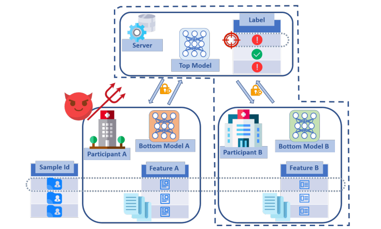
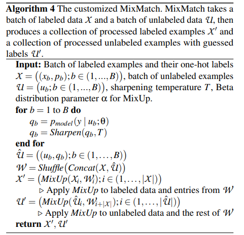
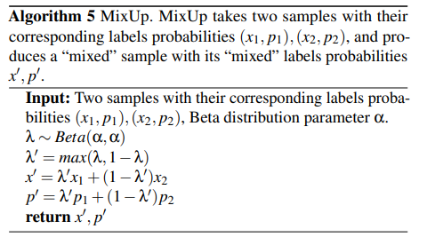
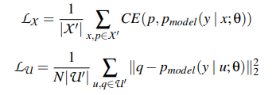
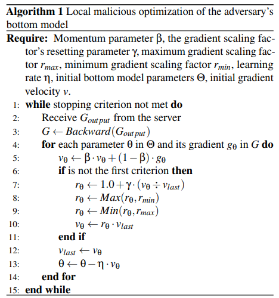

:target{#SplitRec：在隐语拆分学习中使用-LabelInferenceAttack}

# SplitRec：在隐语拆分学习中使用 LabelInferenceAttack

在联邦学习中，攻击者可以通过监听训练模型过程中传输的数值和梯度信息，攻击对方模型或数据，在一定程度上推理出有用信息，造成信息泄露。

本文考虑两方拆分学习中的标签推理攻击，将介绍论文[《Label Inference Attacks Against Vertical Federated Learning》](https://www.usenix.org/system/files/sec22summer_fu.pdf)中的攻击方法在隐语中的使用。

:target{#Label-Inference-Attack-Against-Vertical-Federated-Learning}

## Label Inference Attack Against Vertical Federated Learning

论文中提出纵向联邦场景下主动和被动两种标签推理攻击方法，攻击方推测对方的样本标签造成信息泄露。

:target{#Passive-Label-Inference-Attack-through-Model-Completion}

### Passive Label Inference Attack through Model Completion

被动的标签推理攻击发生在联邦模型训练之后，攻击模型推断对方标签，联邦模型训练期间不会受到干扰。

攻击模型在本地 bottom 模型（SL Model 中的 base 模型）基础上增加 top 模型使其可以预测标签。

攻击模型利用少量带标签的辅助数据和大量无标签数据，使用改进的半监督学习算法 MixMatch 进行训练。MixMatch 通过对少量标记数据和未标记数据进行数据增广，分别计算两者的损失，整体损失是两者的加权。具体改进的 MixMatch 算法如下

<LineBlock>
  

  
</LineBlock>

其中 loss 的计算公式如下

:target{#Active-Label-Inference-Attack-with-the-Malicious-Local-Optimizer}

### Active Label Inference Attack with the Malicious Local Optimizer

在 Passive Label Inference Attack 基础上，恶意的攻击者可以通过使用自适应优化器扩大学习率，使 top 模型更多依赖自己的 bottom 模型，进而提高攻击的效果。

恶意优化算法如下

:target{#隐语中的攻击方法实现}

## 隐语中的攻击方法实现

在隐语中攻击方法的实现是通过 callback 机制来完成。攻击算法基类 CallBack 位于 secretflow/ml/nn/sl/backend/torch/callback.py，我们在联邦模型训练的以下几个节点提供 hook，不同攻击方法可以通过将攻击算法实现在对应节点的 hook， 使攻击逻辑注入到联邦模型的训练过程中。

- on\_train\_begin
- on\_train\_end
- on\_epoch\_begin
- on\_epoch\_end
- on\_batch\_begin
- on\_batch\_end

用户如果需要实现自定义的攻击方法，需要

1. 定义 CustomAttacker 继承基类 Callback，将攻击逻辑实现到对应的 hook 函数中
2. 定义 attacker\_builder 函数将构建 attacker 写到其中
3. 与普通 Split Learning 模型训练一样定义 sl\_model, 并在调用 sl\_model.fit() 时，将 callback\_dict \{party -> attacker\_builder} 传入 callbacks 参数即可

其中步骤 1 可以参考隐语中已有的 FeatureInferenceAttacker/LabelInferenceAttacker，步骤 2 和 3 可参考下面 LeatureInferenceAttacker 的使用方式。

:target{#Label-Inferece-Attack-的隐语封装}

## Label Inferece Attack 的隐语封装

我们在隐语中提供了多种攻击方法的封装。对于论文中的攻击方法，我们提供了 LabelInferenceAttacker 封装，具体使用可以参考以下代码。

首先和一般 Split Learning 模型训练一样，我们将进行数据处理，并定义一个 SLModel。

然后定义调用 LeatureInferenceAttacker 的 attacker\_builder，并在 SLModel fit 时将 attacker\_builder 传入进行训练和攻击。

:target{#环境设置}

## 环境设置

<Notebook.Cell>
  <Notebook.CodeArea prompt="[1]:" stderr={false} type="input">
    ```python
    import secretflow as sf

    # Check the version of your SecretFlow
    print('The version of SecretFlow: {}'.format(sf.__version__))

    # In case you have a running secretflow runtime already.
    sf.shutdown()
    sf.init(['alice', 'bob'], address="local")
    alice, bob = sf.PYU('alice'), sf.PYU('bob')
    device_y = bob
    ```
  </Notebook.CodeArea>

  <Notebook.CodeArea prompt="" stderr={false} type="output">
    <pre>
      {"The version of SecretFlow: 1.1.0.dev20230926\n"}
    </pre>
  </Notebook.CodeArea>
</Notebook.Cell>

:target{#数据集介绍}

## 数据集介绍

这里我们使用经典图像数据集 Cifar10。

这里我们对数据进行拆分，拆分模型两方各持有半张图片，攻击方不持有标签。

[数据集官网](https://www.cs.toronto.edu/~kriz/cifar.html)

:target{#准备训练数据}

## 准备训练数据

<Notebook.Cell>
  <Notebook.CodeArea prompt="[2]:" stderr={false} type="input">
    ```python
    from torch.utils.data import DataLoader
    from torchvision import datasets, transforms
    import numpy as np
    from secretflow.data.ndarray import FedNdarray, PartitionWay

    data_file_path = './data_download'
    batch_size = 128
    train_dataset = datasets.CIFAR10(
        data_file_path, True, transform=transforms.ToTensor(), download=True
    )
    train_loader = DataLoader(dataset=train_dataset, batch_size=batch_size, shuffle=False)

    train_np = np.array(train_loader.dataset)
    train_data = np.array([t[0].numpy() for t in train_np])
    train_label = np.array([t[1] for t in train_np])

    fed_data = FedNdarray(
        partitions={
            alice: alice(lambda x: x[:, :, :, 0:16])(train_data),
            bob: bob(lambda x: x[:, :, :, 16:32])(train_data),
        },
        partition_way=PartitionWay.VERTICAL,
    )
    # party bob hold label
    label = bob(lambda x: x)(train_label)
    ```
  </Notebook.CodeArea>

  <Notebook.CodeArea prompt="" stderr={false} type="output">
    <pre>
      {"Downloading https://www.cs.toronto.edu/~kriz/cifar-10-python.tar.gz to ./data_download/cifar-10-python.tar.gz\n"}
    </pre>
  </Notebook.CodeArea>

  <Notebook.CodeArea prompt="" stderr={false} type="output">
    <pre>
      {"Extracting ./data_download/cifar-10-python.tar.gz to ./data_download\n"}
    </pre>
  </Notebook.CodeArea>
</Notebook.Cell>

:target{#定义SLModel的模型结构}

## 定义SLModel的模型结构

<Notebook.Cell>
  <Notebook.CodeArea prompt="[3]:" stderr={false} type="input">
    ```python
    import torch
    import torch.nn as nn
    import torch.nn.functional as F
    import torch.nn.init as init


    def weights_init(m):
        if isinstance(m, nn.Linear) or isinstance(m, nn.Conv2d):
            init.kaiming_normal_(m.weight)


    class LambdaLayer(nn.Module):
        def __init__(self, lambd):
            super(LambdaLayer, self).__init__()
            self.lambd = lambd

        def forward(self, x):
            return self.lambd(x)


    class BasicBlock(nn.Module):
        expansion = 1

        def __init__(self, in_planes, planes, kernel_size, stride=1, option='A'):
            super(BasicBlock, self).__init__()
            self.conv1 = nn.Conv2d(
                in_planes,
                planes,
                kernel_size=kernel_size,
                stride=stride,
                padding=1,
                bias=False,
            )
            self.bn1 = nn.BatchNorm2d(planes)
            self.conv2 = nn.Conv2d(
                planes, planes, kernel_size=kernel_size, stride=1, padding=1, bias=False
            )
            self.bn2 = nn.BatchNorm2d(planes)

            self.shortcut = nn.Sequential()
            if stride != 1 or in_planes != planes:
                if option == 'A':
                    """
                    For CIFAR10 ResNet paper uses option A.
                    """
                    self.shortcut = LambdaLayer(
                        lambda x: F.pad(
                            x[:, :, ::2, ::2],
                            (0, 0, 0, 0, planes // 4, planes // 4),
                            "constant",
                            0,
                        )
                    )
                elif option == 'B':
                    self.shortcut = nn.Sequential(
                        nn.Conv2d(
                            in_planes,
                            self.expansion * planes,
                            kernel_size=1,
                            stride=stride,
                            bias=False,
                        ),
                        nn.BatchNorm2d(self.expansion * planes),
                    )

        def forward(self, x):
            out = F.relu(self.bn1(self.conv1(x)))
            out = self.bn2(self.conv2(out))
            out += self.shortcut(x)
            out = F.relu(out)
            return out


    class ResNet(nn.Module):
        def __init__(self, block, num_blocks, kernel_size, num_classes):
            super(ResNet, self).__init__()
            self.in_planes = 16

            self.conv1 = nn.Conv2d(
                3, 16, kernel_size=kernel_size, stride=1, padding=1, bias=False
            )
            self.bn1 = nn.BatchNorm2d(16)
            self.layer1 = self._make_layer(block, 16, num_blocks[0], kernel_size, stride=1)
            self.layer2 = self._make_layer(block, 32, num_blocks[1], kernel_size, stride=2)
            self.layer3 = self._make_layer(block, 64, num_blocks[2], kernel_size, stride=2)
            self.linear = nn.Linear(64, num_classes, bias=False)

            self.apply(weights_init)

        def _make_layer(self, block, planes, num_blocks, kernel_size, stride):
            strides = [stride] + [1] * (num_blocks - 1)
            layers = []
            for stride in strides:
                layers.append(block(self.in_planes, planes, kernel_size, stride))
                self.in_planes = planes * block.expansion

            return nn.Sequential(*layers)

        def forward(self, x):
            # [bs,3,32,16]
            out = F.relu(self.bn1(self.conv1(x)))
            # [bs,16,32,16]
            out = self.layer1(out)
            # [bs,16,32,16]
            out = self.layer2(out)
            # [bs,32,16,8]
            out = self.layer3(out)
            # [bs,64,8,4]
            out = F.avg_pool2d(out, out.size()[2:])
            # [bs,64,1,1]
            out = out.view(out.size(0), -1)
            # [bs,64]
            out = self.linear(out)
            # [bs,10]
            return out


    def resnet20(kernel_size=(3, 3), num_classes=10):
        return ResNet(
            block=BasicBlock,
            num_blocks=[3, 3, 3],
            kernel_size=kernel_size,
            num_classes=num_classes,
        )


    # base model
    class BottomModelForCifar10(nn.Module):
        def __init__(self):
            super(BottomModelForCifar10, self).__init__()
            self.resnet20 = resnet20(num_classes=10)

        def forward(self, x):
            x = self.resnet20(x)
            return x

        def output_num(self):
            return 1


    # fuse model
    class TopModelForCifar10(nn.Module):
        def __init__(self):
            super(TopModelForCifar10, self).__init__()
            self.fc1top = nn.Linear(20, 20)
            self.fc2top = nn.Linear(20, 10)
            self.fc3top = nn.Linear(10, 10)
            self.fc4top = nn.Linear(10, 10)
            self.bn0top = nn.BatchNorm1d(20)
            self.bn1top = nn.BatchNorm1d(20)
            self.bn2top = nn.BatchNorm1d(10)
            self.bn3top = nn.BatchNorm1d(10)
            print('batch norm: ', self.bn0top)
            self.apply(weights_init)

        def forward(self, input_tensor):
            output_bottom_models = torch.cat(input_tensor, dim=1)
            x = output_bottom_models
            x = self.fc1top(F.relu(self.bn0top(x)))
            x = self.bn1top(x)
            x = self.fc2top(F.relu(x))
            x = self.fc3top(F.relu(self.bn2top(x)))
            x = self.fc4top(F.relu(self.bn3top(x)))
            return F.log_softmax(x, dim=1)
    ```
  </Notebook.CodeArea>
</Notebook.Cell>

:target{#定义SLModel}

## 定义SLModel

<Notebook.Cell>
  <Notebook.CodeArea prompt="[4]:" stderr={false} type="input">
    ```python
    import torch.optim as optim
    from secretflow.ml.nn.utils import TorchModel
    from torchmetrics import Accuracy, Precision
    from secretflow.ml.nn import SLModel
    from secretflow.ml.nn.fl.utils import metric_wrapper, optim_wrapper


    loss_fn = nn.CrossEntropyLoss
    optim_fn = optim_wrapper(optim.SGD, lr=1e-2, momentum=0.9, weight_decay=5e-4)
    base_model = TorchModel(
        model_fn=BottomModelForCifar10,
        loss_fn=loss_fn,
        optim_fn=optim_fn,
        metrics=[
            metric_wrapper(Accuracy, task="multiclass", num_classes=10, average='micro'),
            metric_wrapper(Precision, task="multiclass", num_classes=10, average='micro'),
        ],
    )

    fuse_model = TorchModel(
        model_fn=TopModelForCifar10,
        loss_fn=loss_fn,
        optim_fn=optim_fn,
        metrics=[
            metric_wrapper(Accuracy, task="multiclass", num_classes=10, average='micro'),
            metric_wrapper(Precision, task="multiclass", num_classes=10, average='micro'),
        ],
    )

    base_model_dict = {
        alice: base_model,
        bob: base_model,
    }

    sl_model = SLModel(
        base_model_dict=base_model_dict,
        device_y=device_y,
        model_fuse=fuse_model,
        dp_strategy_dict=None,
        compressor=None,
        simulation=True,
        random_seed=1234,
        backend='torch',
        strategy='split_nn',
    )
    ```
  </Notebook.CodeArea>
</Notebook.Cell>

:target{#定义-attacker_builder}

## 定义 attacker\_builder

:target{#定义-Attacker-模型结构}

### 定义 Attacker 模型结构

这里 Attacker 模型是在原 base 模型（`BottomModelForCifar10`）基础上加一个 top 模型，这里只需定义 top 模型 `BottomModelPlus`

<Notebook.Cell>
  <Notebook.CodeArea prompt="[5]:" stderr={false} type="input">
    ```python
    import torch.nn as nn


    def weights_init_ones(m):
        if isinstance(m, nn.Linear) or isinstance(m, nn.Conv2d):
            init.ones_(m.weight)


    # for attacker
    class BottomModelPlus(nn.Module):
        def __init__(
            self,
            bottom_model,
            size_bottom_out=10,
            num_classes=10,
            num_layer=1,
            activation_func_type='ReLU',
            use_bn=True,
        ):
            super(BottomModelPlus, self).__init__()
            self.bottom_model = bottom_model

            dict_activation_func_type = {'ReLU': F.relu, 'Sigmoid': F.sigmoid, 'None': None}
            self.activation_func = dict_activation_func_type[activation_func_type]
            self.num_layer = num_layer
            self.use_bn = use_bn

            self.fc_1 = nn.Linear(size_bottom_out, size_bottom_out, bias=True)
            self.bn_1 = nn.BatchNorm1d(size_bottom_out)
            self.fc_1.apply(weights_init_ones)

            self.fc_2 = nn.Linear(size_bottom_out, size_bottom_out, bias=True)
            self.bn_2 = nn.BatchNorm1d(size_bottom_out)
            self.fc_2.apply(weights_init_ones)

            self.fc_3 = nn.Linear(size_bottom_out, size_bottom_out, bias=True)
            self.bn_3 = nn.BatchNorm1d(size_bottom_out)
            self.fc_3.apply(weights_init_ones)

            self.fc_4 = nn.Linear(size_bottom_out, size_bottom_out, bias=True)
            self.bn_4 = nn.BatchNorm1d(size_bottom_out)
            self.fc_4.apply(weights_init_ones)

            self.fc_final = nn.Linear(size_bottom_out, num_classes, bias=True)
            self.bn_final = nn.BatchNorm1d(size_bottom_out)
            self.fc_final.apply(weights_init_ones)

        def forward(self, x):
            x = self.bottom_model(x)

            if self.num_layer >= 2:
                if self.use_bn:
                    x = self.bn_1(x)
                if self.activation_func:
                    x = self.activation_func(x)
                x = self.fc_1(x)

            if self.num_layer >= 3:
                if self.use_bn:
                    x = self.bn_2(x)
                if self.activation_func:
                    x = self.activation_func(x)
                x = self.fc_2(x)

            if self.num_layer >= 4:
                if self.use_bn:
                    x = self.bn_3(x)
                if self.activation_func:
                    x = self.activation_func(x)
                x = self.fc_3(x)

            if self.num_layer >= 5:
                if self.use_bn:
                    x = self.bn_4(x)
                if self.activation_func:
                    x = self.activation_func(x)
                x = self.fc_4(x)
            if self.use_bn:
                x = self.bn_final(x)
            if self.activation_func:
                x = self.activation_func(x)
            x = self.fc_final(x)

            return x
    ```
  </Notebook.CodeArea>
</Notebook.Cell>

:target{#定义-Attacker-需要的数据}

### 定义 Attacker 需要的数据

这里标签攻击算法需要少量有标签的辅助数据集，及本身的大量无标签数据。

<Notebook.Cell>
  <Notebook.CodeArea prompt="[6]:" stderr={false} type="input">
    ```python
    import torch
    from torchvision import datasets, transforms


    class CIFAR10Labeled(datasets.CIFAR10):
        def __init__(
            self,
            root,
            indexs=None,
            train=True,
            transform=None,
            target_transform=None,
            download=False,
        ):
            super(CIFAR10Labeled, self).__init__(
                root,
                train=train,
                transform=transform,
                target_transform=target_transform,
                download=download,
            )
            if indexs is not None:
                self.data = self.data[indexs]
                self.targets = np.array(self.targets)[indexs]

        def __getitem__(self, index):
            """
            Args:
                index (int): Index

            Returns:
                tuple: (image, target) where target is index of the target class.
            """
            img, target = self.data[index], self.targets[index]

            if self.transform is not None:
                img = self.transform(img)
            img = img[:, :, :16]

            if self.target_transform is not None:
                target = self.target_transform(target)

            return img, target


    class CIFAR10Unlabeled(CIFAR10Labeled):
        def __init__(
            self,
            root,
            indexs,
            train=True,
            transform=None,
            target_transform=None,
            download=False,
        ):
            super(CIFAR10Unlabeled, self).__init__(
                root,
                indexs,
                train=train,
                transform=transform,
                target_transform=target_transform,
                download=download,
            )
            self.targets = np.array([-1 for i in range(len(self.targets))])
            self.data = self.data[:, :, :, :16]


    def label_index_split(labels, n_labeled_per_class, num_classes):
        labels = np.array(labels)
        train_labeled_idxs = []
        train_unlabeled_idxs = []

        for i in range(num_classes):
            idxs = np.where(labels == i)[0]
            np.random.shuffle(idxs)
            train_labeled_idxs.extend(idxs[:n_labeled_per_class])
            train_unlabeled_idxs.extend(idxs[n_labeled_per_class:])
        np.random.shuffle(train_labeled_idxs)
        np.random.shuffle(train_unlabeled_idxs)
        return train_labeled_idxs, train_unlabeled_idxs


    def data_builder(batch_size, file_path=None):
        def prepare_data():
            n_labeled = 40
            num_classes = 10

            def get_transforms():
                transform_ = transforms.Compose(
                    [
                        transforms.ToTensor(),
                    ]
                )
                return transform_

            transforms_ = get_transforms()

            base_dataset = datasets.CIFAR10(file_path, train=True)

            train_labeled_idxs, train_unlabeled_idxs = label_index_split(
                base_dataset.targets, int(n_labeled / num_classes), num_classes
            )
            train_labeled_dataset = CIFAR10Labeled(
                file_path, train_labeled_idxs, train=True, transform=transforms_
            )
            train_unlabeled_dataset = CIFAR10Unlabeled(
                file_path, train_unlabeled_idxs, train=True, transform=transforms_
            )
            train_complete_dataset = CIFAR10Labeled(
                file_path, None, train=True, transform=transforms_
            )
            test_dataset = CIFAR10Labeled(
                file_path, train=False, transform=transforms_, download=True
            )
            print(
                "#Labeled:",
                len(train_labeled_idxs),
                "#Unlabeled:",
                len(train_unlabeled_idxs),
            )

            # auxiliary dataset
            labeled_trainloader = torch.utils.data.DataLoader(
                train_labeled_dataset,
                batch_size=batch_size,
                shuffle=True,
                num_workers=0,
                drop_last=True,
            )
            unlabeled_trainloader = torch.utils.data.DataLoader(
                train_unlabeled_dataset,
                batch_size=batch_size,
                shuffle=False,
                num_workers=0,
                drop_last=True,
            )
            dataset_bs = batch_size * 10
            test_loader = torch.utils.data.DataLoader(
                test_dataset, batch_size=dataset_bs, shuffle=False, num_workers=0
            )
            train_complete_trainloader = torch.utils.data.DataLoader(
                train_complete_dataset,
                batch_size=dataset_bs,
                shuffle=False,
                num_workers=0,
                drop_last=True,
            )
            return (
                labeled_trainloader,
                unlabeled_trainloader,
                test_loader,
                train_complete_trainloader,
            )

        return prepare_data
    ```
  </Notebook.CodeArea>
</Notebook.Cell>

:target{#id7}

### 定义 attacker\_builder

这里 attacker\_builder 是一个字典，其元素是参与方和对应的 attacker\_builder，通常只需要填充攻击方和对应的 attacker\_builder\_function。

本文中 Label Inference Attack 只需填充攻击方 alice 和对应的 attacker\_builder\_function。

<Notebook.Cell>
  <Notebook.CodeArea prompt="[7]:" stderr={false} type="input">
    ```python
    from secretflow.ml.nn.sl.attacks.lia_torch import (
        LabelInferenceAttacker,
    )


    def create_attacker_builder(file_path, batch_size, model_save_path):
        def attacker_builder():
            def create_model(ema=False):
                bottom_model = BottomModelForCifar10()
                model = BottomModelPlus(bottom_model)

                if ema:
                    for param in model.parameters():
                        param.detach_()

                return model

            model = create_model(ema=False)
            ema_model = create_model(ema=True)

            data_buil = data_builder(batch_size=batch_size, file_path=file_path)

            attacker = LabelInferenceAttacker(
                model, ema_model, 10, data_buil, save_model_path=model_save_path
            )
            return attacker

        return attacker_builder


    callback_dict = {
        alice: create_attacker_builder(
            file_path=data_file_path, batch_size=16, model_save_path=None
        )
    }
    ```
  </Notebook.CodeArea>
</Notebook.Cell>

:target{#开始训练和攻击}

## 开始训练和攻击

<Notebook.Cell>
  <Notebook.CodeArea prompt="[8]:" stderr={false} type="input">
    ```python
    history = sl_model.fit(
        fed_data,
        label,
        validation_data=(fed_data, label),
        epochs=1,
        batch_size=128,
        shuffle=False,
        random_seed=1234,
        dataset_builder=None,
        # callbacks=callback_dict, # 暂时注释掉，callback完成后恢复 @caibei
    )
    print(history)
    ```
  </Notebook.CodeArea>

  <Notebook.CodeArea prompt="" stderr={false} type="output">
    <pre>
      <span className="ansi-cyan-fg">{"(PYUSLTorchModel pid=1866419)"}</span>{" batch norm:  BatchNorm1d(20, eps=1e-05, momentum=0.1, affine=True, track_running_stats=True)\n"}
    </pre>
  </Notebook.CodeArea>

  <Notebook.CodeArea prompt="" stderr={false} type="output">
    <pre>
      <span className="ansi-cyan-fg">{"(PYUSLTorchModel pid=1866347)"}</span>{" Files already downloaded and verified\n"}
    </pre>
  </Notebook.CodeArea>

  <Notebook.CodeArea prompt="" stderr={false} type="output">
    <pre>
      <span className="ansi-cyan-fg">{"(PYUSLTorchModel pid=1866347)"}</span>{" #Labeled: 40 #Unlabeled: 49960\n"}
    </pre>
  </Notebook.CodeArea>

  <Notebook.CodeArea prompt="" stderr={false} type="output">
    <pre>
      {"{'train_loss': [array(1.685461, dtype=float32)], 'train_MulticlassAccuracy': [tensor(0.3008)], 'train_MulticlassPrecision': [tensor(0.3008)], 'val_val_loss': [array(1.8735596, dtype=float32)], 'val_MulticlassAccuracy': [tensor(0.3600)], 'val_MulticlassPrecision': [tensor(0.3600)]}\n"}
    </pre>
  </Notebook.CodeArea>
</Notebook.Cell>

:target{#总结}

## 总结

本文通过 Cifar10 数据集上的标签推理攻击任务来演示如何通过隐语来使用 LabelInferenceAttack。

您可以：

1. 下载并拆分数据集，准备训练、攻击使用的数据
2. 定义拆分模型结构及 SL Model
3. 定义 attacker\_builder，在其中定义攻击需要的 data\_builder 和 LabelInfereceAttacker
4. 调用 SL Model 进行训练攻击

您可以在自己的数据集上进行尝试，如有任何问题，可以在 github 进行训练即可。
