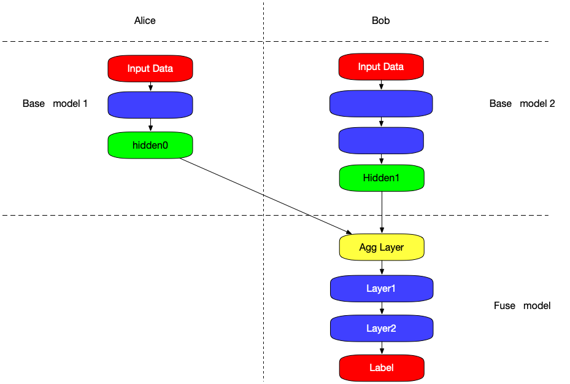

:target{#split-learning}

# 拆分学习

:target{#what-is-split-learning}

## 拆分学习的概念

拆分学习的核心思想是拆分网络结构。每一个参与方拥有模型结构的一部分，所有参与方的模型合在一起形成一个完整的模型。训练过程中，不同参与方只对本地模型进行正向或者反向传播计算，并将计算结果传递给下一个参与方。多个参与方通过联合模型进行训练直至最终收敛。

一个典型的拆分学习例子：

Alice持有数据和基础模型。Bob只有数据、基础模型和fuse模型。

1. Alice使用自己的数据和基础模型得到 <code>hidden0</code>，然后发送给Bob。
2. Bob使用自己的数据和基础模型得到 <code>hidden1</code>。
3. Agg Layer使用 <code>hidden\_0</code> 和 <code>hidden\_1</code> 作为输入，并输出聚合后的隐层。
4. Bob把聚合后的隐层作为fuse模型的输入，计算得到梯度。
5. 梯度被拆分成两部分，分别返回给Alice和Bob。
6. Alice和Bob使用各自收到的梯度更新基础模型。

:target{#split-learning-model}

## 拆分学习模型

隐语提供 <code>SLModel</code>  用来定义拆分学习模型。您可以按照教程来学习如何使用。

:target{#tutorial}

### 教程

- [拆分学习：银行营销](../../../tutorial/Split_Learning_for_bank_marketing.mdx)
- [图神经网络拆分学习](../../../tutorial/split_learning_gnn.mdx)
