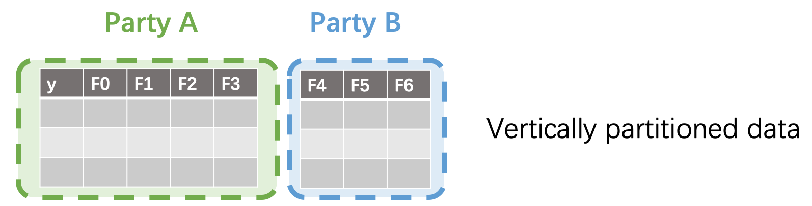
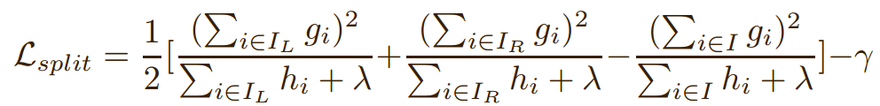
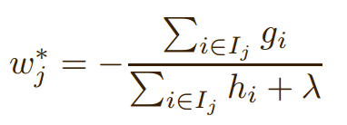
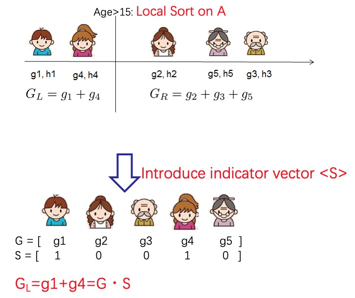

:target{#decision-trees}

# 决策树模型

SecretFlow使用多方安全计算的秘密分享技术实现了可证安全的梯度下降决策树模型 [`Xgb()`](../../source/secretflow.ml.boost.ml.boost.ss_xgb_v.mdx#secretflow.ml.boost.ss_xgb_v.model.Xgb "secretflow.ml.boost.ss_xgb_v.model.Xgb") ，目前支持线性回归问题训练和二分类问题训练。

:target{#dataset-settings}

## 数据设定

垂直划分的数据集

- 所有数据方的样本一致
- 但是拥有样本的不同特征
- 只有一方持有标签

:target{#xgboost-training-algorithm}

## XGBoost 训练算法

详细原理及推导可见 [官方文档](https://xgboost.readthedocs.io/en/stable/tutorials/model.html) 。单棵树分裂的主要过程如下：

- 预计算：根据损失函数定义、样本标签、当前预测值，计算每个样本可以求得其一阶导 <InlineMath>$g_{i}$</InlineMath> 和二阶导  <InlineMath>$h_{i}$</InlineMath>
- 结点分裂：通过枚举所有分裂方案，选出带来最优增益值的方式执行分裂。分裂方案包含分裂特征和分裂阈值，可以将当前结点样本集合 <InlineMath>$I$</InlineMath> 分裂为 左子树样本集合 <InlineMath>$I_{L}$</InlineMath> 和右子树样本集合 <InlineMath>$I_{R}$</InlineMath>， 并由如下公式计算出此分裂方案的增益值：

  

  其中：<InlineMath>$\lambda$</InlineMath> 和 <InlineMath>$\gamma$</InlineMath> 分别为叶节点数和叶节点权重的惩罚因子。
- 权重计算：由落入该结点的样本计算得到，公式如下：

  

回归问题和分类问题的训练流程是相同的，除了：

1. 损失函数的选择（回归-MSE，分类-Logloss)。
2. 分类问题需要将预测值通过sigmoid函数转化为概率。

:target{#ss-xgb-training}

## SS-XGB 训练算法

SS-XGB [`Xgb()`](../../source/secretflow.ml.boost.ml.boost.ss_xgb_v.mdx#secretflow.ml.boost.ss_xgb_v.model.Xgb "secretflow.ml.boost.ss_xgb_v.model.Xgb") 使用秘密分享计算分裂增益值和叶权重。

我们使用秘密分享协议提供的加/乘等操作来实现安全的多方联合计算。特别需要关注的问题是：如何在计算分桶加和时，不泄漏任何样本分布相关的信息。

通过引入一个密态下的向量𝑆就可以解决这个问题。



向量𝑆中标记为1的样本是被选中的样本需要加和，0相反。为了保证样本分布不泄漏，这个向量也是通过秘密分享协议保护的。在秘密分享协议的保护下，计算向量𝑆和梯度向量的内积，即可得到梯度在分桶内的累加和。

通过这个方法我们就可以保护样本的分布信息不泄漏。更多的算法细节和安全分析：[Large-Scale Secure XGB for Vertical Federated Learning](https://arxiv.org/pdf/2005.08479.pdf)

:target{#example}

## 用例

在本示例中使用单节点模式做示范。集群模式的部署方式： [Deployment](../../getting_started/deployment.html.mdx)

API详情：[`Xgb()`](../../source/secretflow.ml.boost.ml.boost.ss_xgb_v.mdx#secretflow.ml.boost.ss_xgb_v.model.Xgb "secretflow.ml.boost.ss_xgb_v.model.Xgb")

```python
import sys
import time
import logging

import secretflow as sf
from secretflow.ml.boost.ss_xgb_v import Xgb
from secretflow.device.driver import wait, reveal
from secretflow.data import FedNdarray, PartitionWay
from secretflow.data.split import train_test_split
import numpy as np
from sklearn.metrics import roc_auc_score
from sklearn.metrics import accuracy_score, classification_report


# init log
logging.basicConfig(stream=sys.stdout, level=logging.INFO)

# init all nodes in local Standalone Mode.
sf.init(['alice', 'bob', 'carol'], address='local')

# init PYU, the Python Processing Unit, process plaintext in each node.
alice = sf.PYU('alice')
bob = sf.PYU('bob')
carol = sf.PYU('carol')

# init SPU, the Secure Processing Unit,
#           process ciphertext under the protection of a multi-party secure computing protocol
spu = sf.SPU(sf.utils.testing.cluster_def(['alice', 'bob', 'carol']))

# read data in each party
def read_x(start, end):
    from sklearn.datasets import load_breast_cancer
    x = load_breast_cancer()['data']
    return x[:, start:end]

def read_y():
    from sklearn.datasets import load_breast_cancer
    return load_breast_cancer()['target']

# alice / bob / carol each hold one third of the features of the data
v_data = FedNdarray(
    partitions={
        alice: alice(read_x)(0, 10),
        bob: bob(read_x)(10, 20),
        carol: carol(read_x)(20, 30),
    },
    partition_way=PartitionWay.VERTICAL,
)
# Y label belongs to alice
label_data = FedNdarray(
    partitions={alice: alice(read_y)()},
    partition_way=PartitionWay.VERTICAL,
)
# wait IO finished
wait([p.data for p in v_data.partitions.values()])
wait([p.data for p in label_data.partitions.values()])
# split train data and test date
random_state = 1234
split_factor = 0.8
v_train_data, v_test_data = train_test_split(v_data, train_size=split_factor, random_state=random_state)
v_train_label, v_test_label= train_test_split(label_data, train_size=split_factor, random_state=random_state)
# run SS-XGB
xgb = Xgb(spu)
start = time.time()
params = {
    # for more detail, see Xgb API doc
    'num_boost_round': 5,
    'max_depth': 5,
    'learning_rate': 0.1,
    'sketch_eps': 0.08,
    'objective': 'logistic',
    'reg_lambda': 0.1,
    'subsample': 1,
    'colsample_by_tree': 1,
    'base_score': 0.5,
}
model = xgb.train(params, v_train_data,v_train_label)
logging.info(f"train time: {time.time() - start}")

# Do predict
start = time.time()
# Now the result is saved in the spu by ciphertext
spu_yhat = model.predict(v_test_data)
# reveal for auc, acc and classification report test.
yhat = reveal(spu_yhat)
logging.info(f"predict time: {time.time() - start}")
y = reveal(v_test_label.partitions[alice])
# get the area under curve(auc) score of classification
logging.info(f"auc: {roc_auc_score(y, yhat)}")
binary_class_results = np.where(yhat>0.5, 1, 0)
# get the accuracy score of classification
logging.info(f"acc: {accuracy_score(y, binary_class_results)}")
# get the report of classification
print("classification report:")
print(classification_report(y, binary_class_results))
```
