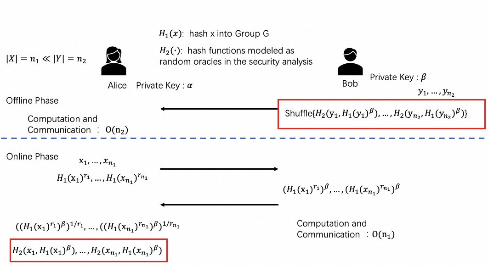

:target{#private-set-intersection-psi}

# 隐私集合求交

SecretFlow SPU 实现了下面的PSI(Private Set Intersection)协议:

- Semi-honest ECDH-based two-party PSI protocol :target{#id1}[\[HFH99\]](#hfh99)
- Semi-honest ECDH-based three-party PSI protocol
- Semi-honest OT-based two-party PSI protocol :target{#id2}[\[KKRT16\]](#kkrt16)
- Semi-honest PCG/VOLE-based two-party PSI protocol (with improved communication efficiency) :target{#id3}[\[BC22\]](#bc22)
- Semi-honest EC-OPRF based two-party Unbalanced PSI protocol
- Differentially Private (DP) PSI Protocol :target{#id4}[\[DP-PSI\]](#dp-psi)

一般情况下, OT-based PSI比Diffie-Hellman-based PSI协议运行时间少，但通信量更大。一些场景中可能会更关注通信量。

:target{#ecdh-psi-2p}

## ECDH-PSI （两方）

半诚实模型的DH-PSI协议在 Huberman, Franklin, and Hogg :target{#id5}[\[HFH99\]](#hfh99) 中提出，但最早可以追溯到Meadows :target{#id6}[\[Mea86\]](#mea86)。DH-PSI协议对数据集中的数据进行指数(点乘)运算。

DH-PSI 协议基于判定Diffie-Hellman假设:

- 选取群 G, 和生成元 g
- 假设: 对于随机数 a,b,c 不能区分 <InlineMath>$(g^a, g^b, g^{ab})$</InlineMath> 和 <InlineMath>$(g^a, g^b, g^c)$</InlineMath>

可以选择的群包括有限域上的乘法群和椭圆曲线上的加法群。实际应用中，综合性能和安全方面比较，通常选取椭圆曲线群，例如: Curve25519 :target{#id7}[\[Ber06\]](#ber06)。

<figure>
  
</figure>

ECDH-PSI 协议开始前，Alice 和 Bob 需要对数据进行随机乱序。

协议流程:

1. Alice 对数据集中元素 <InlineMath>$x_i$</InlineMath> 进行Hash处理，并使用密钥 <InlineMath>$\alpha$</InlineMath> 进行指数运算，得到 <InlineMath>${H(x_i)}^\alpha$</InlineMath> ， Alice 发送   <InlineMath>${\{\,{H(x_i)}^\alpha\}\,}_{i=1}^{n_1}$</InlineMath> 给 Bob。
2. 接收Alice发送的数据: <InlineMath>${H(x_i)}^\alpha$</InlineMath>， Bob 使用密钥 <InlineMath>$\beta$</InlineMath> 进行指数计算，得到 <InlineMath>${H(x_i)}^{\alpha\beta}$</InlineMath>。Bob 发送 <InlineMath>${\{\,{H(x_i)}^{\alpha\beta}\}\,}_{i=1}^{n_1}$</InlineMath> 给 Alice。
3. Bob对数据集中元素  <InlineMath>$y_i$</InlineMath> 进行Hash处理，并使用密钥 <InlineMath>$\beta$</InlineMath>，进行指数运算， 得到 <InlineMath>${H(y_i)}^\beta$</InlineMath> 。 Bob发送  <InlineMath>${\,\{\,{H(y_i)}^\beta\}\,}_{i=1}^{n_2}$</InlineMath> 给 Alice。
4. 接收Bob发送的数据: <InlineMath>${H(y_i)}^\beta$</InlineMath> ，Alice 使用密钥 <InlineMath>$\alpha$</InlineMath> 进行指数运算，得到 <InlineMath>${H(y_i)}^{\beta\alpha}$</InlineMath> 。
5. Alice 比较两个集合 <InlineMath>${\{\,{H(x_i)}^{\alpha\beta}\}\,}_{i=1}^{n_1}$</InlineMath> 和  <InlineMath>${\{\,{H(y_i)}^{\beta\alpha}\}\,}_{i=1}^{n_2}$</InlineMath> ，得到交集。

隐语 SPU PSI模块支持的椭圆曲线类型包括：

<table>
  <thead>
    <tr>
      <td>
        EC group
      </td>

      <td>
        参考文献
      </td>

      <td>
        密码库
      </td>
    </tr>
  </thead>

  <tbody>
    <tr>
      <td rowSpan={2}>
        Curve25519
      </td>

      <td rowSpan={2}>
        :target{#id8}[\[Ber06\]](#ber06)
      </td>

      <td>
        [LibSoidum](https://doc.libsodium.org/)
      </td>
    </tr>

    <tr>
      <td>
        :target{#id9}[\[ipp-crypto\]](#ipp-crypto) (Intel® CPU support AVX-512 IFMA)
      </td>
    </tr>

    <tr>
      <td>
        Secp256k1
      </td>

      <td>
        :target{#id10}[\[SEC2-v2\]](#sec2-v2)
      </td>

      <td>
        [OpenSSL](https://www.openssl.org)
      </td>
    </tr>

    <tr>
      <td rowSpan={2}>
        SM2
      </td>

      <td>
        GBT.32918.1-2016
      </td>

      <td rowSpan={2}>
        [OpenSSL](https://www.openssl.org)
      </td>
    </tr>

    <tr>
      <td>
        ISO/IEC 14888-3:2018
      </td>
    </tr>

    <tr>
      <td>
        FourQ
      </td>

      <td>
        :target{#id12}[\[FourQ\]](#fourq)
      </td>

      <td>
        [FourQlib](https://github.com/microsoft/FourQlib)
      </td>
    </tr>
  </tbody>
</table>

:target{#ecdh-psi-3p}

## ECDH-PSI (3P)

隐语实现了自研的基于 ECDH 的三方 PSI 协议，注意我们实现的这个协议会泄漏两方交集大小，请自行判断是否满足使用场景的安全性。

假设 Alice、Bob 以及 Charlie 想要共同执行 PSI 协议，我们实现的这个协议会泄漏 Alice 和 Bob 交集大小给 Charlie。

<figure>
  
</figure>

另一个需要注意的是，在执行此协议之前，我们假设 Alice 和 Charlie 的数据集是经过 shuffle 乱序的（Bob 的集合可以是非乱序的）。

协议流程:

1. 对于 Alice 集合中的第 i 个元素，Alice 计算 <InlineMath>$H(x_i)^\alpha$</InlineMath> 并把结果发送给 Bob；
2. 对于第 i 个元素，Bob 计算 <InlineMath>$H(x_i)^{\alpha\beta}$</InlineMath> 以及 <InlineMath>$H(y_i)^\beta$</InlineMath> 并把结果发送给 Alice；
3. 对于第 i 个元素，Alice 计算 <InlineMath>$H(y_i)^{\alpha\beta}$</InlineMath> 并且计算交集 <InlineMath>$H(x_i)^{\alpha\beta} \cap H(y_i)^{\alpha\beta}$</InlineMath> （我们把交集结果记为 <InlineMath>$I^{\alpha\beta}$</InlineMath>），之后把交集结果 <InlineMath>$I^{\alpha\beta}$</InlineMath> 发送给 Charlie；
4. 对于第 i 个元素，Charlie 计算 <InlineMath>$H(z_i)^{\gamma}$</InlineMath> 并且把结果发送给 Bob，Bob 在此基础上计算 <InlineMath>$H(z_i)^{\beta\gamma}$</InlineMath> 并把结果发送给 Alice，最终 Alice 计算 <InlineMath>$H(z_i)^{\alpha\beta\gamma}$</InlineMath> 并且把最终结果返回给 Charlie；
5. Charlie 计算 <InlineMath>$I^{\alpha\beta\gamma}$</InlineMath> 并且计算 <InlineMath>$I^{\alpha\beta\gamma}$</InlineMath> 以及 <InlineMath>$H(z_i)^{\alpha\beta\gamma}$</InlineMath> 的交集，并输出结果。

:target{#kkrt16-psi}

## KKRT16-PSI

:target{#id14}[\[KKRT16\]](#kkrt16) 是半诚实 OT-based PSI协议,基于 OT Extension, BaRK-OPRF 和 CuckooHash。 :target{#id13}[\[KKRT16\]](#kkrt16) 是第一个在千万( <InlineMath>$2^{24}$</InlineMath>)规模,长度(128 bits)数据集上，求交时间在1分钟之内的PSI协议.

隐语 SPU PSI 中使用了 :target{#id15}[\[PSZ18\]](#psz18) 提到的 3-way stash-less CuckooHash。

<figure>
  
</figure>

协议流程:

1. Receiver和Sender确定CuckooHash参数和对应的三个hash函数 <InlineMath>$h_1,h_2,h_3: {\{0,1\}}^{*} \rightarrow [m]$</InlineMath>
2. Receiver将每个元素 x 插入到 bin <InlineMath>$h_1(x)$</InlineMath>, <InlineMath>$h_2(x)$</InlineMath> 或 <InlineMath>$h_3(x)$</InlineMath>
3. Sender将每个元素 y 插入到 bin <InlineMath>$h_1(y)$</InlineMath>, <InlineMath>$h_2(y)$</InlineMath> 和 <InlineMath>$h_3(y)$</InlineMath>
4. 执行 BaRK-OPRF, Receiver得到 <InlineMath>$F_{s,k_i}(x)$</InlineMath>,Sender得到 <InlineMath>$F_{s,k_i}(y)$</InlineMath>, 对每个 <InlineMath>$bin_i$</InlineMath>
5. Sender将 <InlineMath>$\{F_{s,k_i}(y)\}$</InlineMath> 发给Receiver
6. Receiver比较两个 BaRK-OPRFs 集合并得到交集.

:target{#bc22-pcg-psi}

## BC22 PCG-PSI

伪随机相关生成器(Pseudorandom Correlation Generator PCG), 是 Boyle等人在一系列论文 :target{#id16}[\[BCG+19b\]](#bcg-19b), :target{#id17}[\[BCGI18\]](#bcgi18), :target{#id18}[\[SGRR19\]](#sgrr19), :target{#id19}[\[BCG+19a\]](#bcg-19a), :target{#id20}[\[CIK+20\]](#cik-20) 中引入的一种密码协议。PCG的优势在于可以将满足特定相关条件的随机数，在不影响安全的前提下进行压缩.

Boyle 等人设计了一系列满足特定相关性的高效PCG协议, 例如: vector oblivious linear evaluation (VOLE) 或者batch oblivious linear evaluation (BOLE)。这些基础的密码原语是现代安全多方计算中的核心组件，可以显著降低通信量。基于LPN假设，PCG/VOLE 函数，Receiver 和Sender得到一组满足线性关系的分量，通信量是亚线性的。

:target{#id24}[\[BC22\]](#bc22) 使用PCG加速PSI协议，减少计算量和通信量。我们实现了 :target{#id22}[\[BC22\]](#bc22) 中的半诚实协议，其中 PCG/VOLE 使用 :target{#id23}[\[WYKW21\]](#wykw21) 中的协议。:target{#id21}[\[BC22\]](#bc22) 在千万( <InlineMath>$2^{24}$</InlineMath>)规模,长度(128bits)数据集上，求交时间在30秒左右，通信量是 :target{#id25}[\[KKRT16\]](#kkrt16) 的1/3.

<figure>
  
</figure>

1. Sender 和 Receiver 共同协商GCH参数: <InlineMath>$(3,2)$</InlineMath>-Generalized CuckooHash <InlineMath>$h_1,h_2: {\{0,1\}}^{*} \rightarrow [N]$</InlineMath>
2. Receiver 将 x 放入  bin <InlineMath>$h_1(x)$</InlineMath> 或 <InlineMath>$h_2(x)$</InlineMath>
3. Sender 将 y 放入 bin <InlineMath>$h_1(y)$</InlineMath> 和 <InlineMath>$h_2(y)$</InlineMath>
4. 执行 :target{#id26}[\[WYKW21\]](#wykw21) 中的PCG/VOLE 协议 , <InlineMath>$w_i = \Delta * u_i + v_i$</InlineMath>,  Sender 得到 <InlineMath>$w_i$</InlineMath> 和 <InlineMath>$\Delta$</InlineMath>,  Receiver 得到 <InlineMath>$u_i$</InlineMath> 和 <InlineMath>$v_i$</InlineMath>, 对每个 <InlineMath>$bin_i$</InlineMath>.
5. Receiver发送掩盖的Bin多项式系数给Sender， 计算本方数据集的 BaRK-OPRF.
6. Sender发送每个 <InlineMath>${\{y_i\}}_{i=1}^{n_2}$</InlineMath> BaRK-OPRF 给Receiver.
7. Receiver比较两个 BaRK-OPRFs 集合并得到交集.

:target{#unbalanced-psi}

## 非平衡PSI

:target{#ecdh-oprf-based-psi}

### 基于ecdh-OPRF的PSI协议

:target{#id27}[\[RA18\]](#ra18) 第3章介绍了一种非平衡的PSI协议(基于ecdh-OPRF)，该协议是 :target{#id28}[\[BBCD+11\]](#bbcd-11) 对 :target{#id29}[\[JL10\]](#jl10) 恶意PSI协议进行简化得到semi-honest协议。协议分成两个阶段：离线预处理阶段和在线阶段。:target{#id4}[\[RA18\]](#ra18) 中引入了一些优化方法减少离线预处理阶段的计算和通信量。secretflow中实现了\[RA18]\_ 第3章中的基本协议。

不经意伪随机函数(Oblivious Pseudorandom Function OPRF)是一个两方协议,客户端和服务端通过执行协议计算伪随机函数(Pseudorandom Function PRF)的结果。RFC 草案 :target{#id30}[\[draft-irtf-cfrg-voprf-10\]](#draft-irtf-cfrg-voprf-10) 基于素数阶群，给出了OPRF, VOPRF, and POPRF 的构造方案。

<figure>
  
</figure>

- 离线阶段
  1. Bob对数据集中元素  <InlineMath>$y_i$</InlineMath> 使用密钥 <InlineMath>$\beta$</InlineMath>，进行PRF运算， 得到 <InlineMath>$H_2(y_i,{H_1(y_i)}^\beta)$</InlineMath> 。
  2. Bob对集合 <InlineMath>${\,\{H_2(y_i,{H_1(y_i)}^\beta)\}\,}_{i=1}^{n_2}$</InlineMath> 打乱顺序后，发送给Alice。
- 在线阶段
  1. Alice 对数据集中元素 <InlineMath>$x_i$</InlineMath> 进行Hash处理，并使用blind密钥 <InlineMath>$r_i$</InlineMath> 进行指数运算，得到 <InlineMath>${H_1(x_i)}^{r_i}$</InlineMath> ， Alice 发送   <InlineMath>${\,\{\,{H_1(x_i)}^{r_i}\,\}\,}_{i=1}^{n_1}$</InlineMath> 给 Bob。
  2. Bobs收到 <InlineMath>$H_1(x_i)^{r_i}$</InlineMath>，使用密钥 <InlineMath>$\beta$</InlineMath> 计算指数： <InlineMath>${H_1(x_i)}^{r_i\beta}$</InlineMath> 。Bob发送 <InlineMath>${\,\{\,{H_1(x_i)}^{\,{r_i}\,\beta}\,\}\,}_{i=1}^{n_1}$</InlineMath> 给Alice。
  3. Alice接收Bob的数据 <InlineMath>${\,\{\,{H_1(x_i)}^{r_i\beta}\}\,}_{i=1}^{n_1}$</InlineMath> 使用 <InlineMath>${r_i}^{-1}$</InlineMath> 进行unblind操作，得到 <InlineMath>${\,\{\,{H_1(x_i)}^\beta\}\,}_{i=1}^{n_1}$</InlineMath>, 计算OPRF <InlineMath>${\,\{H_2(x_i,{H_1(x_i)}^\beta)\}\,}_{i=1}^{n_1}$</InlineMath> 。
  4. Alice 比较两个集合 <InlineMath>${\,\{H_2(x_i,{H_1(x_i)}^\beta)\}\,}_{i=1}^{n_1}$</InlineMath> 和 <InlineMath>${\,\{H_2(y_i,{H_1(y_i)}^\beta)\}\,}_{i=1}^{n_2}$</InlineMath> ，得到交集。

:target{#differentially-private-psi}

## 差分隐私PSI

我们实现了带差分隐私的隐私求交协议，基于ECDH-PSI，提供

- PSI结果的差分隐私保护。

该协议还在进一步的研究测试中，请评估风险后再进行应用。

为什么要对PSI结果增加差分隐私(DP)保护？如果需要对输入和输出都进行隐私保护，一种可行的方案是使用 <cite>circuit PSI</cite>。[circuit PSI\`是一种PSI变种的方案，可以对PSI的结果进行安全计算(例如：MPC 或 HE)。例如：\`PSTY19](https://eprint.iacr.org/2019/241.pdf) 。但是 <cite>circuit PSI</cite> 的计算量和通信量都相对较大，性能不高。

DP-PSI 使用上采样(up-sampling)和下采样(sub-sampling)机制，对PSI结果增加可控的噪声，保护PSI结果。

协议描述如下，假设Alice 的集合是 <InlineMath>$X$</InlineMath> (hashed 和 shuffled)，Bob 的集合是 <InlineMath>$Y$</InlineMath> (hashed 和 shuffled)

<figure>
  
</figure>

下面使用的加密具体是指: <InlineMath>$y\gets x^a$</InlineMath> 。

协议流程:

1. Alice 和 Bob首先对自己的数据集加密，分别得到 <InlineMath>$X^a$</InlineMath> 和 <InlineMath>$Y^b$</InlineMath> 。
2. Alice 发送 <InlineMath>$X^a$</InlineMath> 给Bob。
3. Bob对 <InlineMath>$Y^b$</InlineMath> 执行随机下采样，得到 <InlineMath>$Y_*^b$</InlineMath> ，发送给Alice。Bob接收Alice的数据 <InlineMath>$X^a$</InlineMath> ，并使用 <InlineMath>$b$</InlineMath> 再次加密，得到 <InlineMath>$X^{ab}$</InlineMath> 。Bob 对Alice的数据集进行随机置换 <InlineMath>$\pi$</InlineMath> ，将打乱的数据 <InlineMath>$\pi(X^{ab})$</InlineMath> 发送给Alice。
4. Alice接收Bob的数据： <InlineMath>$Y_*^b$</InlineMath> 和 <InlineMath>$\pi(X^{ab})$</InlineMath>，对 <InlineMath>$Y_*^b$</InlineMath> 再次加密得到 <InlineMath>$Y_*^{ab}$</InlineMath>，计算交集  <InlineMath>$I_*^{ab}\gets\pi(X^{ab})\cap Y_*^{ab}$</InlineMath>。
5. Alice对交集进行下采样(subsample)，得到 <InlineMath>$I_{**}^{ab}$</InlineMath>，并找出在 <InlineMath>$Y_*^b$</InlineMath> 中的序号，随机添加非交集序号到前面得到的交集序号集合。
6. Alice 发送序号集合到Bob，Bob得到最后的交集。

上面的方案保证接收方(Bob)得到带噪声的交集，并无法区分真实的交集数据和干扰数据。

需要注意的是，多次DP-PSI调用会减弱隐私保护的效果，因此，建议用户通过保护机制来限制对同样数据执行多次DP-PSI协议执行。

<table>
  <thead>
    <tr>
      <td>
        Intel(R) Xeon(R) Platinum
      </td>

      <td>
        2^20
      </td>

      <td>
        2^21
      </td>

      <td>
        2^22
      </td>

      <td>
        2^23
      </td>

      <td>
        2^24
      </td>
    </tr>
  </thead>

  <tbody>
    <tr>
      <td>
        DP-PSI
      </td>

      <td>
        9.806s
      </td>

      <td>
        20.134s
      </td>

      <td>
        42.067s
      </td>

      <td>
        86.580s
      </td>

      <td>
        170.359s
      </td>
    </tr>
  </tbody>
</table>

差分隐私的默认强度是 <InlineMath>$\epsilon=3$</InlineMath>。方案的详细描述和安全强度，请参考论文： :target{#id31}[\[DP-PSI\]](#dp-psi) 。

:target{#tutorial}

## 使用教程

详细的使用教程请参考 [SPU隐私求交](../tutorial/PSI_On_SPU.mdx).

:target{#reference}

## 参考文献

<Footnote label="BBCD+11" backrefs={["id28"]} id="bbcd-11">
  Baldi, P., Baronio, R., Cristofaro, E.D., Gasti, P., Tsudik, G.: Countering GATTACA:
  Efficient and Secure Testing of Fully-sequenced Human Genomes. In: ACM
  Conference on Computer and Communications Security. pp. 691–702. ACM (2011)
</Footnote>

<Footnote label="BCGI18" backrefs={["id17"]} id="bcgi18">
  E. Boyle, G. Couteau, N. Gilboa, and Y. Ishai. Compressing vector OLE. In ACM CCS 2018,
  pages 896-912. ACM Press, October 2018.
</Footnote>

<Footnote label="BCG+19a" backrefs={["id19"]} id="bcg-19a">
  E. Boyle, G. Couteau, N. Gilboa, Y. Ishai, L. Kohl, P. Rindal, and P. Scholl. Efficient two-round
  OT extension and silent non-interactive secure computation. In ACM CCS 2019, pages 291–308.
  ACM Press, November 2019.
</Footnote>

<Footnote label="BCG+19b" backrefs={["id16"]} id="bcg-19b">
  E. Boyle, G. Couteau, N. Gilboa, Y. Ishai, L. Kohl, P. Rindal, and P. Scholl.
  Efficient two-round OT extension and silent non-interactive secure computation. In ACM CCS 2019,
  pages 291–308. ACM Press, November 2019.
</Footnote>

<Footnote label="BC22" backrefs={["id3", "id21", "id22", "id24"]} id="bc22">
  Private Set Intersection from Pseudorandom Correlation Generators
</Footnote>

<Footnote label="Ber06" backrefs={["id7", "id8"]} id="ber06">
  Daniel J. Bernstein. Curve25519: new diffie-hellman speed records. In In Public
  Key Cryptography (PKC), Springer-Verlag LNCS 3958, page 2006, 2006. (Cited on page 4.)
</Footnote>

<Footnote label="CIK+20" backrefs={["id20"]} id="cik-20">
  G. Couteau, Y. Ishai, L. Kohl, E. Boyle, P. Scholl, and N. Gilboa. Efficient pseudorandom
  correlation generators from ring-lpn. Springer-Verlag, 2020.
</Footnote>

<Footnote label="DP-PSI" backrefs={["id4", "id31"]} id="dp-psi">
  Differentially-Private PSI [https://arxiv.org/pdf/2208.13249.pdf](https://arxiv.org/pdf/2208.13249.pdf)
</Footnote>

<Footnote label="FourQ" backrefs={["id12"]} id="fourq">
  Costello, C., Longa, P.: Fourq: four-dimensional decompositions on a q-curve over the mersenne prime.
  Cryptology ePrint Archive, Report 2015/565 (2015), [https://eprint.iacr.org/2015/565](https://eprint.iacr.org/2015/565)
</Footnote>

<Footnote label="HFH99" backrefs={["id1", "id5"]} id="hfh99">
  Bernardo A. Huberman, Matt Franklin, and Tad Hogg. Enhancing privacy and trust in electronic
  communities. In ACM CONFERENCE ON ELECTRONIC COMMERCE. ACM, 1999.
</Footnote>

<Footnote label="ipp-crypto" backrefs={["id9"]} id="ipp-crypto">
  [https://github.com/intel/ipp-crypto/](https://github.com/intel/ipp-crypto/)
</Footnote>

<Footnote label="JL10" backrefs={["id29"]} id="jl10">
  Jarecki, S., Liu, X.: Fast Secure Computation of Set Intersection. In: SCN. LNCS,
  vol. 6280, pp. 418–435. Springer (2010)
</Footnote>

<Footnote label="KKRT16" backrefs={["id2", "id13", "id14", "id25"]} id="kkrt16">
  V. Kolesnikov, R. Kumaresan, M. Rosulek, and N. Trieu. Efficient batched oblivious PRF with
  applications to private set intersection. In ACM CCS 2016, pages 818-829. ACM Press, October 2016.
</Footnote>

<Footnote label="Mea86" backrefs={["id6"]} id="mea86">
  C. Meadows. A more efficient cryptographic matchmaking protocol for use in the absence of a
  continuously available third party. In 1986 IEEE Symposium on Security and Privacy, pages 134-134, April 1986.
</Footnote>

<Footnote label="PSZ18" backrefs={["id15"]} id="psz18">
  B. Pinkas, T. Schneider, and M. Zohner. Scalable private set intersection based on ot extension.
  ACM Transactions on Privacy and Security (TOPS), 21(2):1-35, 2018.
</Footnote>

<Footnote label="RA18" backrefs={["id27"]} id="ra18">
  Resende, A.C.D., Aranha, D.F.: Faster unbalanced private set intersection. In: Meiklejohn, S.,
  Sako, K. (eds.) FC2018. LNCS, vol. 10957, pp. 203\{221. Springer, Heidelberg (Feb / Mar 2018)
</Footnote>

<Footnote label="SEC2-v2" backrefs={["id10"]} id="sec2-v2">
  Standards for Efficient Cryptography (SEC) \<[http://www.secg.org/sec2-v2.pdf](http://www.secg.org/sec2-v2.pdf)>
</Footnote>

<Footnote label="SGRR19" backrefs={["id18"]} id="sgrr19">
  P. Schoppmann, A. Gascón, L. Reichert, and M. Raykova. Distributed vector-OLE: Improved
  constructions and implementation. In ACM CCS 2019, pages 1055-1072. ACM Press, November 2019.
</Footnote>

<Footnote label="WYKW21" backrefs={["id23", "id26"]} id="wykw21">
  C. Weng, K. Yang, J. Katz, and X. Wang. Wolverine: fast, scalable, and communication-efficient
  zero-knowledge proofs for boolean and arithmetic circuits. In 2021 IEEE Symposium on Security
  and Privacy (SP), pages 1074-1091. IEEE, 2021.
</Footnote>

<Footnote label="draft-irtf-cfrg-voprf-10" backrefs={["id30"]} id="draft-irtf-cfrg-voprf-10">
  Oblivious Pseudorandom Functions (OPRFs) using Prime-Order Groups.
  [https://www.ietf.org/archive/id/draft-irtf-cfrg-voprf-10.html](https://www.ietf.org/archive/id/draft-irtf-cfrg-voprf-10.html)
</Footnote>
