:target{#id1}

# 功能菜单说明

:target{#id2}

## 1、登录隐语体验部署包

登录时填写部署过程中配置的账号密码即可登录成功。

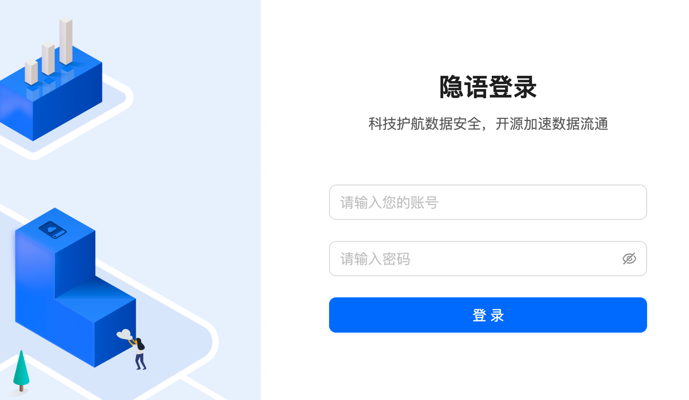

:target{#id3}

## 2、新建项目

- “新手指引流程”和“主页工作台界面”都可新建项目。
- 新建项目时可选训练流模板（包括自定义空白模版、联合圈人、金融风控模板）

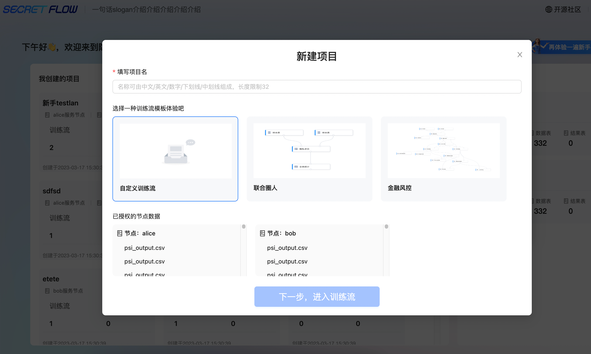

:target{#id4}

## 3、数据授权

- 联合圈人、金融风险类型的训练流模板已默认配置数据；
- 空白训练流则需手动数据授权（点击数据表菜单——去节点中心授权数据表）

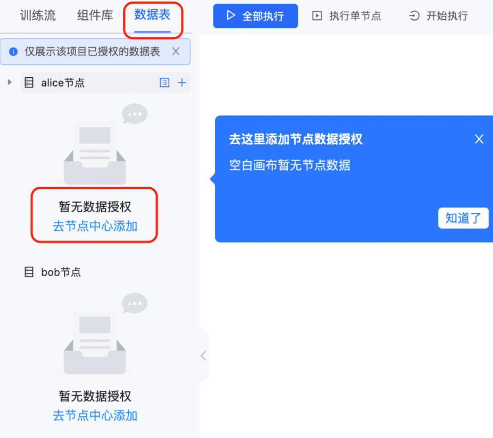

进入节点管理中心界面——点击授权管理

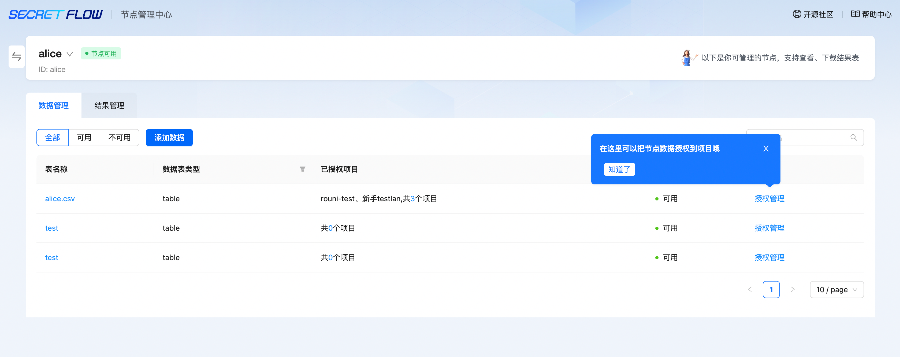

数据授权需选择关联键，标签列为选填

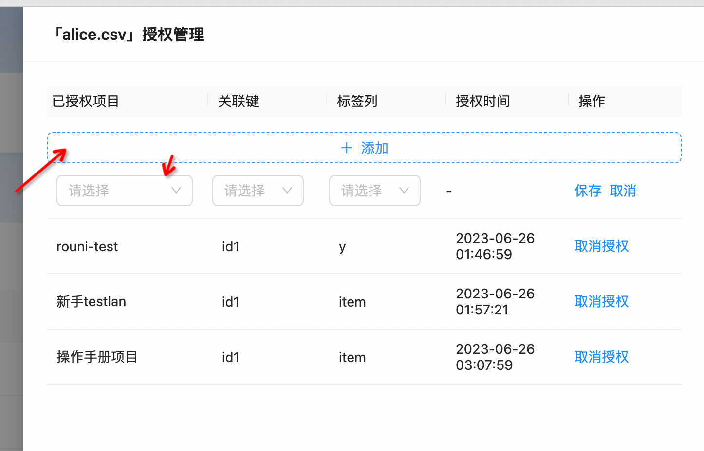

:target{#id5}

## 4、添加数据

若想添加自有数据，可在节点管理中心，点击添加数据——拖拽数据文件到抽屉内——填写数据表名称——检查字段类型——点击提交保存

备注：添加好数据后，还需进行数据授权操作。暂时只支持200M内大小的数据上传，2023.7.31会支持500M的数据。

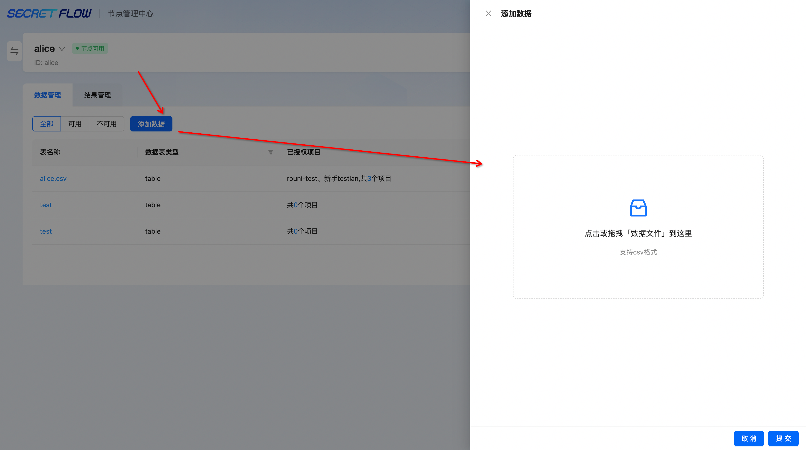

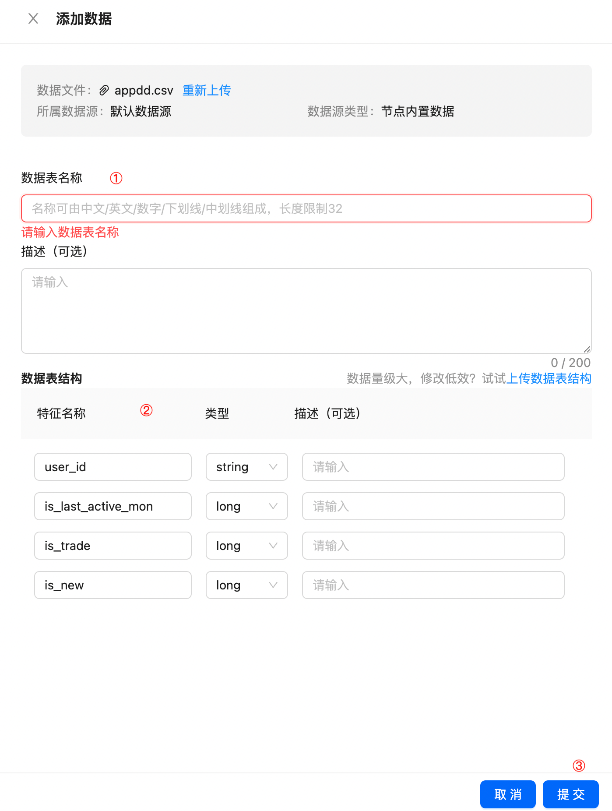

:target{#id6}

## 5、新建训练流

点击训练流左下角“创建训练流”按钮可选自定义训练流、使用联合圈人模板、使用金融风控模板

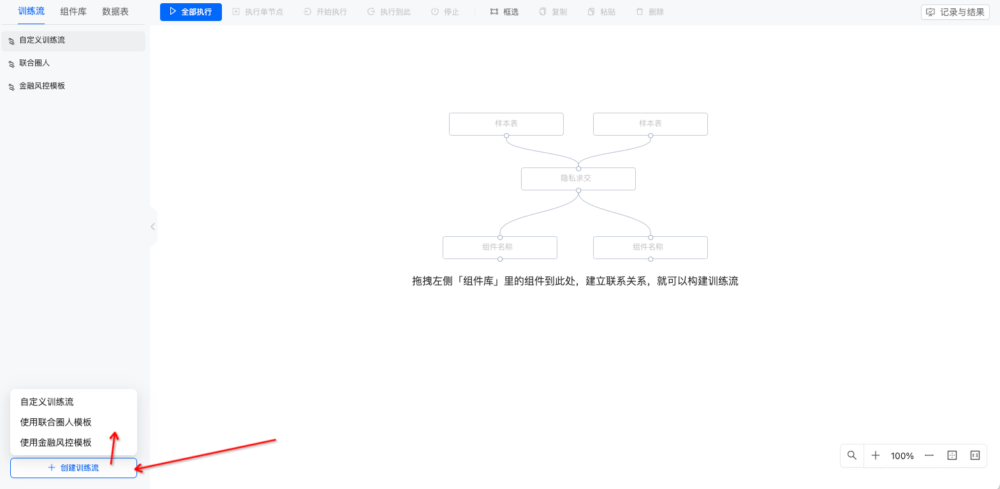

联合圈人、金融风控为对应训练流已编排完成，需要选择样本表逐一配置组件。自定义训练流则需自主拖拽组件，连接并配置后即可运行

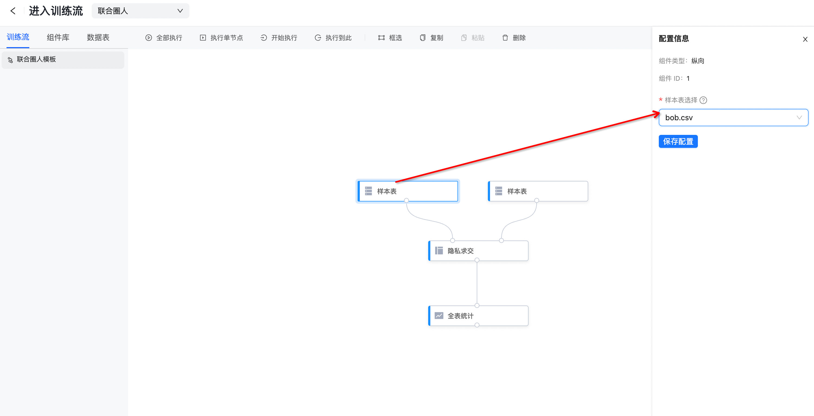

:target{#id7}

## 6、训练流操作

针对训练流中的组件，选中后会弹出配置面板，上方几个操作按钮会高亮

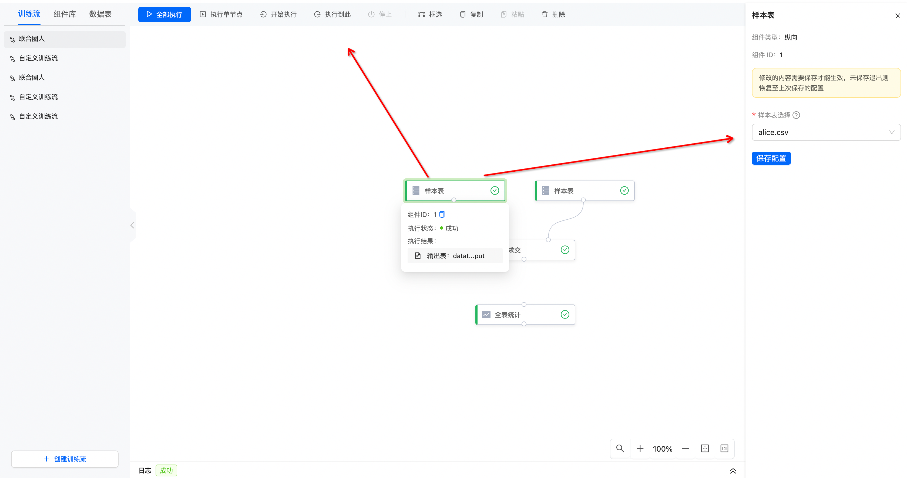

配置面板：每个组件的配置信息不同，按提示进行配置即可

:target{#id8}

### 6.1 操作项说明

<table>
  <thead>
    <tr>
      <td>
        <strong>操作项</strong>
      </td>

      <td>
        <strong>解释</strong>
      </td>
    </tr>
  </thead>

  <tbody>
    <tr>
      <td>
        全部执行
      </td>

      <td>
        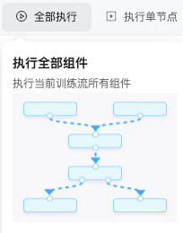<br />执行当前组件
      </td>
    </tr>

    <tr>
      <td>
        执行单节点
      </td>

      <td>
        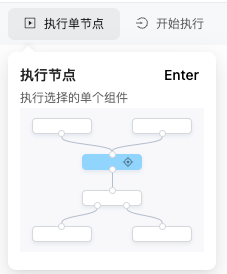<br />执行选中的节点
      </td>
    </tr>

    <tr>
      <td>
        开始执行
      </td>

      <td>
        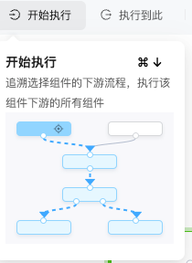<br />从选择的组件开始执行
      </td>
    </tr>

    <tr>
      <td>
        执行到此
      </td>

      <td>
        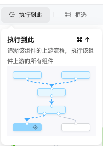<br />追溯上游组件执行到选中的组
      </td>
    </tr>

    <tr>
      <td>
        停止
      </td>

      <td>
        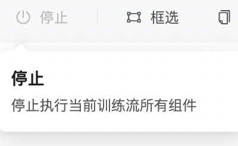<br />停止当前训练流下的所有组件，只有运行中的训练流才会点亮该组件
      </td>
    </tr>

    <tr>
      <td>
        框选
      </td>

      <td>
        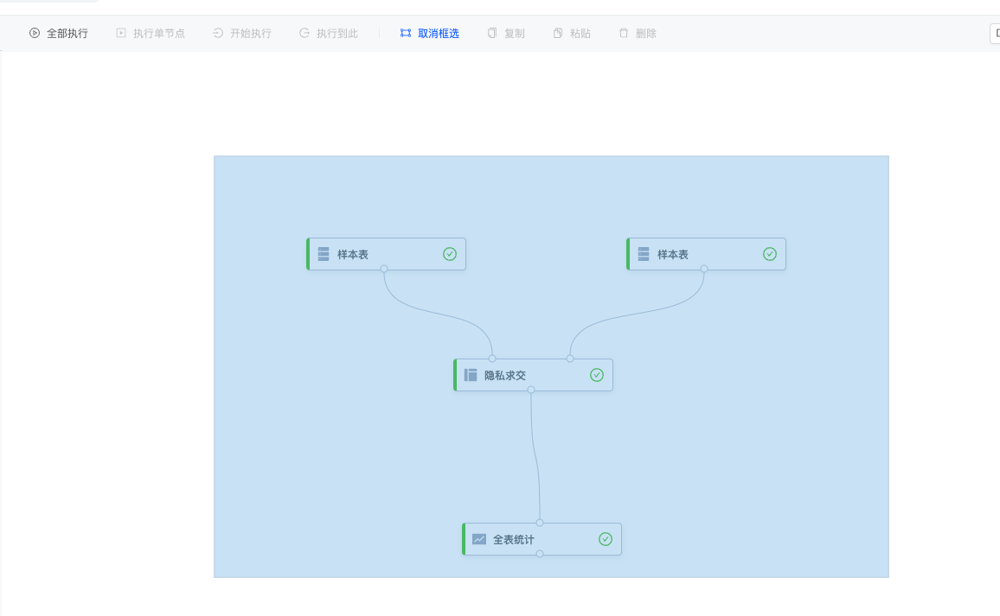<br />局部或全部框选
      </td>
    </tr>

    <tr>
      <td>
        复制
      </td>

      <td>
        选择组件后复制，可粘贴到鼠标指定位置
      </td>
    </tr>

    <tr>
      <td>
        粘贴
      </td>

      <td>
        与复制一起使用
      </td>
    </tr>

    <tr>
      <td>
        删除
      </td>

      <td>
        选择组件后可删除，可框选删除
      </td>
    </tr>
  </tbody>
</table>

:target{#id9}

## 7、查看历史记录与结果

点击系统右上方“记录与结果”按钮，可查看当前项目下的所有任务记录

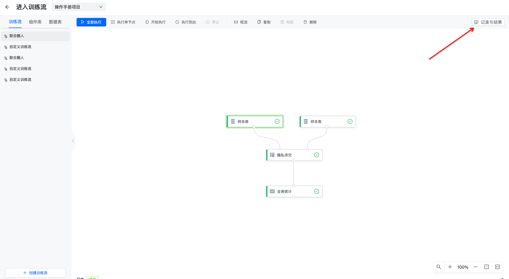

进入结果和记录页面——点击“表、模型、规则、报告”可查看哪些组件产出了对应结果

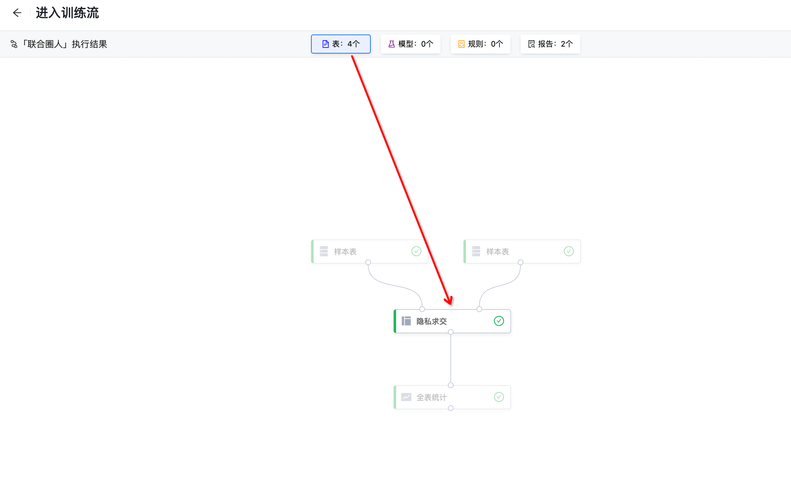

:target{#id10}

## 8、查看并下载结果

移动鼠标到对应的组件面板——点击 执行结果——查看并下载数据表-跳转到结果管理界面下载

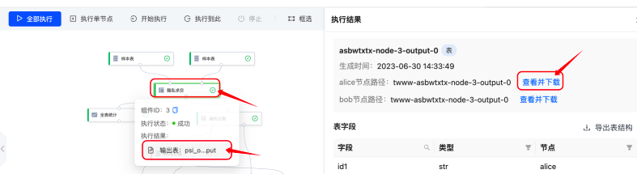

:target{#id11}

## 9、添加合作节点

针对新增的节点，若需要作为参与节点创建项目，则需提前将节点间的通讯建立起来。

内置的alice和bob节点默认已建立合作关系。

点击添加合作节点——选择已注册的可用节点——输入合作节点的通讯地址——输入本节点对合作节点暴露的通讯地址——点击确定即可建立合作关系。

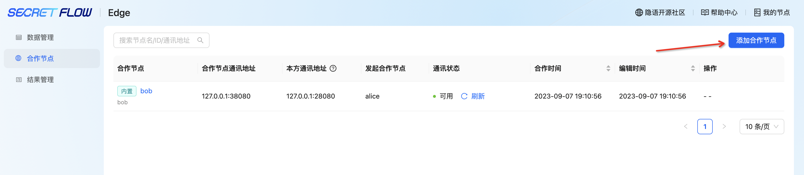

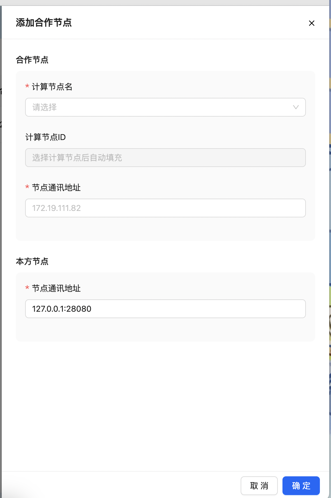

若需要查询节点端口号，则输入如下命令：

```shell
# 查询本节点端口号的命令
docker ps
```

<em>最后更新时间：2023/9/8 14:21:16</em>
