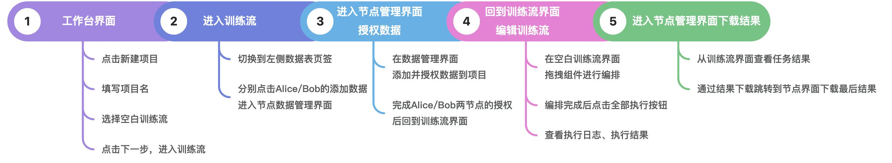
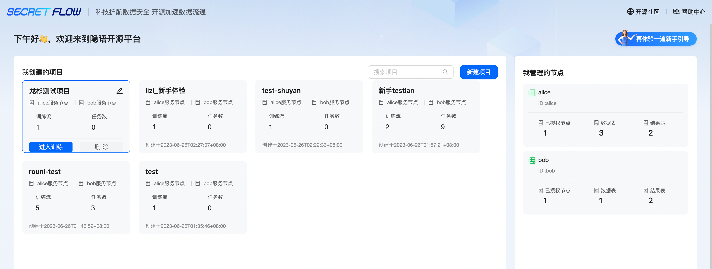
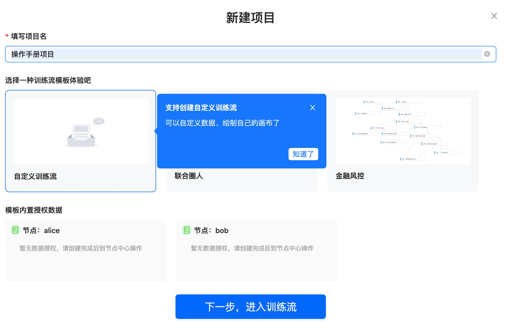
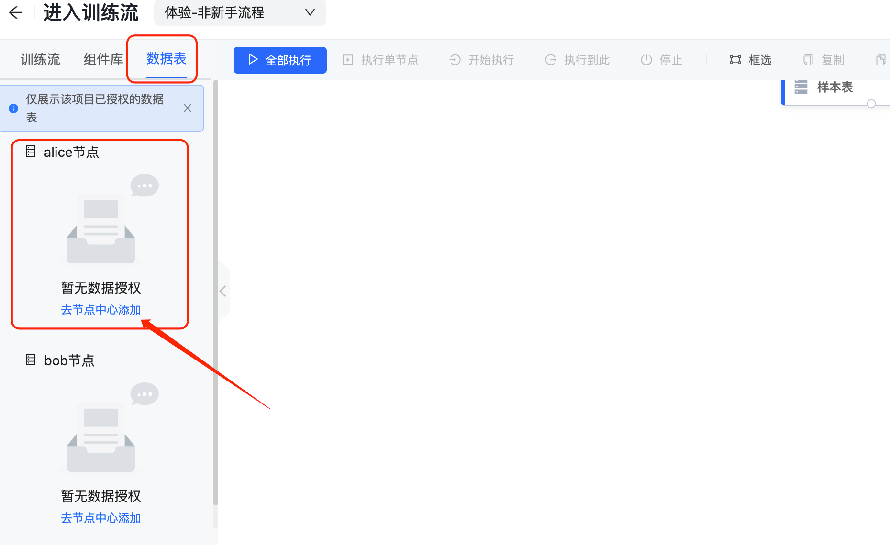
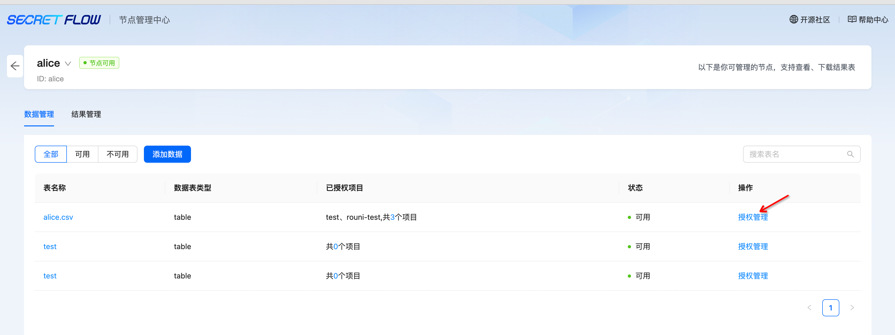
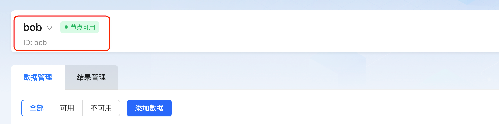
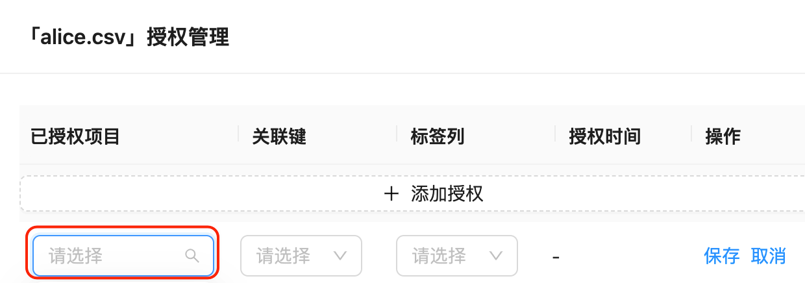
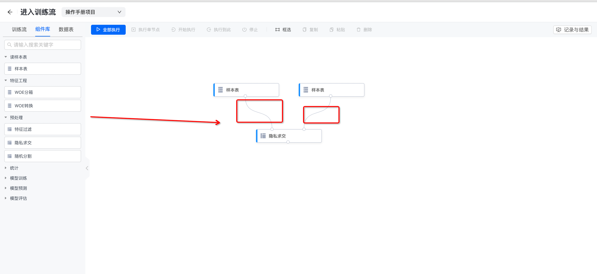
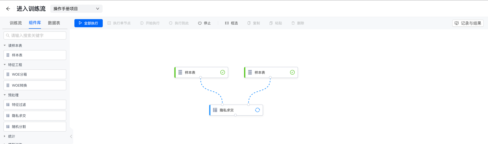

:target{#id1}

# 方式二：自定义训练流

<video id="video" controls={true} preload="none">
  <source id="mp4" src="https://secretflow-public.oss-cn-hangzhou.aliyuncs.com/tutorial-video/pipeline_custom.mp4" type="video/mp4" />
</video>

:target{#id2}

# 一、自定义训练流全流程

:target{#id3}

# 二、详细步骤说明

:target{#id4}

## 第 1 步：进入工作台界面——点击新建项目

:target{#id5}

## 第 2 步：输入项目名称——选择自定义训练流——点击下一步，进入训练流

:target{#id6}

## 第 3 步：进入训练流——点击数据表

:target{#alicebob}

## 第 4 步：跳转到节点管理中心，分别授权 Alice、Bob 数据表给项目使用

:target{#id7}

## 第 5 步：选择需要授权的项目、关联键（可关联两张表的唯一值）、标签列（非必填）

:target{#id8}

## 第 6 步：授权完成后，回到之前的训练流界面——点击组件库，可拖拽组件到画布上进行流程搭建

ps：搭建过程中，注意组件的连接方式是否正确

:target{#id9}

## 第 7 步：点击组件“样本表”——选择数据表——保存配置

:target{#id10}

## 第 8 步：流程搭建完成后——点击全部执行按钮，执行训练流

:target{#id11}

## 第 9 步：移动鼠标到对应的组件面板——点击执行结果——查看并下载数据表

<em>最后更新时间：2023/7/26 14:39:58</em>
