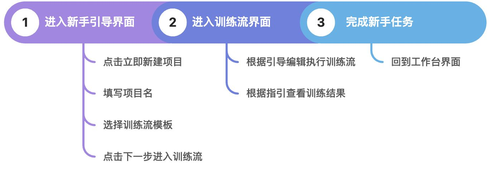
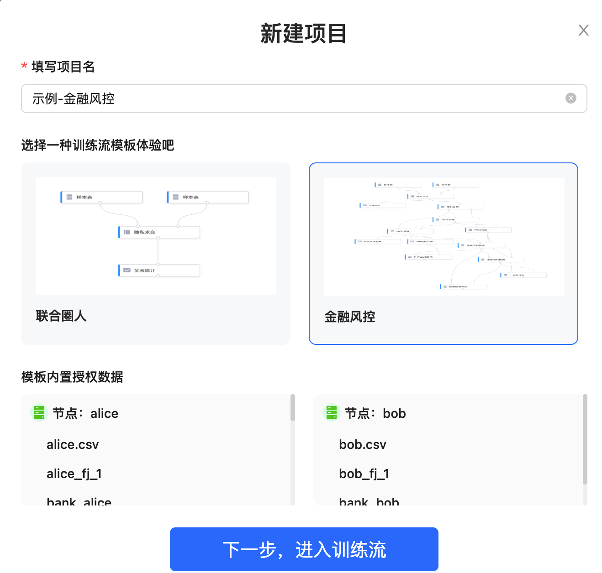
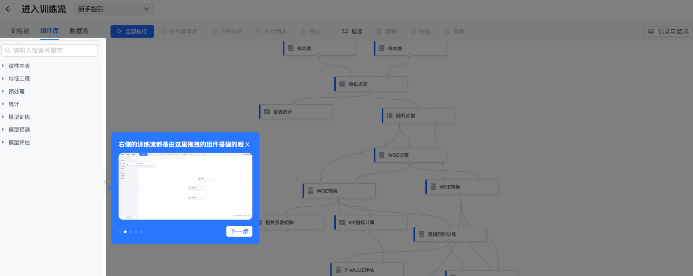
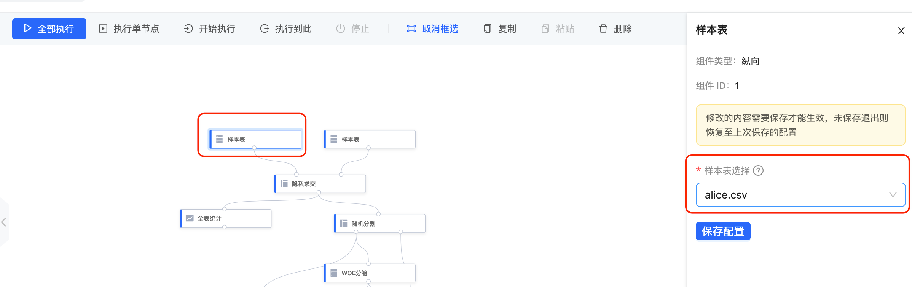
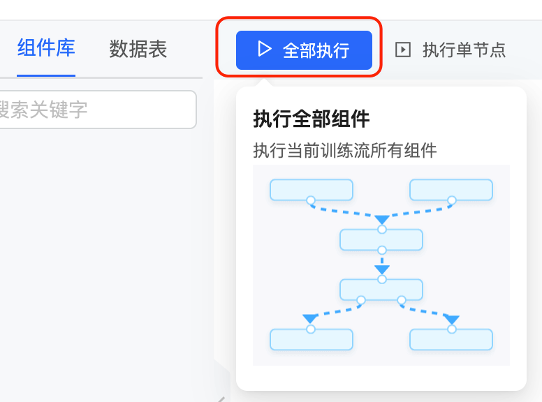
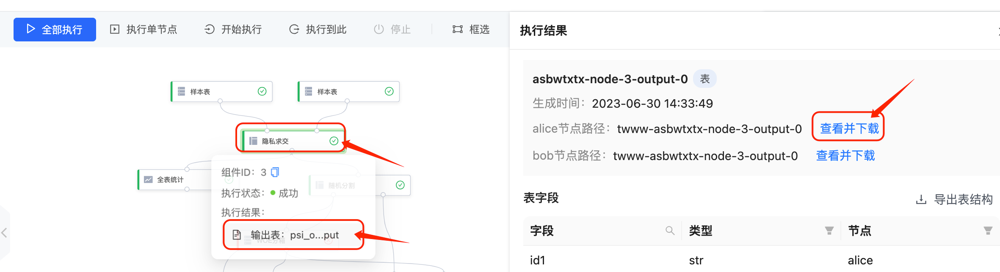

:target{#id1}

# 方式一：使用训练流模板

<video id="video" controls={true} preload="none">
  <source id="mp4" src="https://secretflow-public.oss-cn-hangzhou.aliyuncs.com/tutorial-video/pipeline_template.mp4" type="video/mp4" />
</video>

:target{#id2}

# 一、使用训练流模板全流程

:target{#id3}

# 二、详细步骤说明

:target{#id4}

## 第 1 步：进入新手引导界面——点击立即新建项目

:target{#id5}

## 第 2 步：填写项目名称——选择训练流模板——点击下一步，进入训练流（此处以金融风控训练流为例

:target{#id6}

## 第 3 步：进入训练流界面——查看新手指引——熟悉操作流程

:target{#id7}

## 第 4 步：点击组件“样本表”——查看或选择数据表——保存配置

:target{#id8}

## 第 5 步：点击全部执行——执行训练流程——等待执行成功

:target{#id9}

## 第 6 步：移动鼠标到对应的组件面板——点击执行结果——查看并下载数据表

<em>最后更新时间：2023/7/26 14:38:20</em>
