:target{#id1}

# 安装指引

<video id="video" controls={true} preload="none">
  <source id="mp4" src="https://secretflow-public.oss-cn-hangzhou.aliyuncs.com/tutorial-video/install_guide.mp4" type="video/mp4" />
</video>

:target{#id2}

# 一、安装指引

:target{#id3}

## 1.1 系统要求

操作系统：MacOS（暂不支持M1芯片）, CentOS7, CentOS8

资源：8core / 16G Memory / 200G Hard disk

:target{#docker}

## 1.2 Docker安装与配置

若已安装可跳过

:target{#linux-centos}

### Linux（CentOS）

```shell
# 安装 docker。
yum install -y yum-utils
yum-config-manager \
	--add-repo \
	https://download.docker.com/linux/centos/docker-ce.repo
yum install -y docker-ce docker-ce-cli containerd.io

# 启动 docker。
systemctl start docker
```

其他 OS 可参考 Docker 官方文档：[https://docs.docker.com/engine/install/（其他](https://docs.docker.com/engine/install/%EF%BC%88%E5%85%B6%E4%BB%96) OS 暂未进行系统性测试，若安装过程中出现问题，可提交
[issue](https://github.com/secretflow/secretflow/issues) 反馈，欢迎开发者们提供相应解决方案。）

:target{#windows}

### Windows系统

参考https\://docs.docker.com/desktop/install/windows-install/在Windows上安装Docker，并确保Docker的后端是WSL2

MacOS 需将docker container 内存上限提高为 6G。

参考https\://learn.microsoft.com/en-us/windows/wsl/wsl-config#configure-global-options-with-wslconfig设置对应的设置即可

:target{#mac-os}

### mac OS

参考官网进行安装

[https://docs.docker.com/desktop/install/mac-install/](https://docs.docker.com/desktop/install/mac-install/)

:target{#id4}

### <font color="#DF2A3F" /> 非常重要📢 ： docker 配置&#x20;

<strong>需将 docker container 内存上限提高为 6G，操作步骤如下（版本不同操作入口可能不同）：</strong>

示例一（V4.3.1）：

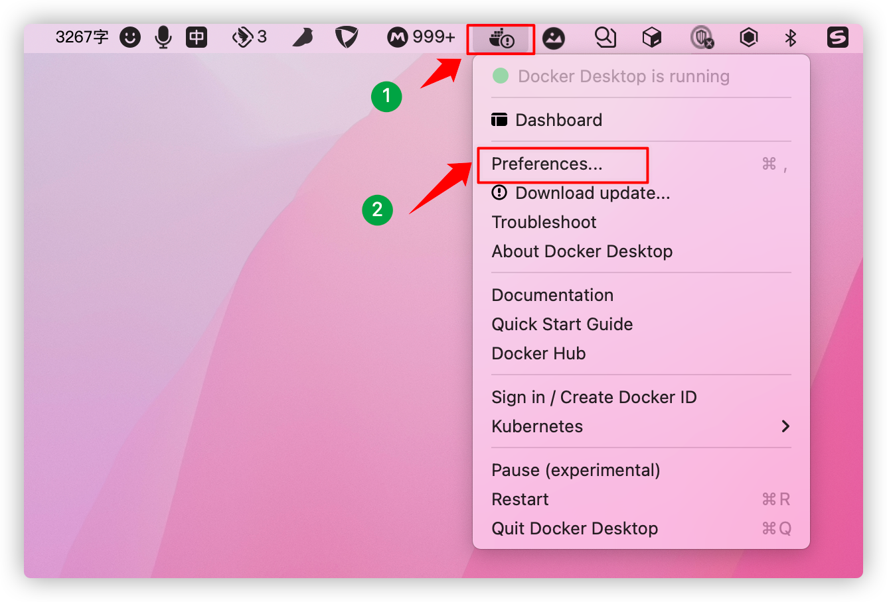 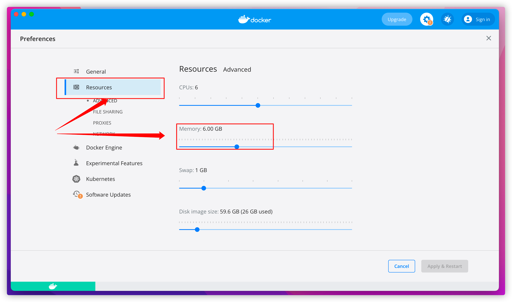

示例二（V4.20.1）：

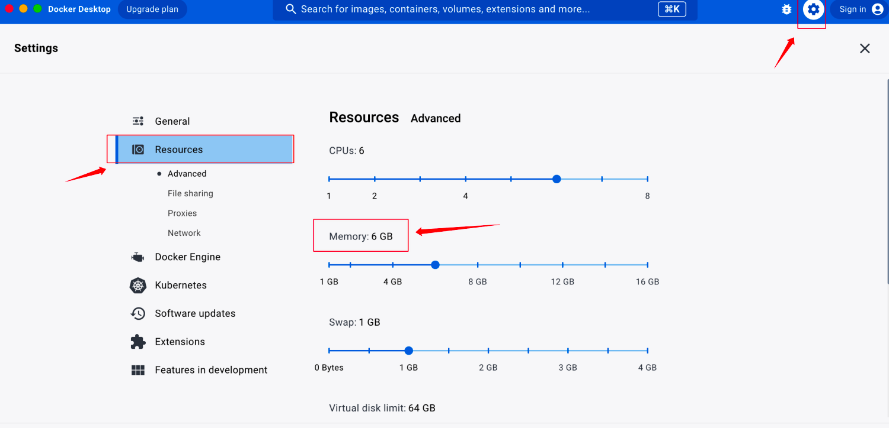

:target{#mac}

## 1.3 隐语体验部署包安装（mac）

:target{#id5}

### 第1步：解压部署包

下载部署包后解压部署包。

:target{#id6}

### 第2步：安装部署

```shell
cd 
./install.sh
```

输入 cd ——把解压的安装包拖入到终端（或输入sercretpad-allinone-package的路径）——再输入 ./install.sh

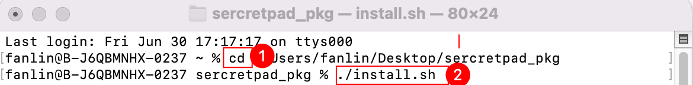

设置任务产物存储目录， 若不设置则直接回车跳过。（默认\~/kusica）

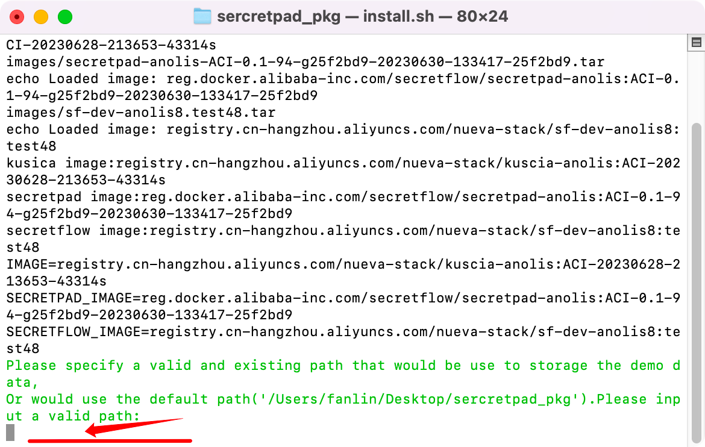

:target{#web}

### 第3步：设置登录web页面的用户名和密码

用户名长度要求大于 4 位字符 ，密码大于 8 位字符。需包含大小写及特殊字符。

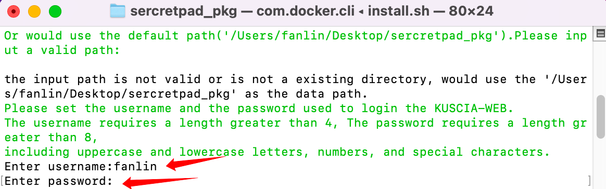

:target{#id7}

### 第4步：安装完成

看到“web server started successfully”则代表部署成功

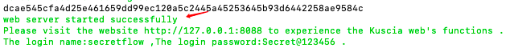

:target{#id8}

### 第5步：浏览器访问平台

部署成功后，浏览器打开 [http://localhost:8080](http://localhost:8080)，利用部署过程中配置的用户密码登陆平台即可体验。

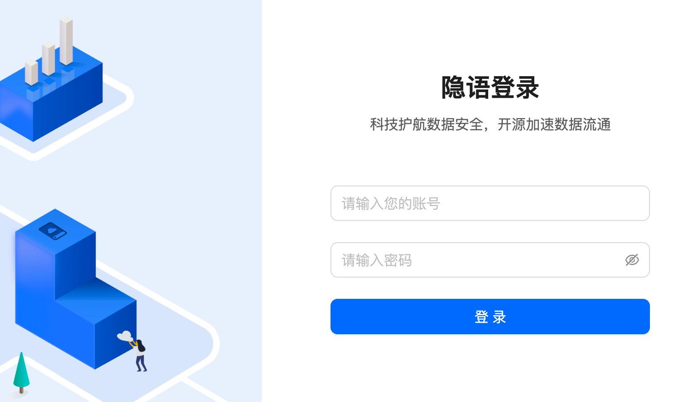

若在部署过程中有相关的问题或者建议，可提交[issue](https://github.com/secretflow/secretflow/issues)
反馈。

:target{#win}

## 1.4 隐语体验部署包安装（win）

:target{#id9}

### 第1步：解压部署包

下载部署包后解压部署包。

:target{#id10}

### 第2步：安装部署

```shell
D：//解压后部署包所在存储盘
cd 
bash install.sh
```

输入 D：（或者C\E\F,找到部署包所以存储盘）——输入cd ——把解压的安装包拖入到终端（或输入sercretpad\_pkg的路径）——再输入 bash
[install.sh](http://install.sh)

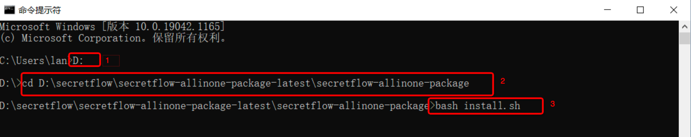

设置任务产物存储目录， 若不设置则直接回车跳过。（默认使用部署包所在目录）

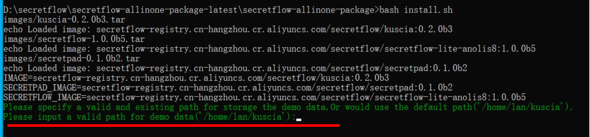

:target{#id11}

### 第3步：设置登录web页面的用户名和密码

用户名长度要求大于 4 位字符 ，密码大于 8 位字符。可含大小写及特殊字符。

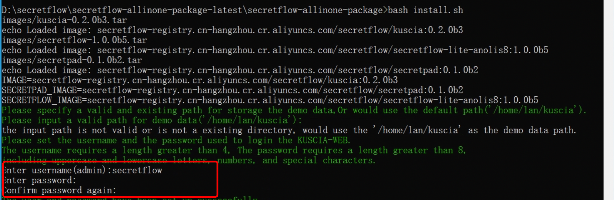

:target{#id12}

### 第4步：安装完成

看到“web server started successfully”则代表部署成功

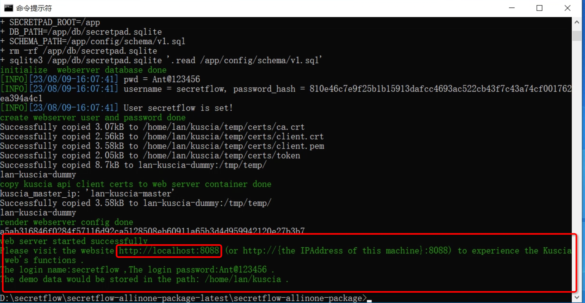

:target{#id13}

### 第5步：浏览器访问平台

部署成功后，浏览器打开 [http://localhost:8080](http://localhost:8080)，利用部署过程中配置的用户密码登陆平台即可体验。


若在部署过程中有相关的问题或者建议，可提交[issue](https://github.com/secretflow/secretflow/issues)
反馈。

<em>最后更新时间：2023/8/9 16:51:44</em>
