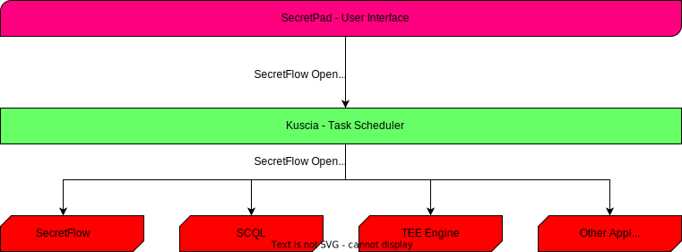

:target{#welcome-to-secretflow-open-specification}

# 欢迎访问隐语开放标准

隐语开放标准是为隐私保护应用设计的协议栈。

目前，隐语开放标准包括数据、组件和节点评估协议。我们将很快引入工作流程协议。

隐语开放标准被隐语生态系统使用，包括：

- SecretFlow：用于隐私保护数据分析和机器学习的统一框架。
- Kuscia：基于 K8s 的隐私保护计算任务编排框架。
- SecretPad：基于 Kuscia 框架的隐私保护计算 Web 平台，旨在为隐私保护数据智能和机器学习功能提供便捷访问。
- SCQL 和 TEE 引擎将来也将使用隐语开放标准。

<TableOfContents />

:target{#announcement}

## 公告

:target{#oct-2023}

### 2023 年 10 月

已发布隐语开放标准 v1.0。

:target{#july-2023}

### 2023 年 7 月

我们伴随 SecretFlow 1.0.0 发布了第一个版本。
