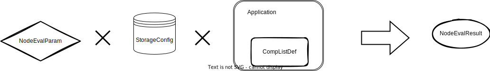

:target{#introduction-to-secretflow-open-specification}

# 隐语开放标准介绍

---

注意

1. 本标准可能会有修改。
2. 目前我们没有官方的工作流协议。

---

:target{#data}

## [Data](#\(spec.md#data\))

我们引入了 [DistData](spec.mdx#distdata) 来表示隐私保护应用程序中的输入和输出

在隐私保护应用程序中，一个数据可能是”分布式”，因为它由多方拥有，例如MPC模型或者垂直分区的表格。

---

注意

不要将其与数据库系统中的数据分区搞混了。在这种系统中，将大型数据集划分为放置在不同机器上的几个小分区是很常见的。但是，对分区没有所有者的强制执行，这意味着选择哪个机器来放置分区是随机的。

---

DistData包含两个部分：

- 公共数据，每个人都可以访问。
- 私有数据，只有所有者可以访问。

:target{#public-data}

### 公共数据

公共数据包括：

- 名称
- type ，指导隐私保护应用程序处理数据的方式
- system\_info
- meta ，任何其他可以公共的数据

:target{#systeminfo}

#### [SystemInfo](spec.mdx#systeminfo)

对于输入数据，SystemInfo描述了可能使用数据的应用程序和环境。

:target{#private-data}

### 私有数据

DistData可能包含多个私有数据片段。每个私有数据片段由DataRef引用。DataRef是DistData中的公共字段，不要在DataRef的uri中放置任何私有信息，因为每个方都获得完全相同的DataRef。

DataRef只包含一个uri。为了获取远程数据，所有者必须使用自己的StorageConfig。

:target{#dataref}

### [DataRef](spec.mdx#distdatadataref)

DataRef是指向一个属于一方的单个文件的指针。uri是相对于其所有者的存储根目录的路径。DataRef是公开的，所有方都可以访问。

---

注意

不要试图将任何机密信息存储在uri中。你应该保护的是由uri指向的文件。

---

:target{#storageconfig}

### [StorageConfig](spec.mdx#storageconfig)

StorageConfig指定了一方的存储根目录。它可以是本地文件路径、数据库表格或 OSS 存储桶。

目前我们只支持 local\_fs。

:target{#common-distdata-types}

### 常见的DistData类型

我们提供了一些常见的DistData类型。

:target{#individualtable}

#### [IndividualTable](spec.mdx#individualtable)

IndividualTable是由一方拥有的表格，这意味着DistData的data\_refs字段中只有一个项。IndividualTable应该打包到DistData的meta字段中，该字段包括schema和line\_count。

在SecretFlow中，IndividualTable的类型为 sf.table.individual。

:target{#verticaltable}

#### [VerticalTable](spec.mdx#verticaltable)

VerticalTable 是多个方拥有的垂直分区表。VerticalTable 包含多个schema。相应地，DistData中应该有多个data\_refs。VerticalTable 应该打包到DistData的meta字段中。

在SecretFlow中，IndividualTable的类型为 sf.table.vertical。

:target{#component}

## [Component](spec.mdx#COMPONENT)

Component是隐语开放标准中最复杂的协议。

组件表示可以集成到工作流中的一份应用程序。

:target{#componentdef}

### [ComponentDef](spec.mdx#componentdef)

你可以使用ComponentDef来定义一个组件：

- domain: 组件的命名空间。可以使用此字段对组件进行分组。例如，在SecretFlow中，我们有 ‘ml.train’，’feature’等。
- name: 在命名空间中必须是唯一的。但是，在不同的命名空间中，可以具有相同名称的组件。
- version: 组件的版本。
- attributes: 请查看下面的AttributeDef部分。
- inputs 和 outputs: 请查看下面的IoDef部分。

通过域、名称和版本的组合，用户可以在系统中定位到一个唯一的组件。

:target{#attributedef}

### [AttributeDef](spec.mdx#attributedef)

我们将组件的所有属性组织成属性树。

- 树的叶子节点称为原子属性，表示用户需要填写的固定字段，例如桶大小或学习率，在图中表示为”a/b”，”a/c/e/i”，”a/c/f/j”。
- 树的非叶子节点称为属性组。有两种类型的属性组：
  - <strong>Struct Attribute Group</strong> ：组内的所有子节点都需要一起填写。例如，在图中”a/c/f”，”a/d”，”a/d/g”。
  - <strong>Union Attribute Group</strong> ：用户必须选择组内的一个子节点进行填写。例如，在图中”a/c”和”a/d/h”。

属性组的子节点可以是另一个属性组。

AttributeDef 表示组件属性树的一个节点。

---

注意

属性组 是组件属性声明中的高级用法。只有一小部分用户可能会在某一天使用此功能。您可以稍后查看属性组。

---

让我们分别介绍原子属性、结构属性组和联合属性组。

:target{#atomic-attributes}

#### [Atomic Attributes](spec.mdx#attributedefatomicattrdesc)

对于原子属性，首先需要在 [AttributeDef](spec.mdx#attributedef) 中使用”type”字段进行指定。

在目前的版本中，我们支持以下标量类型：

- AT\_FLOAT
- AT\_INT
- AT\_STRING
- AT\_BOOL 和相应的标量列表类型。您也可以查看 [AttrType](spec.mdx#attrtype) 。

之后，您应该使用 AtomicAttrDesc 来进一步描述原子属性。

仅适用于列表：

- 使用 list\_min\_length\_inclusive 和 list\_max\_length\_inclusive 来限制列表的长度。

对于浮点数、整数、浮点数列表和整数列表：

- 使用 lower\_bound\_enabled/upper\_bound\_enabled，lower\_bound/upper\_bound，lower\_bound\_inclusive/upper\_bound\_inclusive 来限制值。

对于所有的原子属性：

- 使用 is\_optional 来指示是否必须提供用户答案。
- 如果 is\_optional 为 true，则必须提供 default\_value。

:target{#struct-attribute-group}

#### Struct Attribute Group

Struct Attribute Group 代表一组应该一起填写的属性。例如，在图中”a/c/f/k” 是一个 Struct Attribute Group ，它的子节点是 “a/c/f/k/p” 和 “a/c/f/k/q”。在这种情况下，”a/c/f/k/p” 和 “a/c/f/k/q” 是逻辑上一起分组的，并且应该一起填写。

要定义一个Struct Attribute Group ，在AttributeDef中使用”type”字段指定为AT\_STRUCT\_GROUP。

:target{#union-attribute-group}

#### Union Attribute Group

Union Attribute Group 与 Stuct Attribute group 类似，因为它们都有子节点。然而，用户只能选择一个子节点进行填写。例如，”a/d/h” 是一个 Union Attribute Group ，它的子节点是 “a/d/h/n” 和 “a/d/h/o”。用户必须选择 “a/d/h/n” 或者 “a/d/h/o” 进行填写。

定义一个 Union Attribute Group ，您需要在AttributeDef的”type”字段中使用AT\_UNION\_GROUP进行指示。然后，您可以使用UnionAttrGroupDesc来指定子属性的默认选择。

---

注意

1. 对于任何属性，您可以使用 <strong>prefixes</strong> 来指示属性树节点的所有祖先。根属性的前缀列表为空列表。例如，”a/d/h”的 <strong>prefixes</strong> 是\[“a”, “d”, “h”]。
2. 为什么需要 Union Attribute Group ？ 组件的属性类似于调查问卷。有时问题的答案可能会影响给调查对象提出的后续问题。Union Attribute Group 用于描述这种情况。
3. 为什么需要 Struct Attribute Group ？ 在大多数情况下，Struct Attribute Group 与 Union Attribute Group 一起用于表示复杂的属性树。

---

:target{#iodef}

### [IoDef](spec.mdx#iodef)

IoDef用于指定组件的输入或输出要求。您应该使用types来声明接受的 [DistData](spec.mdx#distdata) 的类型。

:target{#tableattrdef}

#### [TableAttrDef](spec.mdx#TableAttrDef)

如果IoDef的types是sf.table.individual和/或sf.table.vertical，您可以使用TableAttrDef进一步指示在应用程序中使用的表的列。

例如，我们可能要求用户提供一个表作为输入/输出，然后选择某些列作为特征，并为每个选定的列填写其他属性。

- name是列的名称，例如”label”、”key”、”features”。它应该在一个输入的所有TableAttrDefs中是唯一的。
- desc指示用户所选列的含义。
- types指示所选列的类型限制。
- col\_min\_cnt\_inclusive和col\_max\_cnt\_inclusive指示应选择多少列作为name。
- extra\_attrs是每个选定列的额外属性。

---

注意

同样，您可以暂时不用担心TableAttrDef，因为它很少使用。

---

:target{#complistdef}

### [CompListDef](spec.mdx#complistdef)

一组组件可以通过CompListDef进行组织。每个隐私保护应用程序必须提供一个CompList。

例如，这个 [链接](https://github.com/secretflow/secretflow/blob/main/docker/comp_list.json) 是secretflow的组件列表。

:target{#node-evalution}

## [Node Evalution](spec.mdx#EVALUATION)

组件的运行时实例称为节点。要评估一个应用程序的组件，您必须提供以下内容：

- StorageConfig，您必须提供它以让应用程序获取由DataRef指定的远程数据。
- NodeEvalParam，ComponentDef所需的所有字段。

结果由应用程序的NodeEvalResult表示。

:target{#nodeevalparam}

### [NodeEvalParam](spec.mdx#nodeevalparam)

它包含：

- domain，name，version：用于从应用程序的组件列表中定位一个组件。
- attr\_paths，attrs：组件的属性。稍后将进一步讨论。
- inputs：组件的输入，类型是DistData。
- output\_uris：每个输出的URI。稍后将进一步讨论。

---

注意

<strong>为什么每个输出只有一个URI？</strong> 对于每个输出，只提供一个URI。它将由所有参与方用于生成该输出DistData的所有data\_ref。这看起来很奇怪，因为我们可能会给每个参与方一个不同的URI。然而，这不是一个好主意：

- 当我们有多个参与方时，输出URI列表会变得非常长。
- 每个参与方都完全控制存储根目录，并且他们之后可以移动文件。我们希望保持我们的系统简单，不在文件系统管理上投入任何精力。

---

:target{#attributes}

#### 属性

我们复制了上面相同的属性树。

我们使用attr\_paths和attrs来回答组件中定义的属性。

attr\_paths和attrs的长度必须相同。它们应该遵守相同的顺序。例如，第n个attr是第n个attr\_path的值。

<strong>Atomic Attribute</strong>

原子属性的attr\_path是属性树节点的完整路径。例如

- 属性节点名为q的attr\_path是”a/c/f/k/q”
- 属性节点名为j的attr\_path是”a/c/f/k/j”

[Attribute](spec.mdx#attribute) 用于表示属性的值。请使用is\_na来明确表示值为n/a。

<strong>Struct Attribute Group</strong>

对于 Struct Attribute Group ，您不需要填写任何内容。

<strong>Union Attribute Group</strong>

对于 union attribute group ，您必须提供一对attr\_path和attr，以明确指示您选择的子节点。

例如，对于名为c的联合属性组，attr\_path是”a/c”

- 如果您选择名为e的子元素，则attr是一个[Attribute](spec.mdx#attribute) ，其中s字段为e，即子元素选择是一个字符串。
- 如果您选择名为f的子元素，则attr是一个[Attribute](spec.mdx#attribute) ，其中s字段为f。

<strong>TableAttrDef</strong>

填写TableAttrDef非常复杂。

attr\_path是 <em>(input|output)/(IoDef name)/(TableAttrDef name)(/(column name)(/(extra attributes))?)?</em> ，用于选择列和额外属性。

首先，您应该回答选择的列。attr\_path由三个部分组成：

- “input”或”output”表示TableAttrDef的IoDef是来自组件定义的输入还是输出。
- IoDef名
- TableAttrDef名

例如，选择列id的典型attr\_path为”input/train\_dataset/features”

您应该使用 [Attribute](spec.mdx#attribute) 的ss字段列出所选列。

然后，如果TableAttrDef包含extra\_attrs，则应继续回答它。attr\_path包含五个部分：

- “input”或”output”。与所选列相同。
- IoDef名称。与所选列相同。
- TableAttrDef名称。与所选列相同。
- 列名称。
- 额外属性。规则与属性节点相同。

例如，选择列的额外属性的典型attr\_path为”input/train\_dataset/features/x\_1/a/b/c”

:target{#outputs}

#### 输出

您应该为每个配置提供相对于StorageConfig的uri。顺序应与ComponentDef中定义的顺序相同。

:target{#nodeevalresult}

### [NodeEvalResult](spec.mdx#nodeevalresult)

它包含输出的DistData。

:target{#report}

## [Report](spec.mdx#REPORT)

Report 是另一个常见的DistData，它完全公开，并且不拥有任何data\_ref。我们使用Report来展示大多数情况下的统计输出。

与报告相关的 proto 是：

- Descriptions：以组的形式显示多个只读字段。
- Table：显示数据的行。
- Div：页面的一个部分或节，由Descriptions、Tables或Divs组成。
- Tab：报告的一个页面，由Divs组成。
- Report：报告的顶级，由Tabs组成。

Report应该被打包到DistData的meta字段中。

在SecretFlow中，Report的类型为 <em>sf.report</em> 。
