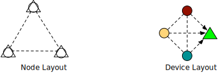

:target{#design-generic-device}

# Design: generic device

<Container type="warning">
  This is a design draft for using SPU from SecretFlow, not an accurate document for SPU itself. It could be treated as a reference to integrate SPU from other systems.
</Container>

:target{#overview}

## Overview

This document discusses the design of a trust chain under an universal device concept.

:target{#concept}

## Concept

<strong>Device</strong>, a virtual concept which can evaluate a piece of code, normally a specific device provides some specific abilities, i.e. CPU is a device for general computation, GPU is a device for parallel computation, HE/MPC evaluator are devices for security computation. Formally, a device is a set of ops <InlineMath>$\left \{  OP_{i} \right \}$</InlineMath>.

- <em>DeviceObject</em> an object which could be operated by the device, formally, it’s a set of data <InlineMath>$\left \{  D_{i} \right \}$</InlineMath>.
- <em>Consistency property</em> is <cite>if type(Di) == type(Dj) and OP works for Di, it also works for Dj</cite>
- <em>Complete property</em> is that <InlineMath>$\left \{  OP_{i} \right \}$</InlineMath> is <em>turing complete</em>

<strong>Node</strong>, a physical node which provides general computing environment, it could host devices.

<strong>Computation</strong> or DAG, is a form to represent logic function, with <em>node</em> as operator and <em>edge</em> as data.

<strong>SecretFlow</strong>, is a framework that could schedule a <em>Computation</em> to a list of <em>Device</em>, with respect that:

- <strong>Securely data transferred</strong> across devices, unless the client explicitly makes an unsafe transfer.
- Each op runs on exactly on one device, <strong>there is no cross-device function</strong>.

:target{#notations}

### Notations


- <em>empty shape</em> stands for <strong>Node</strong>
- <em>colored shape</em> stands for <strong>Device</strong>
- <em>dotted line</em> stands for <strong>no trust</strong> relation between devices.
- <em>dotted line with arrow</em> stands for <strong>weak trust</strong> relation, one device could send its encrypted data to another without data loss.
- <em>solid line with arrow</em> stands for <strong>strong trust</strong> relation, one device could send its raw data to another without data loss.

<LineBlock>
  <br />
</LineBlock>

:target{#device-layout}

## Device layout

:target{#outsourcing-mpc}

### Outsourcing (MPC)


In above deployment, we use 6 nodes to construct 4 devices, where circle devices have weak trust to the triangle device.

:target{#colocated-mpc}

### Colocated (MPC)



In above deployment, we use 3 nodes to construct 4 devices, where circle devices have weak trust to the triangle device.

Note, in this configuration, we use 3 nodes to build exactly the same device layout as the 6 node out-sourcing mode, the client code could run exactly the same without any changes. That is <strong>write once, run anywhere</strong>.

:target{#server-aided-mpc}

### Server-aided (MPC)


In this configuration, one server does not provide data but participates in the computation, it’s so called a <cite>server-aided</cite>.

:target{#he-device}

### HE device


In this mode, we use 2 nodes to virtualize 3 devices, with that:

- The <em>magenta device</em> colocated with <em>yellow CPU device</em>, with a <em>strong trust</em> relationship.
- The <em>red CPU device</em> and the <em>magenta HE device</em> forms a <em>weak trust</em> relationship.


In this configuration, we use 2 nodes to virtualize 4 devices, with that:

- each <em>circle device</em> has one <em>strong trust</em> with one <em>diamond device</em> while a <em>weak trust</em> to another <em>diamond device</em>.


In this configuration, we have 3 nodes. For clarity, we name upper one as Alice, lower-left as Bob, lower-right as Charlie.

Both \{Bob, Charlie} would encrypt their data and send it to Alice, we have to do possible device abstractions.

In the middle, there is only one <em>HE device</em>, which could be used to compute all cipher-texts.

- pros: there is only one HE device per-node, which means if we have N parties, we have at most N HE-devices.
- cons: it breaks the <em>Consistency property</em>, i.e. <cite>add::(\[x], \[y])</cite> add two cipher-texts could not be done if two cipher-texts come from different parties. Another example: when doing output, Bob may get a cipher-text from the <em>HE-device</em>, but he can not decrypt it, since he does not have the right key. @jint, IMHO, <em>Consistency</em> is the key-point to guide programmers, <strong>it’s confusing if an op sometime work, sometimes not</strong>.

In the right configuration, there are 2 <em>HE device</em>, both reside on Alice, but one for Bob and one for Charlie.

- pros: Consistency, the device concept is exactly the same as MPC/TEE.
- cons: there will be at most <InlineMath>$N^2$</InlineMath> HE devices for N nodes. This might not be a problem since it depicts the 2PC property of HE (@jint).

:target{#device-and-node}

## Device and Node

A device is composed by one or more nodes, this section covers the common used device/node pattern in SecretFlow.

For CPU and MPC, it’s easy.

- A CPU device is composed by only one node.
- An MPC device is composed by a list of nodes (unordered).

For HE device, it’s a bit of complicated, it’s composed by a pair of nodes <cite>(location, key-owner)</cite>

- <strong>Location node</strong> is the node that the evaluator located on.
- <strong>KeyOwner node</strong> is the node that provides <cite>\{PK, SK}</cite>

Formally, we can define devices via a configuration file.

```yaml
nodes: [...] # list of nodes.
devices: # list of devices
  - {device-name}    # the ith device name
    type: {dev-type} # the type of the device, one of {SPU, HEU, CPU, TEE}
    nodes: {composition-nodes}  # this is device type dependent, SPU=list of node, CPU=single node, HEU=node pair.
```

For example:

```yaml
# We have three nodes, namely N1-N3
nodes: [ "N1", "N2", "N3" ]
# We have four devices definition.
devices:
  - SPU0: # the first one is SPU, which use three nodes
    type: SPU
    nodes: [ "N1", "N2", "N3" ]
  - P1:
    type: CPU
    node: "N1"
  - P2:
    type: CPU
    node: "N2"
  - P3:
    type: CPU
    node: "N3"
  - HEU0: # the last one is HEU, which resides on N1, and use N2's key pair.
    type: HEU
    node: ("N1", "N2")
```

Let’s ignore the SPU device for a moment, the CPU and HEU looks like this:


In this example, <cite>HEU</cite> computation part is strait-forward, the non-trivial part is the IO (device-to-device transfer). Let’s consider several IO cases.

- First, transfer data from <cite>P1</cite> to <cite>HEU</cite>, in this case, from device concept level, <cite>P1</cite> <strong>strong trust</strong> on <cite>HEU</cite>, so it can send plaintext directly to <cite>HEU</cite>. In implementation, <cite>P1</cite> is colocated with <cite>HEU</cite>, so it makes sense for a plaintext transfer.
- Second, transfer data from <cite>P2</cite> to <cite>HEU</cite>, in device concept, <cite>P2</cite> <strong>weak trust</strong> <cite>HEU</cite>, so it has to encrypt the data with SK, then sends it to <cite>HEU</cite>. From implementation point of view, <cite>P2</cite> has the private key, so it can do the encryption.
- Third case, transfer data devices other than <cite>P1</cite> and <cite>P2</cite> to <cite>HEU</cite>, in this case, it’s neither colocated with <cite>HEU</cite> nor key-provider of <cite>HEU</cite>, it’s just a participant, which has a <cite>weak trust</cite> relationship with <cite>HEU</cite>, and will request <cite>PK</cite> from the <cite>HEU</cite>.

<Mermaid code={"flowchart TB\nstyle P1 fill:#FF0000\nstyle HEU fill:#FF00FF\nstyle P2 fill:#FFFF00\nsubgraph N1, evaluator\nP1((P1))-- Plaintext -->HEU{HEU}\nend\n\nsubgraph N2, SK-PK\nP2\nend\n\nP2((P2))-- Ciphertext -->HEU\nP2-. PK .->HEU\n\nHEU-. PK .->P3\nP3((P3))-- Ciphertext -->HEU\n\nHEU-. PK .->P4\nP4((P4))-- Ciphertext -->HEU"} />

As said before, when the IO is ready, it’s trivial to fire jobs on it.

For output, a notable part of <cite>HEU</cite> is that, it could only reveal the result to the <cite>key-owner</cite> node. If you want to output to a node other than <cite>key-owner node</cite>, you have to ask key-owner node for help. This depicts the fact that HE is indeed a 2PC device, so more than 2PC cases should be handled specially.

<Mermaid code={"flowchart TB\nstyle P1 fill:#FF0000\nstyle HEU fill:#FF00FF\nstyle P2 fill:#FFFF00\n\nsubgraph N2, SK-PK\nP2((P2))\nend\n\nsubgraph N1, evaluator\nHEU{HEU}-- Ciphertext -->P2((P2))\nP2-- Plaintext -->P1((P1))\nend\n\nP2-- Plaintext -->P3((P3))\nP2-- Plaintext -->P4((P4))"} />
