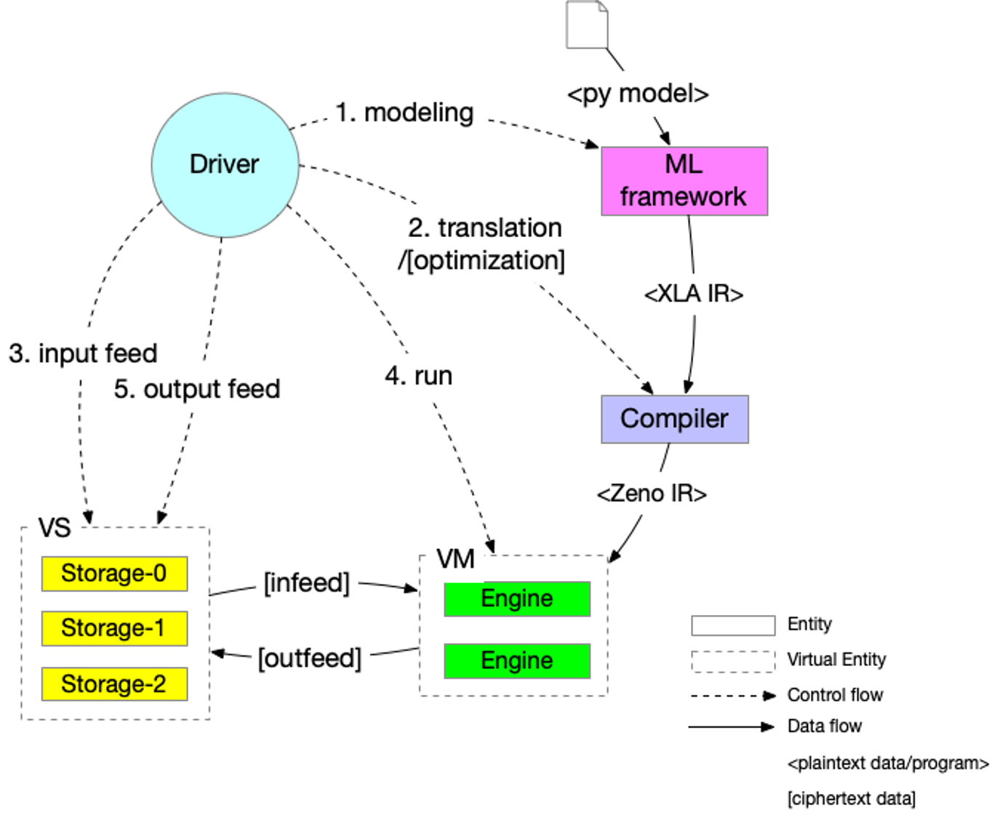

:target{#design-workflow}

# Design: workflow

<Container type="warning">
  This is an early stage design document, the concepts may not match the implementation.
</Container>

:target{#concepts}

## Concepts

:target{#components}

### Components

Before formal definition of SPU components, we define kinds of entities first.

- <em>Entity</em>: an entity is a lib/process/service which could be deployed to provide some functionalities.
- <em>Virtual entity</em>: a virtual entity is a group of entities which cooperates to provide some functionalities.

SPU component is an entity or virtual entity.

- <strong>Compiler</strong>: is an entity which translates/optimizes a XLA DAG to a SPU DAG.
- <strong>(Compute) Engine</strong>: is an entity that cooperates with other engines to do secure evaluation.
- <strong>Virtual Machine</strong>: is a virtual entity which consists of a group of engines, and can launch a SPU computation.
- <strong>Storage Engine</strong>: is an entity which provides input data (data provider) or receives output data (data sink).
- <strong>Virtual Storage</strong>: is a virtual entity which contains a group of storage engines.
- <strong>Driver</strong>: is an entity which drives all entities/virtual engines to jointly complete a secure evaluation.

SPU components are typically hosted by several parties which do not trust each other. We usually assign different roles to these parties.

Kind of roles:

- <strong>Data provider</strong>: which hosts storage engine.
- <strong>Algorithm provider</strong>: which provides the algorithm.
- <strong>Computing provider</strong>: which hosts one or more compute engines.

Note, one party may have multiple roles, for example:

- one party could provide data while also participate in the computation.
- one party could host all compute engines and claim that engines do not collude with each other, that is the ‘out-sourcing mode’.

:target{#compare-to-classic-architecture}

### Compare to classic architecture

<table id="id1">
  <caption>
    comparison to classic architecture.
  </caption>

  <thead>
    <tr>
      <td>
        SPU
      </td>

      <td>
        Classic
      </td>

      <td>
        Difference
      </td>
    </tr>
  </thead>

  <tbody>
    <tr>
      <td>
        SPU VM
      </td>

      <td>
        CPU
      </td>

      <td>
        SPU VM composed by multiple engines who follows MPC protocol
      </td>
    </tr>

    <tr>
      <td>
        SPU VS
      </td>

      <td>
        Disks
      </td>

      <td>
        SPU storage composed by multiple participants who do not trust each other
      </td>
    </tr>

    <tr>
      <td>
        Data infeed
      </td>

      <td>
        Disk read
      </td>

      <td>
        SPU data infeed will make data invisible to engines.
      </td>
    </tr>

    <tr>
      <td>
        Data outfeed
      </td>

      <td>
        Disk write
      </td>

      <td>
        SPU data output will reveal value from engines.
      </td>
    </tr>
  </tbody>
</table>

:target{#deployment}

### Deployment

A SPU component can be deployed:

- <strong>As a lib</strong>: used by other applications, (i.e. python runtime)
- <strong>As a binary</strong>: that could be used as a standalone program.
- <strong>As a service</strong>: that could be called remotely.

<table id="id2">
  <caption>
    Component deployment method.
  </caption>

  <thead>
    <tr>
      <td>
        Component
      </td>

      <td>
        As a lib
      </td>

      <td>
        As a binary
      </td>

      <td>
        As a service
      </td>
    </tr>
  </thead>

  <tbody>
    <tr>
      <td>
        Compiler/C++
      </td>

      <td>
        expose pybind
      </td>

      <td>
        standalone compiler
      </td>

      <td>
        close-source, focus on optimization
      </td>
    </tr>

    <tr>
      <td>
        Engine/C++
      </td>

      <td>
        N/A
      </td>

      <td>
        N/A
      </td>

      <td>
        standalone service program
      </td>
    </tr>

    <tr>
      <td>
        Storage Engine/C++
      </td>

      <td>
        N/A
      </td>

      <td>
        N/A
      </td>

      <td>
        standalone service program
      </td>
    </tr>

    <tr>
      <td>
        Driver/python
      </td>

      <td>
        expose pybind
      </td>

      <td>
        N/A
      </td>

      <td>
        N/A
      </td>
    </tr>
  </tbody>
</table>

Deployment unit.

- <strong>SPU Daemon</strong>: is a program that serves <em>compute engine</em> or <em>storage engine</em>
- <strong>SPU Compiler</strong>: is a program that translates/optimizes XLA IR to SPU IR.
- <strong>driver</strong>: is a lib which drives compile/data-placement/run pipeline.

:target{#workflow}

## Workflow

The following diagram shows a typical control flow of SPU computation.

The whole control flow is driven by the driver/controller.

1. Ask ML framework to compile a model into XLA IR.
2. Ask SPU Compiler to compile XLA IR into SPU IR.
3. Ask storage engines to infeed data to engine’s symbol table.
4. Ask compute engines to run SPU IR.
5. Ask storage engine to outfeed from engine’s symbol table.

:target{#simple-workflow}

### Simple workflow

The following diagram shows detailed steps:

<Mermaid code={"sequenceDiagram\n  autonumber\n  participant Driver\n  participant TF as TF\n  participant Compiler\n  participant VS as Virtual Storage\n  participant VM as Virtual Machine\n\n  Driver->>Driver: write tf program\n\n  Driver->>+VS: initiate Dataset\n  VS->>-Driver: ref to remote dataset\n\n  loop [model.fit foreach minibatch]\n    Driver->>+VS: next(Dataset)\n    VS->>-Driver: ref to remote tensor\n\n    Driver->>+TF: ask tf to compile tf.function (with ref tensor)\n    TF->>-Driver: XLA.HLO (may cached)\n\n    Driver->>+Compiler: ask SPU Compiler to compile XLA.HLO\n    Compiler->>-Driver: XLA.HLO [optional] + infeed + SPU IR (may cached)\n\n    Driver-->>VS: ask virtual storage to infeed\n    activate VS\n    VS-->>VM: infeed data\n    deactivate VS\n    activate VM\n    VM-->>VS: ref or error\n    deactivate VM\n    activate VS\n    VS-->>Driver: ref or error\n    deactivate VS\n\n    Driver-->>+VM: ask virtual machine to run SPU IR\n    VM-->>-Driver: ref or error\n\n    Driver-->>VS: ask virtual storage to gather result data\n    activate VS\n    VS-->>VM: outfeed data\n    deactivate VS\n    activate VM\n    VM-->>VS: ref or error\n    deactivate VM\n    activate VS\n    VS-->>Driver: ref or error\n    deactivate VS\n  end"} />

- <strong>step 1</strong>, driver writes a normal tensorflow program that could be decorated with <cite>tf.function</cite>.
- <strong>step 2-3</strong> driver asks virtual storage to instantiate dataset.
- <strong>step 4-5</strong> driver asks virtual storage to load next batch, get a reference to remote tensor.
- <strong>step 6-7</strong> driver asks tensorflow engine to compile the program into XLA.HLO, with reference tensor.
- <strong>step 8-9</strong> driver asks SPU Compiler to compile the XLA.HLO into SPU IR.
- <strong>step 10-13</strong> driver asks virtual storage to infeed data into VM’s symbol table.
- <strong>step 14-15</strong> driver asks VM to run compiled SPU IR.
- <strong>step 16-19</strong> driver asks virtual storage to outfeed data from VM’s symbol table.

In the above steps, <strong>step 4-5</strong>, <strong>step 10-19</strong> are virtual steps, since both virtual machine and virtual storage are <em>virtual object</em> that can not be interacted directly.

The concrete steps is defined by the virtual machine and storage layout. For example:

- suppose we have 2 data sources <em>Alice</em> and <em>Bob</em>, where <em>Alice</em> also acts as a data sink.
- suppose we have 3 compute engines, which compose a 3-PC virtual machine.
- suppose input <cite>x</cite> comes from <em>Alice</em>, <cite>y</cite> comes from <em>Bob</em>, and the output <cite>z</cite> is revealed to <em>Alice</em>.

:target{#data-load}

#### Data load

<Mermaid code={"sequenceDiagram\n  autonumber\n  participant Driver\n  participant D0 as Alice\n  participant D1 as Bob\n\n  par [ask Alice load data]\n    Driver->>+D0: ask Alice to load data `x`\n    Note over D0: Load `x`, maybe from local csv file.\n    D0->>-Driver: done or error\n\n  and [ask Bob to load data]\n    Driver->>+D1: ask Bob to load data `y`\n    Note over D0: Load `y`, maybe from local database.\n    D1->>-Driver: done or error\n\n  end"} align="left" />

- <strong>step 1-2</strong> <em>Alice</em> loads symbol ‘x’ into it’s local symbol table.
- <strong>step 3-4</strong> <em>Bob</em> loads symbol ‘y’ into it’s local symbol table.

:target{#data-infeed}

#### Data infeed

The above <strong>step 9-12</strong> does data infeed, the concrete steps look like:

<Mermaid code={"sequenceDiagram\n  autonumber\n  participant Driver\n  participant D0 as Alice\n  participant D1 as Bob\n  participant E0 as Engine-0\n  participant E1 as Engine-1\n  participant E2 as Engine-2\n\n  par [ask Alice to place data]\n    Driver->>+D0: ask Alice to split & place data.\n    D0->>D0: Split x into (x1, x2, x3)\n    par [send x0 to E0]\n      D0->>E0: x0\n    and [send x1 to E1]\n      D0->>E1: x1\n    and [send x2 to E2]\n      D0->>E2: x2\n    end\n\n  and [ask Bob to place data]\n    Driver->>+D1: ask Bob to split & place data.\n    D1->>D1: Split y into (y1, y2, y3)\n    par [send y0 to E0]\n      D1->>E0: y0\n    and [send y1 to E1]\n      D1->>E1: y1\n    and [send y2 to E2]\n      D1->>E2: y2\n    end\n\n  end"} align="left" />

- <strong>step 1-5</strong> and <strong>step 6-10</strong> ask <em>Alice</em> and <em>Bob</em> to do infeed simultaneously, and could be done in parallel.
- <strong>step 2</strong>, <em>Alice</em> splits <cite>x</cite> into shares <cite>(x1, x2, x3)</cite>, note: this progress is mpc-protocol dependent.
- <strong>step 3-5</strong>, <em>Alice</em> sends slices of <cite>xi</cite> to each of the engines, could be done in parallel.
- <strong>step 6-10</strong>, <em>Bob</em> does the same thing as <em>Alice</em>.

:target{#run}

#### Run

<Mermaid code={"sequenceDiagram\n  autonumber\n  participant Driver\n  participant E0 as Engine-0\n  participant E1 as Engine-1\n  participant E2 as Engine-2\n\n  Note right of Driver: all input data have been fed in engines' symbol table already\n\n  par [ask E0 to run]\n  Driver->>+E0: SPU IR\n  E0->>-Driver: done or error\n  and [ask E1 to run]\n  Driver->>+E1: SPU IR\n  E1->>-Driver: done or error\n  and [ask E2 to run]\n  Driver->>+E2: SPU IR\n  E2->>-Driver: done or error\n  end\n\n  Note right of Driver: all output and captured data are in engines' symbol table."} align="left" />

- <strong>step 1-2</strong>, driver asks Engine-0 to run the compiled program, note, the input data is feed at this time.
- <strong>step 3-4, 5-6</strong> driver asks Engine-1 & 2 to do the same thing.

:target{#data-outfeed}

#### Data outfeed

Note in this example, <em>Alice</em> also acts as the data sink, the output is revealed to <em>Alice</em>.

<Mermaid code={"sequenceDiagram\n  autonumber\n  participant Driver\n  participant D0 as Alice\n  participant E0 as Engine-0\n  participant E1 as Engine-1\n  participant E2 as Engine-2\n\n  Driver->>D0: ask to collect output data.\n  par [ask for slices]\n    D0->>+E0: request for output z0\n    E0->>-D0: z0\n  and [ask for slices]\n    D0->>+E1: request for output z1\n    E1->>-D0: z1\n  and [ask for slices]\n    D0->>+E2: request for output z1\n    E2->>-D0: z2\n  end\n\n  D0->>D0: Reconstruct z from (z1, z2, z3)"} align="left" />

- <strong>step 2-7</strong> <em>Alice</em> gathers sharings of <cite>z</cite> from engines, note: this progress is mpc-protocol dependent.
- <strong>step 8</strong> <em>Alice</em> reconstructs the result locally.

:target{#full-workflow}

### Full workflow

The following diagram shows workflow with local VS local processing.

<Mermaid code={"sequenceDiagram\n  autonumber\n  participant Driver\n  participant TF as TF@Driver\n  participant Compiler\n  participant VS as Virtual Storage\n  participant VSXLA as TF@VS\n  participant VM as Virtual Machine\n\n  Driver->>Driver: write tf program\n\n  Driver->>+VS: initiate Dataset\n  VS->>-Driver: ref or error\n\n  rect rgb(204, 255, 204)\n    loop [model.fit foreach minibatch]\n      Driver->>+VS: next(Dataset)\n      VS->>-Driver: ref or error\n\n      Driver->>+TF: ask tf to compile tf.function\n      TF->>-Driver: XLA.HLO (may cached)\n\n      Driver->>+Compiler: ask SPU Compiler to compile XLA.HLO\n      Compiler->>-Driver: XLA.HLO [optional] + infeed + SPU IR (may cached)\n\n      Driver-->>VS: ask virtual storage to run XLA.HLO + infeed\n      activate VS\n      VS->>+VSXLA: run XLA.HLO\n      deactivate VS\n      VSXLA->>-VS: ref or error\n      activate VS\n      VS-->>VM: infeed data\n      deactivate VS\n      activate VM\n      VM-->>VS: ref or error\n      deactivate VM\n      activate VS\n      VS-->>Driver: ref or error\n      deactivate VS\n\n      Driver-->>+VM: ask virtual machine to run SPU IR\n      VM-->>-Driver: ref or error\n\n      Driver-->>VS: ask virtual storage to gather result data\n      activate VS\n      VS-->>VM: outfeed data\n      deactivate VS\n      activate VM\n      VM-->>VS: ref or error\n      deactivate VM\n      activate VS\n      VS-->>Driver: ref or error\n      deactivate VS\n    end\n  end"} />

In the above picture, we can do local computation on <em>VS</em> side, which makes it suitable for FL like application.
