:target{#Pitfalls---Fxp-Arithmetic}

# Pitfalls - Fxp Arithmetic

We have confirmed the precision issues or input limitations with the following ops.

We will update this part promptly.

:target{#Simulation}

## Simulation

We will use SPU <strong>simulation</strong> tool to simulate multi-parties with threads.

<Notebook.Cell>
  <Notebook.CodeArea prompt="[1]:" stderr={false} type="input">
    ```python
    import spu
    import jax.numpy as jnp
    import numpy as np
    from matplotlib import pyplot as plt

    plt.rcParams['figure.dpi'] = 70

    # import spu simulation module
    import spu.utils.simulation as pps
    ```
  </Notebook.CodeArea>
</Notebook.Cell>

:target{#Default-Runtime-Config-Parameters}

## Default Runtime Config Parameters

We will use the following common settings in SPU Runtime config. Other parameters may be modified however.

<Notebook.Cell>
  <Notebook.CodeArea prompt="[2]:" stderr={false} type="input">
    ```python
    DEFAULT_SPU_PROTOCOL = spu.ProtocolKind.ABY3
    DEFAULT_SPU_FIELD = spu.FieldType.FM64
    DEFAULT_SPU_FXP_FRACTION_BITS = 18
    ```
  </Notebook.CodeArea>
</Notebook.Cell>

:target{#Unary-Operator}

## Unary Operator

:target{#Reciprocal}

### Reciprocal

SPU uses Goldschmidt’s method to calculate Reciprocal. Please refer to [Secure Computation With Fixed-Point Numbers](http://citeseerx.ist.psu.edu/viewdoc/download?doi=10.1.1.221.1305\&rep=rep1\&type=pdf) for details.

Reciprocal is only correct if input belongs to <strong>(-2\*\*fxp\_fraction\_bits, 2\*\*fxp\_fraction\_bits)</strong>.

First, let’s have a look at the figure.

<Notebook.Cell>
  <Notebook.CodeArea prompt="[3]:" stderr={false} type="input">
    ```python
    config = spu.RuntimeConfig(
        protocol=DEFAULT_SPU_PROTOCOL,
        field=DEFAULT_SPU_FIELD,
        fxp_fraction_bits=DEFAULT_SPU_FXP_FRACTION_BITS,
    )
    simulator = pps.Simulator(3, config)
    spu_reciprocal = pps.sim_jax(simulator, jnp.reciprocal)

    fig, ((ax1, ax2), (ax3, ax4)) = plt.subplots(2, 2, figsize=(12, 8))
    fig.suptitle("Reciprocal")


    def plot_reciprocal(spu_reciprocal, ax, x, title):
        (line1,) = ax.plot(x, 1.0 / x, label='expected 1/x')
        (line2,) = ax.plot(x, spu_reciprocal(x), label='spu 1/x')
        ax.legend()
        ax.title.set_text(title)


    plot_reciprocal(spu_reciprocal, ax1, np.linspace(0.001, 1.0, num=1000), '(0.001, 1.0)')
    plot_reciprocal(
        spu_reciprocal,
        ax2,
        np.linspace(1.0, 2**DEFAULT_SPU_FXP_FRACTION_BITS - 1, num=1000),
        '(1.0, 2**DEFAULT_SPU_FXP_FRACTION_BITS)',
    )
    plot_reciprocal(
        spu_reciprocal, ax3, np.linspace(-1.0, -0.001, num=1000), '(-1.0, 1000)'
    )
    plot_reciprocal(
        spu_reciprocal,
        ax4,
        np.linspace(-(2**DEFAULT_SPU_FXP_FRACTION_BITS) + 1, -1.0, num=1000),
        '(-2**DEFAULT_SPU_FXP_FRACTION_BITS,-1.0)',
    )
    plt.show()
    ```
  </Notebook.CodeArea>

  <Notebook.FancyOutput prompt="" type="output">
    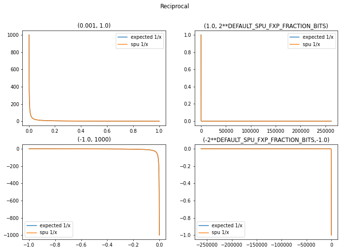
  </Notebook.FancyOutput>
</Notebook.Cell>

Actually the precision is quite high.

<Notebook.Cell>
  <Notebook.CodeArea prompt="[4]:" stderr={false} type="input">
    ```python
    x = np.linspace(
        -(2**DEFAULT_SPU_FXP_FRACTION_BITS) + 1,
        2**DEFAULT_SPU_FXP_FRACTION_BITS - 1,
        num=1000,
    )
    expected_y = 1.0 / x
    y = spu_reciprocal(x)

    assert np.allclose(y, expected_y, rtol=1e-04, atol=1e-5)
    ```
  </Notebook.CodeArea>
</Notebook.Cell>

Let’s have an idea about what happens if input is not within the valid range.

<Notebook.Cell>
  <Notebook.CodeArea prompt="[5]:" stderr={false} type="input">
    ```python
    fig, (ax1, ax2) = plt.subplots(2, 1, figsize=(12, 8))
    fig.suptitle("Reciprocal - Incorrect")


    def plot_reciprocal(spu_reciprocal, ax, x, title):
        (line1,) = ax.plot(x, 1.0 / x, label='expected 1/x')
        (line2,) = ax.plot(x, spu_reciprocal(x), label='spu 1/x')
        ax.legend()
        ax.title.set_text(title)


    plot_reciprocal(
        spu_reciprocal,
        ax1,
        np.linspace(
            2**DEFAULT_SPU_FXP_FRACTION_BITS,
            2**DEFAULT_SPU_FXP_FRACTION_BITS + 1000,
            num=1000,
        ),
        '(2**DEFAULT_SPU_FXP_FRACTION_BITS, 2**DEFAULT_SPU_FXP_FRACTION_BITS + 1000)',
    )

    plot_reciprocal(
        spu_reciprocal,
        ax2,
        np.linspace(
            -(2**DEFAULT_SPU_FXP_FRACTION_BITS) - 1000,
            -(2**DEFAULT_SPU_FXP_FRACTION_BITS),
            num=1000,
        ),
        '(-2**DEFAULT_SPU_FXP_FRACTION_BITS - 1000,-2**DEFAULT_SPU_FXP_FRACTION_BITS)',
    )
    plt.show()
    ```
  </Notebook.CodeArea>

  <Notebook.FancyOutput prompt="" type="output">
    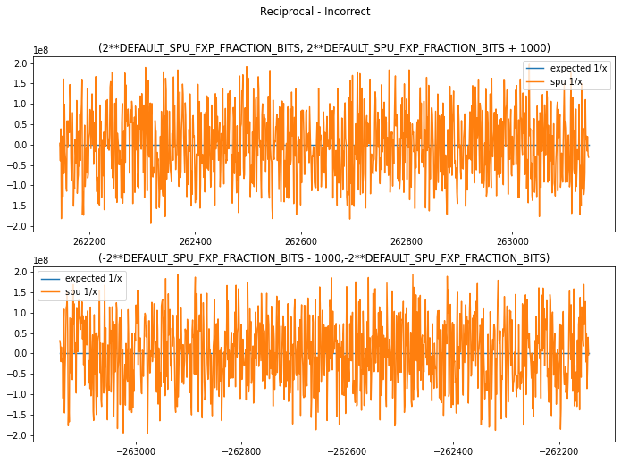
  </Notebook.FancyOutput>
</Notebook.Cell>

:target{#Natural-Logarithm}

### Natural Logarithm

SPU uses Pade approximation by default. Please check [Benchmarking Privacy Preserving Scientific Operations](https://www.esat.kuleuven.be/cosic/publications/article-3013.pdf) for details.

Logarithm is only correct if input belongs to <strong>(0, 2\*\*fxp\_fraction\_bits)</strong>.

> <strong>NOTE:</strong> Similar conclusion also applies to <strong>log1p</strong>, <strong>log2</strong>.

<Notebook.Cell>
  <Notebook.CodeArea prompt="[6]:" stderr={false} type="input">
    ```python
    config = spu.RuntimeConfig(
        protocol=DEFAULT_SPU_PROTOCOL,
        field=DEFAULT_SPU_FIELD,
        fxp_fraction_bits=DEFAULT_SPU_FXP_FRACTION_BITS,
    )
    simulator = pps.Simulator(3, config)

    spu_log = pps.sim_jax(simulator, jnp.log)
    x = np.linspace(0.0001, 2**DEFAULT_SPU_FXP_FRACTION_BITS - 1, num=1000)
    expected_y = np.log(x)
    y = spu_log(x)

    fig, ax = plt.subplots(figsize=(12, 8))
    fig.suptitle("Natural Logarithm(Pade Approximation)")
    (line1,) = ax.plot(x, expected_y, label='expected log(x)')
    (line2,) = ax.plot(x, y, label='spu log(x)')
    ax.legend()
    plt.show()
    ```
  </Notebook.CodeArea>

  <Notebook.FancyOutput prompt="" type="output">
    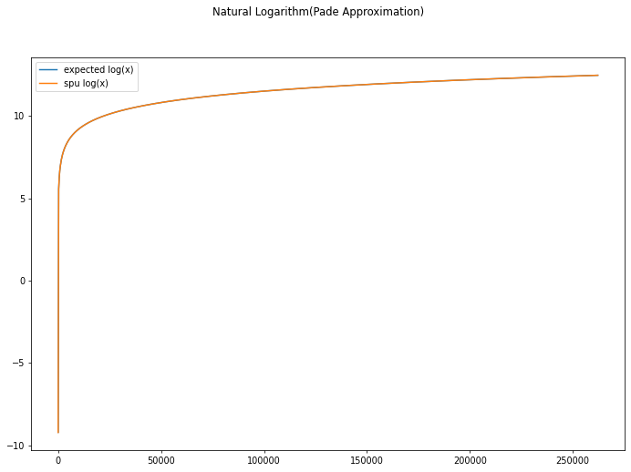
  </Notebook.FancyOutput>
</Notebook.Cell>

<Notebook.Cell>
  <Notebook.CodeArea prompt="[7]:" stderr={false} type="input">
    ```python
    assert np.allclose(y, expected_y, rtol=1e-3, atol=1e-5)
    ```
  </Notebook.CodeArea>
</Notebook.Cell>

Again, let’s see what happens if input is out of valid range.

<Notebook.Cell>
  <Notebook.CodeArea prompt="[8]:" stderr={false} type="input">
    ```python
    x = np.linspace(
        2**DEFAULT_SPU_FXP_FRACTION_BITS,
        2**DEFAULT_SPU_FXP_FRACTION_BITS + 1000,
        num=1000,
    )
    expected_y = np.log(x)
    y = spu_log(x)

    fig, ax = plt.subplots(figsize=(12, 8))
    fig.suptitle("Natural Logarithm(Pade Approximation) - Incorrect")
    (line1,) = ax.plot(x, expected_y, label='expected log(x)')
    (line2,) = ax.plot(x, y, label='spu log(x)')
    ax.legend()
    plt.show()
    ```
  </Notebook.CodeArea>

  <Notebook.FancyOutput prompt="" type="output">
    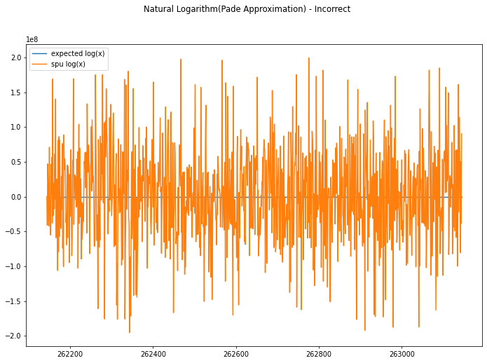
  </Notebook.FancyOutput>
</Notebook.Cell>

:target{#Another-Choice:-Newton-Approximation}

#### Another Choice: Newton Approximation

If you would like to compute faster, you may switch to Newton Approximation. But the precision is lower and valid input range is around <strong>(0, 250)</strong>.

<Notebook.Cell>
  <Notebook.CodeArea prompt="[9]:" stderr={false} type="input">
    ```python
    config = spu.RuntimeConfig(
        protocol=DEFAULT_SPU_PROTOCOL,
        field=DEFAULT_SPU_FIELD,
        fxp_fraction_bits=DEFAULT_SPU_FXP_FRACTION_BITS,
        fxp_log_mode=spu.RuntimeConfig.LOG_NEWTON,
    )
    simulator = pps.Simulator(3, config)

    spu_log = pps.sim_jax(simulator, jnp.log)
    x = np.linspace(0.0001, 250, num=1000)
    expected_y = np.log(x)
    y = spu_log(x)

    fig, ax = plt.subplots(figsize=(12, 8))
    fig.suptitle("Natural Logarithm(Newton Approximation)")
    (line1,) = ax.plot(x, expected_y, label='expected log(x)')
    (line2,) = ax.plot(x, y, label='spu log(x)')
    ax.legend()
    plt.show()
    ```
  </Notebook.CodeArea>

  <Notebook.FancyOutput prompt="" type="output">
    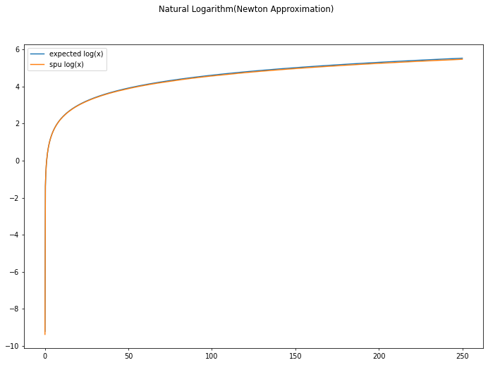
  </Notebook.FancyOutput>
</Notebook.Cell>

While, if out of valid input…

<Notebook.Cell>
  <Notebook.CodeArea prompt="[10]:" stderr={false} type="input">
    ```python
    x = np.linspace(250, 500, num=1000)
    expected_y = np.log(x)
    y = spu_log(x)

    fig, ax = plt.subplots(figsize=(12, 8))
    fig.suptitle("Natural Logarithm(Newton Approximation) - Incorrect")
    (line1,) = ax.plot(x, expected_y, label='expected log(x)')
    (line2,) = ax.plot(x, y, label='spu log(x)')
    ax.legend()
    plt.show()
    ```
  </Notebook.CodeArea>

  <Notebook.FancyOutput prompt="" type="output">
    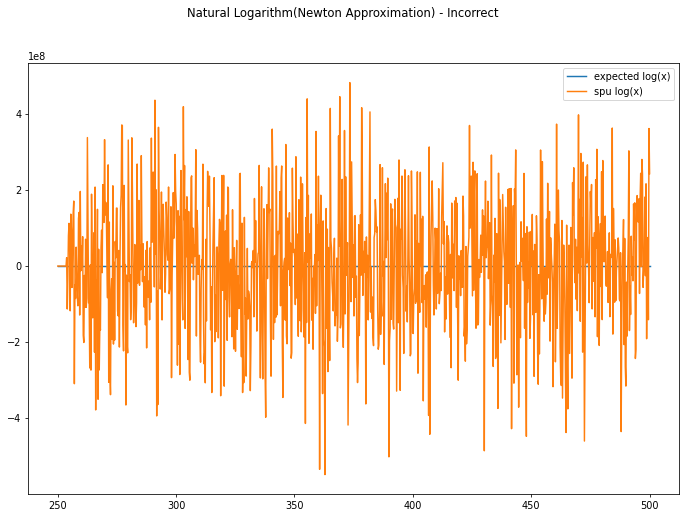
  </Notebook.FancyOutput>
</Notebook.Cell>

:target{#Natural-Exponential}

### Natural Exponential

The current implementation is based on Taylor approximation. The valid input range is around <strong>(0, 10)</strong>.

> <strong>NOTE:</strong> Similar conclusion also applies to <strong>exp2</strong>.

<Notebook.Cell>
  <Notebook.CodeArea prompt="[11]:" stderr={false} type="input">
    ```python
    config = spu.RuntimeConfig(
        protocol=DEFAULT_SPU_PROTOCOL,
        field=DEFAULT_SPU_FIELD,
        fxp_fraction_bits=DEFAULT_SPU_FXP_FRACTION_BITS,
    )
    simulator = pps.Simulator(3, config)

    spu_exp = pps.sim_jax(simulator, jnp.exp)
    x = np.linspace(0.0001, 15, num=1000)
    expected_y = np.exp(x)
    y = spu_exp(x)

    fig, ax = plt.subplots(figsize=(12, 8))
    fig.suptitle("Natural Exponential(Taylor Approximation)")
    (line1,) = ax.plot(x, expected_y, label='expected exp(x)')
    (line2,) = ax.plot(x, y, label='spu exp(x)')
    ax.legend()
    plt.show()
    ```
  </Notebook.CodeArea>

  <Notebook.FancyOutput prompt="" type="output">
    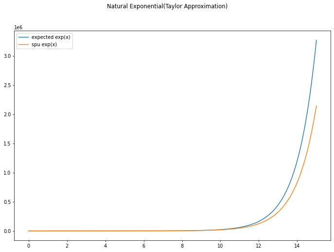
  </Notebook.FancyOutput>
</Notebook.Cell>

If input not in valid range, then…

<Notebook.Cell>
  <Notebook.CodeArea prompt="[12]:" stderr={false} type="input">
    ```python
    x = np.linspace(10, 20, num=1000)
    expected_y = np.exp(x)
    y = spu_exp(x)

    fig, ax = plt.subplots(figsize=(12, 8))
    fig.suptitle("Natural Exponential(Taylor Approximation) - Incorrect")
    (line1,) = ax.plot(x, expected_y, label='expected exp(x)')
    (line2,) = ax.plot(x, y, label='spu exp(x)')
    ax.legend()
    plt.show()
    ```
  </Notebook.CodeArea>

  <Notebook.FancyOutput prompt="" type="output">
    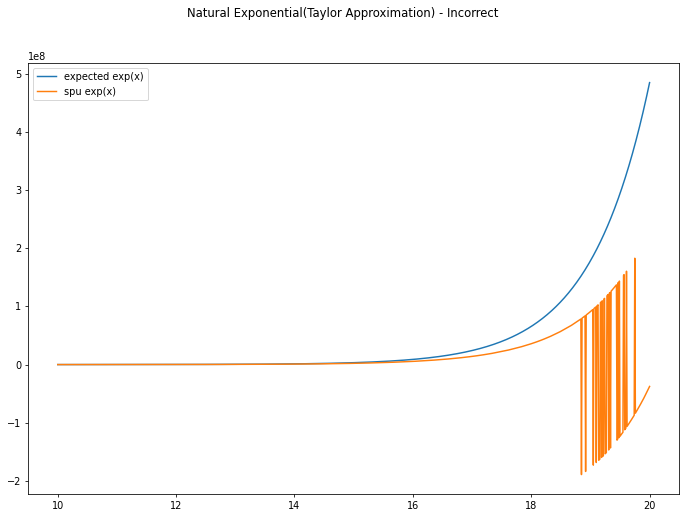
  </Notebook.FancyOutput>
</Notebook.Cell>

:target{#Another-Choice:-Pade-Approximation}

#### Another Choice: Pade Approximation

SPU also implements Pade Approximation which has a larger valid input range - <strong>(0, 20)</strong> but with slower computation speed.

<Notebook.Cell>
  <Notebook.CodeArea prompt="[13]:" stderr={false} type="input">
    ```python
    config = spu.RuntimeConfig(
        protocol=DEFAULT_SPU_PROTOCOL,
        field=DEFAULT_SPU_FIELD,
        fxp_fraction_bits=DEFAULT_SPU_FXP_FRACTION_BITS,
        fxp_exp_mode=spu.RuntimeConfig.EXP_PADE,
    )
    simulator = pps.Simulator(3, config)

    spu_exp = pps.sim_jax(simulator, jnp.exp)
    x = np.linspace(0.0001, 40, num=1000)
    expected_y = np.exp(x)
    y = spu_exp(x)

    fig, ax = plt.subplots(figsize=(12, 8))
    fig.suptitle("Natural Exponential(Pade Approximation)")
    (line1,) = ax.plot(x, expected_y, label='expected exp(x)')
    (line2,) = ax.plot(x, y, label='spu exp(x)')
    ax.legend()
    plt.show()
    ```
  </Notebook.CodeArea>

  <Notebook.FancyOutput prompt="" type="output">
    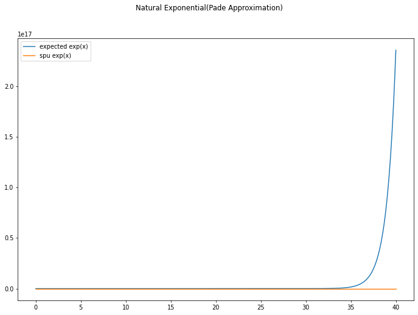
  </Notebook.FancyOutput>
</Notebook.Cell>

Let’s check if input is larger than 20:

<Notebook.Cell>
  <Notebook.CodeArea prompt="[14]:" stderr={false} type="input">
    ```python
    x = np.linspace(20, 25, num=1000)
    expected_y = np.exp(x)
    y = spu_exp(x)

    fig, ax = plt.subplots(figsize=(12, 8))
    fig.suptitle("Natural Exponential(Pade Approximation) - Incorrect")
    (line1,) = ax.plot(x, expected_y, label='expected exp(x)')
    (line2,) = ax.plot(x, y, label='spu exp(x)')
    ax.legend()
    plt.show()
    ```
  </Notebook.CodeArea>

  <Notebook.FancyOutput prompt="" type="output">
    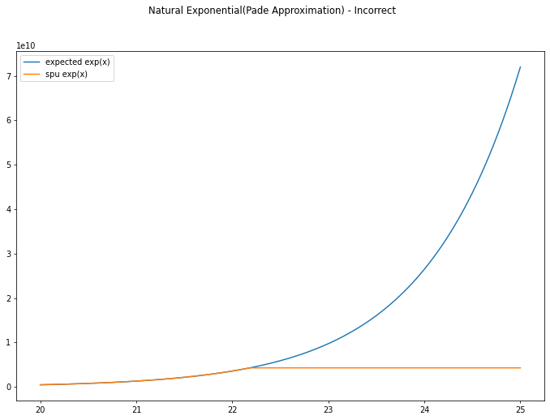
  </Notebook.FancyOutput>
</Notebook.Cell>

:target{#Hyperbolic-Tangent}

### Hyperbolic Tangent

SPU uses Pade Approximation for implementation. The parameters refer to [Wolfram](https://www.wolframalpha.com/input?i=Pade+approximation+tanh%28x%29+order+5%2C5). The valid input range is about <strong>(-5,5)</strong>.

<Notebook.Cell>
  <Notebook.CodeArea prompt="[15]:" stderr={false} type="input">
    ```python
    config = spu.RuntimeConfig(
        protocol=DEFAULT_SPU_PROTOCOL,
        field=DEFAULT_SPU_FIELD,
        fxp_fraction_bits=DEFAULT_SPU_FXP_FRACTION_BITS,
    )
    simulator = pps.Simulator(3, config)

    spu_tanh = pps.sim_jax(simulator, jnp.tanh)
    x = np.linspace(-15, 15, num=1000)
    expected_y = np.tanh(x)
    y = spu_tanh(x)

    fig, ax = plt.subplots(figsize=(12, 8))
    fig.suptitle("Hyperbolic Tangent")
    (line1,) = ax.plot(x, expected_y, label='expected tanh(x)')
    (line2,) = ax.plot(x, y, label='spu tanh(x)')
    ax.legend()
    plt.show()
    ```
  </Notebook.CodeArea>

  <Notebook.FancyOutput prompt="" type="output">
    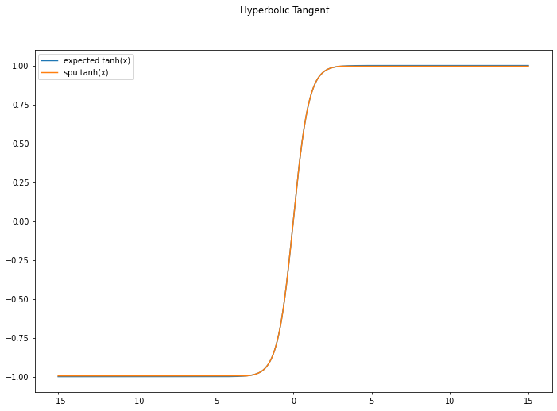
  </Notebook.FancyOutput>
</Notebook.Cell>

:target{#Binary-Operator}

## Binary Operator

:target{#Div}

### Div

SPU uses Goldschmidt’s method to calculate division. Please refer to [Secure Computation With Fixed-Point Numbers](http://citeseerx.ist.psu.edu/viewdoc/download?doi=10.1.1.221.1305\&rep=rep1\&type=pdf) for details.

So we have a similar valid input range to <strong>b</strong>, which is <strong>(-2\*\*fxp\_fraction\_bits, 2\*\*fxp\_fraction\_bits)</strong>. Please check details at <strong>reciprocal</strong> part.

Besides, We do find some subtle pitfalls in real applications:

1. Overflow when numerator is large.
2. Some gap between numpy output.

<strong>Rule of thumb</strong>

We recommend users to try some actions if you come across “strange” outputs:

1. If <strong>huge error</strong> occurs(maybe even <strong>opposite sign</strong>):
   - It’s common that numerator is <strong>too large</strong>, which leads to overflow.
   - Try <strong>Larger</strong> field(`FM128`) first. Larger field can accommodate larger number when fxp is fixed, so overflow can be avoided. But it will drag down the efficiency of <strong>nearly all op</strong> dramatically.
2. Else, if the gap is not very significant, you can try to modify another two parameters:
   1. Enlarging `fxp_fraction_bits`: it is an essential parameters for fixed-point arithmetic and will influence all the op associated with float-point. For fixed field, larger fxp can support more bits for fraction part which may give more precision. However, larger fxp will occupy the bits for integer part, and makes <strong>overflow</strong> easier.
   2. Enlarging `fxp_div_goldschmidt_iters`: the precision of Goldschmidt’s method depends on iter numbers. So if you eager to more precise output, you can enlarge this parameter. But it’s worthy to note that:
   - Larger this parameter, larger the cost of `Div` and all op containing it(like `Log` and `Tanh`).
   - The final precision is also influenced by field, fxp and even method for truncation. We only recommend to adjust this when you really care about the <strong>high precision</strong>(low absolute error) and other methods not work.

<Notebook.Cell>
  <Notebook.CodeArea prompt="[16]:" stderr={false} type="input">
    ```python
    # some test case
    x = np.array([[423871654, 423871654, 423871654], [419372966, 419372966, 419372966]])
    y = np.array([[793, 793, 793], [778, 778, 778]])
    ```
  </Notebook.CodeArea>
</Notebook.Cell>

<Notebook.Cell>
  <Notebook.CodeArea prompt="[17]:" stderr={false} type="input">
    ```python
    # real div output
    np.divide(x, y)
    ```
  </Notebook.CodeArea>

  <Notebook.CodeArea prompt="[17]:" stderr={false} type="output">
    <pre>
      {"array([[534516.58764187, 534516.58764187, 534516.58764187],\n       [539039.80205656, 539039.80205656, 539039.80205656]])\n"}
    </pre>
  </Notebook.CodeArea>
</Notebook.Cell>

When numerator is very large(<InlineMath>$>2^{28}$</InlineMath> for `FM64` and `fxp=18`), then the integer part may overflow under large probability, and this brings huge error.

<Notebook.Cell>
  <Notebook.CodeArea prompt="[18]:" stderr={false} type="input">
    ```python
    # use default setting as usual
    config = spu.RuntimeConfig(
        protocol=DEFAULT_SPU_PROTOCOL,
        field=DEFAULT_SPU_FIELD,  # FM64
        fxp_fraction_bits=DEFAULT_SPU_FXP_FRACTION_BITS,  # 18fxp
    )
    simulator = pps.Simulator(3, config)

    spu_div = pps.sim_jax(simulator, jnp.divide)

    z = spu_div(x, y)
    ```
  </Notebook.CodeArea>
</Notebook.Cell>

<Notebook.Cell>
  <Notebook.CodeArea prompt="[19]:" stderr={false} type="input">
    ```python
    # get huge difference between real div output
    z
    ```
  </Notebook.CodeArea>

  <Notebook.CodeArea prompt="[19]:" stderr={false} type="output">
    <pre>
      {"array([[10221.877, 10223.456, 10221.877],\n       [14744.429, 14744.429, 14745.99 ]], dtype=float32)\n"}
    </pre>
  </Notebook.CodeArea>
</Notebook.Cell>

In this situation, <strong>enlarging</strong> field to `FM128` may be the only remedy.

<Notebook.Cell>
  <Notebook.CodeArea prompt="[20]:" stderr={false} type="input">
    ```python
    config = spu.RuntimeConfig(
        protocol=DEFAULT_SPU_PROTOCOL,
        field=spu.FieldType.FM128,  # use larger field to accommodate larger numerator
        fxp_fraction_bits=18,  #  fix fxp as FM64 does
    )
    simulator = pps.Simulator(3, config)

    spu_div = pps.sim_jax(simulator, jnp.divide)

    z = spu_div(x, y)
    ```
  </Notebook.CodeArea>
</Notebook.Cell>

<Notebook.Cell>
  <Notebook.CodeArea prompt="[21]:" stderr={false} type="input">
    ```python
    # it behaves much better than FM64.
    # but some minor error always exits
    z
    ```
  </Notebook.CodeArea>

  <Notebook.CodeArea prompt="[21]:" stderr={false} type="output">
    <pre>
      {"array([[534513.06, 534513.06, 534511.44],\n       [539032.44, 539034.  , 539032.44]], dtype=float32)\n"}
    </pre>
  </Notebook.CodeArea>
</Notebook.Cell>

Now, we try larger fxp.

<Notebook.Cell>
  <Notebook.CodeArea prompt="[22]:" stderr={false} type="input">
    ```python
    config = spu.RuntimeConfig(
        protocol=DEFAULT_SPU_PROTOCOL,
        field=spu.FieldType.FM128,  # use larger field to accommodate larger numerator
        fxp_fraction_bits=40,  #  use larger fxp
    )
    simulator = pps.Simulator(3, config)

    spu_div = pps.sim_jax(simulator, jnp.divide)

    z = spu_div(x, y)
    ```
  </Notebook.CodeArea>
</Notebook.Cell>

<Notebook.Cell>
  <Notebook.CodeArea prompt="[23]:" stderr={false} type="input">
    ```python
    # seems similar to fxp=18
    z
    ```
  </Notebook.CodeArea>

  <Notebook.CodeArea prompt="[23]:" stderr={false} type="output">
    <pre>
      {"array([[534510.8, 534510.8, 534510.8],\n       [539033. , 539033. , 539033. ]], dtype=float32)\n"}
    </pre>
  </Notebook.CodeArea>
</Notebook.Cell>

As we have mentioned at <strong>reciprocal</strong> part, SPU implements reciprocal with Goldschmidt’s method, so the final precision depends heavily on the <strong>iter numbers</strong>.

We first go through the algorithm quickly. let <InlineMath>$r_i$</InlineMath> denote the approximation of reciprocal, <InlineMath>$e_i$</InlineMath> be the relative error, then in one iter:

<Math>
  $$
  r_i = r_{i-1}(1+e_i) \\
     e_{i+1} = e_i^2
  $$
</Math>

It’s easy to prove that:

1. To compute `Div(a, b)`, if we need <InlineMath>$|\frac{a}{b} - r_i| \le 2^{-l}$</InlineMath>, then <InlineMath>$\lceil {log(\frac{l +log(a)}{\tau})} \rceil$</InlineMath> iterations should be done(we assume <InlineMath>$|\frac{1}{b} - r_0| \le 2^{-\tau}$</InlineMath>).In current implementation, we choose polynomial of degree 1 as the initial guess of reciprocal, which leads to <InlineMath>$\tau \approx 3.5$</InlineMath>.
2. The relative error <InlineMath>$e_i = e_0^{2^i}$</InlineMath>(same as `Div(a,b)`).

Although some other factors like fxp and truncation will also bring into some errors, the above error analysis can still give readers some recommendations when deciding `fxp_div_goldschmidt_iters`.

<Notebook.Cell>
  <Notebook.CodeArea prompt="[24]:" stderr={false} type="input">
    ```python
    # Now, we enlarge the goldschmidt_iters
    config = spu.RuntimeConfig(
        protocol=DEFAULT_SPU_PROTOCOL,
        field=spu.FieldType.FM128,
        fxp_fraction_bits=18,
        fxp_div_goldschmidt_iters=3,  # set iters to 3
    )
    simulator = pps.Simulator(3, config)

    spu_div = pps.sim_jax(simulator, jnp.divide)

    z = spu_div(x, y)
    ```
  </Notebook.CodeArea>
</Notebook.Cell>

<Notebook.Cell>
  <Notebook.CodeArea prompt="[25]:" stderr={false} type="input">
    ```python
    # now the gap between numpy is very small
    z
    ```
  </Notebook.CodeArea>

  <Notebook.CodeArea prompt="[25]:" stderr={false} type="output">
    <pre>
      {"array([[534517.75, 534516.2 , 534514.6 ],\n       [539037.1 , 539038.7 , 539037.1 ]], dtype=float32)\n"}
    </pre>
  </Notebook.CodeArea>
</Notebook.Cell>
