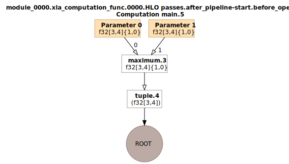

:target{#dump-ir-to-dag}

# Dump IR to DAG

<Container type="warning">
  The configuration for dump IR to DAG maybe unstable. Please refer to the [spu.proto](https://github.com/secretflow/spu/blob/main/libspu/spu.proto) for latest configurations.
</Container>

:target{#introduction}

## Introduction

This document provides the demo for how to dump the IR (Intermediate Representation, generated by [XLA](https://www.tensorflow.org/xla/architecture)) to a DAG.
With the aid of visualized DAG, the execution logic and required operators will be more explicit.

<Container type="note">
  Please refer to [<span>SPU Compiler</span>](compiler.mdx) for description of the role of XLA in SPU.
</Container>

:target{#tl-dr}

## TL;DR

In case you just want to have a try on obtaining the DAG for executed code, we provide a [demo](https://github.com/secretflow/spu/blob/main/examples/python/ir_dump/ir_dump.py) that demonstrates the required code modifications to enable dumping the IR of executed code to a custom path.

For those users who have designated requirements (e.g., dump to txt, dot, html), we recommend to read the following detailed step-by-step elaborations.

:target{#configuration}

## Configuration

Please first have a look at the [spu.proto](https://github.com/secretflow/spu/blob/main/libspu/spu.proto) for SPU. To dump the IR, we should modify the compiler options, which is shown in the following code snippet.

<figure id="id1">
  <figcaption>
    Compiler Options
  </figcaption>

  ```protobuf
  message CompilerOptions {
      // Pretty print
      bool enable_pretty_print = 1;
      string pretty_print_dump_dir = 2;
      XLAPrettyPrintKind xla_pp_kind = 3;

      // Disable sqrt(x) + eps to sqrt(x+eps) rewrite
      bool disable_sqrt_plus_epsilon_rewrite = 10;

      // Disable x/sqrt(y) to x*rsqrt(y) rewrite
      bool disable_div_sqrt_rewrite = 11;

      // Disable reduce truncation optimization
      bool disable_reduce_truncation_optimization = 12;

      // Disable maxpooling optimization
      bool disable_maxpooling_optimization = 13;

      // Disallow mix type operations
      bool disallow_mix_types_opts = 14;

      // Disable SelectOp optimization
      bool disable_select_optimization = 15;

      // Enable optimize x/bcast(y) -> x * bcast(1/y)
      bool enable_optimize_denominator_with_broadcast = 16;
  }
  ```
</figure>

The part of the above code related to dumping IR to DAG is as follows.

<figure id="id2">
  <figcaption>
    Configurations related to dump IR
  </figcaption>

  ```protobuf
  // Pretty print
  bool enable_pretty_print = 1;
  string pretty_print_dump_dir = 2;
  XLAPrettyPrintKind xla_pp_kind = 3;
  ```
</figure>

In general, we require to focus on three variables to control the dump behavior.

- <strong>enable\_pretty\_print</strong> is a <em>bool</em> value, which denotes whether to dump the IR or not.
- <strong>pretty\_print\_dump\_dir</strong> is a <em>string</em> value, which denotes the dump path (should be a directory).
- <strong>xla\_pp\_kind</strong> is a <em>int</em> value, of which the range is \[0, 1, 2], with each one representing one dump format. To date, we support three kinds of formats: TEXT, DOT and HTML. If you want to obtain the DAG, you should use DOT or HTML.

<Container type="note">
  For <strong>DOT</strong> files, you should use [GraphViz](https://graphviz.org/) to convert them to PDF or PNG to visualize the DAG.

  While for <strong>HTML</strong> files, you can directly open the them in your Web Browser, which shall render the DAG.
</Container>

<figure id="id3">
  <figcaption>
    XLA Pretty Print Kind
  </figcaption>

  ```protobuf
  enum XLAPrettyPrintKind {
      TEXT = 0;
      DOT = 1;
      HTML = 2;
  }
  ```
</figure>

:target{#pass-custom-compiler-options}

## Pass custom compiler options

We hereby describe how to manually pass the custom compiler options to dump the IR of executed code.

First of all, we declare an CompilerOptions object. Note that the <strong>pretty\_print\_dump\_dir</strong> is better to be an absolute path.

<figure id="id4">
  <figcaption>
    Declare CompilerOptions object
  </figcaption>

  ```python
  import spu.spu_pb2 as spu_pb2
  copts = spu_pb2.CompilerOptions()
  copts.enable_pretty_print = True
  copts.pretty_print_dump_dir = "your/custom/path"
  copts.xla_pp_kind = 2
  ```
</figure>

Then we pass the CompilerOptions to the executed SPU code.

The code shall be modified from

<figure id="id5">
  <figcaption>
    SPU execution without customized compiler options
  </figcaption>

  ```python
  res_spu = ppd.device("SPU")(func)(x_spu, y_spu)
  ```
</figure>

to

<figure id="id6">
  <figcaption>
    SPU execution with customized compiler options
  </figcaption>

  ```python
  res_spu = ppd.device("SPU")(func, copts=copts)(x_spu, y_spu)
  ```
</figure>

<Container type="note">
  Here, <cite>func</cite> is a Python function. Please refer to the [demo](https://github.com/secretflow/spu/blob/main/examples/python/ir_dump/ir_dump.py) for the context.
</Container>

In the end, you can just run the target code and the output (e.g., DOT) can be found in <strong>your custom path</strong>.

:target{#example}

## Example

We here provide the code snippet for dumping IR to HTML files. The DAG for the executed function is illustrated in the end.

<figure id="id7">
  <figcaption>
    Code snippet for dumping the IR of func
  </figcaption>

  ```python
  def func(x, y):
      """
      Any custom function that consists of operators that SPU currently supports.
      Here, we define a `max` function use jax.numpy.
      """
      return jnp.maximum(x, y)

  def get_data(seed=123):
      """
      Any IO function that loads the data.
      """
      np.random.seed(seed)
      data = np.random.randn(3, 4)
      return data

  x = get_data(1)
  y = get_data(2)

  # SPU secure version
  x_spu = ppd.device("P1")(lambda x: x)(x)
  y_spu = ppd.device("P2")(lambda x: x)(y)

  import spu.spu_pb2 as spu_pb2
  copts = spu_pb2.CompilerOptions()
  copts.enable_pretty_print = True
  copts.pretty_print_dump_dir = "dump/path"
  copts.xla_pp_kind = 2 # HTML format

  res_spu = ppd.device("SPU")(func, copts=copts)(x_spu, y_spu)
  ```
</figure>

<Container type="note">
  You may find multiple files in the output directory since XLA has multiple compile passes and generates multiple IRs, with each corresponding to one DAG.
</Container>

The <strong>HTML</strong> output is rendered as follows.

<figure id="id8">
  

  <figcaption>
    DAG for executed demo function
  </figcaption>
</figure>
