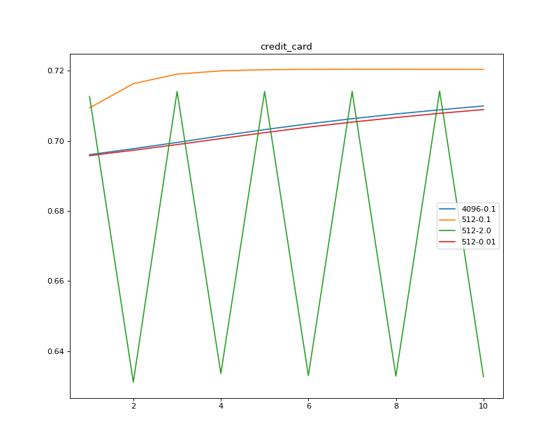
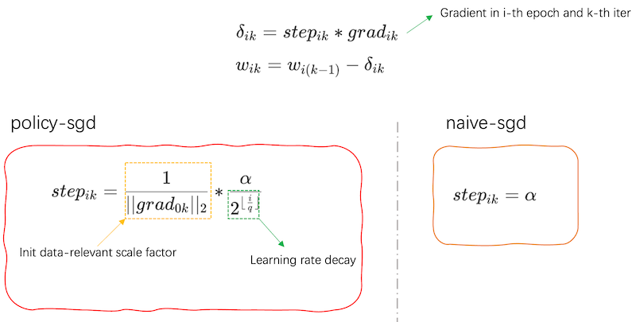
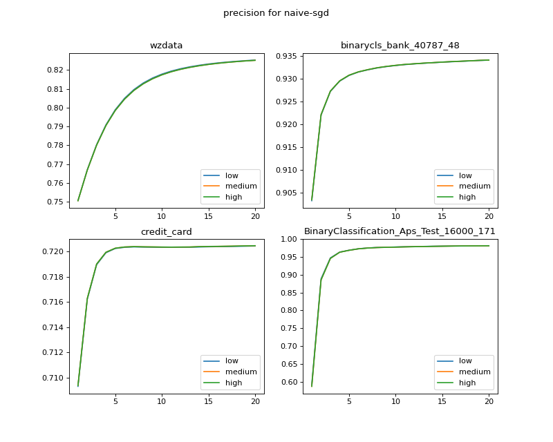
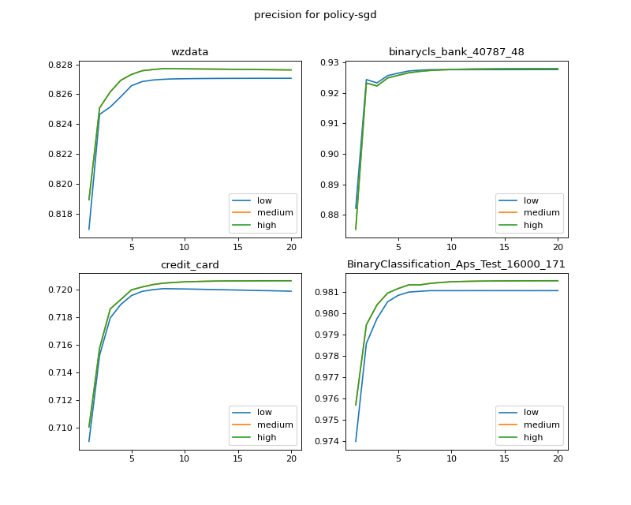
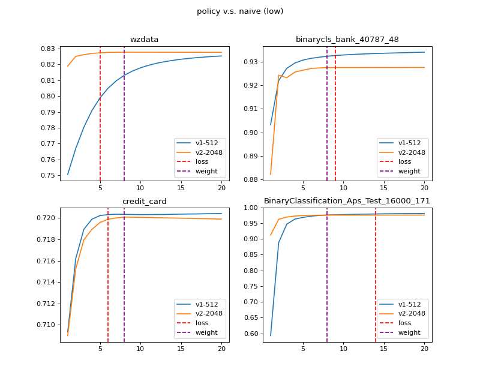

:target{#background-sgd-in-mpc-ml}

# Background: SGD in MPC-ML

SGD(Stochastic Gradient Descent) is a famous optimization algorithm, it updates weights using gradient direction.
However, it suffers that user should choose hyper-parameters very carefully. Of course, grid-search is a potential treatment for this problem, but it becomes impractical when training cost is large.
As an example, When running LR with SGD in [credit card dataset](https://www.kaggle.com/datasets/uciml/default-of-credit-card-clients-dataset) (for 4096-0.1, 4096 is batch\_size, 0.1 is learning\_rate),
we can find that it seems safer to use small batch\_size and learning\_rate, else we get some loss or very strong vibration of auc within 10 epochs(we leave 10000 samples as test dataset randomly).

<figure>
  
</figure>

Unfortunately, when under MPC, even simple algorithm like SSLR, small batch\_size leads to huge training time under limited network resources. Besides, even you have high bandwidth,
small batch\_size can not utilize it!

:target{#how-to-improve-sgd}

## How to improve SGD

Indeed, after our elaborated experiments, we can find two drawbacks of naive SGD:

1. slow update(because of small learning\_rate) at the beginning.
2. vibration happens when near to optimal point.

So, it’s a straight strategy to use “large” learning\_rate at the beginning, and “slow down” as training goes on.
But the ensuing question is how to determine specific “large” and “slow down” for different datasets.

:target{#what-s-policy-sgd}

## What’s Policy sgd

For SSLR, we provide an answer to the above question: policy-sgd(already implemented on <cite>SSRegression</cite> in Secretflow when setting <cite>strategy=policy\_sgd</cite>).

<figure>
  
</figure>

The core of this optimizer consists of two parts:

1\. Adaptive learning rate scaling mechanism: in first epoch, we force the weight move unit-norm in gradient direction and
record <InlineMath>$\frac{1}{||grad||_2}$</InlineMath> as scale factor for this batch.

2\. Learning rate decay and early stop: we use step-decay strategy for learning\_rate decay. As for early stop, we
compare two strategies, loss based(use Taylor expansion to avoid invoking time-consuming op like <cite>exp</cite>, <cite>log</cite>)
and weight based, and choose the latter in our final implementation.

:target{#experiments}

## Experiments

We use 4 dataset for experiments, containing 3 open source dataset
([credit\_card](https://www.kaggle.com/datasets/uciml/default-of-credit-card-clients-dataset),
[Bank Marketing](https://archive.ics.uci.edu/ml/datasets/Bank+Marketing#),
[Aps](https://archive.ics.uci.edu/ml/datasets/APS+Failure+at+Scania+Trucks))
and 1 business dataset(wzdata). For open source dataset, we just do some basic one-hot and min-max normalization like normal LR needs.
We leave out about <InlineMath>$\frac{1}{3}$</InlineMath> data for test data and evaluate auc on it. The baseline auc is computed when using sklearn for model training.

<table>
  <thead>
    <tr>
      <td>
        Dataset
      </td>

      <td>
        Training shape
      </td>

      <td>
        baseline auc
      </td>
    </tr>
  </thead>

  <tbody>
    <tr>
      <td>
        business dataset
      </td>

      <td>
        111618，23
      </td>

      <td>
        0.8175
      </td>
    </tr>

    <tr>
      <td>
        Bank Marketing
      </td>

      <td>
        40787，48
      </td>

      <td>
        0.93
      </td>
    </tr>

    <tr>
      <td>
        credit\_card
      </td>

      <td>
        20000, 23
      </td>

      <td>
        0.718
      </td>
    </tr>

    <tr>
      <td>
        Aps
      </td>

      <td>
        60000，170
      </td>

      <td>
        0.9666
      </td>
    </tr>
  </tbody>
</table>

:target{#precision}

## Precision

We first test how precision of fixed point influence SSLR and test three settings:

1. low precision: <cite>FM64</cite> + 18 fxp
2. medium precision: <cite>FM128</cite> + 28 fxp
3. high precision: <cite>FM128</cite> + 42 fxp

<figure>
  
</figure>

<figure>
  
</figure>

We can find that for both optimizer, precision has little influence on final auc, so it’s safe for
user to choose low precision when training LR.

:target{#naive-v-s-policy}

## Naive v.s Policy

Then, we compare the totally runtime of naive\_sgd(v1) and policy\_sgd(v2).
For naive-sgd, we follow the “safe strategy”(mostly used in plaintext ML): small learning\_rate like 0.1, and small batch\_size like 1024(If using 2048, then some data does not converge).
Also, it’s hard to decide a good default value for naive\_sgd to early stop well(even worse, you may get huge auc drop if setting bad values).
To avoid tedious grid-search, so for naive\_sgd, it runs without any learning\_rate decay(recommended way for naive\_sgd).
But for policy\_sgd, it’s often harmless to use larger batch\_size(2048 for these experiments),and we set learning\_rate decay a half every 2 epochs.

As for other hyper-parameters, we set total running epochs to 20, learning\_rate to 0.1 and use low precision, CHEETAH protocol.
And we test in WAN, providing 20Mbps and 20ms RTT, which is a typical setting in real world project.

<figure>
  
</figure>

First, we find for naive\_sgd(v1), none of them meets any early stop criterion during 20 epochs(so we omit the early stop line in figure).
However, for policy\_sgd(v2), it can always “stop well”(red dot line means policy\_sgd meets the stop criterion based on loss, similar for purple line) after the model converges.
Besides, checking the auc of stopping time, it has very low gap(\<0.01) between baseline.

The following table shows the total running time of policy\_sgd and naive\_sgd(based on weight early stop).
Policy\_sgd can reduce the time by 2-5 times compared to naive\_sgd.

<table>
  <thead>
    <tr>
      <td>
        Dataset
      </td>

      <td>
        naive\_sgd(s)
      </td>

      <td>
        policy\_sgd(s)
      </td>

      <td>
        naive/policy
      </td>
    </tr>
  </thead>

  <tbody>
    <tr>
      <td>
        business dataset
      </td>

      <td>
        \~8000
      </td>

      <td>
        \~1600
      </td>

      <td>
        5x
      </td>
    </tr>

    <tr>
      <td>
        Bank Marketing
      </td>

      <td>
        \~3000
      </td>

      <td>
        \~800
      </td>

      <td>
        3.75x
      </td>
    </tr>

    <tr>
      <td>
        credit\_card
      </td>

      <td>
        \~1600
      </td>

      <td>
        \~350
      </td>

      <td>
        4.57x
      </td>
    </tr>

    <tr>
      <td>
        Aps
      </td>

      <td>
        \~10000
      </td>

      <td>
        \~4200
      </td>

      <td>
        2.38x
      </td>
    </tr>
  </tbody>
</table>
