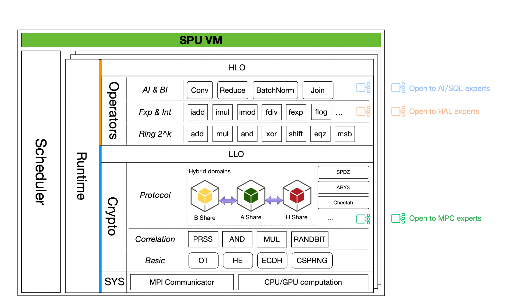
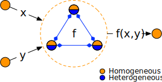
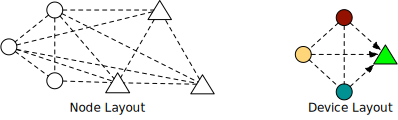
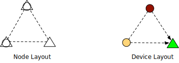
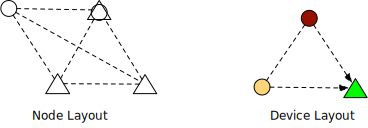

:target{#spu-runtime}

# SPU Runtime

:target{#architecture}

## Architecture

Here is the big picture of SPU VM.

- The top 3 blocks above <em>SPU VM</em> are applications, we could ignore them for now.
- The bottom left block is the scheduling component.
- The main block is the SPU Architecture, which is the core for secure evaluation.

Inside SPU, there are multiple layers, from bottom to up:

- <strong>System layer</strong> provides the basic computation and communication ability for the upper layers.
- <strong>Crypto layer</strong> is the key for secure computation, it’s composed by 3 sub layers.
  - <strong>Basic</strong> or classic layer, provides classic cryptography, OT, HE also lives in this layer.
  - <strong>Correlation</strong> or the offline protocol layer, provides correlation like beaver triple and randbit.
  - <strong>Protocol</strong> or the online protocol layer, applies random correlation and runs the secure evaluation.
- <strong>ALU layer</strong> converts MPC protocols into a programmable machine, which has two sub layers.
  - <strong>Ring 2^k</strong> layer, just like normal CPU, hides cryptography layer’s details and provides standard ring2k arithmetic.
  - <strong>Fixed point</strong> layer uses fixed point encoding to represent a fractional number and provides basic arithmetic operations over them.
- <strong>OPS layer</strong> is designed to be extensible, in this layer we can define multiple modules based on <em>ALU layer</em> and finally exposed to VM clients via bindings or SPU IR.

:target{#homogeneous-and-heterogeneous}

### Homogeneous and Heterogeneous

Recall that SPU VM is composed of multiple physical engines, the definitions of <em>homogeneous</em> and <em>heterogeneous</em> come from an <em>engines</em>’ perspective.

- <strong>Homogeneous</strong>: a layer is <em>homogeneous</em> means that all engines run exactly the same code in this layer. The user of this layer doesn’t have to distinguish between engines, they cannot and should not send/recv messages between engines, in other words, they can treat all engines the same, and program them as one machine.
- <strong>Heterogeneous</strong>: in contrast, a layer is <em>heterogeneous</em> means that engines in this layer behave differently (following some protocols). The author of this layer should take care of the behavior of each engine to make things correct.

We want SPU VM to be <em>homogeneous</em>, so we can treat it as a normal virtual device when applying secure evaluation. For example, in the following computation graph, given <cite>x</cite>, <cite>y</cite>, we want to compute <cite>f(x, y)</cite>, the big circle represents a computing node which can evaluate f.

In secure computation mode, we have a group of servers working together to provide the functionality of <cite>f</cite>, as shown blow.

The secure protocol (MPC protocol) itself is <strong>heterogeneous</strong>, three servers inside the big circle may behave differently, in this pic, the lower part is blue, which means three servers act and interact differently.

But they together provide a <strong>homogeneous</strong> interface to the upper layer, in this pic, the upper half is orange, three servers behave exactly the same, so in the whole computation DAG, the big circle could be treated as one (virtual) node.

Another reason to use <strong>homogeneous</strong> IR is to hide the number of parties, so the application can switch to an m-PC protocol from an n-PC protocol without code change.

One of <em>SPU</em>’s goal is to hide the heterogeneous part and expose homogeneous API.

:target{#vm-layout}

## VM Layout

SPU, as a virtual device, is hosted by multiple physical devices. The relationship between physical devices and SPU is very flexible. Now let’s use some examples to illustrate the possible layouts.

<Container type="important">
  Programmers coding toward the virtual layout, the underline physical is <strong>transparent</strong> from the programmer’s perspective. It’s free to use different physical layouts, without changing a single line of code.
</Container>

:target{#outsourcing}

### Outsourcing

In this mode, data providers send data shares to a group of non-colluding computation providers who cooperate to evaluate secure computations.

The figure to left depicts the physical layout, there are 6 physical nodes, mutually connected but untrusted to each other.

- The circle stands for data provider.
- The triangle stands for computing provider, three triangle nodes agree on some MPC protocol.

The figure to the right depicts the virtual layout.

- The circle has one-to-one relation to the physical nodes.
- 3 triangle nodes are treated as a single virtual device.

:target{#colocated}

### Colocated

In this mode, data providers also participate in the computation progress, that is, data providers are <strong>colocated</strong> with computing providers.

- On the left side, there are 3 physical nodes, each of which acts as data provider as well as computing provider.
- On the right side, <strong>SPU is a pure virtual node, constructed by physical nodes</strong>.

The number of computing nodes could be larger than that of data nodes in this mode, for example, a computing node without data source could act as a <em>random correlation generator</em>, for example:

<LineBlock>
   
</LineBlock>

There are two notable optimizations in this mode.

- The <strong>private semantic</strong>, a computing node may have private data manipulations to accelerate MPC computation, for example, in <em>HESS protocol</em>, we can do `HShare x Private` without online communication.
- The <strong>zero share data infeed</strong>, when a data provider tries to share data cross nodes, it can use `ZeroShare + Private` trick to avoid online communication.

:target{#hybrid}

### Hybrid

This is the most general form, some data providers participate in the secure computation while others do not.

<Container type="note">
  the <strong>private semantic</strong> and <strong>zero share data infeed</strong> also apply to data providers that participate in the computation.
</Container>
