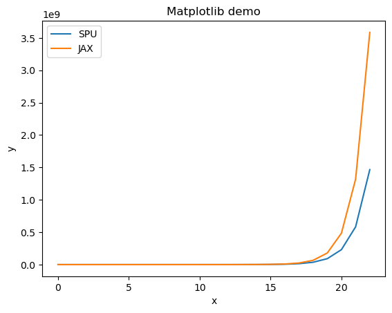

:target{#SPU-Inside}

# SPU Inside

SPU is a virtual device backed by an MPC engine, which provides an <em>arithmetic black box</em> abstraction to front-end users. Just like other <em>black boxes</em>, it’s not easy to understand what happened inside it.

For this reason, SPU provides some features to show what happened inside it, this document demonstrates these features.

:target{#Simulation}

## Simulation

As the name suggests, <em>multi-party computation</em> is born to be distributed system with multiple participants, which makes it harder to setup, debug and inspect. So SPU provides a <em>simulation module</em> that uses threads to simulate multi-parties in a single process. All parties acts exactly the same as in production environment, so we can use it as a playground to inspect the internals of SPU.

To use the simulation module, we can simple do

<Notebook.Cell>
  <Notebook.CodeArea prompt="[1]:" stderr={false} type="input">
    ```python
    import spu
    import jax.numpy as jnp
    import numpy as np

    # import spu simulation module
    import spu.utils.simulation as pps
    ```
  </Notebook.CodeArea>
</Notebook.Cell>

Now we can create SPU simulator and run program on it.

<Notebook.Cell>
  <Notebook.CodeArea prompt="[2]:" stderr={false} type="input">
    ```python
    # create a simulator with ABY3 x Ring64 protocol.
    protocol = spu.ProtocolKind.ABY3
    field = spu.FieldType.FM64
    simulator = pps.Simulator.simple(3, protocol, field)

    # decorate a jnp function to a simulated function
    spu_add = pps.sim_jax(simulator, jnp.add)

    # now we can call spu_fn like normal jnp fn.
    x = np.array([[1.0, 2.0], [3.0, 4.0]])
    y = np.array([[5.0, 6.0], [7.0, 8.0]])

    # the function is simulated on SPU VM, which use 3 threads to simulate different parties.
    # the actual progress is exactly the same as real distributed version.
    z = spu_add(x, y)

    print(z)
    ```
  </Notebook.CodeArea>

  <Notebook.CodeArea prompt="" stderr={false} type="output">
    <pre>
      {"[[ 6.  8.]\n [10. 12.]]\n"}
    </pre>
  </Notebook.CodeArea>
</Notebook.Cell>

In the above code. - First, we create an SPU simulator backed by <em>ABY3</em> protocol with <em>FM64</em> field. - Then we decorates a jax function `jax.add` to make it a SPU simulated function. - Then we can use the simulated function just like normal python functions.

As the result suggests, it behaves like a python function, we can also print the compiled pphlo program with

<Notebook.Cell>
  <Notebook.CodeArea prompt="[3]:" stderr={false} type="input">
    ```python
    print(spu_add.pphlo)
    ```
  </Notebook.CodeArea>

  <Notebook.CodeArea prompt="" stderr={false} type="output">
    <pre>
      {"module @xla_computation_add attributes {mhlo.cross_program_prefetches = [], mhlo.dynamic_parameter_bindings = [], mhlo.is_dynamic = false, mhlo.use_auto_spmd_partitioning = false} {\n  func.func @main(%arg0: tensor<2x2x!pphlo.sec<f32>>, %arg1: tensor<2x2x!pphlo.sec<f32>>) -> tensor<2x2x!pphlo.sec<f32>> {\n    %0 = \"pphlo.add\"(%arg0, %arg1) : (tensor<2x2x!pphlo.sec<f32>>, tensor<2x2x!pphlo.sec<f32>>) -> tensor<2x2x!pphlo.sec<f32>>\n    return %0 : tensor<2x2x!pphlo.sec<f32>>\n  }\n}\n\n"}
    </pre>
  </Notebook.CodeArea>
</Notebook.Cell>

The above code is a pphlo dialect in [MLIR](https://mlir.llvm.org/) format, which defines a `main` function that accepts two arguments and returns the sum as result.

Besides single `jax.numpy` op, we can simulate any jax function on SPU, i.e.

<Notebook.Cell>
  <Notebook.CodeArea prompt="[4]:" stderr={false} type="input">
    ```python
    def sigmoid(x):
        return 1 / (1 + jnp.exp(-x))


    spu_sigmoid = pps.sim_jax(simulator, sigmoid)
    spu_sigmoid(x)

    print(spu_sigmoid.pphlo)
    ```
  </Notebook.CodeArea>

  <Notebook.CodeArea prompt="" stderr={false} type="output">
    <pre>
      {"module @xla_computation_sigmoid attributes {mhlo.cross_program_prefetches = [], mhlo.dynamic_parameter_bindings = [], mhlo.is_dynamic = false, mhlo.use_auto_spmd_partitioning = false} {\n  func.func @main(%arg0: tensor<2x2x!pphlo.sec<f32>>) -> tensor<2x2x!pphlo.sec<f32>> {\n    %0 = \"pphlo.constant\"() {value = dense<1.000000e+00> : tensor<2x2xf32>} : () -> tensor<2x2x!pphlo.pub<f32>>\n    %1 = \"pphlo.negate\"(%arg0) : (tensor<2x2x!pphlo.sec<f32>>) -> tensor<2x2x!pphlo.sec<f32>>\n    %2 = \"pphlo.exponential\"(%1) : (tensor<2x2x!pphlo.sec<f32>>) -> tensor<2x2x!pphlo.sec<f32>>\n    %3 = \"pphlo.add\"(%2, %0) : (tensor<2x2x!pphlo.sec<f32>>, tensor<2x2x!pphlo.pub<f32>>) -> tensor<2x2x!pphlo.sec<f32>>\n    %4 = \"pphlo.divide\"(%0, %3) : (tensor<2x2x!pphlo.pub<f32>>, tensor<2x2x!pphlo.sec<f32>>) -> tensor<2x2x!pphlo.sec<f32>>\n    return %4 : tensor<2x2x!pphlo.sec<f32>>\n  }\n}\n\n"}
    </pre>
  </Notebook.CodeArea>
</Notebook.Cell>

The above code is `spu function` which is composed of spu builtin ops.

Note: since spu use [JIT](https://en.wikipedia.org/wiki/Just-in-time_compilation) compilation, so we have to execute the function before printing the compiled bytecode.

:target{#Profling}

## Profling

Besides simple simulation, we can profile the simulated program, although the profiling result could NOT be used as a reference of SPU perf, it still gives some information of what happened.

To use profiling, we have enabled some feature flags.

<Notebook.Cell>
  <Notebook.CodeArea prompt="[5]:" stderr={false} type="input">
    ```python
    config = spu.RuntimeConfig(protocol=protocol, field=field)
    config.enable_pphlo_profile = True
    simulator = pps.Simulator(3, config)
    ```
  </Notebook.CodeArea>
</Notebook.Cell>

`enable_pphlo_profile` tells SPU runtime to print information about pphlo, now, let’s run the function on this new runtime.

<Notebook.Cell>
  <Notebook.CodeArea prompt="[6]:" stderr={false} type="input">
    ```python
    spu_sigmoid = pps.sim_jax(simulator, sigmoid)
    z = spu_sigmoid(x)
    ```
  </Notebook.CodeArea>

  <Notebook.CodeArea prompt="" stderr={false} type="output">
    <pre>
      {"[2023-07-10 08:43:04.404] [info] [api.cc:131] [Profiling] SPU execution sigmoid completed, input processing took 5.08e-07s, execution took 0.005350594s, output processing took 8.97e-07s, total time 0.005351999s.\n[2023-07-10 08:43:04.404] [info] [api.cc:163] HLO profiling: total time 0.004799822\n[2023-07-10 08:43:04.404] [info] [api.cc:166] - pphlo.add, executed 1 times, duration 1.113e-05s\n[2023-07-10 08:43:04.404] [info] [api.cc:166] - pphlo.constant, executed 1 times, duration 7.731e-06s\n[2023-07-10 08:43:04.404] [info] [api.cc:166] - pphlo.divide, executed 1 times, duration 0.003190403s\n[2023-07-10 08:43:04.404] [info] [api.cc:166] - pphlo.exponential, executed 1 times, duration 0.001568901s\n[2023-07-10 08:43:04.404] [info] [api.cc:166] - pphlo.negate, executed 1 times, duration 2.1657e-05s\n[2023-07-10 08:43:04.404] [info] [api.cc:175] Link details: total send bytes 3504, send actions 89\n"}
    </pre>
  </Notebook.CodeArea>
</Notebook.Cell>

The above log tells the total execution time and the detailed statistics of each builtin function.

Besides the `enable_pphlo_profile` feature flag, SPU has other flags like `enable_hal_profile` to dump runtime information in different levels of instructions.

:target{#Tracing}

## Tracing

<em>Profiling</em> can only tell the statistics of SPU instructions, it’s still hard to understand what happened inside it. <em>Tracing</em> is a feature that used to print verbose `call stack`, which helps to understand/inspect what exactly happened.

To enable tracing features, just set `enable_action_trace` in the runtime config.

<Notebook.Cell>
  <Notebook.CodeArea prompt="[7]:" stderr={false} type="input">
    ```python
    config = spu.RuntimeConfig(protocol=protocol, field=field)
    config.enable_action_trace = True
    simulator = pps.Simulator(3, config)
    ```
  </Notebook.CodeArea>
</Notebook.Cell>

Now, let’s run another function on this `tracing enabled` simulator.

<Notebook.Cell>
  <Notebook.CodeArea prompt="[8]:" stderr={false} type="input">
    ```python
    spu_mul = pps.sim_jax(simulator, jnp.multiply)
    z = spu_mul(x, y)
    ```
  </Notebook.CodeArea>

  <Notebook.CodeArea prompt="" stderr={false} type="output">
    <pre>
      {"[2023-07-10 08:43:04.434] [TR] [B] hlo.pphlo.multiply()\n[2023-07-10 08:43:04.434] [TR] [B]   hal.mul(Value<2x2xSF32,s=2,1>, Value<2x2xSF32,s=2,1>)\n[2023-07-10 08:43:04.434] [TR] [B]     hal.f_mul(Value<2x2xSF32,s=2,1>, Value<2x2xSF32,s=2,1>)\n[2023-07-10 08:43:04.434] [TR] [B]       hal._mul(Value<2x2xSF32,s=2,1>, Value<2x2xSF32,s=2,1>)\n[2023-07-10 08:43:04.434] [TR] [B]         hal._mul_ss(Value<2x2xSF32,s=2,1>, Value<2x2xSF32,s=2,1>)\n[2023-07-10 08:43:04.434] [TR] [B]           mpc.mul_ss(Value<2x2xSF32,s=2,1>, Value<2x2xSF32,s=2,1>)\n[2023-07-10 08:43:04.434] [TR] [B]             mpc.mul_aa(Value<2x2xSF32,s=2,1>, Value<2x2xSF32,s=2,1>)\n[2023-07-10 08:43:04.434] [TR] [E]             mpc.mul_aa(Value<2x2xSF32,s=2,1>, Value<2x2xSF32,s=2,1>)\n[2023-07-10 08:43:04.434] [TR] [E]           mpc.mul_ss(Value<2x2xSF32,s=2,1>, Value<2x2xSF32,s=2,1>)\n[2023-07-10 08:43:04.434] [TR] [E]         hal._mul_ss(Value<2x2xSF32,s=2,1>, Value<2x2xSF32,s=2,1>)\n[2023-07-10 08:43:04.434] [TR] [E]       hal._mul(Value<2x2xSF32,s=2,1>, Value<2x2xSF32,s=2,1>)\n[2023-07-10 08:43:04.434] [TR] [B]       hal._trunc(Value<2x2xS*,s=2,1>, 0)\n[2023-07-10 08:43:04.434] [TR] [B]         hal._trunc_s(Value<2x2xS*,s=2,1>, 18)\n[2023-07-10 08:43:04.434] [TR] [B]           mpc.trunc_s(Value<2x2xS*,s=2,1>, 18)\n[2023-07-10 08:43:04.434] [TR] [B]             mpc.trunc_a(Value<2x2xS*,s=2,1>, 18)\n[2023-07-10 08:43:04.434] [TR] [E]             mpc.trunc_a(Value<2x2xS*,s=2,1>, 18)\n[2023-07-10 08:43:04.434] [TR] [E]           mpc.trunc_s(Value<2x2xS*,s=2,1>, 18)\n[2023-07-10 08:43:04.434] [TR] [E]         hal._trunc_s(Value<2x2xS*,s=2,1>, 18)\n[2023-07-10 08:43:04.434] [TR] [E]       hal._trunc(Value<2x2xS*,s=2,1>, 0)\n[2023-07-10 08:43:04.434] [TR] [E]     hal.f_mul(Value<2x2xSF32,s=2,1>, Value<2x2xSF32,s=2,1>)\n[2023-07-10 08:43:04.434] [TR] [E]   hal.mul(Value<2x2xSF32,s=2,1>, Value<2x2xSF32,s=2,1>)\n[2023-07-10 08:43:04.434] [TR] [E] hlo.pphlo.multiply()\n"}
    </pre>
  </Notebook.CodeArea>
</Notebook.Cell>

At the first glance, the trace log is a bit of frustrating, so it worth a little while to explain it.

At the very begining, is the entry point of `multiply` function.

Each line follows the format as below:

```none
[timestamp] [TR] [B/E] module.op(value_type...)
```

For example, the second line `[timestamp] [TR] [B]   hal.mul(Value<2x2xSFXP,s=2,1>, Value<2x2xSFXP,s=2,1>)` means: - this is a tracing log indicated by `[TR]` - the function begins/ends `[B/E]` - the module is `hal` - the operator is `mul` - the two args are both `Value<2x2xSFXP,s=2,1>`

Note, `hlo` is short for `High Level Operations`, `hal` is short for `Hardware Abstraction Layer`, `mpc` is short for `Multi-Party Computation`.

The `Value<2x2xSFXP,s=2,1>` means it’s a <strong>S</strong>ecret <strong>F</strong>i<strong>X</strong>ed <strong>P</strong>ointed tensor with shape(<strong>2x2</strong>) and strides(<strong>2,1</strong>).

1. the runtime dispatches the function according parameters datatype (in this case <em>fxp</em>), then calls the corresponding fixed point handle function `hal.f_mul`, the prefix `f_` means its for fixed point.
2. the runtime dispatches `hal.f_mul` to the untyped version `hal._mul` which operates on `rings`.
3. the runtime dispatches `hal._mul` according to the <em>visibility</em> type, since both parameters are <strong>secret</strong>, so `hal._mul_ss` is called, the postfix `_ss` indicates that it operates on two secrets.

Then the function `hal._mul_ss` is dispatched to the MPC layer, the signature becomes more complicated.

```none
mpc.mul_ss(ArrayRef<4xaby3.AShr<FM64>>,ArrayRef<4xaby3.AShr<FM64>>)
```

The signature of this operation is the same as above, `mpc.mul_ss` indicates the module is `mpc` and the operation is `mul_ss`.

The type `ArrayRef<4xaby3.AShr<FM64>>` has two notable differences: 1. unlike hal ops, mpc ops operates on 1D-array instead of tensor, which makes it a more standard SIMD instruction. 2. the type `aby3.AShr<FM64>` is protocol-dependent, in this case, it’s an <em>ABY3</em> arithmetic share in FM64.

Finally, it’s dispatched to `mpc.mul_aa`, the postfix `_aa` indicates both parameters are arithmetic shares, then the ABY3 share addition protocol is performed.

But `f_mul` could not be done with ring multiplication only, we have to `truncate` the result to make the fixed point legal, in the following lines, `hal._trunc` is called and finally dispatched to `mpc.trunc_a` protocol.

The above example is pretty straight forward, now let’s make it harder.

Fixed point reciprocal is done with [Goldschmidt](https://en.wikipedia.org/wiki/Division_algorithm#Goldschmidt_division) approximation algorithm, the algorithm itself is not that simple, and when it’s executed on MPC, things become more complicated.

It takes a lot of effort to understand how it works, let’s directly see the tracing result.

<Notebook.Cell>
  <Notebook.CodeArea prompt="[9]:" stderr={false} type="input">
    ```python
    spu_reciprocal = pps.sim_jax(simulator, jnp.reciprocal)
    z = spu_reciprocal(x)
    ```
  </Notebook.CodeArea>

  <Notebook.CodeArea prompt="" stderr={false} type="output">
    <pre>
      {"[2023-07-10 08:43:04.454] [TR] [B] hlo.pphlo.constant()\n[2023-07-10 08:43:04.454] [TR] [B]   hal.constant(PtBufferView<0x7fd59c0123f8,xPT_F32,>, F32, {})\n[2023-07-10 08:43:04.454] [TR] [B]     hal.make_pub2k(PtBufferView<0x7fd59c0123f8,xPT_F32,>)\n[2023-07-10 08:43:04.454] [TR] [E]     hal.make_pub2k(PtBufferView<0x7fd59c0123f8,xPT_F32,>)\n[2023-07-10 08:43:04.454] [TR] [E]   hal.constant(PtBufferView<0x7fd59c0123f8,xPT_F32,>, F32, {})\n[2023-07-10 08:43:04.454] [TR] [B]   hal.broadcast_to(Value<xPF32,s=>, {2,2})\n[2023-07-10 08:43:04.454] [TR] [E]   hal.broadcast_to(Value<xPF32,s=>, {2,2})\n[2023-07-10 08:43:04.454] [TR] [E] hlo.pphlo.constant()\n[2023-07-10 08:43:04.454] [TR] [B] hlo.pphlo.divide()\n[2023-07-10 08:43:04.454] [TR] [B]   hal.div(Value<2x2xPF32,s=0,0>, Value<2x2xSF32,s=2,1>)\n[2023-07-10 08:43:04.454] [TR] [B]     hal.dtype_cast(Value<2x2xPF32,s=0,0>, F32)\n[2023-07-10 08:43:04.454] [TR] [E]     hal.dtype_cast(Value<2x2xPF32,s=0,0>, F32)\n[2023-07-10 08:43:04.454] [TR] [B]     hal.dtype_cast(Value<2x2xSF32,s=2,1>, F32)\n[2023-07-10 08:43:04.454] [TR] [E]     hal.dtype_cast(Value<2x2xSF32,s=2,1>, F32)\n[2023-07-10 08:43:04.454] [TR] [B]     hal.f_div(Value<2x2xPF32,s=0,0>, Value<2x2xSF32,s=2,1>)\n[2023-07-10 08:43:04.454] [TR] [B]       hal.div_goldschmidt(Value<2x2xPF32,s=0,0>, Value<2x2xSF32,s=2,1>)\n[2023-07-10 08:43:04.454] [TR] [B]         hal._msb(Value<2x2xSF32,s=2,1>)\n[2023-07-10 08:43:04.454] [TR] [B]           hal._msb_s(Value<2x2xSF32,s=2,1>)\n[2023-07-10 08:43:04.454] [TR] [B]             mpc.msb_s(Value<2x2xSF32,s=2,1>)\n[2023-07-10 08:43:04.454] [TR] [B]               mpc.msb_a2b(Value<2x2xSF32,s=2,1>)\n[2023-07-10 08:43:04.454] [TR] [B]                 mpc.xor_bb(Value<4xS*,s=1>, Value<4xS*,s=1>)\n[2023-07-10 08:43:04.454] [TR] [E]                 mpc.xor_bb(Value<4xS*,s=1>, Value<4xS*,s=1>)\n[2023-07-10 08:43:04.454] [TR] [B]                 mpc.and_bb(Value<4xS*,s=1>, Value<4xS*,s=1>)\n[2023-07-10 08:43:04.454] [TR] [E]                 mpc.and_bb(Value<4xS*,s=1>, Value<4xS*,s=1>)\n[2023-07-10 08:43:04.454] [TR] [B]                 mpc.lshift_b(Value<4xS*,s=1>, 1)\n[2023-07-10 08:43:04.454] [TR] [E]                 mpc.lshift_b(Value<4xS*,s=1>, 1)\n[2023-07-10 08:43:04.454] [TR] [B]                 mpc.lshift_b(Value<4xS*,s=1>, 1)\n[2023-07-10 08:43:04.454] [TR] [E]                 mpc.lshift_b(Value<4xS*,s=1>, 1)\n[2023-07-10 08:43:04.454] [TR] [B]                 mpc.bitdeintl_b(Value<4xS*,s=1>, 0)\n[2023-07-10 08:43:04.454] [TR] [E]                 mpc.bitdeintl_b(Value<4xS*,s=1>, 0)\n[2023-07-10 08:43:04.454] [TR] [B]                 mpc.rshift_b(Value<4xS*,s=1>, 32)\n[2023-07-10 08:43:04.454] [TR] [E]                 mpc.rshift_b(Value<4xS*,s=1>, 32)\n[2023-07-10 08:43:04.454] [TR] [B]                 mpc.and_bp(Value<4xS*,s=1>, Value<4xP*,s=0>)\n[2023-07-10 08:43:04.454] [TR] [E]                 mpc.and_bp(Value<4xS*,s=1>, Value<4xP*,s=0>)\n[2023-07-10 08:43:04.454] [TR] [B]                 mpc.bitdeintl_b(Value<4xS*,s=1>, 0)\n[2023-07-10 08:43:04.454] [TR] [E]                 mpc.bitdeintl_b(Value<4xS*,s=1>, 0)\n[2023-07-10 08:43:04.454] [TR] [B]                 mpc.rshift_b(Value<4xS*,s=1>, 32)\n[2023-07-10 08:43:04.454] [TR] [E]                 mpc.rshift_b(Value<4xS*,s=1>, 32)\n[2023-07-10 08:43:04.454] [TR] [B]                 mpc.and_bp(Value<4xS*,s=1>, Value<4xP*,s=0>)\n[2023-07-10 08:43:04.454] [TR] [E]                 mpc.and_bp(Value<4xS*,s=1>, Value<4xP*,s=0>)\n[2023-07-10 08:43:04.454] [TR] [B]                 mpc.and_bb(Value<8xS*,s=1>, Value<8xS*,s=1>)\n[2023-07-10 08:43:04.454] [TR] [E]                 mpc.and_bb(Value<8xS*,s=1>, Value<8xS*,s=1>)\n[2023-07-10 08:43:04.454] [TR] [B]                 mpc.xor_bb(Value<4xS*,s=1>, Value<4xS*,s=1>)\n[2023-07-10 08:43:04.454] [TR] [E]                 mpc.xor_bb(Value<4xS*,s=1>, Value<4xS*,s=1>)\n[2023-07-10 08:43:04.454] [TR] [B]                 mpc.bitdeintl_b(Value<4xS*,s=1>, 0)\n[2023-07-10 08:43:04.454] [TR] [E]                 mpc.bitdeintl_b(Value<4xS*,s=1>, 0)\n[2023-07-10 08:43:04.454] [TR] [B]                 mpc.rshift_b(Value<4xS*,s=1>, 16)\n[2023-07-10 08:43:04.454] [TR] [E]                 mpc.rshift_b(Value<4xS*,s=1>, 16)\n[2023-07-10 08:43:04.454] [TR] [B]                 mpc.and_bp(Value<4xS*,s=1>, Value<4xP*,s=0>)\n[2023-07-10 08:43:04.454] [TR] [E]                 mpc.and_bp(Value<4xS*,s=1>, Value<4xP*,s=0>)\n[2023-07-10 08:43:04.454] [TR] [B]                 mpc.bitdeintl_b(Value<4xS*,s=1>, 0)\n[2023-07-10 08:43:04.454] [TR] [E]                 mpc.bitdeintl_b(Value<4xS*,s=1>, 0)\n[2023-07-10 08:43:04.455] [TR] [B]                 mpc.rshift_b(Value<4xS*,s=1>, 16)\n[2023-07-10 08:43:04.455] [TR] [E]                 mpc.rshift_b(Value<4xS*,s=1>, 16)\n[2023-07-10 08:43:04.455] [TR] [B]                 mpc.and_bp(Value<4xS*,s=1>, Value<4xP*,s=0>)\n[2023-07-10 08:43:04.455] [TR] [E]                 mpc.and_bp(Value<4xS*,s=1>, Value<4xP*,s=0>)\n[2023-07-10 08:43:04.455] [TR] [B]                 mpc.and_bb(Value<8xS*,s=1>, Value<8xS*,s=1>)\n[2023-07-10 08:43:04.455] [TR] [E]                 mpc.and_bb(Value<8xS*,s=1>, Value<8xS*,s=1>)\n[2023-07-10 08:43:04.455] [TR] [B]                 mpc.xor_bb(Value<4xS*,s=1>, Value<4xS*,s=1>)\n[2023-07-10 08:43:04.455] [TR] [E]                 mpc.xor_bb(Value<4xS*,s=1>, Value<4xS*,s=1>)\n[2023-07-10 08:43:04.455] [TR] [B]                 mpc.bitdeintl_b(Value<4xS*,s=1>, 0)\n[2023-07-10 08:43:04.455] [TR] [E]                 mpc.bitdeintl_b(Value<4xS*,s=1>, 0)\n[2023-07-10 08:43:04.455] [TR] [B]                 mpc.rshift_b(Value<4xS*,s=1>, 8)\n[2023-07-10 08:43:04.455] [TR] [E]                 mpc.rshift_b(Value<4xS*,s=1>, 8)\n[2023-07-10 08:43:04.455] [TR] [B]                 mpc.and_bp(Value<4xS*,s=1>, Value<4xP*,s=0>)\n[2023-07-10 08:43:04.455] [TR] [E]                 mpc.and_bp(Value<4xS*,s=1>, Value<4xP*,s=0>)\n[2023-07-10 08:43:04.455] [TR] [B]                 mpc.bitdeintl_b(Value<4xS*,s=1>, 0)\n[2023-07-10 08:43:04.455] [TR] [E]                 mpc.bitdeintl_b(Value<4xS*,s=1>, 0)\n[2023-07-10 08:43:04.455] [TR] [B]                 mpc.rshift_b(Value<4xS*,s=1>, 8)\n[2023-07-10 08:43:04.455] [TR] [E]                 mpc.rshift_b(Value<4xS*,s=1>, 8)\n[2023-07-10 08:43:04.455] [TR] [B]                 mpc.and_bp(Value<4xS*,s=1>, Value<4xP*,s=0>)\n[2023-07-10 08:43:04.455] [TR] [E]                 mpc.and_bp(Value<4xS*,s=1>, Value<4xP*,s=0>)\n[2023-07-10 08:43:04.455] [TR] [B]                 mpc.and_bb(Value<8xS*,s=1>, Value<8xS*,s=1>)\n[2023-07-10 08:43:04.455] [TR] [E]                 mpc.and_bb(Value<8xS*,s=1>, Value<8xS*,s=1>)\n[2023-07-10 08:43:04.455] [TR] [B]                 mpc.xor_bb(Value<4xS*,s=1>, Value<4xS*,s=1>)\n[2023-07-10 08:43:04.455] [TR] [E]                 mpc.xor_bb(Value<4xS*,s=1>, Value<4xS*,s=1>)\n[2023-07-10 08:43:04.455] [TR] [B]                 mpc.bitdeintl_b(Value<4xS*,s=1>, 0)\n[2023-07-10 08:43:04.455] [TR] [E]                 mpc.bitdeintl_b(Value<4xS*,s=1>, 0)\n[2023-07-10 08:43:04.455] [TR] [B]                 mpc.rshift_b(Value<4xS*,s=1>, 4)\n[2023-07-10 08:43:04.455] [TR] [E]                 mpc.rshift_b(Value<4xS*,s=1>, 4)\n[2023-07-10 08:43:04.455] [TR] [B]                 mpc.and_bp(Value<4xS*,s=1>, Value<4xP*,s=0>)\n[2023-07-10 08:43:04.455] [TR] [E]                 mpc.and_bp(Value<4xS*,s=1>, Value<4xP*,s=0>)\n[2023-07-10 08:43:04.455] [TR] [B]                 mpc.bitdeintl_b(Value<4xS*,s=1>, 0)\n[2023-07-10 08:43:04.455] [TR] [E]                 mpc.bitdeintl_b(Value<4xS*,s=1>, 0)\n[2023-07-10 08:43:04.455] [TR] [B]                 mpc.rshift_b(Value<4xS*,s=1>, 4)\n[2023-07-10 08:43:04.455] [TR] [E]                 mpc.rshift_b(Value<4xS*,s=1>, 4)\n[2023-07-10 08:43:04.455] [TR] [B]                 mpc.and_bp(Value<4xS*,s=1>, Value<4xP*,s=0>)\n[2023-07-10 08:43:04.455] [TR] [E]                 mpc.and_bp(Value<4xS*,s=1>, Value<4xP*,s=0>)\n[2023-07-10 08:43:04.455] [TR] [B]                 mpc.and_bb(Value<8xS*,s=1>, Value<8xS*,s=1>)\n[2023-07-10 08:43:04.455] [TR] [E]                 mpc.and_bb(Value<8xS*,s=1>, Value<8xS*,s=1>)\n[2023-07-10 08:43:04.455] [TR] [B]                 mpc.xor_bb(Value<4xS*,s=1>, Value<4xS*,s=1>)\n[2023-07-10 08:43:04.455] [TR] [E]                 mpc.xor_bb(Value<4xS*,s=1>, Value<4xS*,s=1>)\n[2023-07-10 08:43:04.455] [TR] [B]                 mpc.bitdeintl_b(Value<4xS*,s=1>, 0)\n[2023-07-10 08:43:04.455] [TR] [E]                 mpc.bitdeintl_b(Value<4xS*,s=1>, 0)\n[2023-07-10 08:43:04.455] [TR] [B]                 mpc.rshift_b(Value<4xS*,s=1>, 2)\n[2023-07-10 08:43:04.455] [TR] [E]                 mpc.rshift_b(Value<4xS*,s=1>, 2)\n[2023-07-10 08:43:04.455] [TR] [B]                 mpc.and_bp(Value<4xS*,s=1>, Value<4xP*,s=0>)\n[2023-07-10 08:43:04.455] [TR] [E]                 mpc.and_bp(Value<4xS*,s=1>, Value<4xP*,s=0>)\n[2023-07-10 08:43:04.455] [TR] [B]                 mpc.bitdeintl_b(Value<4xS*,s=1>, 0)\n[2023-07-10 08:43:04.455] [TR] [E]                 mpc.bitdeintl_b(Value<4xS*,s=1>, 0)\n[2023-07-10 08:43:04.455] [TR] [B]                 mpc.rshift_b(Value<4xS*,s=1>, 2)\n[2023-07-10 08:43:04.455] [TR] [E]                 mpc.rshift_b(Value<4xS*,s=1>, 2)\n[2023-07-10 08:43:04.455] [TR] [B]                 mpc.and_bp(Value<4xS*,s=1>, Value<4xP*,s=0>)\n[2023-07-10 08:43:04.455] [TR] [E]                 mpc.and_bp(Value<4xS*,s=1>, Value<4xP*,s=0>)\n[2023-07-10 08:43:04.455] [TR] [B]                 mpc.and_bb(Value<8xS*,s=1>, Value<8xS*,s=1>)\n[2023-07-10 08:43:04.455] [TR] [E]                 mpc.and_bb(Value<8xS*,s=1>, Value<8xS*,s=1>)\n[2023-07-10 08:43:04.455] [TR] [B]                 mpc.xor_bb(Value<4xS*,s=1>, Value<4xS*,s=1>)\n[2023-07-10 08:43:04.455] [TR] [E]                 mpc.xor_bb(Value<4xS*,s=1>, Value<4xS*,s=1>)\n[2023-07-10 08:43:04.455] [TR] [B]                 mpc.bitdeintl_b(Value<4xS*,s=1>, 0)\n[2023-07-10 08:43:04.455] [TR] [E]                 mpc.bitdeintl_b(Value<4xS*,s=1>, 0)\n[2023-07-10 08:43:04.455] [TR] [B]                 mpc.rshift_b(Value<4xS*,s=1>, 1)\n[2023-07-10 08:43:04.455] [TR] [E]                 mpc.rshift_b(Value<4xS*,s=1>, 1)\n[2023-07-10 08:43:04.455] [TR] [B]                 mpc.and_bp(Value<4xS*,s=1>, Value<4xP*,s=0>)\n[2023-07-10 08:43:04.455] [TR] [E]                 mpc.and_bp(Value<4xS*,s=1>, Value<4xP*,s=0>)\n[2023-07-10 08:43:04.455] [TR] [B]                 mpc.bitdeintl_b(Value<4xS*,s=1>, 0)\n[2023-07-10 08:43:04.455] [TR] [E]                 mpc.bitdeintl_b(Value<4xS*,s=1>, 0)\n[2023-07-10 08:43:04.455] [TR] [B]                 mpc.rshift_b(Value<4xS*,s=1>, 1)\n[2023-07-10 08:43:04.455] [TR] [E]                 mpc.rshift_b(Value<4xS*,s=1>, 1)\n[2023-07-10 08:43:04.455] [TR] [B]                 mpc.and_bp(Value<4xS*,s=1>, Value<4xP*,s=0>)\n[2023-07-10 08:43:04.455] [TR] [E]                 mpc.and_bp(Value<4xS*,s=1>, Value<4xP*,s=0>)\n[2023-07-10 08:43:04.455] [TR] [B]                 mpc.and_bb(Value<8xS*,s=1>, Value<8xS*,s=1>)\n[2023-07-10 08:43:04.455] [TR] [E]                 mpc.and_bb(Value<8xS*,s=1>, Value<8xS*,s=1>)\n[2023-07-10 08:43:04.455] [TR] [B]                 mpc.xor_bb(Value<4xS*,s=1>, Value<4xS*,s=1>)\n[2023-07-10 08:43:04.455] [TR] [E]                 mpc.xor_bb(Value<4xS*,s=1>, Value<4xS*,s=1>)\n[2023-07-10 08:43:04.455] [TR] [B]                 mpc.xor_bb(Value<4xS*,s=1>, Value<4xS*,s=1>)\n[2023-07-10 08:43:04.456] [TR] [E]                 mpc.xor_bb(Value<4xS*,s=1>, Value<4xS*,s=1>)\n[2023-07-10 08:43:04.456] [TR] [B]                 mpc.rshift_b(Value<4xS*,s=1>, 63)\n[2023-07-10 08:43:04.456] [TR] [E]                 mpc.rshift_b(Value<4xS*,s=1>, 63)\n[2023-07-10 08:43:04.456] [TR] [B]                 mpc.xor_bb(Value<4xS*,s=1>, Value<4xS*,s=1>)\n[2023-07-10 08:43:04.456] [TR] [E]                 mpc.xor_bb(Value<4xS*,s=1>, Value<4xS*,s=1>)\n[2023-07-10 08:43:04.456] [TR] [E]               mpc.msb_a2b(Value<2x2xSF32,s=2,1>)\n[2023-07-10 08:43:04.456] [TR] [E]             mpc.msb_s(Value<2x2xSF32,s=2,1>)\n[2023-07-10 08:43:04.456] [TR] [E]           hal._msb_s(Value<2x2xSF32,s=2,1>)\n[2023-07-10 08:43:04.456] [TR] [E]         hal._msb(Value<2x2xSF32,s=2,1>)\n[2023-07-10 08:43:04.456] [TR] [B]         hal._make_p(0)\n[2023-07-10 08:43:04.456] [TR] [B]           mpc.make_p(0, {2,2})\n[2023-07-10 08:43:04.456] [TR] [E]           mpc.make_p(0, {2,2})\n[2023-07-10 08:43:04.456] [TR] [E]         hal._make_p(0)\n[2023-07-10 08:43:04.456] [TR] [B]         hal._add(Value<2x2xS*,s=2,1>, Value<2x2xP*,s=0,0>)\n[2023-07-10 08:43:04.456] [TR] [B]           hal._add_sp(Value<2x2xS*,s=2,1>, Value<2x2xP*,s=0,0>)\n[2023-07-10 08:43:04.456] [TR] [B]             mpc.add_sp(Value<2x2xS*,s=2,1>, Value<2x2xP*,s=0,0>)\n[2023-07-10 08:43:04.456] [TR] [B]               mpc.b2a(Value<2x2xS*,s=2,1>)\n[2023-07-10 08:43:04.456] [TR] [E]               mpc.b2a(Value<2x2xS*,s=2,1>)\n[2023-07-10 08:43:04.456] [TR] [B]               mpc.add_ap(Value<2x2xS*,s=2,1>, Value<2x2xP*,s=0,0>)\n[2023-07-10 08:43:04.456] [TR] [E]               mpc.add_ap(Value<2x2xS*,s=2,1>, Value<2x2xP*,s=0,0>)\n[2023-07-10 08:43:04.456] [TR] [E]             mpc.add_sp(Value<2x2xS*,s=2,1>, Value<2x2xP*,s=0,0>)\n[2023-07-10 08:43:04.456] [TR] [E]           hal._add_sp(Value<2x2xS*,s=2,1>, Value<2x2xP*,s=0,0>)\n[2023-07-10 08:43:04.456] [TR] [E]         hal._add(Value<2x2xS*,s=2,1>, Value<2x2xP*,s=0,0>)\n[2023-07-10 08:43:04.456] [TR] [B]         hal._negate(Value<2x2xSF32,s=2,1>)\n[2023-07-10 08:43:04.456] [TR] [B]           hal._make_p(1)\n[2023-07-10 08:43:04.456] [TR] [B]             mpc.make_p(1, {2,2})\n[2023-07-10 08:43:04.456] [TR] [E]             mpc.make_p(1, {2,2})\n[2023-07-10 08:43:04.456] [TR] [E]           hal._make_p(1)\n[2023-07-10 08:43:04.456] [TR] [B]           hal._not(Value<2x2xSF32,s=2,1>)\n[2023-07-10 08:43:04.456] [TR] [B]             hal._not_s(Value<2x2xSF32,s=2,1>)\n[2023-07-10 08:43:04.456] [TR] [B]               mpc.not_s(Value<2x2xSF32,s=2,1>)\n[2023-07-10 08:43:04.456] [TR] [B]                 mpc.not_a(Value<2x2xSF32,s=2,1>)\n[2023-07-10 08:43:04.456] [TR] [E]                 mpc.not_a(Value<2x2xSF32,s=2,1>)\n[2023-07-10 08:43:04.456] [TR] [E]               mpc.not_s(Value<2x2xSF32,s=2,1>)\n[2023-07-10 08:43:04.456] [TR] [E]             hal._not_s(Value<2x2xSF32,s=2,1>)\n[2023-07-10 08:43:04.456] [TR] [E]           hal._not(Value<2x2xSF32,s=2,1>)\n[2023-07-10 08:43:04.456] [TR] [B]           hal._add(Value<2x2xS*,s=2,1>, Value<2x2xP*,s=0,0>)\n[2023-07-10 08:43:04.456] [TR] [B]             hal._add_sp(Value<2x2xS*,s=2,1>, Value<2x2xP*,s=0,0>)\n[2023-07-10 08:43:04.456] [TR] [B]               mpc.add_sp(Value<2x2xS*,s=2,1>, Value<2x2xP*,s=0,0>)\n[2023-07-10 08:43:04.456] [TR] [B]                 mpc.add_ap(Value<2x2xS*,s=2,1>, Value<2x2xP*,s=0,0>)\n[2023-07-10 08:43:04.456] [TR] [E]                 mpc.add_ap(Value<2x2xS*,s=2,1>, Value<2x2xP*,s=0,0>)\n[2023-07-10 08:43:04.456] [TR] [E]               mpc.add_sp(Value<2x2xS*,s=2,1>, Value<2x2xP*,s=0,0>)\n[2023-07-10 08:43:04.456] [TR] [E]             hal._add_sp(Value<2x2xS*,s=2,1>, Value<2x2xP*,s=0,0>)\n[2023-07-10 08:43:04.456] [TR] [E]           hal._add(Value<2x2xS*,s=2,1>, Value<2x2xP*,s=0,0>)\n[2023-07-10 08:43:04.456] [TR] [E]         hal._negate(Value<2x2xSF32,s=2,1>)\n[2023-07-10 08:43:04.456] [TR] [B]         hal._mux(Value<2x2xS*,s=2,1>, Value<2x2xS*,s=2,1>, Value<2x2xSF32,s=2,1>)\n[2023-07-10 08:43:04.456] [TR] [B]           hal._sub(Value<2x2xS*,s=2,1>, Value<2x2xSF32,s=2,1>)\n[2023-07-10 08:43:04.456] [TR] [B]             hal._negate(Value<2x2xSF32,s=2,1>)\n[2023-07-10 08:43:04.456] [TR] [B]               hal._make_p(1)\n[2023-07-10 08:43:04.456] [TR] [B]                 mpc.make_p(1, {2,2})\n[2023-07-10 08:43:04.456] [TR] [E]                 mpc.make_p(1, {2,2})\n[2023-07-10 08:43:04.456] [TR] [E]               hal._make_p(1)\n[2023-07-10 08:43:04.456] [TR] [B]               hal._not(Value<2x2xSF32,s=2,1>)\n[2023-07-10 08:43:04.456] [TR] [B]                 hal._not_s(Value<2x2xSF32,s=2,1>)\n[2023-07-10 08:43:04.456] [TR] [B]                   mpc.not_s(Value<2x2xSF32,s=2,1>)\n[2023-07-10 08:43:04.456] [TR] [B]                     mpc.not_a(Value<2x2xSF32,s=2,1>)\n[2023-07-10 08:43:04.456] [TR] [E]                     mpc.not_a(Value<2x2xSF32,s=2,1>)\n[2023-07-10 08:43:04.456] [TR] [E]                   mpc.not_s(Value<2x2xSF32,s=2,1>)\n[2023-07-10 08:43:04.456] [TR] [E]                 hal._not_s(Value<2x2xSF32,s=2,1>)\n[2023-07-10 08:43:04.456] [TR] [E]               hal._not(Value<2x2xSF32,s=2,1>)\n[2023-07-10 08:43:04.456] [TR] [B]               hal._add(Value<2x2xS*,s=2,1>, Value<2x2xP*,s=0,0>)\n[2023-07-10 08:43:04.456] [TR] [B]                 hal._add_sp(Value<2x2xS*,s=2,1>, Value<2x2xP*,s=0,0>)\n[2023-07-10 08:43:04.456] [TR] [B]                   mpc.add_sp(Value<2x2xS*,s=2,1>, Value<2x2xP*,s=0,0>)\n[2023-07-10 08:43:04.456] [TR] [B]                     mpc.add_ap(Value<2x2xS*,s=2,1>, Value<2x2xP*,s=0,0>)\n[2023-07-10 08:43:04.456] [TR] [E]                     mpc.add_ap(Value<2x2xS*,s=2,1>, Value<2x2xP*,s=0,0>)\n[2023-07-10 08:43:04.456] [TR] [E]                   mpc.add_sp(Value<2x2xS*,s=2,1>, Value<2x2xP*,s=0,0>)\n[2023-07-10 08:43:04.456] [TR] [E]                 hal._add_sp(Value<2x2xS*,s=2,1>, Value<2x2xP*,s=0,0>)\n[2023-07-10 08:43:04.456] [TR] [E]               hal._add(Value<2x2xS*,s=2,1>, Value<2x2xP*,s=0,0>)\n[2023-07-10 08:43:04.456] [TR] [E]             hal._negate(Value<2x2xSF32,s=2,1>)\n[2023-07-10 08:43:04.456] [TR] [B]             hal._add(Value<2x2xS*,s=2,1>, Value<2x2xS*,s=2,1>)\n[2023-07-10 08:43:04.456] [TR] [B]               hal._add_ss(Value<2x2xS*,s=2,1>, Value<2x2xS*,s=2,1>)\n[2023-07-10 08:43:04.456] [TR] [B]                 mpc.add_ss(Value<2x2xS*,s=2,1>, Value<2x2xS*,s=2,1>)\n[2023-07-10 08:43:04.456] [TR] [B]                   mpc.add_aa(Value<2x2xS*,s=2,1>, Value<2x2xS*,s=2,1>)\n[2023-07-10 08:43:04.456] [TR] [E]                   mpc.add_aa(Value<2x2xS*,s=2,1>, Value<2x2xS*,s=2,1>)\n[2023-07-10 08:43:04.456] [TR] [E]                 mpc.add_ss(Value<2x2xS*,s=2,1>, Value<2x2xS*,s=2,1>)\n[2023-07-10 08:43:04.456] [TR] [E]               hal._add_ss(Value<2x2xS*,s=2,1>, Value<2x2xS*,s=2,1>)\n[2023-07-10 08:43:04.456] [TR] [E]             hal._add(Value<2x2xS*,s=2,1>, Value<2x2xS*,s=2,1>)\n[2023-07-10 08:43:04.456] [TR] [E]           hal._sub(Value<2x2xS*,s=2,1>, Value<2x2xSF32,s=2,1>)\n[2023-07-10 08:43:04.456] [TR] [B]           hal._mul(Value<2x2xS*,s=2,1>, Value<2x2xS*,s=2,1>)\n[2023-07-10 08:43:04.456] [TR] [B]             hal._mul_ss(Value<2x2xS*,s=2,1>, Value<2x2xS*,s=2,1>)\n[2023-07-10 08:43:04.456] [TR] [B]               mpc.mul_ss(Value<2x2xS*,s=2,1>, Value<2x2xS*,s=2,1>)\n[2023-07-10 08:43:04.456] [TR] [B]                 mpc.mul_aa(Value<2x2xS*,s=2,1>, Value<2x2xS*,s=2,1>)\n[2023-07-10 08:43:04.456] [TR] [E]                 mpc.mul_aa(Value<2x2xS*,s=2,1>, Value<2x2xS*,s=2,1>)\n[2023-07-10 08:43:04.456] [TR] [E]               mpc.mul_ss(Value<2x2xS*,s=2,1>, Value<2x2xS*,s=2,1>)\n[2023-07-10 08:43:04.456] [TR] [E]             hal._mul_ss(Value<2x2xS*,s=2,1>, Value<2x2xS*,s=2,1>)\n[2023-07-10 08:43:04.456] [TR] [E]           hal._mul(Value<2x2xS*,s=2,1>, Value<2x2xS*,s=2,1>)\n[2023-07-10 08:43:04.456] [TR] [B]           hal._add(Value<2x2xSF32,s=2,1>, Value<2x2xS*,s=2,1>)\n[2023-07-10 08:43:04.456] [TR] [B]             hal._add_ss(Value<2x2xS*,s=2,1>, Value<2x2xSF32,s=2,1>)\n[2023-07-10 08:43:04.456] [TR] [B]               mpc.add_ss(Value<2x2xS*,s=2,1>, Value<2x2xSF32,s=2,1>)\n[2023-07-10 08:43:04.456] [TR] [B]                 mpc.add_aa(Value<2x2xS*,s=2,1>, Value<2x2xSF32,s=2,1>)\n[2023-07-10 08:43:04.456] [TR] [E]                 mpc.add_aa(Value<2x2xS*,s=2,1>, Value<2x2xSF32,s=2,1>)\n[2023-07-10 08:43:04.456] [TR] [E]               mpc.add_ss(Value<2x2xS*,s=2,1>, Value<2x2xSF32,s=2,1>)\n[2023-07-10 08:43:04.456] [TR] [E]             hal._add_ss(Value<2x2xS*,s=2,1>, Value<2x2xSF32,s=2,1>)\n[2023-07-10 08:43:04.456] [TR] [E]           hal._add(Value<2x2xSF32,s=2,1>, Value<2x2xS*,s=2,1>)\n[2023-07-10 08:43:04.456] [TR] [E]         hal._mux(Value<2x2xS*,s=2,1>, Value<2x2xS*,s=2,1>, Value<2x2xSF32,s=2,1>)\n[2023-07-10 08:43:04.456] [TR] [B]         hal._prefix_or(Value<2x2xSF32,s=2,1>)\n[2023-07-10 08:43:04.456] [TR] [B]           hal._make_p(0)\n[2023-07-10 08:43:04.456] [TR] [B]             mpc.make_p(0, {2,2})\n[2023-07-10 08:43:04.456] [TR] [E]             mpc.make_p(0, {2,2})\n[2023-07-10 08:43:04.456] [TR] [E]           hal._make_p(0)\n[2023-07-10 08:43:04.456] [TR] [B]           hal._xor(Value<2x2xSF32,s=2,1>, Value<2x2xP*,s=0,0>)\n[2023-07-10 08:43:04.456] [TR] [B]             hal._xor_sp(Value<2x2xSF32,s=2,1>, Value<2x2xP*,s=0,0>)\n[2023-07-10 08:43:04.456] [TR] [B]               mpc.xor_sp(Value<2x2xSF32,s=2,1>, Value<2x2xP*,s=0,0>)\n[2023-07-10 08:43:04.456] [TR] [B]                 mpc.a2b(Value<2x2xSF32,s=2,1>)\n[2023-07-10 08:43:04.456] [TR] [B]                   mpc.add_bb(Value<4xS*,s=1>, Value<4xS*,s=1>)\n[2023-07-10 08:43:04.456] [TR] [B]                     mpc.xor_bb(Value<4xS*,s=1>, Value<4xS*,s=1>)\n[2023-07-10 08:43:04.457] [TR] [E]                     mpc.xor_bb(Value<4xS*,s=1>, Value<4xS*,s=1>)\n[2023-07-10 08:43:04.457] [TR] [B]                     mpc.and_bb(Value<4xS*,s=1>, Value<4xS*,s=1>)\n[2023-07-10 08:43:04.457] [TR] [E]                     mpc.and_bb(Value<4xS*,s=1>, Value<4xS*,s=1>)\n[2023-07-10 08:43:04.457] [TR] [B]                     mpc.lshift_b(Value<4xS*,s=1>, 1)\n[2023-07-10 08:43:04.457] [TR] [E]                     mpc.lshift_b(Value<4xS*,s=1>, 1)\n[2023-07-10 08:43:04.457] [TR] [B]                     mpc.lshift_b(Value<4xS*,s=1>, 1)\n[2023-07-10 08:43:04.457] [TR] [E]                     mpc.lshift_b(Value<4xS*,s=1>, 1)\n[2023-07-10 08:43:04.457] [TR] [B]                     mpc.and_bb(Value<8xS*,s=1>, Value<8xS*,s=1>)\n[2023-07-10 08:43:04.457] [TR] [E]                     mpc.and_bb(Value<8xS*,s=1>, Value<8xS*,s=1>)\n[2023-07-10 08:43:04.457] [TR] [B]                     mpc.xor_bb(Value<4xS*,s=1>, Value<4xS*,s=1>)\n[2023-07-10 08:43:04.457] [TR] [E]                     mpc.xor_bb(Value<4xS*,s=1>, Value<4xS*,s=1>)\n[2023-07-10 08:43:04.457] [TR] [B]                     mpc.lshift_b(Value<4xS*,s=1>, 2)\n[2023-07-10 08:43:04.457] [TR] [E]                     mpc.lshift_b(Value<4xS*,s=1>, 2)\n[2023-07-10 08:43:04.457] [TR] [B]                     mpc.lshift_b(Value<4xS*,s=1>, 2)\n[2023-07-10 08:43:04.457] [TR] [E]                     mpc.lshift_b(Value<4xS*,s=1>, 2)\n[2023-07-10 08:43:04.457] [TR] [B]                     mpc.and_bb(Value<8xS*,s=1>, Value<8xS*,s=1>)\n[2023-07-10 08:43:04.457] [TR] [E]                     mpc.and_bb(Value<8xS*,s=1>, Value<8xS*,s=1>)\n[2023-07-10 08:43:04.457] [TR] [B]                     mpc.xor_bb(Value<4xS*,s=1>, Value<4xS*,s=1>)\n[2023-07-10 08:43:04.457] [TR] [E]                     mpc.xor_bb(Value<4xS*,s=1>, Value<4xS*,s=1>)\n[2023-07-10 08:43:04.457] [TR] [B]                     mpc.lshift_b(Value<4xS*,s=1>, 4)\n[2023-07-10 08:43:04.457] [TR] [E]                     mpc.lshift_b(Value<4xS*,s=1>, 4)\n[2023-07-10 08:43:04.457] [TR] [B]                     mpc.lshift_b(Value<4xS*,s=1>, 4)\n[2023-07-10 08:43:04.457] [TR] [E]                     mpc.lshift_b(Value<4xS*,s=1>, 4)\n[2023-07-10 08:43:04.457] [TR] [B]                     mpc.and_bb(Value<8xS*,s=1>, Value<8xS*,s=1>)\n[2023-07-10 08:43:04.457] [TR] [E]                     mpc.and_bb(Value<8xS*,s=1>, Value<8xS*,s=1>)\n[2023-07-10 08:43:04.457] [TR] [B]                     mpc.xor_bb(Value<4xS*,s=1>, Value<4xS*,s=1>)\n[2023-07-10 08:43:04.457] [TR] [E]                     mpc.xor_bb(Value<4xS*,s=1>, Value<4xS*,s=1>)\n[2023-07-10 08:43:04.457] [TR] [B]                     mpc.lshift_b(Value<4xS*,s=1>, 8)\n[2023-07-10 08:43:04.457] [TR] [E]                     mpc.lshift_b(Value<4xS*,s=1>, 8)\n[2023-07-10 08:43:04.457] [TR] [B]                     mpc.lshift_b(Value<4xS*,s=1>, 8)\n[2023-07-10 08:43:04.457] [TR] [E]                     mpc.lshift_b(Value<4xS*,s=1>, 8)\n[2023-07-10 08:43:04.457] [TR] [B]                     mpc.and_bb(Value<8xS*,s=1>, Value<8xS*,s=1>)\n[2023-07-10 08:43:04.457] [TR] [E]                     mpc.and_bb(Value<8xS*,s=1>, Value<8xS*,s=1>)\n[2023-07-10 08:43:04.457] [TR] [B]                     mpc.xor_bb(Value<4xS*,s=1>, Value<4xS*,s=1>)\n[2023-07-10 08:43:04.457] [TR] [E]                     mpc.xor_bb(Value<4xS*,s=1>, Value<4xS*,s=1>)\n[2023-07-10 08:43:04.457] [TR] [B]                     mpc.lshift_b(Value<4xS*,s=1>, 16)\n[2023-07-10 08:43:04.457] [TR] [E]                     mpc.lshift_b(Value<4xS*,s=1>, 16)\n[2023-07-10 08:43:04.457] [TR] [B]                     mpc.lshift_b(Value<4xS*,s=1>, 16)\n[2023-07-10 08:43:04.457] [TR] [E]                     mpc.lshift_b(Value<4xS*,s=1>, 16)\n[2023-07-10 08:43:04.457] [TR] [B]                     mpc.and_bb(Value<8xS*,s=1>, Value<8xS*,s=1>)\n[2023-07-10 08:43:04.457] [TR] [E]                     mpc.and_bb(Value<8xS*,s=1>, Value<8xS*,s=1>)\n[2023-07-10 08:43:04.457] [TR] [B]                     mpc.xor_bb(Value<4xS*,s=1>, Value<4xS*,s=1>)\n[2023-07-10 08:43:04.457] [TR] [E]                     mpc.xor_bb(Value<4xS*,s=1>, Value<4xS*,s=1>)\n[2023-07-10 08:43:04.457] [TR] [B]                     mpc.lshift_b(Value<4xS*,s=1>, 32)\n[2023-07-10 08:43:04.457] [TR] [E]                     mpc.lshift_b(Value<4xS*,s=1>, 32)\n[2023-07-10 08:43:04.457] [TR] [B]                     mpc.lshift_b(Value<4xS*,s=1>, 32)\n[2023-07-10 08:43:04.457] [TR] [E]                     mpc.lshift_b(Value<4xS*,s=1>, 32)\n[2023-07-10 08:43:04.457] [TR] [B]                     mpc.and_bb(Value<8xS*,s=1>, Value<8xS*,s=1>)\n[2023-07-10 08:43:04.457] [TR] [E]                     mpc.and_bb(Value<8xS*,s=1>, Value<8xS*,s=1>)\n[2023-07-10 08:43:04.457] [TR] [B]                     mpc.xor_bb(Value<4xS*,s=1>, Value<4xS*,s=1>)\n[2023-07-10 08:43:04.457] [TR] [E]                     mpc.xor_bb(Value<4xS*,s=1>, Value<4xS*,s=1>)\n[2023-07-10 08:43:04.457] [TR] [B]                     mpc.lshift_b(Value<4xS*,s=1>, 1)\n[2023-07-10 08:43:04.457] [TR] [E]                     mpc.lshift_b(Value<4xS*,s=1>, 1)\n[2023-07-10 08:43:04.457] [TR] [B]                     mpc.xor_bb(Value<4xS*,s=1>, Value<4xS*,s=1>)\n[2023-07-10 08:43:04.457] [TR] [E]                     mpc.xor_bb(Value<4xS*,s=1>, Value<4xS*,s=1>)\n[2023-07-10 08:43:04.457] [TR] [B]                     mpc.xor_bb(Value<4xS*,s=1>, Value<4xS*,s=1>)\n[2023-07-10 08:43:04.457] [TR] [E]                     mpc.xor_bb(Value<4xS*,s=1>, Value<4xS*,s=1>)\n[2023-07-10 08:43:04.457] [TR] [E]                   mpc.add_bb(Value<4xS*,s=1>, Value<4xS*,s=1>)\n[2023-07-10 08:43:04.457] [TR] [E]                 mpc.a2b(Value<2x2xSF32,s=2,1>)\n[2023-07-10 08:43:04.457] [TR] [B]                 mpc.xor_bp(Value<2x2xS*,s=2,1>, Value<2x2xP*,s=0,0>)\n[2023-07-10 08:43:04.457] [TR] [E]                 mpc.xor_bp(Value<2x2xS*,s=2,1>, Value<2x2xP*,s=0,0>)\n[2023-07-10 08:43:04.457] [TR] [E]               mpc.xor_sp(Value<2x2xSF32,s=2,1>, Value<2x2xP*,s=0,0>)\n[2023-07-10 08:43:04.457] [TR] [E]             hal._xor_sp(Value<2x2xSF32,s=2,1>, Value<2x2xP*,s=0,0>)\n[2023-07-10 08:43:04.457] [TR] [E]           hal._xor(Value<2x2xSF32,s=2,1>, Value<2x2xP*,s=0,0>)\n[2023-07-10 08:43:04.457] [TR] [B]           hal._rshift(Value<2x2xSF32,s=2,1>, 1)\n[2023-07-10 08:43:04.457] [TR] [B]             hal._rshift_s(Value<2x2xSF32,s=2,1>, 1)\n[2023-07-10 08:43:04.457] [TR] [B]               mpc.rshift_s(Value<2x2xSF32,s=2,1>, 1)\n[2023-07-10 08:43:04.457] [TR] [B]                 mpc.rshift_b(Value<2x2xSF32,s=2,1>, 1)\n[2023-07-10 08:43:04.457] [TR] [E]                 mpc.rshift_b(Value<2x2xSF32,s=2,1>, 1)\n[2023-07-10 08:43:04.457] [TR] [E]               mpc.rshift_s(Value<2x2xSF32,s=2,1>, 1)\n[2023-07-10 08:43:04.457] [TR] [E]             hal._rshift_s(Value<2x2xSF32,s=2,1>, 1)\n[2023-07-10 08:43:04.457] [TR] [E]           hal._rshift(Value<2x2xSF32,s=2,1>, 1)\n[2023-07-10 08:43:04.457] [TR] [B]           hal._and(Value<2x2xSF32,s=2,1>, Value<2x2xS*,s=2,1>)\n[2023-07-10 08:43:04.457] [TR] [B]             hal._and_ss(Value<2x2xS*,s=2,1>, Value<2x2xSF32,s=2,1>)\n[2023-07-10 08:43:04.457] [TR] [B]               mpc.and_ss(Value<2x2xS*,s=2,1>, Value<2x2xSF32,s=2,1>)\n[2023-07-10 08:43:04.457] [TR] [B]                 mpc.and_bb(Value<2x2xS*,s=2,1>, Value<2x2xSF32,s=2,1>)\n[2023-07-10 08:43:04.457] [TR] [E]                 mpc.and_bb(Value<2x2xS*,s=2,1>, Value<2x2xSF32,s=2,1>)\n[2023-07-10 08:43:04.457] [TR] [E]               mpc.and_ss(Value<2x2xS*,s=2,1>, Value<2x2xSF32,s=2,1>)\n[2023-07-10 08:43:04.457] [TR] [E]             hal._and_ss(Value<2x2xS*,s=2,1>, Value<2x2xSF32,s=2,1>)\n[2023-07-10 08:43:04.457] [TR] [E]           hal._and(Value<2x2xSF32,s=2,1>, Value<2x2xS*,s=2,1>)\n[2023-07-10 08:43:04.457] [TR] [B]           hal._xor(Value<2x2xS*,s=2,1>, Value<2x2xS*,s=2,1>)\n[2023-07-10 08:43:04.457] [TR] [B]             hal._xor_ss(Value<2x2xS*,s=2,1>, Value<2x2xS*,s=2,1>)\n[2023-07-10 08:43:04.457] [TR] [B]               mpc.xor_ss(Value<2x2xS*,s=2,1>, Value<2x2xS*,s=2,1>)\n[2023-07-10 08:43:04.457] [TR] [B]                 mpc.xor_bb(Value<2x2xS*,s=2,1>, Value<2x2xS*,s=2,1>)\n[2023-07-10 08:43:04.457] [TR] [E]                 mpc.xor_bb(Value<2x2xS*,s=2,1>, Value<2x2xS*,s=2,1>)\n[2023-07-10 08:43:04.457] [TR] [E]               mpc.xor_ss(Value<2x2xS*,s=2,1>, Value<2x2xS*,s=2,1>)\n[2023-07-10 08:43:04.457] [TR] [E]             hal._xor_ss(Value<2x2xS*,s=2,1>, Value<2x2xS*,s=2,1>)\n[2023-07-10 08:43:04.457] [TR] [E]           hal._xor(Value<2x2xS*,s=2,1>, Value<2x2xS*,s=2,1>)\n[2023-07-10 08:43:04.458] [TR] [B]           hal._xor(Value<2x2xSF32,s=2,1>, Value<2x2xS*,s=2,1>)\n[2023-07-10 08:43:04.458] [TR] [B]             hal._xor_ss(Value<2x2xS*,s=2,1>, Value<2x2xSF32,s=2,1>)\n[2023-07-10 08:43:04.458] [TR] [B]               mpc.xor_ss(Value<2x2xS*,s=2,1>, Value<2x2xSF32,s=2,1>)\n[2023-07-10 08:43:04.458] [TR] [B]                 mpc.xor_bb(Value<2x2xS*,s=2,1>, Value<2x2xSF32,s=2,1>)\n[2023-07-10 08:43:04.458] [TR] [E]                 mpc.xor_bb(Value<2x2xS*,s=2,1>, Value<2x2xSF32,s=2,1>)\n[2023-07-10 08:43:04.458] [TR] [E]               mpc.xor_ss(Value<2x2xS*,s=2,1>, Value<2x2xSF32,s=2,1>)\n[2023-07-10 08:43:04.458] [TR] [E]             hal._xor_ss(Value<2x2xS*,s=2,1>, Value<2x2xSF32,s=2,1>)\n[2023-07-10 08:43:04.458] [TR] [E]           hal._xor(Value<2x2xSF32,s=2,1>, Value<2x2xS*,s=2,1>)\n[2023-07-10 08:43:04.458] [TR] [B]           hal._rshift(Value<2x2xS*,s=2,1>, 2)\n[2023-07-10 08:43:04.458] [TR] [B]             hal._rshift_s(Value<2x2xS*,s=2,1>, 2)\n[2023-07-10 08:43:04.458] [TR] [B]               mpc.rshift_s(Value<2x2xS*,s=2,1>, 2)\n[2023-07-10 08:43:04.458] [TR] [B]                 mpc.rshift_b(Value<2x2xS*,s=2,1>, 2)\n[2023-07-10 08:43:04.458] [TR] [E]                 mpc.rshift_b(Value<2x2xS*,s=2,1>, 2)\n[2023-07-10 08:43:04.458] [TR] [E]               mpc.rshift_s(Value<2x2xS*,s=2,1>, 2)\n[2023-07-10 08:43:04.458] [TR] [E]             hal._rshift_s(Value<2x2xS*,s=2,1>, 2)\n[2023-07-10 08:43:04.458] [TR] [E]           hal._rshift(Value<2x2xS*,s=2,1>, 2)\n[2023-07-10 08:43:04.458] [TR] [B]           hal._and(Value<2x2xS*,s=2,1>, Value<2x2xS*,s=2,1>)\n[2023-07-10 08:43:04.458] [TR] [B]             hal._and_ss(Value<2x2xS*,s=2,1>, Value<2x2xS*,s=2,1>)\n[2023-07-10 08:43:04.458] [TR] [B]               mpc.and_ss(Value<2x2xS*,s=2,1>, Value<2x2xS*,s=2,1>)\n[2023-07-10 08:43:04.458] [TR] [B]                 mpc.and_bb(Value<2x2xS*,s=2,1>, Value<2x2xS*,s=2,1>)\n[2023-07-10 08:43:04.458] [TR] [E]                 mpc.and_bb(Value<2x2xS*,s=2,1>, Value<2x2xS*,s=2,1>)\n[2023-07-10 08:43:04.458] [TR] [E]               mpc.and_ss(Value<2x2xS*,s=2,1>, Value<2x2xS*,s=2,1>)\n[2023-07-10 08:43:04.458] [TR] [E]             hal._and_ss(Value<2x2xS*,s=2,1>, Value<2x2xS*,s=2,1>)\n[2023-07-10 08:43:04.458] [TR] [E]           hal._and(Value<2x2xS*,s=2,1>, Value<2x2xS*,s=2,1>)\n[2023-07-10 08:43:04.458] [TR] [B]           hal._xor(Value<2x2xS*,s=2,1>, Value<2x2xS*,s=2,1>)\n[2023-07-10 08:43:04.458] [TR] [B]             hal._xor_ss(Value<2x2xS*,s=2,1>, Value<2x2xS*,s=2,1>)\n[2023-07-10 08:43:04.458] [TR] [B]               mpc.xor_ss(Value<2x2xS*,s=2,1>, Value<2x2xS*,s=2,1>)\n[2023-07-10 08:43:04.458] [TR] [B]                 mpc.xor_bb(Value<2x2xS*,s=2,1>, Value<2x2xS*,s=2,1>)\n[2023-07-10 08:43:04.458] [TR] [E]                 mpc.xor_bb(Value<2x2xS*,s=2,1>, Value<2x2xS*,s=2,1>)\n[2023-07-10 08:43:04.458] [TR] [E]               mpc.xor_ss(Value<2x2xS*,s=2,1>, Value<2x2xS*,s=2,1>)\n[2023-07-10 08:43:04.458] [TR] [E]             hal._xor_ss(Value<2x2xS*,s=2,1>, Value<2x2xS*,s=2,1>)\n[2023-07-10 08:43:04.458] [TR] [E]           hal._xor(Value<2x2xS*,s=2,1>, Value<2x2xS*,s=2,1>)\n[2023-07-10 08:43:04.458] [TR] [B]           hal._xor(Value<2x2xS*,s=2,1>, Value<2x2xS*,s=2,1>)\n[2023-07-10 08:43:04.458] [TR] [B]             hal._xor_ss(Value<2x2xS*,s=2,1>, Value<2x2xS*,s=2,1>)\n[2023-07-10 08:43:04.458] [TR] [B]               mpc.xor_ss(Value<2x2xS*,s=2,1>, Value<2x2xS*,s=2,1>)\n[2023-07-10 08:43:04.458] [TR] [B]                 mpc.xor_bb(Value<2x2xS*,s=2,1>, Value<2x2xS*,s=2,1>)\n[2023-07-10 08:43:04.458] [TR] [E]                 mpc.xor_bb(Value<2x2xS*,s=2,1>, Value<2x2xS*,s=2,1>)\n[2023-07-10 08:43:04.458] [TR] [E]               mpc.xor_ss(Value<2x2xS*,s=2,1>, Value<2x2xS*,s=2,1>)\n[2023-07-10 08:43:04.458] [TR] [E]             hal._xor_ss(Value<2x2xS*,s=2,1>, Value<2x2xS*,s=2,1>)\n[2023-07-10 08:43:04.458] [TR] [E]           hal._xor(Value<2x2xS*,s=2,1>, Value<2x2xS*,s=2,1>)\n[2023-07-10 08:43:04.458] [TR] [B]           hal._rshift(Value<2x2xS*,s=2,1>, 4)\n[2023-07-10 08:43:04.458] [TR] [B]             hal._rshift_s(Value<2x2xS*,s=2,1>, 4)\n[2023-07-10 08:43:04.458] [TR] [B]               mpc.rshift_s(Value<2x2xS*,s=2,1>, 4)\n[2023-07-10 08:43:04.458] [TR] [B]                 mpc.rshift_b(Value<2x2xS*,s=2,1>, 4)\n[2023-07-10 08:43:04.458] [TR] [E]                 mpc.rshift_b(Value<2x2xS*,s=2,1>, 4)\n[2023-07-10 08:43:04.458] [TR] [E]               mpc.rshift_s(Value<2x2xS*,s=2,1>, 4)\n[2023-07-10 08:43:04.458] [TR] [E]             hal._rshift_s(Value<2x2xS*,s=2,1>, 4)\n[2023-07-10 08:43:04.458] [TR] [E]           hal._rshift(Value<2x2xS*,s=2,1>, 4)\n[2023-07-10 08:43:04.458] [TR] [B]           hal._and(Value<2x2xS*,s=2,1>, Value<2x2xS*,s=2,1>)\n[2023-07-10 08:43:04.458] [TR] [B]             hal._and_ss(Value<2x2xS*,s=2,1>, Value<2x2xS*,s=2,1>)\n[2023-07-10 08:43:04.458] [TR] [B]               mpc.and_ss(Value<2x2xS*,s=2,1>, Value<2x2xS*,s=2,1>)\n[2023-07-10 08:43:04.458] [TR] [B]                 mpc.and_bb(Value<2x2xS*,s=2,1>, Value<2x2xS*,s=2,1>)\n[2023-07-10 08:43:04.458] [TR] [E]                 mpc.and_bb(Value<2x2xS*,s=2,1>, Value<2x2xS*,s=2,1>)\n[2023-07-10 08:43:04.458] [TR] [E]               mpc.and_ss(Value<2x2xS*,s=2,1>, Value<2x2xS*,s=2,1>)\n[2023-07-10 08:43:04.458] [TR] [E]             hal._and_ss(Value<2x2xS*,s=2,1>, Value<2x2xS*,s=2,1>)\n[2023-07-10 08:43:04.458] [TR] [E]           hal._and(Value<2x2xS*,s=2,1>, Value<2x2xS*,s=2,1>)\n[2023-07-10 08:43:04.458] [TR] [B]           hal._xor(Value<2x2xS*,s=2,1>, Value<2x2xS*,s=2,1>)\n[2023-07-10 08:43:04.458] [TR] [B]             hal._xor_ss(Value<2x2xS*,s=2,1>, Value<2x2xS*,s=2,1>)\n[2023-07-10 08:43:04.458] [TR] [B]               mpc.xor_ss(Value<2x2xS*,s=2,1>, Value<2x2xS*,s=2,1>)\n[2023-07-10 08:43:04.458] [TR] [B]                 mpc.xor_bb(Value<2x2xS*,s=2,1>, Value<2x2xS*,s=2,1>)\n[2023-07-10 08:43:04.458] [TR] [E]                 mpc.xor_bb(Value<2x2xS*,s=2,1>, Value<2x2xS*,s=2,1>)\n[2023-07-10 08:43:04.458] [TR] [E]               mpc.xor_ss(Value<2x2xS*,s=2,1>, Value<2x2xS*,s=2,1>)\n[2023-07-10 08:43:04.458] [TR] [E]             hal._xor_ss(Value<2x2xS*,s=2,1>, Value<2x2xS*,s=2,1>)\n[2023-07-10 08:43:04.458] [TR] [E]           hal._xor(Value<2x2xS*,s=2,1>, Value<2x2xS*,s=2,1>)\n[2023-07-10 08:43:04.458] [TR] [B]           hal._xor(Value<2x2xS*,s=2,1>, Value<2x2xS*,s=2,1>)\n[2023-07-10 08:43:04.458] [TR] [B]             hal._xor_ss(Value<2x2xS*,s=2,1>, Value<2x2xS*,s=2,1>)\n[2023-07-10 08:43:04.458] [TR] [B]               mpc.xor_ss(Value<2x2xS*,s=2,1>, Value<2x2xS*,s=2,1>)\n[2023-07-10 08:43:04.458] [TR] [B]                 mpc.xor_bb(Value<2x2xS*,s=2,1>, Value<2x2xS*,s=2,1>)\n[2023-07-10 08:43:04.458] [TR] [E]                 mpc.xor_bb(Value<2x2xS*,s=2,1>, Value<2x2xS*,s=2,1>)\n[2023-07-10 08:43:04.458] [TR] [E]               mpc.xor_ss(Value<2x2xS*,s=2,1>, Value<2x2xS*,s=2,1>)\n[2023-07-10 08:43:04.458] [TR] [E]             hal._xor_ss(Value<2x2xS*,s=2,1>, Value<2x2xS*,s=2,1>)\n[2023-07-10 08:43:04.458] [TR] [E]           hal._xor(Value<2x2xS*,s=2,1>, Value<2x2xS*,s=2,1>)\n[2023-07-10 08:43:04.458] [TR] [B]           hal._rshift(Value<2x2xS*,s=2,1>, 8)\n[2023-07-10 08:43:04.458] [TR] [B]             hal._rshift_s(Value<2x2xS*,s=2,1>, 8)\n[2023-07-10 08:43:04.458] [TR] [B]               mpc.rshift_s(Value<2x2xS*,s=2,1>, 8)\n[2023-07-10 08:43:04.458] [TR] [B]                 mpc.rshift_b(Value<2x2xS*,s=2,1>, 8)\n[2023-07-10 08:43:04.458] [TR] [E]                 mpc.rshift_b(Value<2x2xS*,s=2,1>, 8)\n[2023-07-10 08:43:04.458] [TR] [E]               mpc.rshift_s(Value<2x2xS*,s=2,1>, 8)\n[2023-07-10 08:43:04.458] [TR] [E]             hal._rshift_s(Value<2x2xS*,s=2,1>, 8)\n[2023-07-10 08:43:04.458] [TR] [E]           hal._rshift(Value<2x2xS*,s=2,1>, 8)\n[2023-07-10 08:43:04.458] [TR] [B]           hal._and(Value<2x2xS*,s=2,1>, Value<2x2xS*,s=2,1>)\n[2023-07-10 08:43:04.458] [TR] [B]             hal._and_ss(Value<2x2xS*,s=2,1>, Value<2x2xS*,s=2,1>)\n[2023-07-10 08:43:04.458] [TR] [B]               mpc.and_ss(Value<2x2xS*,s=2,1>, Value<2x2xS*,s=2,1>)\n[2023-07-10 08:43:04.458] [TR] [B]                 mpc.and_bb(Value<2x2xS*,s=2,1>, Value<2x2xS*,s=2,1>)\n[2023-07-10 08:43:04.458] [TR] [E]                 mpc.and_bb(Value<2x2xS*,s=2,1>, Value<2x2xS*,s=2,1>)\n[2023-07-10 08:43:04.458] [TR] [E]               mpc.and_ss(Value<2x2xS*,s=2,1>, Value<2x2xS*,s=2,1>)\n[2023-07-10 08:43:04.458] [TR] [E]             hal._and_ss(Value<2x2xS*,s=2,1>, Value<2x2xS*,s=2,1>)\n[2023-07-10 08:43:04.458] [TR] [E]           hal._and(Value<2x2xS*,s=2,1>, Value<2x2xS*,s=2,1>)\n[2023-07-10 08:43:04.458] [TR] [B]           hal._xor(Value<2x2xS*,s=2,1>, Value<2x2xS*,s=2,1>)\n[2023-07-10 08:43:04.458] [TR] [B]             hal._xor_ss(Value<2x2xS*,s=2,1>, Value<2x2xS*,s=2,1>)\n[2023-07-10 08:43:04.458] [TR] [B]               mpc.xor_ss(Value<2x2xS*,s=2,1>, Value<2x2xS*,s=2,1>)\n[2023-07-10 08:43:04.458] [TR] [B]                 mpc.xor_bb(Value<2x2xS*,s=2,1>, Value<2x2xS*,s=2,1>)\n[2023-07-10 08:43:04.458] [TR] [E]                 mpc.xor_bb(Value<2x2xS*,s=2,1>, Value<2x2xS*,s=2,1>)\n[2023-07-10 08:43:04.458] [TR] [E]               mpc.xor_ss(Value<2x2xS*,s=2,1>, Value<2x2xS*,s=2,1>)\n[2023-07-10 08:43:04.458] [TR] [E]             hal._xor_ss(Value<2x2xS*,s=2,1>, Value<2x2xS*,s=2,1>)\n[2023-07-10 08:43:04.458] [TR] [E]           hal._xor(Value<2x2xS*,s=2,1>, Value<2x2xS*,s=2,1>)\n[2023-07-10 08:43:04.458] [TR] [B]           hal._xor(Value<2x2xS*,s=2,1>, Value<2x2xS*,s=2,1>)\n[2023-07-10 08:43:04.458] [TR] [B]             hal._xor_ss(Value<2x2xS*,s=2,1>, Value<2x2xS*,s=2,1>)\n[2023-07-10 08:43:04.458] [TR] [B]               mpc.xor_ss(Value<2x2xS*,s=2,1>, Value<2x2xS*,s=2,1>)\n[2023-07-10 08:43:04.458] [TR] [B]                 mpc.xor_bb(Value<2x2xS*,s=2,1>, Value<2x2xS*,s=2,1>)\n[2023-07-10 08:43:04.458] [TR] [E]                 mpc.xor_bb(Value<2x2xS*,s=2,1>, Value<2x2xS*,s=2,1>)\n[2023-07-10 08:43:04.458] [TR] [E]               mpc.xor_ss(Value<2x2xS*,s=2,1>, Value<2x2xS*,s=2,1>)\n[2023-07-10 08:43:04.458] [TR] [E]             hal._xor_ss(Value<2x2xS*,s=2,1>, Value<2x2xS*,s=2,1>)\n[2023-07-10 08:43:04.458] [TR] [E]           hal._xor(Value<2x2xS*,s=2,1>, Value<2x2xS*,s=2,1>)\n[2023-07-10 08:43:04.458] [TR] [B]           hal._rshift(Value<2x2xS*,s=2,1>, 16)\n[2023-07-10 08:43:04.458] [TR] [B]             hal._rshift_s(Value<2x2xS*,s=2,1>, 16)\n[2023-07-10 08:43:04.458] [TR] [B]               mpc.rshift_s(Value<2x2xS*,s=2,1>, 16)\n[2023-07-10 08:43:04.458] [TR] [B]                 mpc.rshift_b(Value<2x2xS*,s=2,1>, 16)\n[2023-07-10 08:43:04.458] [TR] [E]                 mpc.rshift_b(Value<2x2xS*,s=2,1>, 16)\n[2023-07-10 08:43:04.458] [TR] [E]               mpc.rshift_s(Value<2x2xS*,s=2,1>, 16)\n[2023-07-10 08:43:04.458] [TR] [E]             hal._rshift_s(Value<2x2xS*,s=2,1>, 16)\n[2023-07-10 08:43:04.458] [TR] [E]           hal._rshift(Value<2x2xS*,s=2,1>, 16)\n[2023-07-10 08:43:04.458] [TR] [B]           hal._and(Value<2x2xS*,s=2,1>, Value<2x2xS*,s=2,1>)\n[2023-07-10 08:43:04.458] [TR] [B]             hal._and_ss(Value<2x2xS*,s=2,1>, Value<2x2xS*,s=2,1>)\n[2023-07-10 08:43:04.458] [TR] [B]               mpc.and_ss(Value<2x2xS*,s=2,1>, Value<2x2xS*,s=2,1>)\n[2023-07-10 08:43:04.458] [TR] [B]                 mpc.and_bb(Value<2x2xS*,s=2,1>, Value<2x2xS*,s=2,1>)\n[2023-07-10 08:43:04.458] [TR] [E]                 mpc.and_bb(Value<2x2xS*,s=2,1>, Value<2x2xS*,s=2,1>)\n[2023-07-10 08:43:04.458] [TR] [E]               mpc.and_ss(Value<2x2xS*,s=2,1>, Value<2x2xS*,s=2,1>)\n[2023-07-10 08:43:04.458] [TR] [E]             hal._and_ss(Value<2x2xS*,s=2,1>, Value<2x2xS*,s=2,1>)\n[2023-07-10 08:43:04.458] [TR] [E]           hal._and(Value<2x2xS*,s=2,1>, Value<2x2xS*,s=2,1>)\n[2023-07-10 08:43:04.459] [TR] [B]           hal._xor(Value<2x2xS*,s=2,1>, Value<2x2xS*,s=2,1>)\n[2023-07-10 08:43:04.459] [TR] [B]             hal._xor_ss(Value<2x2xS*,s=2,1>, Value<2x2xS*,s=2,1>)\n[2023-07-10 08:43:04.459] [TR] [B]               mpc.xor_ss(Value<2x2xS*,s=2,1>, Value<2x2xS*,s=2,1>)\n[2023-07-10 08:43:04.459] [TR] [B]                 mpc.xor_bb(Value<2x2xS*,s=2,1>, Value<2x2xS*,s=2,1>)\n[2023-07-10 08:43:04.459] [TR] [E]                 mpc.xor_bb(Value<2x2xS*,s=2,1>, Value<2x2xS*,s=2,1>)\n[2023-07-10 08:43:04.459] [TR] [E]               mpc.xor_ss(Value<2x2xS*,s=2,1>, Value<2x2xS*,s=2,1>)\n[2023-07-10 08:43:04.459] [TR] [E]             hal._xor_ss(Value<2x2xS*,s=2,1>, Value<2x2xS*,s=2,1>)\n[2023-07-10 08:43:04.459] [TR] [E]           hal._xor(Value<2x2xS*,s=2,1>, Value<2x2xS*,s=2,1>)\n[2023-07-10 08:43:04.459] [TR] [B]           hal._xor(Value<2x2xS*,s=2,1>, Value<2x2xS*,s=2,1>)\n[2023-07-10 08:43:04.459] [TR] [B]             hal._xor_ss(Value<2x2xS*,s=2,1>, Value<2x2xS*,s=2,1>)\n[2023-07-10 08:43:04.459] [TR] [B]               mpc.xor_ss(Value<2x2xS*,s=2,1>, Value<2x2xS*,s=2,1>)\n[2023-07-10 08:43:04.459] [TR] [B]                 mpc.xor_bb(Value<2x2xS*,s=2,1>, Value<2x2xS*,s=2,1>)\n[2023-07-10 08:43:04.459] [TR] [E]                 mpc.xor_bb(Value<2x2xS*,s=2,1>, Value<2x2xS*,s=2,1>)\n[2023-07-10 08:43:04.459] [TR] [E]               mpc.xor_ss(Value<2x2xS*,s=2,1>, Value<2x2xS*,s=2,1>)\n[2023-07-10 08:43:04.459] [TR] [E]             hal._xor_ss(Value<2x2xS*,s=2,1>, Value<2x2xS*,s=2,1>)\n[2023-07-10 08:43:04.459] [TR] [E]           hal._xor(Value<2x2xS*,s=2,1>, Value<2x2xS*,s=2,1>)\n[2023-07-10 08:43:04.459] [TR] [B]           hal._rshift(Value<2x2xS*,s=2,1>, 32)\n[2023-07-10 08:43:04.459] [TR] [B]             hal._rshift_s(Value<2x2xS*,s=2,1>, 32)\n[2023-07-10 08:43:04.459] [TR] [B]               mpc.rshift_s(Value<2x2xS*,s=2,1>, 32)\n[2023-07-10 08:43:04.459] [TR] [B]                 mpc.rshift_b(Value<2x2xS*,s=2,1>, 32)\n[2023-07-10 08:43:04.459] [TR] [E]                 mpc.rshift_b(Value<2x2xS*,s=2,1>, 32)\n[2023-07-10 08:43:04.459] [TR] [E]               mpc.rshift_s(Value<2x2xS*,s=2,1>, 32)\n[2023-07-10 08:43:04.459] [TR] [E]             hal._rshift_s(Value<2x2xS*,s=2,1>, 32)\n[2023-07-10 08:43:04.459] [TR] [E]           hal._rshift(Value<2x2xS*,s=2,1>, 32)\n[2023-07-10 08:43:04.459] [TR] [B]           hal._and(Value<2x2xS*,s=2,1>, Value<2x2xS*,s=2,1>)\n[2023-07-10 08:43:04.459] [TR] [B]             hal._and_ss(Value<2x2xS*,s=2,1>, Value<2x2xS*,s=2,1>)\n[2023-07-10 08:43:04.459] [TR] [B]               mpc.and_ss(Value<2x2xS*,s=2,1>, Value<2x2xS*,s=2,1>)\n[2023-07-10 08:43:04.459] [TR] [B]                 mpc.and_bb(Value<2x2xS*,s=2,1>, Value<2x2xS*,s=2,1>)\n[2023-07-10 08:43:04.459] [TR] [E]                 mpc.and_bb(Value<2x2xS*,s=2,1>, Value<2x2xS*,s=2,1>)\n[2023-07-10 08:43:04.459] [TR] [E]               mpc.and_ss(Value<2x2xS*,s=2,1>, Value<2x2xS*,s=2,1>)\n[2023-07-10 08:43:04.459] [TR] [E]             hal._and_ss(Value<2x2xS*,s=2,1>, Value<2x2xS*,s=2,1>)\n[2023-07-10 08:43:04.459] [TR] [E]           hal._and(Value<2x2xS*,s=2,1>, Value<2x2xS*,s=2,1>)\n[2023-07-10 08:43:04.459] [TR] [B]           hal._xor(Value<2x2xS*,s=2,1>, Value<2x2xS*,s=2,1>)\n[2023-07-10 08:43:04.459] [TR] [B]             hal._xor_ss(Value<2x2xS*,s=2,1>, Value<2x2xS*,s=2,1>)\n[2023-07-10 08:43:04.459] [TR] [B]               mpc.xor_ss(Value<2x2xS*,s=2,1>, Value<2x2xS*,s=2,1>)\n[2023-07-10 08:43:04.459] [TR] [B]                 mpc.xor_bb(Value<2x2xS*,s=2,1>, Value<2x2xS*,s=2,1>)\n[2023-07-10 08:43:04.459] [TR] [E]                 mpc.xor_bb(Value<2x2xS*,s=2,1>, Value<2x2xS*,s=2,1>)\n[2023-07-10 08:43:04.459] [TR] [E]               mpc.xor_ss(Value<2x2xS*,s=2,1>, Value<2x2xS*,s=2,1>)\n[2023-07-10 08:43:04.459] [TR] [E]             hal._xor_ss(Value<2x2xS*,s=2,1>, Value<2x2xS*,s=2,1>)\n[2023-07-10 08:43:04.459] [TR] [E]           hal._xor(Value<2x2xS*,s=2,1>, Value<2x2xS*,s=2,1>)\n[2023-07-10 08:43:04.459] [TR] [B]           hal._xor(Value<2x2xS*,s=2,1>, Value<2x2xS*,s=2,1>)\n[2023-07-10 08:43:04.459] [TR] [B]             hal._xor_ss(Value<2x2xS*,s=2,1>, Value<2x2xS*,s=2,1>)\n[2023-07-10 08:43:04.459] [TR] [B]               mpc.xor_ss(Value<2x2xS*,s=2,1>, Value<2x2xS*,s=2,1>)\n[2023-07-10 08:43:04.459] [TR] [B]                 mpc.xor_bb(Value<2x2xS*,s=2,1>, Value<2x2xS*,s=2,1>)\n[2023-07-10 08:43:04.459] [TR] [E]                 mpc.xor_bb(Value<2x2xS*,s=2,1>, Value<2x2xS*,s=2,1>)\n[2023-07-10 08:43:04.459] [TR] [E]               mpc.xor_ss(Value<2x2xS*,s=2,1>, Value<2x2xS*,s=2,1>)\n[2023-07-10 08:43:04.459] [TR] [E]             hal._xor_ss(Value<2x2xS*,s=2,1>, Value<2x2xS*,s=2,1>)\n[2023-07-10 08:43:04.459] [TR] [E]           hal._xor(Value<2x2xS*,s=2,1>, Value<2x2xS*,s=2,1>)\n[2023-07-10 08:43:04.459] [TR] [E]         hal._prefix_or(Value<2x2xSF32,s=2,1>)\n[2023-07-10 08:43:04.459] [TR] [B]         hal._rshift(Value<2x2xS*,s=2,1>, 1)\n[2023-07-10 08:43:04.459] [TR] [B]           hal._rshift_s(Value<2x2xS*,s=2,1>, 1)\n[2023-07-10 08:43:04.459] [TR] [B]             mpc.rshift_s(Value<2x2xS*,s=2,1>, 1)\n[2023-07-10 08:43:04.459] [TR] [B]               mpc.rshift_b(Value<2x2xS*,s=2,1>, 1)\n[2023-07-10 08:43:04.459] [TR] [E]               mpc.rshift_b(Value<2x2xS*,s=2,1>, 1)\n[2023-07-10 08:43:04.459] [TR] [E]             mpc.rshift_s(Value<2x2xS*,s=2,1>, 1)\n[2023-07-10 08:43:04.459] [TR] [E]           hal._rshift_s(Value<2x2xS*,s=2,1>, 1)\n[2023-07-10 08:43:04.459] [TR] [E]         hal._rshift(Value<2x2xS*,s=2,1>, 1)\n[2023-07-10 08:43:04.459] [TR] [B]         hal._xor(Value<2x2xS*,s=2,1>, Value<2x2xS*,s=2,1>)\n[2023-07-10 08:43:04.459] [TR] [B]           hal._xor_ss(Value<2x2xS*,s=2,1>, Value<2x2xS*,s=2,1>)\n[2023-07-10 08:43:04.459] [TR] [B]             mpc.xor_ss(Value<2x2xS*,s=2,1>, Value<2x2xS*,s=2,1>)\n[2023-07-10 08:43:04.459] [TR] [B]               mpc.xor_bb(Value<2x2xS*,s=2,1>, Value<2x2xS*,s=2,1>)\n[2023-07-10 08:43:04.459] [TR] [E]               mpc.xor_bb(Value<2x2xS*,s=2,1>, Value<2x2xS*,s=2,1>)\n[2023-07-10 08:43:04.459] [TR] [E]             mpc.xor_ss(Value<2x2xS*,s=2,1>, Value<2x2xS*,s=2,1>)\n[2023-07-10 08:43:04.459] [TR] [E]           hal._xor_ss(Value<2x2xS*,s=2,1>, Value<2x2xS*,s=2,1>)\n[2023-07-10 08:43:04.459] [TR] [E]         hal._xor(Value<2x2xS*,s=2,1>, Value<2x2xS*,s=2,1>)\n[2023-07-10 08:43:04.459] [TR] [B]         hal._bitrev(Value<2x2xS*,s=2,1>, 0, 36)\n[2023-07-10 08:43:04.459] [TR] [B]           hal._bitrev_s(Value<2x2xS*,s=2,1>, 0, 36)\n[2023-07-10 08:43:04.459] [TR] [B]             mpc.bitrev_s(Value<2x2xS*,s=2,1>, 0, 36)\n[2023-07-10 08:43:04.459] [TR] [B]               mpc.bitrev_b(Value<2x2xS*,s=2,1>, 0, 36)\n[2023-07-10 08:43:04.459] [TR] [E]               mpc.bitrev_b(Value<2x2xS*,s=2,1>, 0, 36)\n[2023-07-10 08:43:04.459] [TR] [E]             mpc.bitrev_s(Value<2x2xS*,s=2,1>, 0, 36)\n[2023-07-10 08:43:04.459] [TR] [E]           hal._bitrev_s(Value<2x2xS*,s=2,1>, 0, 36)\n[2023-07-10 08:43:04.459] [TR] [E]         hal._bitrev(Value<2x2xS*,s=2,1>, 0, 36)\n[2023-07-10 08:43:04.459] [TR] [B]         hal.f_mul_with_sign(Value<2x2xSF32,s=2,1>, Value<2x2xSF32,s=2,1>)\n[2023-07-10 08:43:04.459] [TR] [B]           hal._mul(Value<2x2xSF32,s=2,1>, Value<2x2xSF32,s=2,1>)\n[2023-07-10 08:43:04.459] [TR] [B]             hal._mul_ss(Value<2x2xSF32,s=2,1>, Value<2x2xSF32,s=2,1>)\n[2023-07-10 08:43:04.459] [TR] [B]               mpc.mul_ss(Value<2x2xSF32,s=2,1>, Value<2x2xSF32,s=2,1>)\n[2023-07-10 08:43:04.459] [TR] [B]                 mpc.b2a(Value<2x2xSF32,s=2,1>)\n[2023-07-10 08:43:04.459] [TR] [B]                   mpc.add_bb(Value<4xS*,s=1>, Value<4xS*,s=1>)\n[2023-07-10 08:43:04.459] [TR] [B]                     mpc.xor_bb(Value<4xS*,s=1>, Value<4xS*,s=1>)\n[2023-07-10 08:43:04.459] [TR] [E]                     mpc.xor_bb(Value<4xS*,s=1>, Value<4xS*,s=1>)\n[2023-07-10 08:43:04.459] [TR] [B]                     mpc.and_bb(Value<4xS*,s=1>, Value<4xS*,s=1>)\n[2023-07-10 08:43:04.459] [TR] [E]                     mpc.and_bb(Value<4xS*,s=1>, Value<4xS*,s=1>)\n[2023-07-10 08:43:04.459] [TR] [B]                     mpc.lshift_b(Value<4xS*,s=1>, 1)\n[2023-07-10 08:43:04.459] [TR] [E]                     mpc.lshift_b(Value<4xS*,s=1>, 1)\n[2023-07-10 08:43:04.459] [TR] [B]                     mpc.lshift_b(Value<4xS*,s=1>, 1)\n[2023-07-10 08:43:04.459] [TR] [E]                     mpc.lshift_b(Value<4xS*,s=1>, 1)\n[2023-07-10 08:43:04.459] [TR] [B]                     mpc.and_bb(Value<8xS*,s=1>, Value<8xS*,s=1>)\n[2023-07-10 08:43:04.459] [TR] [E]                     mpc.and_bb(Value<8xS*,s=1>, Value<8xS*,s=1>)\n[2023-07-10 08:43:04.459] [TR] [B]                     mpc.xor_bb(Value<4xS*,s=1>, Value<4xS*,s=1>)\n[2023-07-10 08:43:04.459] [TR] [E]                     mpc.xor_bb(Value<4xS*,s=1>, Value<4xS*,s=1>)\n[2023-07-10 08:43:04.459] [TR] [B]                     mpc.lshift_b(Value<4xS*,s=1>, 2)\n[2023-07-10 08:43:04.459] [TR] [E]                     mpc.lshift_b(Value<4xS*,s=1>, 2)\n[2023-07-10 08:43:04.459] [TR] [B]                     mpc.lshift_b(Value<4xS*,s=1>, 2)\n[2023-07-10 08:43:04.459] [TR] [E]                     mpc.lshift_b(Value<4xS*,s=1>, 2)\n[2023-07-10 08:43:04.459] [TR] [B]                     mpc.and_bb(Value<8xS*,s=1>, Value<8xS*,s=1>)\n[2023-07-10 08:43:04.459] [TR] [E]                     mpc.and_bb(Value<8xS*,s=1>, Value<8xS*,s=1>)\n[2023-07-10 08:43:04.459] [TR] [B]                     mpc.xor_bb(Value<4xS*,s=1>, Value<4xS*,s=1>)\n[2023-07-10 08:43:04.459] [TR] [E]                     mpc.xor_bb(Value<4xS*,s=1>, Value<4xS*,s=1>)\n[2023-07-10 08:43:04.459] [TR] [B]                     mpc.lshift_b(Value<4xS*,s=1>, 4)\n[2023-07-10 08:43:04.459] [TR] [E]                     mpc.lshift_b(Value<4xS*,s=1>, 4)\n[2023-07-10 08:43:04.459] [TR] [B]                     mpc.lshift_b(Value<4xS*,s=1>, 4)\n[2023-07-10 08:43:04.459] [TR] [E]                     mpc.lshift_b(Value<4xS*,s=1>, 4)\n[2023-07-10 08:43:04.460] [TR] [B]                     mpc.and_bb(Value<8xS*,s=1>, Value<8xS*,s=1>)\n[2023-07-10 08:43:04.460] [TR] [E]                     mpc.and_bb(Value<8xS*,s=1>, Value<8xS*,s=1>)\n[2023-07-10 08:43:04.460] [TR] [B]                     mpc.xor_bb(Value<4xS*,s=1>, Value<4xS*,s=1>)\n[2023-07-10 08:43:04.460] [TR] [E]                     mpc.xor_bb(Value<4xS*,s=1>, Value<4xS*,s=1>)\n[2023-07-10 08:43:04.460] [TR] [B]                     mpc.lshift_b(Value<4xS*,s=1>, 8)\n[2023-07-10 08:43:04.460] [TR] [E]                     mpc.lshift_b(Value<4xS*,s=1>, 8)\n[2023-07-10 08:43:04.460] [TR] [B]                     mpc.lshift_b(Value<4xS*,s=1>, 8)\n[2023-07-10 08:43:04.460] [TR] [E]                     mpc.lshift_b(Value<4xS*,s=1>, 8)\n[2023-07-10 08:43:04.460] [TR] [B]                     mpc.and_bb(Value<8xS*,s=1>, Value<8xS*,s=1>)\n[2023-07-10 08:43:04.460] [TR] [E]                     mpc.and_bb(Value<8xS*,s=1>, Value<8xS*,s=1>)\n[2023-07-10 08:43:04.460] [TR] [B]                     mpc.xor_bb(Value<4xS*,s=1>, Value<4xS*,s=1>)\n[2023-07-10 08:43:04.460] [TR] [E]                     mpc.xor_bb(Value<4xS*,s=1>, Value<4xS*,s=1>)\n[2023-07-10 08:43:04.460] [TR] [B]                     mpc.lshift_b(Value<4xS*,s=1>, 16)\n[2023-07-10 08:43:04.460] [TR] [E]                     mpc.lshift_b(Value<4xS*,s=1>, 16)\n[2023-07-10 08:43:04.460] [TR] [B]                     mpc.lshift_b(Value<4xS*,s=1>, 16)\n[2023-07-10 08:43:04.460] [TR] [E]                     mpc.lshift_b(Value<4xS*,s=1>, 16)\n[2023-07-10 08:43:04.460] [TR] [B]                     mpc.and_bb(Value<8xS*,s=1>, Value<8xS*,s=1>)\n[2023-07-10 08:43:04.460] [TR] [E]                     mpc.and_bb(Value<8xS*,s=1>, Value<8xS*,s=1>)\n[2023-07-10 08:43:04.460] [TR] [B]                     mpc.xor_bb(Value<4xS*,s=1>, Value<4xS*,s=1>)\n[2023-07-10 08:43:04.460] [TR] [E]                     mpc.xor_bb(Value<4xS*,s=1>, Value<4xS*,s=1>)\n[2023-07-10 08:43:04.460] [TR] [B]                     mpc.lshift_b(Value<4xS*,s=1>, 32)\n[2023-07-10 08:43:04.460] [TR] [E]                     mpc.lshift_b(Value<4xS*,s=1>, 32)\n[2023-07-10 08:43:04.460] [TR] [B]                     mpc.lshift_b(Value<4xS*,s=1>, 32)\n[2023-07-10 08:43:04.460] [TR] [E]                     mpc.lshift_b(Value<4xS*,s=1>, 32)\n[2023-07-10 08:43:04.460] [TR] [B]                     mpc.and_bb(Value<8xS*,s=1>, Value<8xS*,s=1>)\n[2023-07-10 08:43:04.460] [TR] [E]                     mpc.and_bb(Value<8xS*,s=1>, Value<8xS*,s=1>)\n[2023-07-10 08:43:04.460] [TR] [B]                     mpc.xor_bb(Value<4xS*,s=1>, Value<4xS*,s=1>)\n[2023-07-10 08:43:04.460] [TR] [E]                     mpc.xor_bb(Value<4xS*,s=1>, Value<4xS*,s=1>)\n[2023-07-10 08:43:04.460] [TR] [B]                     mpc.lshift_b(Value<4xS*,s=1>, 1)\n[2023-07-10 08:43:04.460] [TR] [E]                     mpc.lshift_b(Value<4xS*,s=1>, 1)\n[2023-07-10 08:43:04.460] [TR] [B]                     mpc.xor_bb(Value<4xS*,s=1>, Value<4xS*,s=1>)\n[2023-07-10 08:43:04.460] [TR] [E]                     mpc.xor_bb(Value<4xS*,s=1>, Value<4xS*,s=1>)\n[2023-07-10 08:43:04.460] [TR] [B]                     mpc.xor_bb(Value<4xS*,s=1>, Value<4xS*,s=1>)\n[2023-07-10 08:43:04.460] [TR] [E]                     mpc.xor_bb(Value<4xS*,s=1>, Value<4xS*,s=1>)\n[2023-07-10 08:43:04.460] [TR] [E]                   mpc.add_bb(Value<4xS*,s=1>, Value<4xS*,s=1>)\n[2023-07-10 08:43:04.460] [TR] [E]                 mpc.b2a(Value<2x2xSF32,s=2,1>)\n[2023-07-10 08:43:04.460] [TR] [B]                 mpc.mul_aa(Value<2x2xS*,s=2,1>, Value<2x2xSF32,s=2,1>)\n[2023-07-10 08:43:04.460] [TR] [E]                 mpc.mul_aa(Value<2x2xS*,s=2,1>, Value<2x2xSF32,s=2,1>)\n[2023-07-10 08:43:04.460] [TR] [E]               mpc.mul_ss(Value<2x2xSF32,s=2,1>, Value<2x2xSF32,s=2,1>)\n[2023-07-10 08:43:04.460] [TR] [E]             hal._mul_ss(Value<2x2xSF32,s=2,1>, Value<2x2xSF32,s=2,1>)\n[2023-07-10 08:43:04.460] [TR] [E]           hal._mul(Value<2x2xSF32,s=2,1>, Value<2x2xSF32,s=2,1>)\n[2023-07-10 08:43:04.460] [TR] [B]           hal._trunc_with_sign(Value<2x2xS*,s=2,1>, 18)\n[2023-07-10 08:43:04.460] [TR] [B]             hal._trunc_s(Value<2x2xS*,s=2,1>, 18)\n[2023-07-10 08:43:04.460] [TR] [B]               mpc.trunc_s(Value<2x2xS*,s=2,1>, 18)\n[2023-07-10 08:43:04.460] [TR] [B]                 mpc.trunc_a(Value<2x2xS*,s=2,1>, 18)\n[2023-07-10 08:43:04.460] [TR] [E]                 mpc.trunc_a(Value<2x2xS*,s=2,1>, 18)\n[2023-07-10 08:43:04.460] [TR] [E]               mpc.trunc_s(Value<2x2xS*,s=2,1>, 18)\n[2023-07-10 08:43:04.460] [TR] [E]             hal._trunc_s(Value<2x2xS*,s=2,1>, 18)\n[2023-07-10 08:43:04.460] [TR] [E]           hal._trunc_with_sign(Value<2x2xS*,s=2,1>, 18)\n[2023-07-10 08:43:04.460] [TR] [E]         hal.f_mul_with_sign(Value<2x2xSF32,s=2,1>, Value<2x2xSF32,s=2,1>)\n[2023-07-10 08:43:04.460] [TR] [B]         hal._make_p(2)\n[2023-07-10 08:43:04.460] [TR] [B]           mpc.make_p(2, {2,2})\n[2023-07-10 08:43:04.460] [TR] [E]           mpc.make_p(2, {2,2})\n[2023-07-10 08:43:04.460] [TR] [E]         hal._make_p(2)\n[2023-07-10 08:43:04.460] [TR] [B]         hal.constant(PtBufferView<0x7fd5d1ff8250,xPT_F32,>, F32, {2,2})\n[2023-07-10 08:43:04.460] [TR] [B]           hal.make_pub2k(PtBufferView<0x7fd5d1ff8250,xPT_F32,>)\n[2023-07-10 08:43:04.460] [TR] [E]           hal.make_pub2k(PtBufferView<0x7fd5d1ff8250,xPT_F32,>)\n[2023-07-10 08:43:04.460] [TR] [E]         hal.constant(PtBufferView<0x7fd5d1ff8250,xPT_F32,>, F32, {2,2})\n[2023-07-10 08:43:04.460] [TR] [B]         hal._mul(Value<2x2xP*,s=0,0>, Value<2x2xSF32,s=2,1>)\n[2023-07-10 08:43:04.460] [TR] [B]           hal._mul_sp(Value<2x2xSF32,s=2,1>, Value<2x2xP*,s=0,0>)\n[2023-07-10 08:43:04.460] [TR] [B]             mpc.mul_sp(Value<2x2xSF32,s=2,1>, Value<2x2xP*,s=0,0>)\n[2023-07-10 08:43:04.460] [TR] [B]               mpc.mul_ap(Value<2x2xSF32,s=2,1>, Value<2x2xP*,s=0,0>)\n[2023-07-10 08:43:04.460] [TR] [E]               mpc.mul_ap(Value<2x2xSF32,s=2,1>, Value<2x2xP*,s=0,0>)\n[2023-07-10 08:43:04.460] [TR] [E]             mpc.mul_sp(Value<2x2xSF32,s=2,1>, Value<2x2xP*,s=0,0>)\n[2023-07-10 08:43:04.460] [TR] [E]           hal._mul_sp(Value<2x2xSF32,s=2,1>, Value<2x2xP*,s=0,0>)\n[2023-07-10 08:43:04.460] [TR] [E]         hal._mul(Value<2x2xP*,s=0,0>, Value<2x2xSF32,s=2,1>)\n[2023-07-10 08:43:04.460] [TR] [B]         hal.f_sub(Value<2x2xPF32,s=0,0>, Value<2x2xSF32,s=2,1>)\n[2023-07-10 08:43:04.460] [TR] [B]           hal.f_negate(Value<2x2xSF32,s=2,1>)\n[2023-07-10 08:43:04.460] [TR] [B]             hal._negate(Value<2x2xSF32,s=2,1>)\n[2023-07-10 08:43:04.460] [TR] [B]               hal._make_p(1)\n[2023-07-10 08:43:04.460] [TR] [B]                 mpc.make_p(1, {2,2})\n[2023-07-10 08:43:04.460] [TR] [E]                 mpc.make_p(1, {2,2})\n[2023-07-10 08:43:04.460] [TR] [E]               hal._make_p(1)\n[2023-07-10 08:43:04.460] [TR] [B]               hal._not(Value<2x2xSF32,s=2,1>)\n[2023-07-10 08:43:04.460] [TR] [B]                 hal._not_s(Value<2x2xSF32,s=2,1>)\n[2023-07-10 08:43:04.460] [TR] [B]                   mpc.not_s(Value<2x2xSF32,s=2,1>)\n[2023-07-10 08:43:04.460] [TR] [B]                     mpc.not_a(Value<2x2xSF32,s=2,1>)\n[2023-07-10 08:43:04.460] [TR] [E]                     mpc.not_a(Value<2x2xSF32,s=2,1>)\n[2023-07-10 08:43:04.460] [TR] [E]                   mpc.not_s(Value<2x2xSF32,s=2,1>)\n[2023-07-10 08:43:04.460] [TR] [E]                 hal._not_s(Value<2x2xSF32,s=2,1>)\n[2023-07-10 08:43:04.460] [TR] [E]               hal._not(Value<2x2xSF32,s=2,1>)\n[2023-07-10 08:43:04.460] [TR] [B]               hal._add(Value<2x2xS*,s=2,1>, Value<2x2xP*,s=0,0>)\n[2023-07-10 08:43:04.460] [TR] [B]                 hal._add_sp(Value<2x2xS*,s=2,1>, Value<2x2xP*,s=0,0>)\n[2023-07-10 08:43:04.460] [TR] [B]                   mpc.add_sp(Value<2x2xS*,s=2,1>, Value<2x2xP*,s=0,0>)\n[2023-07-10 08:43:04.460] [TR] [B]                     mpc.add_ap(Value<2x2xS*,s=2,1>, Value<2x2xP*,s=0,0>)\n[2023-07-10 08:43:04.460] [TR] [E]                     mpc.add_ap(Value<2x2xS*,s=2,1>, Value<2x2xP*,s=0,0>)\n[2023-07-10 08:43:04.460] [TR] [E]                   mpc.add_sp(Value<2x2xS*,s=2,1>, Value<2x2xP*,s=0,0>)\n[2023-07-10 08:43:04.460] [TR] [E]                 hal._add_sp(Value<2x2xS*,s=2,1>, Value<2x2xP*,s=0,0>)\n[2023-07-10 08:43:04.460] [TR] [E]               hal._add(Value<2x2xS*,s=2,1>, Value<2x2xP*,s=0,0>)\n[2023-07-10 08:43:04.460] [TR] [E]             hal._negate(Value<2x2xSF32,s=2,1>)\n[2023-07-10 08:43:04.460] [TR] [E]           hal.f_negate(Value<2x2xSF32,s=2,1>)\n[2023-07-10 08:43:04.460] [TR] [B]           hal.f_add(Value<2x2xPF32,s=0,0>, Value<2x2xSF32,s=2,1>)\n[2023-07-10 08:43:04.460] [TR] [B]             hal._add(Value<2x2xPF32,s=0,0>, Value<2x2xSF32,s=2,1>)\n[2023-07-10 08:43:04.460] [TR] [B]               hal._add_sp(Value<2x2xSF32,s=2,1>, Value<2x2xPF32,s=0,0>)\n[2023-07-10 08:43:04.461] [TR] [B]                 mpc.add_sp(Value<2x2xSF32,s=2,1>, Value<2x2xPF32,s=0,0>)\n[2023-07-10 08:43:04.461] [TR] [B]                   mpc.add_ap(Value<2x2xSF32,s=2,1>, Value<2x2xPF32,s=0,0>)\n[2023-07-10 08:43:04.461] [TR] [E]                   mpc.add_ap(Value<2x2xSF32,s=2,1>, Value<2x2xPF32,s=0,0>)\n[2023-07-10 08:43:04.461] [TR] [E]                 mpc.add_sp(Value<2x2xSF32,s=2,1>, Value<2x2xPF32,s=0,0>)\n[2023-07-10 08:43:04.461] [TR] [E]               hal._add_sp(Value<2x2xSF32,s=2,1>, Value<2x2xPF32,s=0,0>)\n[2023-07-10 08:43:04.461] [TR] [E]             hal._add(Value<2x2xPF32,s=0,0>, Value<2x2xSF32,s=2,1>)\n[2023-07-10 08:43:04.461] [TR] [E]           hal.f_add(Value<2x2xPF32,s=0,0>, Value<2x2xSF32,s=2,1>)\n[2023-07-10 08:43:04.461] [TR] [E]         hal.f_sub(Value<2x2xPF32,s=0,0>, Value<2x2xSF32,s=2,1>)\n[2023-07-10 08:43:04.461] [TR] [B]         hal.constant(PtBufferView<0x7fd5d1ff8250,xPT_F32,>, F32, {2,2})\n[2023-07-10 08:43:04.461] [TR] [B]           hal.make_pub2k(PtBufferView<0x7fd5d1ff8250,xPT_F32,>)\n[2023-07-10 08:43:04.461] [TR] [E]           hal.make_pub2k(PtBufferView<0x7fd5d1ff8250,xPT_F32,>)\n[2023-07-10 08:43:04.461] [TR] [E]         hal.constant(PtBufferView<0x7fd5d1ff8250,xPT_F32,>, F32, {2,2})\n[2023-07-10 08:43:04.461] [TR] [B]         hal.f_mul_with_sign(Value<2x2xSF32,s=2,1>, Value<2x2xSF32,s=2,1>)\n[2023-07-10 08:43:04.461] [TR] [B]           hal._mul(Value<2x2xSF32,s=2,1>, Value<2x2xSF32,s=2,1>)\n[2023-07-10 08:43:04.461] [TR] [B]             hal._mul_ss(Value<2x2xSF32,s=2,1>, Value<2x2xSF32,s=2,1>)\n[2023-07-10 08:43:04.461] [TR] [B]               mpc.mul_ss(Value<2x2xSF32,s=2,1>, Value<2x2xSF32,s=2,1>)\n[2023-07-10 08:43:04.461] [TR] [B]                 mpc.mul_aa(Value<2x2xSF32,s=2,1>, Value<2x2xSF32,s=2,1>)\n[2023-07-10 08:43:04.461] [TR] [E]                 mpc.mul_aa(Value<2x2xSF32,s=2,1>, Value<2x2xSF32,s=2,1>)\n[2023-07-10 08:43:04.461] [TR] [E]               mpc.mul_ss(Value<2x2xSF32,s=2,1>, Value<2x2xSF32,s=2,1>)\n[2023-07-10 08:43:04.461] [TR] [E]             hal._mul_ss(Value<2x2xSF32,s=2,1>, Value<2x2xSF32,s=2,1>)\n[2023-07-10 08:43:04.461] [TR] [E]           hal._mul(Value<2x2xSF32,s=2,1>, Value<2x2xSF32,s=2,1>)\n[2023-07-10 08:43:04.461] [TR] [B]           hal._trunc_with_sign(Value<2x2xS*,s=2,1>, 18)\n[2023-07-10 08:43:04.461] [TR] [B]             hal._trunc_s(Value<2x2xS*,s=2,1>, 18)\n[2023-07-10 08:43:04.461] [TR] [B]               mpc.trunc_s(Value<2x2xS*,s=2,1>, 18)\n[2023-07-10 08:43:04.461] [TR] [B]                 mpc.trunc_a(Value<2x2xS*,s=2,1>, 18)\n[2023-07-10 08:43:04.461] [TR] [E]                 mpc.trunc_a(Value<2x2xS*,s=2,1>, 18)\n[2023-07-10 08:43:04.461] [TR] [E]               mpc.trunc_s(Value<2x2xS*,s=2,1>, 18)\n[2023-07-10 08:43:04.461] [TR] [E]             hal._trunc_s(Value<2x2xS*,s=2,1>, 18)\n[2023-07-10 08:43:04.461] [TR] [E]           hal._trunc_with_sign(Value<2x2xS*,s=2,1>, 18)\n[2023-07-10 08:43:04.461] [TR] [E]         hal.f_mul_with_sign(Value<2x2xSF32,s=2,1>, Value<2x2xSF32,s=2,1>)\n[2023-07-10 08:43:04.461] [TR] [B]         hal.f_sub(Value<2x2xPF32,s=0,0>, Value<2x2xSF32,s=2,1>)\n[2023-07-10 08:43:04.461] [TR] [B]           hal.f_negate(Value<2x2xSF32,s=2,1>)\n[2023-07-10 08:43:04.461] [TR] [B]             hal._negate(Value<2x2xSF32,s=2,1>)\n[2023-07-10 08:43:04.461] [TR] [B]               hal._make_p(1)\n[2023-07-10 08:43:04.461] [TR] [B]                 mpc.make_p(1, {2,2})\n[2023-07-10 08:43:04.461] [TR] [E]                 mpc.make_p(1, {2,2})\n[2023-07-10 08:43:04.461] [TR] [E]               hal._make_p(1)\n[2023-07-10 08:43:04.461] [TR] [B]               hal._not(Value<2x2xSF32,s=2,1>)\n[2023-07-10 08:43:04.461] [TR] [B]                 hal._not_s(Value<2x2xSF32,s=2,1>)\n[2023-07-10 08:43:04.461] [TR] [B]                   mpc.not_s(Value<2x2xSF32,s=2,1>)\n[2023-07-10 08:43:04.461] [TR] [B]                     mpc.not_a(Value<2x2xSF32,s=2,1>)\n[2023-07-10 08:43:04.461] [TR] [E]                     mpc.not_a(Value<2x2xSF32,s=2,1>)\n[2023-07-10 08:43:04.461] [TR] [E]                   mpc.not_s(Value<2x2xSF32,s=2,1>)\n[2023-07-10 08:43:04.461] [TR] [E]                 hal._not_s(Value<2x2xSF32,s=2,1>)\n[2023-07-10 08:43:04.461] [TR] [E]               hal._not(Value<2x2xSF32,s=2,1>)\n[2023-07-10 08:43:04.461] [TR] [B]               hal._add(Value<2x2xS*,s=2,1>, Value<2x2xP*,s=0,0>)\n[2023-07-10 08:43:04.461] [TR] [B]                 hal._add_sp(Value<2x2xS*,s=2,1>, Value<2x2xP*,s=0,0>)\n[2023-07-10 08:43:04.461] [TR] [B]                   mpc.add_sp(Value<2x2xS*,s=2,1>, Value<2x2xP*,s=0,0>)\n[2023-07-10 08:43:04.461] [TR] [B]                     mpc.add_ap(Value<2x2xS*,s=2,1>, Value<2x2xP*,s=0,0>)\n[2023-07-10 08:43:04.461] [TR] [E]                     mpc.add_ap(Value<2x2xS*,s=2,1>, Value<2x2xP*,s=0,0>)\n[2023-07-10 08:43:04.461] [TR] [E]                   mpc.add_sp(Value<2x2xS*,s=2,1>, Value<2x2xP*,s=0,0>)\n[2023-07-10 08:43:04.461] [TR] [E]                 hal._add_sp(Value<2x2xS*,s=2,1>, Value<2x2xP*,s=0,0>)\n[2023-07-10 08:43:04.461] [TR] [E]               hal._add(Value<2x2xS*,s=2,1>, Value<2x2xP*,s=0,0>)\n[2023-07-10 08:43:04.461] [TR] [E]             hal._negate(Value<2x2xSF32,s=2,1>)\n[2023-07-10 08:43:04.461] [TR] [E]           hal.f_negate(Value<2x2xSF32,s=2,1>)\n[2023-07-10 08:43:04.461] [TR] [B]           hal.f_add(Value<2x2xPF32,s=0,0>, Value<2x2xSF32,s=2,1>)\n[2023-07-10 08:43:04.461] [TR] [B]             hal._add(Value<2x2xPF32,s=0,0>, Value<2x2xSF32,s=2,1>)\n[2023-07-10 08:43:04.461] [TR] [B]               hal._add_sp(Value<2x2xSF32,s=2,1>, Value<2x2xPF32,s=0,0>)\n[2023-07-10 08:43:04.461] [TR] [B]                 mpc.add_sp(Value<2x2xSF32,s=2,1>, Value<2x2xPF32,s=0,0>)\n[2023-07-10 08:43:04.461] [TR] [B]                   mpc.add_ap(Value<2x2xSF32,s=2,1>, Value<2x2xPF32,s=0,0>)\n[2023-07-10 08:43:04.461] [TR] [E]                   mpc.add_ap(Value<2x2xSF32,s=2,1>, Value<2x2xPF32,s=0,0>)\n[2023-07-10 08:43:04.461] [TR] [E]                 mpc.add_sp(Value<2x2xSF32,s=2,1>, Value<2x2xPF32,s=0,0>)\n[2023-07-10 08:43:04.461] [TR] [E]               hal._add_sp(Value<2x2xSF32,s=2,1>, Value<2x2xPF32,s=0,0>)\n[2023-07-10 08:43:04.461] [TR] [E]             hal._add(Value<2x2xPF32,s=0,0>, Value<2x2xSF32,s=2,1>)\n[2023-07-10 08:43:04.461] [TR] [E]           hal.f_add(Value<2x2xPF32,s=0,0>, Value<2x2xSF32,s=2,1>)\n[2023-07-10 08:43:04.461] [TR] [E]         hal.f_sub(Value<2x2xPF32,s=0,0>, Value<2x2xSF32,s=2,1>)\n[2023-07-10 08:43:04.461] [TR] [B]         hal.f_add(Value<2x2xSF32,s=2,1>, Value<2x2xPF32,s=0,0>)\n[2023-07-10 08:43:04.461] [TR] [B]           hal._add(Value<2x2xSF32,s=2,1>, Value<2x2xPF32,s=0,0>)\n[2023-07-10 08:43:04.461] [TR] [B]             hal._add_sp(Value<2x2xSF32,s=2,1>, Value<2x2xPF32,s=0,0>)\n[2023-07-10 08:43:04.461] [TR] [B]               mpc.add_sp(Value<2x2xSF32,s=2,1>, Value<2x2xPF32,s=0,0>)\n[2023-07-10 08:43:04.461] [TR] [B]                 mpc.add_ap(Value<2x2xSF32,s=2,1>, Value<2x2xPF32,s=0,0>)\n[2023-07-10 08:43:04.461] [TR] [E]                 mpc.add_ap(Value<2x2xSF32,s=2,1>, Value<2x2xPF32,s=0,0>)\n[2023-07-10 08:43:04.461] [TR] [E]               mpc.add_sp(Value<2x2xSF32,s=2,1>, Value<2x2xPF32,s=0,0>)\n[2023-07-10 08:43:04.461] [TR] [E]             hal._add_sp(Value<2x2xSF32,s=2,1>, Value<2x2xPF32,s=0,0>)\n[2023-07-10 08:43:04.461] [TR] [E]           hal._add(Value<2x2xSF32,s=2,1>, Value<2x2xPF32,s=0,0>)\n[2023-07-10 08:43:04.461] [TR] [E]         hal.f_add(Value<2x2xSF32,s=2,1>, Value<2x2xPF32,s=0,0>)\n[2023-07-10 08:43:04.461] [TR] [B]         hal.f_mul_with_sign(Value<2x2xSF32,s=2,1>, Value<2x2xSF32,s=2,1>)\n[2023-07-10 08:43:04.461] [TR] [B]           hal._mul(Value<2x2xSF32,s=2,1>, Value<2x2xSF32,s=2,1>)\n[2023-07-10 08:43:04.461] [TR] [B]             hal._mul_ss(Value<2x2xSF32,s=2,1>, Value<2x2xSF32,s=2,1>)\n[2023-07-10 08:43:04.461] [TR] [B]               mpc.mul_ss(Value<2x2xSF32,s=2,1>, Value<2x2xSF32,s=2,1>)\n[2023-07-10 08:43:04.461] [TR] [B]                 mpc.mul_aa(Value<2x2xSF32,s=2,1>, Value<2x2xSF32,s=2,1>)\n[2023-07-10 08:43:04.461] [TR] [E]                 mpc.mul_aa(Value<2x2xSF32,s=2,1>, Value<2x2xSF32,s=2,1>)\n[2023-07-10 08:43:04.461] [TR] [E]               mpc.mul_ss(Value<2x2xSF32,s=2,1>, Value<2x2xSF32,s=2,1>)\n[2023-07-10 08:43:04.461] [TR] [E]             hal._mul_ss(Value<2x2xSF32,s=2,1>, Value<2x2xSF32,s=2,1>)\n[2023-07-10 08:43:04.461] [TR] [E]           hal._mul(Value<2x2xSF32,s=2,1>, Value<2x2xSF32,s=2,1>)\n[2023-07-10 08:43:04.461] [TR] [B]           hal._trunc_with_sign(Value<2x2xS*,s=2,1>, 18)\n[2023-07-10 08:43:04.461] [TR] [B]             hal._trunc_s(Value<2x2xS*,s=2,1>, 18)\n[2023-07-10 08:43:04.461] [TR] [B]               mpc.trunc_s(Value<2x2xS*,s=2,1>, 18)\n[2023-07-10 08:43:04.461] [TR] [B]                 mpc.trunc_a(Value<2x2xS*,s=2,1>, 18)\n[2023-07-10 08:43:04.461] [TR] [E]                 mpc.trunc_a(Value<2x2xS*,s=2,1>, 18)\n[2023-07-10 08:43:04.461] [TR] [E]               mpc.trunc_s(Value<2x2xS*,s=2,1>, 18)\n[2023-07-10 08:43:04.461] [TR] [E]             hal._trunc_s(Value<2x2xS*,s=2,1>, 18)\n[2023-07-10 08:43:04.461] [TR] [E]           hal._trunc_with_sign(Value<2x2xS*,s=2,1>, 18)\n[2023-07-10 08:43:04.461] [TR] [E]         hal.f_mul_with_sign(Value<2x2xSF32,s=2,1>, Value<2x2xSF32,s=2,1>)\n[2023-07-10 08:43:04.461] [TR] [B]         hal.f_square(Value<2x2xSF32,s=2,1>)\n[2023-07-10 08:43:04.461] [TR] [B]           hal._mul(Value<2x2xSF32,s=2,1>, Value<2x2xSF32,s=2,1>)\n[2023-07-10 08:43:04.461] [TR] [B]             hal._mul_ss(Value<2x2xSF32,s=2,1>, Value<2x2xSF32,s=2,1>)\n[2023-07-10 08:43:04.461] [TR] [B]               mpc.mul_ss(Value<2x2xSF32,s=2,1>, Value<2x2xSF32,s=2,1>)\n[2023-07-10 08:43:04.461] [TR] [B]                 mpc.mul_aa(Value<2x2xSF32,s=2,1>, Value<2x2xSF32,s=2,1>)\n[2023-07-10 08:43:04.461] [TR] [E]                 mpc.mul_aa(Value<2x2xSF32,s=2,1>, Value<2x2xSF32,s=2,1>)\n[2023-07-10 08:43:04.461] [TR] [E]               mpc.mul_ss(Value<2x2xSF32,s=2,1>, Value<2x2xSF32,s=2,1>)\n[2023-07-10 08:43:04.461] [TR] [E]             hal._mul_ss(Value<2x2xSF32,s=2,1>, Value<2x2xSF32,s=2,1>)\n[2023-07-10 08:43:04.461] [TR] [E]           hal._mul(Value<2x2xSF32,s=2,1>, Value<2x2xSF32,s=2,1>)\n[2023-07-10 08:43:04.461] [TR] [B]           hal._trunc_with_sign(Value<2x2xS*,s=2,1>, 18)\n[2023-07-10 08:43:04.461] [TR] [B]             hal._trunc_s(Value<2x2xS*,s=2,1>, 18)\n[2023-07-10 08:43:04.461] [TR] [B]               mpc.trunc_s(Value<2x2xS*,s=2,1>, 18)\n[2023-07-10 08:43:04.461] [TR] [B]                 mpc.trunc_a(Value<2x2xS*,s=2,1>, 18)\n[2023-07-10 08:43:04.461] [TR] [E]                 mpc.trunc_a(Value<2x2xS*,s=2,1>, 18)\n[2023-07-10 08:43:04.461] [TR] [E]               mpc.trunc_s(Value<2x2xS*,s=2,1>, 18)\n[2023-07-10 08:43:04.461] [TR] [E]             hal._trunc_s(Value<2x2xS*,s=2,1>, 18)\n[2023-07-10 08:43:04.461] [TR] [E]           hal._trunc_with_sign(Value<2x2xS*,s=2,1>, 18)\n[2023-07-10 08:43:04.461] [TR] [E]         hal.f_square(Value<2x2xSF32,s=2,1>)\n[2023-07-10 08:43:04.462] [TR] [B]         hal.f_add(Value<2x2xSF32,s=2,1>, Value<2x2xPF32,s=0,0>)\n[2023-07-10 08:43:04.462] [TR] [B]           hal._add(Value<2x2xSF32,s=2,1>, Value<2x2xPF32,s=0,0>)\n[2023-07-10 08:43:04.462] [TR] [B]             hal._add_sp(Value<2x2xSF32,s=2,1>, Value<2x2xPF32,s=0,0>)\n[2023-07-10 08:43:04.462] [TR] [B]               mpc.add_sp(Value<2x2xSF32,s=2,1>, Value<2x2xPF32,s=0,0>)\n[2023-07-10 08:43:04.462] [TR] [B]                 mpc.add_ap(Value<2x2xSF32,s=2,1>, Value<2x2xPF32,s=0,0>)\n[2023-07-10 08:43:04.462] [TR] [E]                 mpc.add_ap(Value<2x2xSF32,s=2,1>, Value<2x2xPF32,s=0,0>)\n[2023-07-10 08:43:04.462] [TR] [E]               mpc.add_sp(Value<2x2xSF32,s=2,1>, Value<2x2xPF32,s=0,0>)\n[2023-07-10 08:43:04.462] [TR] [E]             hal._add_sp(Value<2x2xSF32,s=2,1>, Value<2x2xPF32,s=0,0>)\n[2023-07-10 08:43:04.462] [TR] [E]           hal._add(Value<2x2xSF32,s=2,1>, Value<2x2xPF32,s=0,0>)\n[2023-07-10 08:43:04.462] [TR] [E]         hal.f_add(Value<2x2xSF32,s=2,1>, Value<2x2xPF32,s=0,0>)\n[2023-07-10 08:43:04.462] [TR] [B]         hal.f_mul_with_sign(Value<2x2xSF32,s=2,1>, Value<2x2xSF32,s=2,1>)\n[2023-07-10 08:43:04.462] [TR] [B]           hal._mul(Value<2x2xSF32,s=2,1>, Value<2x2xSF32,s=2,1>)\n[2023-07-10 08:43:04.462] [TR] [B]             hal._mul_ss(Value<2x2xSF32,s=2,1>, Value<2x2xSF32,s=2,1>)\n[2023-07-10 08:43:04.462] [TR] [B]               mpc.mul_ss(Value<2x2xSF32,s=2,1>, Value<2x2xSF32,s=2,1>)\n[2023-07-10 08:43:04.462] [TR] [B]                 mpc.mul_aa(Value<2x2xSF32,s=2,1>, Value<2x2xSF32,s=2,1>)\n[2023-07-10 08:43:04.462] [TR] [E]                 mpc.mul_aa(Value<2x2xSF32,s=2,1>, Value<2x2xSF32,s=2,1>)\n[2023-07-10 08:43:04.462] [TR] [E]               mpc.mul_ss(Value<2x2xSF32,s=2,1>, Value<2x2xSF32,s=2,1>)\n[2023-07-10 08:43:04.462] [TR] [E]             hal._mul_ss(Value<2x2xSF32,s=2,1>, Value<2x2xSF32,s=2,1>)\n[2023-07-10 08:43:04.462] [TR] [E]           hal._mul(Value<2x2xSF32,s=2,1>, Value<2x2xSF32,s=2,1>)\n[2023-07-10 08:43:04.462] [TR] [B]           hal._trunc_with_sign(Value<2x2xS*,s=2,1>, 18)\n[2023-07-10 08:43:04.462] [TR] [B]             hal._trunc_s(Value<2x2xS*,s=2,1>, 18)\n[2023-07-10 08:43:04.462] [TR] [B]               mpc.trunc_s(Value<2x2xS*,s=2,1>, 18)\n[2023-07-10 08:43:04.462] [TR] [B]                 mpc.trunc_a(Value<2x2xS*,s=2,1>, 18)\n[2023-07-10 08:43:04.462] [TR] [E]                 mpc.trunc_a(Value<2x2xS*,s=2,1>, 18)\n[2023-07-10 08:43:04.462] [TR] [E]               mpc.trunc_s(Value<2x2xS*,s=2,1>, 18)\n[2023-07-10 08:43:04.462] [TR] [E]             hal._trunc_s(Value<2x2xS*,s=2,1>, 18)\n[2023-07-10 08:43:04.462] [TR] [E]           hal._trunc_with_sign(Value<2x2xS*,s=2,1>, 18)\n[2023-07-10 08:43:04.462] [TR] [E]         hal.f_mul_with_sign(Value<2x2xSF32,s=2,1>, Value<2x2xSF32,s=2,1>)\n[2023-07-10 08:43:04.462] [TR] [B]         hal.f_mul(Value<2x2xSF32,s=2,1>, Value<2x2xPF32,s=0,0>)\n[2023-07-10 08:43:04.462] [TR] [B]           hal._mul(Value<2x2xSF32,s=2,1>, Value<2x2xPF32,s=0,0>)\n[2023-07-10 08:43:04.462] [TR] [B]             hal._mul_sp(Value<2x2xSF32,s=2,1>, Value<2x2xPF32,s=0,0>)\n[2023-07-10 08:43:04.462] [TR] [B]               mpc.mul_sp(Value<2x2xSF32,s=2,1>, Value<2x2xPF32,s=0,0>)\n[2023-07-10 08:43:04.462] [TR] [B]                 mpc.mul_ap(Value<2x2xSF32,s=2,1>, Value<2x2xPF32,s=0,0>)\n[2023-07-10 08:43:04.462] [TR] [E]                 mpc.mul_ap(Value<2x2xSF32,s=2,1>, Value<2x2xPF32,s=0,0>)\n[2023-07-10 08:43:04.462] [TR] [E]               mpc.mul_sp(Value<2x2xSF32,s=2,1>, Value<2x2xPF32,s=0,0>)\n[2023-07-10 08:43:04.462] [TR] [E]             hal._mul_sp(Value<2x2xSF32,s=2,1>, Value<2x2xPF32,s=0,0>)\n[2023-07-10 08:43:04.462] [TR] [E]           hal._mul(Value<2x2xSF32,s=2,1>, Value<2x2xPF32,s=0,0>)\n[2023-07-10 08:43:04.462] [TR] [B]           hal._trunc(Value<2x2xS*,s=2,1>, 0)\n[2023-07-10 08:43:04.462] [TR] [B]             hal._trunc_s(Value<2x2xS*,s=2,1>, 18)\n[2023-07-10 08:43:04.462] [TR] [B]               mpc.trunc_s(Value<2x2xS*,s=2,1>, 18)\n[2023-07-10 08:43:04.462] [TR] [B]                 mpc.trunc_a(Value<2x2xS*,s=2,1>, 18)\n[2023-07-10 08:43:04.462] [TR] [E]                 mpc.trunc_a(Value<2x2xS*,s=2,1>, 18)\n[2023-07-10 08:43:04.462] [TR] [E]               mpc.trunc_s(Value<2x2xS*,s=2,1>, 18)\n[2023-07-10 08:43:04.462] [TR] [E]             hal._trunc_s(Value<2x2xS*,s=2,1>, 18)\n[2023-07-10 08:43:04.462] [TR] [E]           hal._trunc(Value<2x2xS*,s=2,1>, 0)\n[2023-07-10 08:43:04.462] [TR] [E]         hal.f_mul(Value<2x2xSF32,s=2,1>, Value<2x2xPF32,s=0,0>)\n[2023-07-10 08:43:04.462] [TR] [B]         hal.f_mul(Value<2x2xSF32,s=2,1>, Value<2x2xSF32,s=2,1>)\n[2023-07-10 08:43:04.462] [TR] [B]           hal._mul(Value<2x2xSF32,s=2,1>, Value<2x2xSF32,s=2,1>)\n[2023-07-10 08:43:04.462] [TR] [B]             hal._mul_ss(Value<2x2xSF32,s=2,1>, Value<2x2xSF32,s=2,1>)\n[2023-07-10 08:43:04.462] [TR] [B]               mpc.mul_ss(Value<2x2xSF32,s=2,1>, Value<2x2xSF32,s=2,1>)\n[2023-07-10 08:43:04.462] [TR] [B]                 mpc.b2a(Value<2x2xSF32,s=2,1>)\n[2023-07-10 08:43:04.462] [TR] [B]                   mpc.add_bb(Value<4xS*,s=1>, Value<4xS*,s=1>)\n[2023-07-10 08:43:04.462] [TR] [B]                     mpc.xor_bb(Value<4xS*,s=1>, Value<4xS*,s=1>)\n[2023-07-10 08:43:04.462] [TR] [E]                     mpc.xor_bb(Value<4xS*,s=1>, Value<4xS*,s=1>)\n[2023-07-10 08:43:04.462] [TR] [B]                     mpc.and_bb(Value<4xS*,s=1>, Value<4xS*,s=1>)\n[2023-07-10 08:43:04.462] [TR] [E]                     mpc.and_bb(Value<4xS*,s=1>, Value<4xS*,s=1>)\n[2023-07-10 08:43:04.462] [TR] [B]                     mpc.lshift_b(Value<4xS*,s=1>, 1)\n[2023-07-10 08:43:04.462] [TR] [E]                     mpc.lshift_b(Value<4xS*,s=1>, 1)\n[2023-07-10 08:43:04.462] [TR] [B]                     mpc.lshift_b(Value<4xS*,s=1>, 1)\n[2023-07-10 08:43:04.462] [TR] [E]                     mpc.lshift_b(Value<4xS*,s=1>, 1)\n[2023-07-10 08:43:04.462] [TR] [B]                     mpc.and_bb(Value<8xS*,s=1>, Value<8xS*,s=1>)\n[2023-07-10 08:43:04.462] [TR] [E]                     mpc.and_bb(Value<8xS*,s=1>, Value<8xS*,s=1>)\n[2023-07-10 08:43:04.462] [TR] [B]                     mpc.xor_bb(Value<4xS*,s=1>, Value<4xS*,s=1>)\n[2023-07-10 08:43:04.462] [TR] [E]                     mpc.xor_bb(Value<4xS*,s=1>, Value<4xS*,s=1>)\n[2023-07-10 08:43:04.462] [TR] [B]                     mpc.lshift_b(Value<4xS*,s=1>, 2)\n[2023-07-10 08:43:04.462] [TR] [E]                     mpc.lshift_b(Value<4xS*,s=1>, 2)\n[2023-07-10 08:43:04.462] [TR] [B]                     mpc.lshift_b(Value<4xS*,s=1>, 2)\n[2023-07-10 08:43:04.462] [TR] [E]                     mpc.lshift_b(Value<4xS*,s=1>, 2)\n[2023-07-10 08:43:04.462] [TR] [B]                     mpc.and_bb(Value<8xS*,s=1>, Value<8xS*,s=1>)\n[2023-07-10 08:43:04.462] [TR] [E]                     mpc.and_bb(Value<8xS*,s=1>, Value<8xS*,s=1>)\n[2023-07-10 08:43:04.462] [TR] [B]                     mpc.xor_bb(Value<4xS*,s=1>, Value<4xS*,s=1>)\n[2023-07-10 08:43:04.462] [TR] [E]                     mpc.xor_bb(Value<4xS*,s=1>, Value<4xS*,s=1>)\n[2023-07-10 08:43:04.462] [TR] [B]                     mpc.lshift_b(Value<4xS*,s=1>, 4)\n[2023-07-10 08:43:04.462] [TR] [E]                     mpc.lshift_b(Value<4xS*,s=1>, 4)\n[2023-07-10 08:43:04.462] [TR] [B]                     mpc.lshift_b(Value<4xS*,s=1>, 4)\n[2023-07-10 08:43:04.462] [TR] [E]                     mpc.lshift_b(Value<4xS*,s=1>, 4)\n[2023-07-10 08:43:04.462] [TR] [B]                     mpc.and_bb(Value<8xS*,s=1>, Value<8xS*,s=1>)\n[2023-07-10 08:43:04.462] [TR] [E]                     mpc.and_bb(Value<8xS*,s=1>, Value<8xS*,s=1>)\n[2023-07-10 08:43:04.462] [TR] [B]                     mpc.xor_bb(Value<4xS*,s=1>, Value<4xS*,s=1>)\n[2023-07-10 08:43:04.462] [TR] [E]                     mpc.xor_bb(Value<4xS*,s=1>, Value<4xS*,s=1>)\n[2023-07-10 08:43:04.462] [TR] [B]                     mpc.lshift_b(Value<4xS*,s=1>, 8)\n[2023-07-10 08:43:04.462] [TR] [E]                     mpc.lshift_b(Value<4xS*,s=1>, 8)\n[2023-07-10 08:43:04.462] [TR] [B]                     mpc.lshift_b(Value<4xS*,s=1>, 8)\n[2023-07-10 08:43:04.462] [TR] [E]                     mpc.lshift_b(Value<4xS*,s=1>, 8)\n[2023-07-10 08:43:04.462] [TR] [B]                     mpc.and_bb(Value<8xS*,s=1>, Value<8xS*,s=1>)\n[2023-07-10 08:43:04.462] [TR] [E]                     mpc.and_bb(Value<8xS*,s=1>, Value<8xS*,s=1>)\n[2023-07-10 08:43:04.462] [TR] [B]                     mpc.xor_bb(Value<4xS*,s=1>, Value<4xS*,s=1>)\n[2023-07-10 08:43:04.462] [TR] [E]                     mpc.xor_bb(Value<4xS*,s=1>, Value<4xS*,s=1>)\n[2023-07-10 08:43:04.462] [TR] [B]                     mpc.lshift_b(Value<4xS*,s=1>, 16)\n[2023-07-10 08:43:04.462] [TR] [E]                     mpc.lshift_b(Value<4xS*,s=1>, 16)\n[2023-07-10 08:43:04.462] [TR] [B]                     mpc.lshift_b(Value<4xS*,s=1>, 16)\n[2023-07-10 08:43:04.462] [TR] [E]                     mpc.lshift_b(Value<4xS*,s=1>, 16)\n[2023-07-10 08:43:04.462] [TR] [B]                     mpc.and_bb(Value<8xS*,s=1>, Value<8xS*,s=1>)\n[2023-07-10 08:43:04.462] [TR] [E]                     mpc.and_bb(Value<8xS*,s=1>, Value<8xS*,s=1>)\n[2023-07-10 08:43:04.462] [TR] [B]                     mpc.xor_bb(Value<4xS*,s=1>, Value<4xS*,s=1>)\n[2023-07-10 08:43:04.462] [TR] [E]                     mpc.xor_bb(Value<4xS*,s=1>, Value<4xS*,s=1>)\n[2023-07-10 08:43:04.462] [TR] [B]                     mpc.lshift_b(Value<4xS*,s=1>, 32)\n[2023-07-10 08:43:04.462] [TR] [E]                     mpc.lshift_b(Value<4xS*,s=1>, 32)\n[2023-07-10 08:43:04.462] [TR] [B]                     mpc.lshift_b(Value<4xS*,s=1>, 32)\n[2023-07-10 08:43:04.462] [TR] [E]                     mpc.lshift_b(Value<4xS*,s=1>, 32)\n[2023-07-10 08:43:04.462] [TR] [B]                     mpc.and_bb(Value<8xS*,s=1>, Value<8xS*,s=1>)\n[2023-07-10 08:43:04.462] [TR] [E]                     mpc.and_bb(Value<8xS*,s=1>, Value<8xS*,s=1>)\n[2023-07-10 08:43:04.462] [TR] [B]                     mpc.xor_bb(Value<4xS*,s=1>, Value<4xS*,s=1>)\n[2023-07-10 08:43:04.462] [TR] [E]                     mpc.xor_bb(Value<4xS*,s=1>, Value<4xS*,s=1>)\n[2023-07-10 08:43:04.462] [TR] [B]                     mpc.lshift_b(Value<4xS*,s=1>, 1)\n[2023-07-10 08:43:04.462] [TR] [E]                     mpc.lshift_b(Value<4xS*,s=1>, 1)\n[2023-07-10 08:43:04.462] [TR] [B]                     mpc.xor_bb(Value<4xS*,s=1>, Value<4xS*,s=1>)\n[2023-07-10 08:43:04.462] [TR] [E]                     mpc.xor_bb(Value<4xS*,s=1>, Value<4xS*,s=1>)\n[2023-07-10 08:43:04.462] [TR] [B]                     mpc.xor_bb(Value<4xS*,s=1>, Value<4xS*,s=1>)\n[2023-07-10 08:43:04.462] [TR] [E]                     mpc.xor_bb(Value<4xS*,s=1>, Value<4xS*,s=1>)\n[2023-07-10 08:43:04.463] [TR] [E]                   mpc.add_bb(Value<4xS*,s=1>, Value<4xS*,s=1>)\n[2023-07-10 08:43:04.463] [TR] [E]                 mpc.b2a(Value<2x2xSF32,s=2,1>)\n[2023-07-10 08:43:04.463] [TR] [B]                 mpc.mul_aa(Value<2x2xS*,s=2,1>, Value<2x2xSF32,s=2,1>)\n[2023-07-10 08:43:04.463] [TR] [E]                 mpc.mul_aa(Value<2x2xS*,s=2,1>, Value<2x2xSF32,s=2,1>)\n[2023-07-10 08:43:04.463] [TR] [E]               mpc.mul_ss(Value<2x2xSF32,s=2,1>, Value<2x2xSF32,s=2,1>)\n[2023-07-10 08:43:04.463] [TR] [E]             hal._mul_ss(Value<2x2xSF32,s=2,1>, Value<2x2xSF32,s=2,1>)\n[2023-07-10 08:43:04.463] [TR] [E]           hal._mul(Value<2x2xSF32,s=2,1>, Value<2x2xSF32,s=2,1>)\n[2023-07-10 08:43:04.463] [TR] [B]           hal._trunc(Value<2x2xS*,s=2,1>, 0)\n[2023-07-10 08:43:04.463] [TR] [B]             hal._trunc_s(Value<2x2xS*,s=2,1>, 18)\n[2023-07-10 08:43:04.463] [TR] [B]               mpc.trunc_s(Value<2x2xS*,s=2,1>, 18)\n[2023-07-10 08:43:04.463] [TR] [B]                 mpc.trunc_a(Value<2x2xS*,s=2,1>, 18)\n[2023-07-10 08:43:04.463] [TR] [E]                 mpc.trunc_a(Value<2x2xS*,s=2,1>, 18)\n[2023-07-10 08:43:04.463] [TR] [E]               mpc.trunc_s(Value<2x2xS*,s=2,1>, 18)\n[2023-07-10 08:43:04.463] [TR] [E]             hal._trunc_s(Value<2x2xS*,s=2,1>, 18)\n[2023-07-10 08:43:04.463] [TR] [E]           hal._trunc(Value<2x2xS*,s=2,1>, 0)\n[2023-07-10 08:43:04.463] [TR] [E]         hal.f_mul(Value<2x2xSF32,s=2,1>, Value<2x2xSF32,s=2,1>)\n[2023-07-10 08:43:04.463] [TR] [B]         hal._negate(Value<2x2xSF32,s=2,1>)\n[2023-07-10 08:43:04.463] [TR] [B]           hal._make_p(1)\n[2023-07-10 08:43:04.463] [TR] [B]             mpc.make_p(1, {2,2})\n[2023-07-10 08:43:04.463] [TR] [E]             mpc.make_p(1, {2,2})\n[2023-07-10 08:43:04.463] [TR] [E]           hal._make_p(1)\n[2023-07-10 08:43:04.463] [TR] [B]           hal._not(Value<2x2xSF32,s=2,1>)\n[2023-07-10 08:43:04.463] [TR] [B]             hal._not_s(Value<2x2xSF32,s=2,1>)\n[2023-07-10 08:43:04.463] [TR] [B]               mpc.not_s(Value<2x2xSF32,s=2,1>)\n[2023-07-10 08:43:04.463] [TR] [B]                 mpc.not_a(Value<2x2xSF32,s=2,1>)\n[2023-07-10 08:43:04.463] [TR] [E]                 mpc.not_a(Value<2x2xSF32,s=2,1>)\n[2023-07-10 08:43:04.463] [TR] [E]               mpc.not_s(Value<2x2xSF32,s=2,1>)\n[2023-07-10 08:43:04.463] [TR] [E]             hal._not_s(Value<2x2xSF32,s=2,1>)\n[2023-07-10 08:43:04.463] [TR] [E]           hal._not(Value<2x2xSF32,s=2,1>)\n[2023-07-10 08:43:04.463] [TR] [B]           hal._add(Value<2x2xS*,s=2,1>, Value<2x2xP*,s=0,0>)\n[2023-07-10 08:43:04.463] [TR] [B]             hal._add_sp(Value<2x2xS*,s=2,1>, Value<2x2xP*,s=0,0>)\n[2023-07-10 08:43:04.463] [TR] [B]               mpc.add_sp(Value<2x2xS*,s=2,1>, Value<2x2xP*,s=0,0>)\n[2023-07-10 08:43:04.463] [TR] [B]                 mpc.add_ap(Value<2x2xS*,s=2,1>, Value<2x2xP*,s=0,0>)\n[2023-07-10 08:43:04.463] [TR] [E]                 mpc.add_ap(Value<2x2xS*,s=2,1>, Value<2x2xP*,s=0,0>)\n[2023-07-10 08:43:04.463] [TR] [E]               mpc.add_sp(Value<2x2xS*,s=2,1>, Value<2x2xP*,s=0,0>)\n[2023-07-10 08:43:04.463] [TR] [E]             hal._add_sp(Value<2x2xS*,s=2,1>, Value<2x2xP*,s=0,0>)\n[2023-07-10 08:43:04.463] [TR] [E]           hal._add(Value<2x2xS*,s=2,1>, Value<2x2xP*,s=0,0>)\n[2023-07-10 08:43:04.463] [TR] [E]         hal._negate(Value<2x2xSF32,s=2,1>)\n[2023-07-10 08:43:04.463] [TR] [B]         hal._mux(Value<2x2xS*,s=2,1>, Value<2x2xS*,s=2,1>, Value<2x2xSF32,s=2,1>)\n[2023-07-10 08:43:04.463] [TR] [B]           hal._sub(Value<2x2xS*,s=2,1>, Value<2x2xSF32,s=2,1>)\n[2023-07-10 08:43:04.463] [TR] [B]             hal._negate(Value<2x2xSF32,s=2,1>)\n[2023-07-10 08:43:04.463] [TR] [B]               hal._make_p(1)\n[2023-07-10 08:43:04.463] [TR] [B]                 mpc.make_p(1, {2,2})\n[2023-07-10 08:43:04.463] [TR] [E]                 mpc.make_p(1, {2,2})\n[2023-07-10 08:43:04.463] [TR] [E]               hal._make_p(1)\n[2023-07-10 08:43:04.463] [TR] [B]               hal._not(Value<2x2xSF32,s=2,1>)\n[2023-07-10 08:43:04.463] [TR] [B]                 hal._not_s(Value<2x2xSF32,s=2,1>)\n[2023-07-10 08:43:04.463] [TR] [B]                   mpc.not_s(Value<2x2xSF32,s=2,1>)\n[2023-07-10 08:43:04.463] [TR] [B]                     mpc.not_a(Value<2x2xSF32,s=2,1>)\n[2023-07-10 08:43:04.463] [TR] [E]                     mpc.not_a(Value<2x2xSF32,s=2,1>)\n[2023-07-10 08:43:04.463] [TR] [E]                   mpc.not_s(Value<2x2xSF32,s=2,1>)\n[2023-07-10 08:43:04.463] [TR] [E]                 hal._not_s(Value<2x2xSF32,s=2,1>)\n[2023-07-10 08:43:04.463] [TR] [E]               hal._not(Value<2x2xSF32,s=2,1>)\n[2023-07-10 08:43:04.463] [TR] [B]               hal._add(Value<2x2xS*,s=2,1>, Value<2x2xP*,s=0,0>)\n[2023-07-10 08:43:04.463] [TR] [B]                 hal._add_sp(Value<2x2xS*,s=2,1>, Value<2x2xP*,s=0,0>)\n[2023-07-10 08:43:04.463] [TR] [B]                   mpc.add_sp(Value<2x2xS*,s=2,1>, Value<2x2xP*,s=0,0>)\n[2023-07-10 08:43:04.463] [TR] [B]                     mpc.add_ap(Value<2x2xS*,s=2,1>, Value<2x2xP*,s=0,0>)\n[2023-07-10 08:43:04.463] [TR] [E]                     mpc.add_ap(Value<2x2xS*,s=2,1>, Value<2x2xP*,s=0,0>)\n[2023-07-10 08:43:04.463] [TR] [E]                   mpc.add_sp(Value<2x2xS*,s=2,1>, Value<2x2xP*,s=0,0>)\n[2023-07-10 08:43:04.463] [TR] [E]                 hal._add_sp(Value<2x2xS*,s=2,1>, Value<2x2xP*,s=0,0>)\n[2023-07-10 08:43:04.463] [TR] [E]               hal._add(Value<2x2xS*,s=2,1>, Value<2x2xP*,s=0,0>)\n[2023-07-10 08:43:04.463] [TR] [E]             hal._negate(Value<2x2xSF32,s=2,1>)\n[2023-07-10 08:43:04.463] [TR] [B]             hal._add(Value<2x2xS*,s=2,1>, Value<2x2xS*,s=2,1>)\n[2023-07-10 08:43:04.463] [TR] [B]               hal._add_ss(Value<2x2xS*,s=2,1>, Value<2x2xS*,s=2,1>)\n[2023-07-10 08:43:04.463] [TR] [B]                 mpc.add_ss(Value<2x2xS*,s=2,1>, Value<2x2xS*,s=2,1>)\n[2023-07-10 08:43:04.463] [TR] [B]                   mpc.add_aa(Value<2x2xS*,s=2,1>, Value<2x2xS*,s=2,1>)\n[2023-07-10 08:43:04.463] [TR] [E]                   mpc.add_aa(Value<2x2xS*,s=2,1>, Value<2x2xS*,s=2,1>)\n[2023-07-10 08:43:04.463] [TR] [E]                 mpc.add_ss(Value<2x2xS*,s=2,1>, Value<2x2xS*,s=2,1>)\n[2023-07-10 08:43:04.463] [TR] [E]               hal._add_ss(Value<2x2xS*,s=2,1>, Value<2x2xS*,s=2,1>)\n[2023-07-10 08:43:04.463] [TR] [E]             hal._add(Value<2x2xS*,s=2,1>, Value<2x2xS*,s=2,1>)\n[2023-07-10 08:43:04.463] [TR] [E]           hal._sub(Value<2x2xS*,s=2,1>, Value<2x2xSF32,s=2,1>)\n[2023-07-10 08:43:04.463] [TR] [B]           hal._mul(Value<2x2xS*,s=2,1>, Value<2x2xS*,s=2,1>)\n[2023-07-10 08:43:04.463] [TR] [B]             hal._mul_ss(Value<2x2xS*,s=2,1>, Value<2x2xS*,s=2,1>)\n[2023-07-10 08:43:04.463] [TR] [B]               mpc.mul_ss(Value<2x2xS*,s=2,1>, Value<2x2xS*,s=2,1>)\n[2023-07-10 08:43:04.463] [TR] [B]                 mpc.mul_aa(Value<2x2xS*,s=2,1>, Value<2x2xS*,s=2,1>)\n[2023-07-10 08:43:04.463] [TR] [E]                 mpc.mul_aa(Value<2x2xS*,s=2,1>, Value<2x2xS*,s=2,1>)\n[2023-07-10 08:43:04.463] [TR] [E]               mpc.mul_ss(Value<2x2xS*,s=2,1>, Value<2x2xS*,s=2,1>)\n[2023-07-10 08:43:04.463] [TR] [E]             hal._mul_ss(Value<2x2xS*,s=2,1>, Value<2x2xS*,s=2,1>)\n[2023-07-10 08:43:04.463] [TR] [E]           hal._mul(Value<2x2xS*,s=2,1>, Value<2x2xS*,s=2,1>)\n[2023-07-10 08:43:04.463] [TR] [B]           hal._add(Value<2x2xSF32,s=2,1>, Value<2x2xS*,s=2,1>)\n[2023-07-10 08:43:04.463] [TR] [B]             hal._add_ss(Value<2x2xS*,s=2,1>, Value<2x2xSF32,s=2,1>)\n[2023-07-10 08:43:04.463] [TR] [B]               mpc.add_ss(Value<2x2xS*,s=2,1>, Value<2x2xSF32,s=2,1>)\n[2023-07-10 08:43:04.463] [TR] [B]                 mpc.add_aa(Value<2x2xS*,s=2,1>, Value<2x2xSF32,s=2,1>)\n[2023-07-10 08:43:04.463] [TR] [E]                 mpc.add_aa(Value<2x2xS*,s=2,1>, Value<2x2xSF32,s=2,1>)\n[2023-07-10 08:43:04.463] [TR] [E]               mpc.add_ss(Value<2x2xS*,s=2,1>, Value<2x2xSF32,s=2,1>)\n[2023-07-10 08:43:04.463] [TR] [E]             hal._add_ss(Value<2x2xS*,s=2,1>, Value<2x2xSF32,s=2,1>)\n[2023-07-10 08:43:04.463] [TR] [E]           hal._add(Value<2x2xSF32,s=2,1>, Value<2x2xS*,s=2,1>)\n[2023-07-10 08:43:04.463] [TR] [E]         hal._mux(Value<2x2xS*,s=2,1>, Value<2x2xS*,s=2,1>, Value<2x2xSF32,s=2,1>)\n[2023-07-10 08:43:04.463] [TR] [E]       hal.div_goldschmidt(Value<2x2xPF32,s=0,0>, Value<2x2xSF32,s=2,1>)\n[2023-07-10 08:43:04.463] [TR] [E]     hal.f_div(Value<2x2xPF32,s=0,0>, Value<2x2xSF32,s=2,1>)\n[2023-07-10 08:43:04.463] [TR] [E]   hal.div(Value<2x2xPF32,s=0,0>, Value<2x2xSF32,s=2,1>)\n[2023-07-10 08:43:04.463] [TR] [E] hlo.pphlo.divide()\n"}
    </pre>
  </Notebook.CodeArea>
</Notebook.Cell>

Surprise, it’s really a lot of ops!

Yes, that’s why MPC is still relatively slow and why SPU wants to optimize it \:P

The `reciprocal` is still a relative simple operator, you can try more complicated op like `convolution`.

:target{#Misc}

## Misc

Simulation could be used to inspect other parts of SPU, i.e. the <em>fixed point arithmetic</em> accuracy.

As the above example indicates, non-linear functions like `reciprocal` and `exp` are approximated with some numeric methods, so the result is not as accurate as floating point arithmetic.

For example.

<Notebook.Cell>
  <Notebook.CodeArea prompt="[10]:" stderr={false} type="input">
    ```python
    %pip install matplotlib
    ```
  </Notebook.CodeArea>

  <Notebook.CodeArea prompt="" stderr={false} type="output">
    <pre>
      {"Requirement already satisfied: matplotlib in /opt/anaconda3/envs/limingbo_sf/lib/python3.8/site-packages (3.7.1)\nRequirement already satisfied: contourpy>=1.0.1 in /opt/anaconda3/envs/limingbo_sf/lib/python3.8/site-packages (from matplotlib) (1.0.5)\nRequirement already satisfied: cycler>=0.10 in /opt/anaconda3/envs/limingbo_sf/lib/python3.8/site-packages (from matplotlib) (0.11.0)\nRequirement already satisfied: fonttools>=4.22.0 in /opt/anaconda3/envs/limingbo_sf/lib/python3.8/site-packages (from matplotlib) (4.25.0)\nRequirement already satisfied: kiwisolver>=1.0.1 in /opt/anaconda3/envs/limingbo_sf/lib/python3.8/site-packages (from matplotlib) (1.4.4)\nRequirement already satisfied: numpy>=1.20 in /opt/anaconda3/envs/limingbo_sf/lib/python3.8/site-packages (from matplotlib) (1.23.5)\nRequirement already satisfied: packaging>=20.0 in /opt/anaconda3/envs/limingbo_sf/lib/python3.8/site-packages (from matplotlib) (23.0)\nRequirement already satisfied: pillow>=6.2.0 in /opt/anaconda3/envs/limingbo_sf/lib/python3.8/site-packages (from matplotlib) (10.0.0)\nRequirement already satisfied: pyparsing>=2.3.1 in /opt/anaconda3/envs/limingbo_sf/lib/python3.8/site-packages (from matplotlib) (3.0.9)\nRequirement already satisfied: python-dateutil>=2.7 in /opt/anaconda3/envs/limingbo_sf/lib/python3.8/site-packages (from matplotlib) (2.8.2)\nRequirement already satisfied: importlib-resources>=3.2.0 in /opt/anaconda3/envs/limingbo_sf/lib/python3.8/site-packages (from matplotlib) (5.2.0)\nRequirement already satisfied: zipp>=3.1.0 in /opt/anaconda3/envs/limingbo_sf/lib/python3.8/site-packages (from importlib-resources>=3.2.0->matplotlib) (3.11.0)\nRequirement already satisfied: six>=1.5 in /opt/anaconda3/envs/limingbo_sf/lib/python3.8/site-packages (from python-dateutil>=2.7->matplotlib) (1.16.0)\nNote: you may need to restart the kernel to use updated packages.\n"}
    </pre>
  </Notebook.CodeArea>
</Notebook.Cell>

<Notebook.Cell>
  <Notebook.CodeArea prompt="[11]:" stderr={false} type="input">
    ```python
    from matplotlib import pyplot as plt

    simulator = pps.Simulator.simple(3, protocol, spu.FieldType.FM128)
    spu_exp = pps.sim_jax(simulator, jnp.exp)

    x = np.arange(0.0, 23.0)
    spu_y = spu_exp(x)
    jax_y = jnp.exp(x)
    plt.title("Matplotlib demo")
    plt.plot(x, spu_y, label="SPU")
    plt.plot(x, jax_y, label="JAX")
    plt.xlabel("x")
    plt.ylabel("y")
    plt.legend()
    plt.show()
    ```
  </Notebook.CodeArea>

  <Notebook.FancyOutput prompt="" type="output">
    
  </Notebook.FancyOutput>
</Notebook.Cell>

As we can see, the SPU version of `exp` (blue line) diverges with the standard version when input is larger.

Finally, SPU, as a secure computation, behaves very differently from CPU, both in accuracy and cost model, when you are not sure about how it works, simulate on it!
