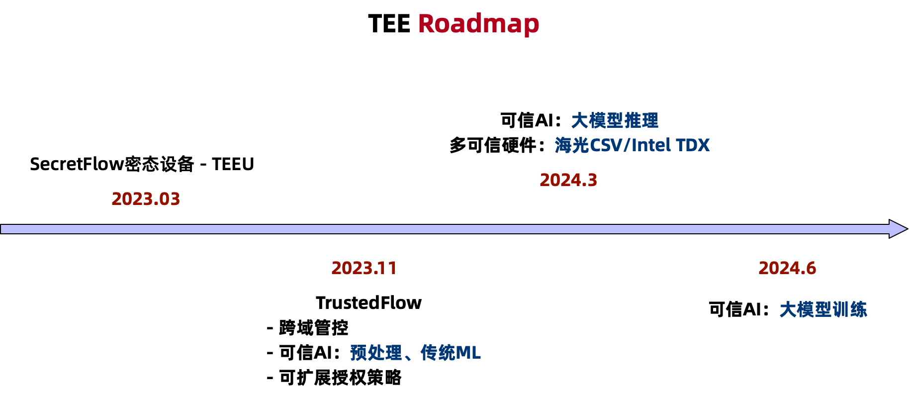

:target{#id1}

# 路线图

:target{#id2}

## 功能列表

<table>
  <thead>
    <tr>
      <td>
        大类
      </td>

      <td>
        小项
      </td>

      <td>
        是否支持
      </td>
    </tr>
  </thead>

  <tbody>
    <tr>
      <td>
        跨域管控
      </td>

      <td>
        数据密态存储
      </td>

      <td>
        ✅
      </td>
    </tr>

    <tr>
      <td>

      </td>

      <td>
        计算管控 - 静态计算逻辑
      </td>

      <td>
        ✅
      </td>
    </tr>

    <tr>
      <td>

      </td>

      <td>
        计算管控 - 动态计算逻辑
      </td>

      <td>
        ✅
      </td>
    </tr>

    <tr>
      <td>

      </td>

      <td>
        计算管控 - 计算时间
      </td>

      <td>
        (计划中)
      </td>
    </tr>

    <tr>
      <td>

      </td>

      <td>
        计算管控 - 计算次数
      </td>

      <td>
        (计划中)
      </td>
    </tr>

    <tr>
      <td>

      </td>

      <td>
        计算管控 - 列管控(CCL)
      </td>

      <td>
        (计划中)
      </td>
    </tr>

    <tr>
      <td>

      </td>

      <td>
        结果管控 - 导出审批
      </td>

      <td>
        ✅
      </td>
    </tr>

    <tr>
      <td>

      </td>

      <td>
        结果管控 - 数据血缘
      </td>

      <td>
        ✅
      </td>
    </tr>

    <tr>
      <td>

      </td>

      <td>
        结果管控 - 计算代码血缘
      </td>

      <td>
        (计划中)
      </td>
    </tr>

    <tr>
      <td>
        可信AI
      </td>

      <td>
        预处理
      </td>

      <td>
        ✅
      </td>
    </tr>

    <tr>
      <td>

      </td>

      <td>
        传统ML
      </td>

      <td>
        ✅
      </td>
    </tr>

    <tr>
      <td>

      </td>

      <td>
        深度学习
      </td>

      <td>
        (计划中)
      </td>
    </tr>

    <tr>
      <td>

      </td>

      <td>
        大模型
      </td>

      <td>
        (计划中)
      </td>
    </tr>

    <tr>
      <td>
        可信BI
      </td>

      <td>

      </td>

      <td>
        (计划中)
      </td>
    </tr>
  </tbody>
</table>

:target{#id3}

## 路线图

