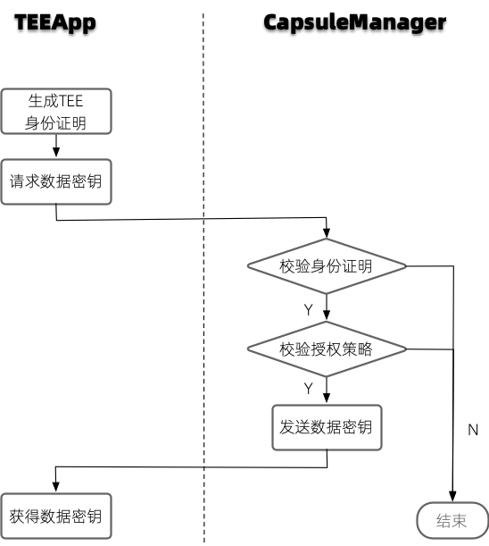

:target{#app}

# 可信APP

TrustedFlow内置了多种可信APP，每一个可信APP在执行计算逻辑之前，会先向CapsuleManager请求数据密钥，具体流程如下图所示。

可信APP使用隐语组件标准 [component spec](https://www.secretflow.org.cn/docs/spec/latest/zh-Hans/intro#component) 进行定义。

每个组件包含名称、版本号、属性、输入（inputs）和输出（outputs）。

1. 组件名称由domain + name决定，组件名称通常表示了某一个具体功能的组件。
2. 组件版本号（version）标识了组件的版本，需要注意，不同版本可能兼容也可能不兼容，具体应该见组件说明。
3. 属性（attrs）定义了算子的参数以及它们的默认值、取值范围或者可选值等。

4\. 输入（inputs）和输出（outputs）定义了输入输出的类型，用来标识它是一张数据表（table）、一个机器学习的模型（model）
还是一个数据分析的报告（report）等。输入输出中的属性（attrs）用来表示该输入输出的额外属性，
例如求交算子中用”key”来表示输入表中的求交列，woe分箱算子中用”feature\_selects”来表示输入表选取列。

下面，我们会先通过求交和woe分箱这两个可信APP来详细说明组件化定义的方式以及任务配置文件的书写方式。更多的组件示例详见列表。

<TableOfContents>

  - [求交](intersect.mdx)
  - [WOE分箱](woe_binning.mdx)
  - [WOE转换](woe_substitution.mdx)
  - [随机分割](split.mdx)
  - [特征过滤](feature_filter.mdx)
  - [相关系数矩阵](corr.mdx)
  - [全表统计](data_describe.mdx)
  - [VIF](vif.mdx)
  - [XGBoost训练](xgb_train.mdx)
  - [LR训练](lr_train.mdx)
  - [XGBoost离线预测](xgb_predict.mdx)
  - [LR预测](lr_predict.mdx)
  - [二分类评估](binary_evaluation.mdx)
  - [预测偏差评估](prediction_bias_eval.mdx)
</TableOfContents>
