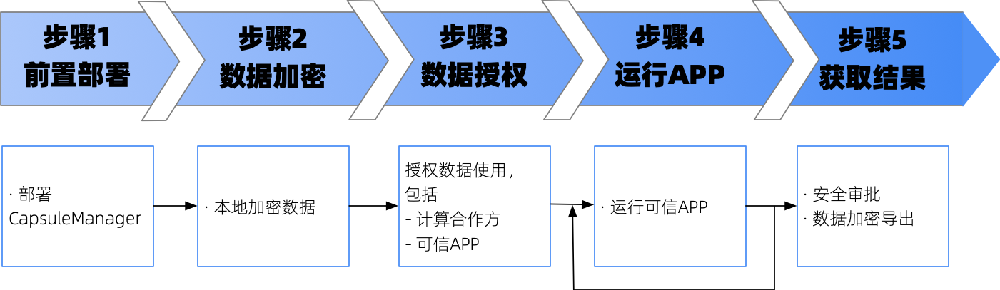

:target{#quick-start}

# <Target id="id1" />快速上手

欢迎使用TrustedFlow！

整个快速上手的使用流程如下图所示。

:target{#sgx}

## 仿真模式与SGX模式

为了方便用户上手体验，TrustedFlow提供仿真模式，用户可以在没有TEE硬件的情况下体验TrustedFlow的基本功能。
需要注意的是，仿真模式没有TEE安全特性，因此仅限于体验使用，请勿在生产中使用仿真模式。

如果用户有真实的TEE机器，则可以尝试SGX模式执行（目前TrustedFlow仅支持SGX2，未来会支持更多TEE硬件）。

:target{#id2}

## 参与机构

为了方便后续演示，我们假设有三个机构分别为alice、bob和carol，其中alice和bob提供数据，carol提供TEE机器。
每个机构的职责不同，后续会有相应说明。

注意，我们并不限定TEE机器必须是第三方（carol）提供，亦可以是alice或者bob自身，这里以carol提供TEE机器为例是为了方便进行说明。

:target{#id3}

## 机构证书

后续的演示依赖每个机构提供证书和私钥。为了方便测试，可以用以下命令为每个机构生成一个自签的证书。
<strong>注意，自签证书仅适用于测试，请勿直接用于生产</strong>

1. alice生成私钥，私钥文件名为alice.key

```default
openssl genrsa -out alice.key 3072
```

2. alice自签发证书，证书文件名为alice.crt。

```default
openssl req -x509 -new -nodes -key alice.key -sha256 -days 3650 -out alice.crt
```

3. bob、carol用相同方式生成自签证书，记得修改产出文件的名称。

:target{#id4}

## 详细步骤

<TableOfContents>


  - [步骤一：（仅carol）前置部署](step1.mdx)
    - [选项一：仿真模式部署CapsuleManager](step1.mdx#选项一：仿真模式部署CapsuleManager)
    - [选项二：在SGX机器上运行CapsuleManager](step1.mdx#选项二：在SGX机器上运行CapsuleManager)
  - [步骤二：（仅alice和bob）数据加密](step2.mdx)
    - [第一步：下载CLI工具](step2.mdx#第一步：下载CLI工具)
    - [第二步：加密数据](step2.mdx#第二步：加密数据)
    - [第三步：上传数据密钥](step2.mdx#第三步：上传数据密钥)
    - [选项二：SGX模式](step2.mdx#选项二：SGX模式)
  - [步骤三：（仅alice和bob）数据授权](step3.mdx)
    - [选项一：仿真模式](step3.mdx#选项一：仿真模式)
    - [选项二：SGX模式](step3.mdx#选项二：SGX模式)
    - [（可选）自定义授权策略](step3.mdx#（可选）自定义授权策略)
  - [步骤四：（仅carol）运行可信APP](step4.mdx)
    - [直接使用breast cancer数据集建模](step4.mdx#直接使用breast-cancer数据集建模)
    - [使用TrustedFlow复现breast cancer建模](step4.mdx#使用TrustedFlow复现breast-cancer建模)
  - [步骤五：（可选）获取结果](step5.mdx)
    - [数据导出流程原理](step5.mdx#数据导出流程原理)
    - [数据导出示例](step5.mdx#数据导出示例)
</TableOfContents>
