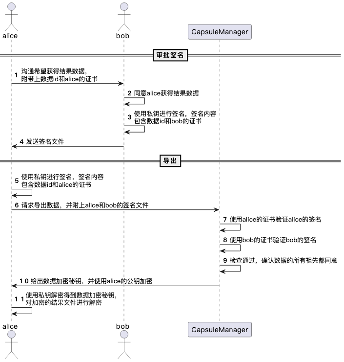

:target{#步骤五：（可选）获取结果}

# 步骤五：（可选）获取结果

TrustedFlow允许用户对可信APP的执行结果（比如模型、预测结果、处理后的数据等）进行导出，导出结果数据需要获得所有数据提供方的集体同意。TrustedFlow提供了CLI工具帮助用户进行结果导出。

:target{#数据导出流程原理}

## 数据导出流程原理

假设alice希望获得结果数据，这份结果数据是由alice和bob提供的数据加工得到的，那么数据导出的流程如下。

:target{#数据导出示例}

## 数据导出示例

我们以前文为例，按照前文的步骤，我们完成了使用TrustedFlow对breast cancer数据集进行可信建模，其中在执行XGBoost训练APP的时候，我们会得到一个加密的XGBoost模型。现在假如alice希望得到模型，则可以按照下列步骤进行。导出过程中需要使用到CLI工具，前文中已经有过介绍。

:target{id="1.-定位要导出的文件ID"}

### 1. 定位要导出的文件ID

每一份文件都有一个ID与之对应，您可以按照步骤三的说明，找到可信APP——XGBoost训练对应的任务配置文件`xgb.json`，我们会找到输出文件的说明。
如下所示，`file://output/?id=model_uuid&&uri=/host/testdata/breast_cancer/xgb_model`说明XGBoost训练APP得到的模型ID叫做`model_uuid`，文件位置为`/host/testdata/breast_cancer/xgb_model`。注意，由于occlum使用`host`指代其运行所在目录，所以最终文件应该存储在occlum\_instance目录下的`testdata/breast_cancer/xgb_model`。该文件是加密的，我们假设alice从carol中得到了这个文件。

```json
{
    {
        "output_uris": [
            "file://output/?id=model_uuid&&uri=/host/testdata/breast_cancer/xgb_model"
            ]
    }
}
```

:target{id="2.-获取数据密钥"}

### 2. 获取数据密钥

:target{id="2.1-alice生成待签名内容"}

#### 2.1 alice生成待签名内容

把下列的内容拷贝到一个空文件中，假如您把文件内容保存为文件export.yaml。 该文件主要包含两块内容：

- `vote_request`：描述了alice请求要下载的数据、alice的证书等信息。
- `vote_invite`：描述了bob同意alice的请求，bob通过对vote\_request的信息进行签名以表达同意。

这一步您需要填写以下项目：

- `vote_request.approved_threshold`: 需要同意导出的机构数，因为只需要bob同意即可，所以这里填写1。
- `vote_request.approved_action`: 表示同意所做的操作。由逗号分割，`tee/download`的含义为数据导出（请勿修改），后者为要导出的数据ID，即上一步得到的数据ID。这里如果您要导出其他数据，记得修改为对应的数据ID。
- `vote_request.cert_chain_file`: 数据导出请求方（示例是alice）的证书和CA证书（如果有）。
- `vote_request.private_key_file`: 数据导出请求方（示例是alice）的私钥。

```yaml
vote_request:
  vote_request_id:
  type: TEE_DOWNLOAD
  initiator:
  vote_counter: ""
  voters:
    -
  executors:
    -
  approved_threshold: 1
  approved_action: "tee/download,model_uuid"
  rejected_action: ""
  cert_chain_file:
    - alice.crt
  private_key_file: alice.key
  vote_request_signature:

vote_invite:
  -
    vote_request_id:
    voter:
    action: APPROVE
    cert_chain_file:
      - bob.crt
      - bob_ca.crt
    voter_signature:
```

正确填写之后，执行下列命令，可以得到文件data-export.json。

```none
cms_util generate-data-export-cert --config-file=export.yaml --dest-file=data-export.json
```

data-export.json的部分内容展示如下。 这里需要关注的是`vote_request.body`，这个其实是把上面`vote_request`的内容（不包含私钥和签名部分）转换成了json并且进行了base64编码。(如果您有兴趣可以用base64进行解码进行查看)

找到`vote_request.body`之后，把对应的内容给到bob，bob需要对该内容进行签名。

```json
{
  "vote_request": {
    "cert_chain": [
      ""
    ],
    "body": "eyJ2b3RlX3JlcXVlc3RfaWQiOiBudWxsLCAidHlwZSI6ICJURUVfRE9XTkxPQUQiLCAiaW5pdGlhdG9yIjogbnVsbCwgInZvdGVfY291bnRlciI6ICIiLCAidm90ZXJzIjogW251bGxdLCAiZXhlY3V0b3JzIjogW251bGxdLCAiYXBwcm92ZWRfdGhyZXNob2xkIjogMSwgImFwcHJvdmVkX2FjdGlvbiI6ICJ0ZWUvZG93bmxvYWQsbW9kZWxfdXVpZCIsICJyZWplY3RlZF9hY3Rpb24iOiAiIn0",
    "vote_request_signature": ""
  },
  "vote_invite": [
    {
      "cert_chain": [
        ""
      ],
      "body": "",
      "voter_signature": null
    }
  ]
}
```

:target{id="2.2-bob对数据导出请求进行签名"}

#### 2.2 bob对数据导出请求进行签名

首先，bob需要把以下内容复制到一个空文件，假设文件叫做sign.yaml。该文件说明如下：

- `vote_request_signature`: 上一步alice得到的数据导出请求的内容，拷贝到这里。记住，请替换为您实际得到的内容。
- `action`: `APPROVED`表示同意alice的请求，无需修改。
- `private_key_file`: bob自己的私钥，用于签名。

```yaml
vote_request_signature: "eyJ2b3RlX3JlcXVlc3RfaWQiOiBudWxsLCAidHlwZSI6ICJURUVfRE9XTkxPQUQiLCAiaW5pdGlhdG9yIjogbnVsbCwgInZvdGVfY291bnRlciI6ICIiLCAidm90ZXJzIjogW251bGxdLCAiZXhlY3V0b3JzIjogW251bGxdLCAiYXBwcm92ZWRfdGhyZXNob2xkIjogMSwgImFwcHJvdmVkX2FjdGlvbiI6ICJ0ZWUvZG93bmxvYWQsbW9kZWxfdXVpZCIsICJyZWplY3RlZF9hY3Rpb24iOiAiIn0"
vote_request_id:
voter: bob
action: APPROVED
private_key_file: bob.key
```

接下来，bob执行命令，预期屏幕会输出一长串字符，是对sign.yaml文件内容签名得到的结果，请把结果拷贝保存下来并返回给alice。

```bash
cms_util generate-voter-sign --config-file=sign.yaml
```

:target{id="2.3-alice生成数据导出请求的内容"}

#### 2.3 alice生成数据导出请求的内容

alice从bob处得到签名结果后， 注意把签名结果填写到export.yaml中`voter_signature`属性后面。

```yaml
vote_request:
  vote_request_id:
  type: TEE_DOWNLOAD
  initiator:
  vote_counter: ""
  voters:
    -
  executors:
    -
  approved_threshold: 1
  approved_action: "tee/download,model_uuid"
  rejected_action: ""
  cert_chain_file:
    - alice.crt
  private_key_file: alice.key
  vote_request_signature:

vote_invite:
  -
    vote_request_id:
    voter:
    action: APPROVE
    cert_chain_file:
      - bob.crt
      - bob_ca.crt
    voter_signature: "填写bob返回的签名内容"
```

接着执行命令，执行下列命令，可以得到更新后的文件data-export.json。

```none
cms_util generate-data-export-cert --config-file=export.yaml --dest-file=data-export.json
```

:target{id="2.4-alice获取数据密钥并解密"}

#### 2.4 alice获取数据密钥并解密

打开CLI工具的配置文件，编辑以下内容：

- `party_id`: 填写alice的机构ID（在以前的步骤中您应该已经获得）。
- `resource_uri`: 要解密的文件，即前文中提到的从carol获取到的加密的模型文件xgb\_model。
- `data_export_certificate_file`: 即上一步得到的文件。

```yaml
get_export_data_key:
  party_id: alice_party_id
  resource_uri: xgb_model
  data_export_certificate_file: data-export.json
```

执行命令，向CapsuleManager请求获取数据加密密钥，预期屏幕会输出数据密钥。

```bash
cms get-export-data-key
```

接着使用得到的数据密钥对模型文件进行解密，记得用实际值替换`数据密钥`，解密后的模型文件为`xgb.model`。

```bash
cms_util decrypt-file --data-key-b64 数据密钥 --source-file xgb_model --dest-file xgb.model
```

您可以查看该模型文件，它应该与步骤三里面直接使用明文数据训练得到的模型文件是一致的。
