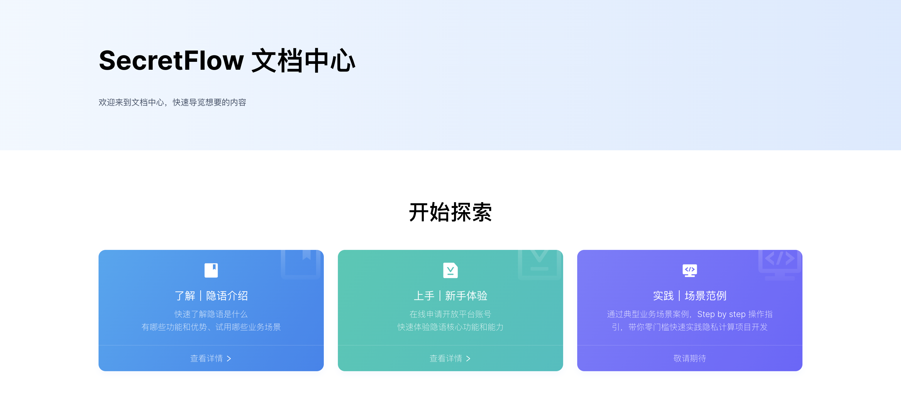
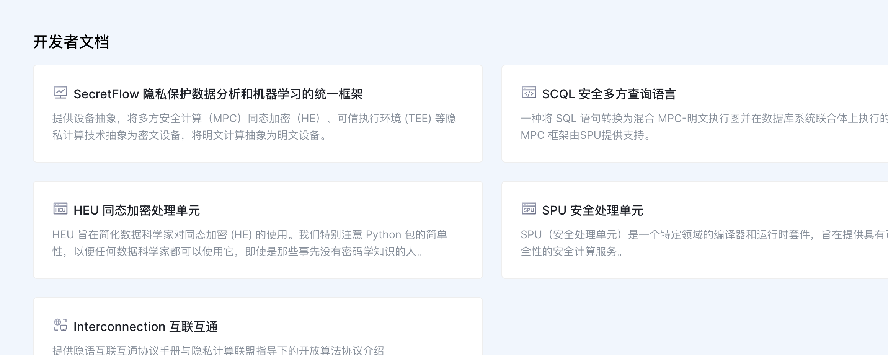
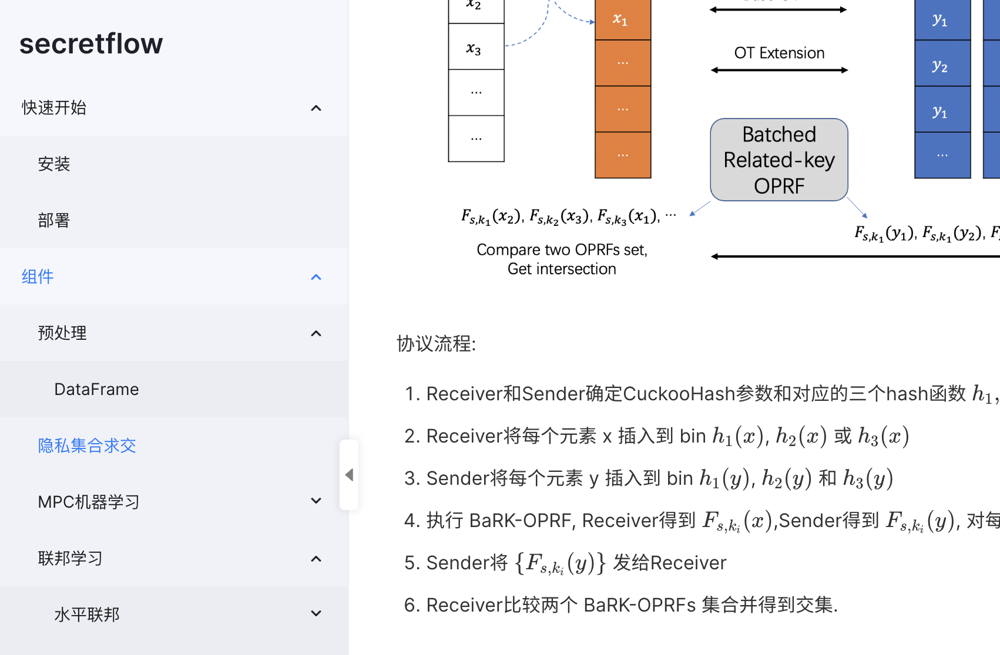
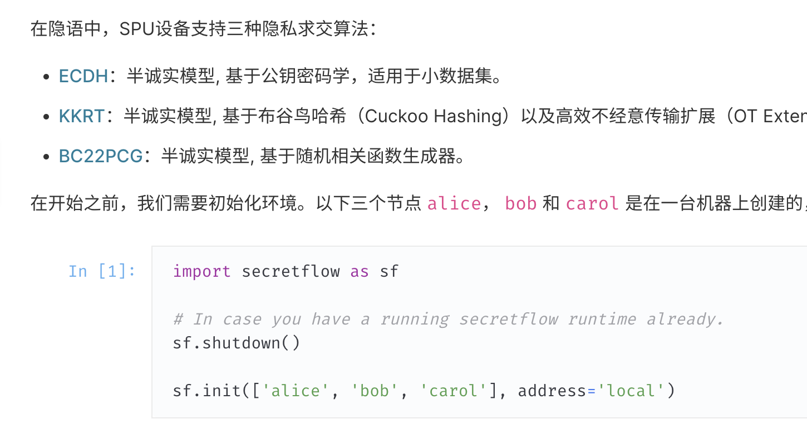
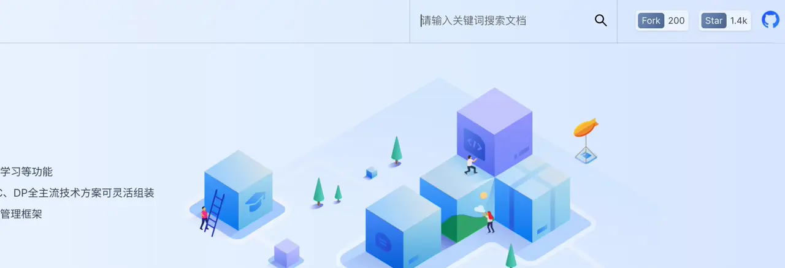

import { Link } from 'dumi';
import Container from 'dumi/theme-default/builtins/Container';
import styled from 'styled-components';

export const Figure = styled.figure`
  margin: 0;
  padding: 1.5rem;
  max-width: 640px;

  @media screen and (max-width: 991px) {
    padding: 1.5rem 0;
  }

  text-align: left;

  p {
    display: flex;
    flex-flow: column nowrap;
    min-width: 0;
  }

  img {
    border-radius: 4px;
    box-shadow: 0 8px 10px 0 rgb(0 0 0 / 15%);
    object-fit: contain;
    max-width: 640px;
    max-height: 480px;
  }

  img + img {
    margin-top: 1rem;
  }

  figcaption {
    font-size: 0.8em;
    color: #666;
    text-align: center;

    @media screen and (max-width: 991px) {
      margin-left: 308px;
      text-align: start;
    }

    @media screen and (max-width: 680px) {
      margin-left: 0px;
      text-align: center;
    }
  }
`;

export const Anchor = styled(Link)`
  color: #e83e8c;
  text-decoration: none;
  font-weight: 500;
  &:hover {
    text-decoration: underline;
  }
`;

export const ImageContainer = styled.div`
  width: 100%;
  display: flex;
  flex-flow: row nowrap;
  justify-content: flex-start;
`

export const Image = styled.img`
  max-width: 100%;
  margin: 0.5rem 0;
  object-fit: contain;
`

export const RowContainer = styled.div`
  max-width: 100%;
  display: flex;
  flex-flow: row nowrap;
  justify-content: flex-start;
  gap: 1rem;
  overflow: auto;

  @media screen and (max-width: 991px) {
    overflow: initial;
    flex-flow: column nowrap;
  }
`

<ImageContainer>
  <Image style={{ maxHeight: 360, height: 360 }} alt="headline" src="https://mdn.alipayobjects.com/huamei_usjdcg/afts/img/A*L4hDSqru86EAAAAAAAAAAAAADo6HAQ/fmt.webp" />
</ImageContainer>

:target{#events}

## 活动中心

隐语社区近期动态、活动及 Meetup 等日程，以及过往活动的精彩回顾，现在都可以在 <Anchor to="/events">活动中心</Anchor> 找到。

<Figure>
  

  <figcaption>活动中心</figcaption>
</Figure>

:target{#docs-center}

## 文档中心

SecretFlow 的文档终于有了一站式的入口！从隐语 SecretFlow 的 <Anchor to="/docs/intro/voga7g">深度介绍</Anchor>，到所有框架的 <Anchor to="/docs/secretflow/latest/zh-Hans">开发者文档</Anchor>，再到隐语开放平台的 <Anchor to="/docs/quickstart/pe6o3q">使用手册</Anchor>，敬请浏览新的 <Anchor to="/docs">文档中心</Anchor>。

<Figure>
  

  <figcaption>文档中心首页</figcaption>

  

  <figcaption>开发者文档</figcaption>
</Figure>

:target{#docs-revamp}

## 文档阅读器

为了提升开发者的文档阅读体验，我们重新构建了我们的文档阅读器。

- 更大的阅读空间以及更友好的字体；
- 新的文档库目录树：你可以在左侧侧边栏找到当前知识库的所有其它文档；

<Figure>
  

  <figcaption>新的文档库目录树</figcaption>
</Figure>

- 优化了代码块、数学公式、流程图等文档内容的显示效果。

<Figure>
  

  <figcaption>代码块显示效果</figcaption>
</Figure>

:target{#full-text-search}

## 全文搜索 (BETA)

在旧版本的文档库中，每个框架分别提供了各自独立的搜索。在新官网，你可以在**任何页面**通过右上角的搜索框检索**任何文档库**的内容。

<Figure>
  

  <figcaption>全文检索</figcaption>
</Figure>

<Container type="info" title="全文搜索目前处于 BETA 阶段 ...">
  ... 可能会出现搜索结果不准确/非最佳排序的情况。我们会持续优化搜索结果的准确性以及搜索体验的流畅度。
</Container>

:target{#performance}

## 性能及缺陷修复

我们升级了官网的技术栈，以提升页面加载速度。同时我们也修复了旧文档库中诸如链接跳转失败等一些缺陷。

:target{#mobile}

## 移动端 (BETA)

<Figure>
  

  <figcaption>适配移动端友好</figcaption>
</Figure>

官网及文档中心新增移动端版本！现在你可以在行动设备随时随地了解隐语最新活动、查阅技术文档。

<RowContainer>
  <Figure>
    

    <figcaption>首页</figcaption>
  </Figure>
  <Figure>
    

    <figcaption>文档</figcaption>
  </Figure>
  <Figure>
    

    <figcaption>搜索</figcaption>
  </Figure>
  <Figure>
    

    <figcaption>活动</figcaption>
  </Figure>
</RowContainer>
